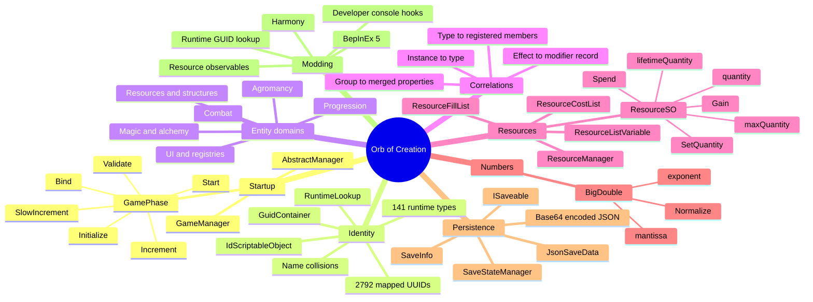

# Orb of Creation reverse-engineering notes

These notes describe the managed-code architecture of the installed Orb of Creation build. The current main assembly was re-audited on 2026-07-13; see [Reverse-engineering audit](reverse-engineering-audit.md) for hashes, corrections, and confidence boundaries.

## Examined build

- Unity `6000.0.70`
- 64-bit Mono runtime
- BepInEx `5.4.23.5`
- Main game assembly: `Orb Of Creation_Data/Managed/Assembly-CSharp.dll`
- Numeric library: `Orb Of Creation_Data/Managed/Assembly-CSharp-firstpass.dll`
- Save format version observed: `6`

The findings come from assembly metadata and selected IL method bodies read with Mono.Cecil. No game binaries were modified.

## Knowledge map

## Suggested reading order

1. [Architecture](architecture.md)
2. [Identity and registries](identity-and-registries.md)
3. [Entity catalog and taxonomy](entity-catalog.md)
4. [Entity correlations](entity-correlations.md)
5. [Resources and large numbers](resources-and-bigdouble.md)
6. [Save system](save-system.md)
7. [Modding hooks](modding-hooks.md)
8. [Global and global-ish stat catalog](global-stats-catalog.md)
9. [Public release checklist](public-release-checklist.md)
9. [Reverse-engineering audit](reverse-engineering-audit.md)

## Product and implementation plans

- [Three-mod iteration plan](three-mod-iteration-plan.md)
- [Project roadmap](roadmap.md)
- [Orb Chronomancer plan](chronomancer-plan.md)
- [Orb Automata plan](automata-plan.md)
- [Auto Cast MVP](auto-cast-mvp.md)
- [Orb Insights plan](insights-plan.md)
- [Orb Toolbox plan](toolbox-plan.md)
- [Orb Achievement Resonance plan](achievement-resonance-plan.md)
- [Orb Mentor plan](mastery-sharing-plan.md)
- [Orb Mentor artifacts and alchemy design](mentor-artifacts-alchemy-plan.md)
- [Orb Mentor interactive runtime checklist](orb-mentor-runtime-validation.md)
- [In-game mod configuration UI plan](mod-config-ui-plan.md)
- [Compatibility, testing, and releases](compatibility-and-testing.md)
- [Local runtime validation protocol](local-runtime-validation.md)

## Important discovered identifier

| Entity | UUID | Runtime type |
|---|---|---|
| Alchemic Scroll | `67acd892-8a8a-455a-aa71-3fb06e75bf38` | `ResourceSO` |

## Confidence labels

- **Verified:** directly present in metadata or inspected IL.
- **Inferred:** conclusion based on verified structure but not yet confirmed at runtime.
- **Candidate:** promising target that should be tested in a logging-only plugin.
