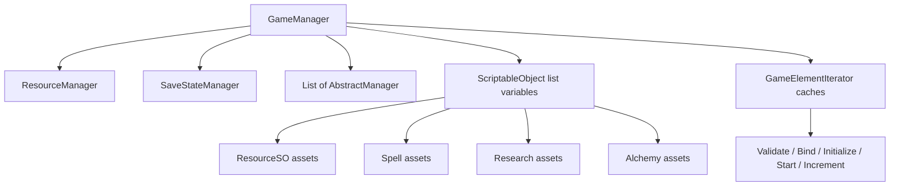
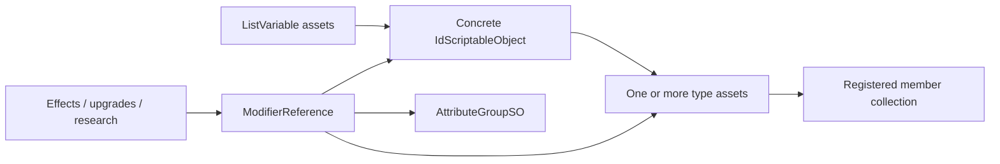

# Architecture

[Back to index](README.md)

## High-level lifecycle

`GameManager` is the main coordinator. It holds the major asset lists, managers, save/settings managers, active effects, and iteration caches.

Its verified phase enum is:

```text
Empty → Validate → Bind → Initialize → Start → Increment / SlowIncrement
```

`GameManager.GameElementIterator` discovers objects implementing lifecycle interfaces and calls:

- `Validate()`
- `Bind()`
- `Initialize()`
- `Start()`
- `Increment(float)`
- `SlowIncrement(float)`

This suggests most gameplay systems are data-driven ScriptableObjects advanced by centralized loops rather than independent Unity components.

## Managers

Managers generally inherit either `AbstractManager` or `MonoBehaviour`. `AbstractManager` exposes:

```text
ManagerStart()
ManagerUpdate(float deltaTime)
```

Important verified managers include:

| Manager | Responsibility |
|---|---|
| `GameManager` | Overall initialization, iteration, effects, save boundaries |
| `ResourceManager` | Resource initialization/checking, rarity and global progress |
| `SaveStateManager` | Collection, encoding, loading, backup and slot operations |
| `AlchemyManager` | Selected glyphs/resources, recipes and active alchemy |
| `CraftingManager` | Crafting pages |
| `AutoBuyManager` | Automated purchase queue |
| `InputManager` | Key bindings, modals and developer-console activation |

## GameManager dependencies



## Data-model pattern

Across resources, structures, spells, alchemy, rituals, research, equipment, passives, time runes, and harvesting, the assembly repeatedly uses concrete assets linked to one or more type assets. Type assets keep registered-member collections and merge shared modifiers into member records. List-variable assets provide additional registries, filtered views, and live-instance collections.



This repeated structure is the main correlation surface for mods. See [Entity catalog](entity-catalog.md) for full domain coverage and [Entity correlations](entity-correlations.md) for verified field-level relationships.

## Save boundaries

`GameManager` exposes `TriggerBeforeSave`, `BeforeSave`, `AfterSave`, and `TriggerAfterSave`. These are candidate integration points if a mod owns custom state that must be synchronized with normal saves.
