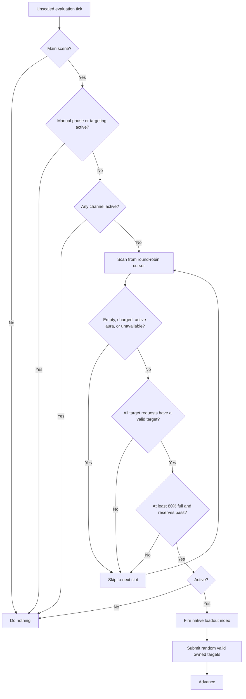

# Auto Cast MVP

[Back to Automata plan](automata-plan.md)

## Player contract

Auto Cast operates on every non-empty spell in the current native loadout. Loadout order is cast order. The first implementation uses a round-robin cursor: after a successful cast it resumes at the following slot, skips temporarily ineligible spells, and wraps at the end. Alternative priority modes are deferred.

The module runs throughout the `Main` gameplay scene, independently of the open tab. It performs at most one new cast per evaluation and uses the native `SpellManager.FireSpellIndex(int)` path.

The configured mode can be toggled from the default `Left Alt + X` shortcut or a native-styled state button placed immediately left of the game's Auto Buy queue switch. The indicator states are `AC OFF`, `AC ON`, and `AC !` when emergency disable blocks an active configuration.

## Agreed behavior

- Default mode is `Disabled`; the public selector contains only `Disabled` and `Active`.
- `ToggleShortcut` defaults to `Left Alt + X`; `ShowToggleButton` defaults to `true`.
- A spell may start only when every finite, positive-cap resource used by its immediate cost or persistent drain is at least 80% full.
- Existing absolute, relative, and cost-ratio reserves also apply to immediate cast costs.
- A manual spell fire pauses Auto Cast for two unscaled seconds by default. The pause is configurable.
- Existing manual target selection always owns the targeting interface and pauses automation.
- Targeted automated casts preflight their native target requests, then select a random valid target through each request's own `TargetSelectOptions` rules.
- Active auras are treated as satisfied and skipped while rotation continues.
- An active channel pauses the rotation until the game ends it naturally.
- Automata never turns off an aura or channel, including on disable, emergency stop, or falling resources.
- Charged spells are rejected in the first active iteration with an explicit diagnostic reason.

The earlier proposed 50% persistent-spell stop threshold is not part of this contract. It was superseded by the decision to never stop persistent spells automatically.

## Native contracts

The audited game build exposes the required path:

1. `SpellManager.instance.activeSpells` preserves native loadout order.
2. `SpellManager.FireSpellIndex(int)` performs the same guarded action as the casting UI/hotkey.
3. `Spell.CanCast()`, `CanFire()`, `IsReadyingCast()`, `IsCasting()`, `IsChanneled()`, `IsToggledSpell()`, and `CanCharge()` expose readiness and spell shape.
4. `Spell.GetCost()` and `GetDrainCost()` expose `ResourceCostList` values.
5. `ResourceSO.GetTrueQuantity()` provides the current amount in quality-adjusted units. The matching capacity is `ResourceSO.maxQuantity.GetValue()` converted through `ResourceSO.GetTrueAmount(BigDouble)`. `GetTrueSoftCap()` is unrelated: it is the threshold used for quantity-effect scaling, not the resource's storage capacity.
6. `RequestTargetEffectScript.targetOptions` exposes native target validation.
7. `TargetingManager` exposes the active request, its owner, random valid selection, and submission.

Calling another spell while a channel is active invokes `SpellManager.StopCastingChannelled()`. Auto Cast must therefore detect an active channel before starting any later slot.

## Safety state machine

## Deferred iterations

- Configurable priority-first and strict-sequence rotation.
- Charged-spell policies: uncharged, fixed hold time, or full charge.
- Per-spell enablement and thresholds.
- Target preferences beyond each native selector's random-valid choice.
- Automatic aura/channel shutdown and hysteresis, only if explicitly opted in later.
- Combat-context rules beyond native target availability and readiness.

## Runtime validation

Use a disposable backed-up save and begin with one harmless instant spell before adding targeting or persistent spells. With operational logging enabled, validate loadout ordering, cooldown/charge rejection, the 80% boundary, a zero-cost instant spell, a targeted spell, an aura followed by another spell, a channel that blocks rotation, manual pause, and emergency disable. Confirm that `Left Alt + X` and the queue-adjacent button produce the same Disabled/Active transitions and indicator state.
