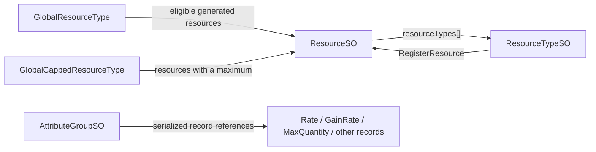
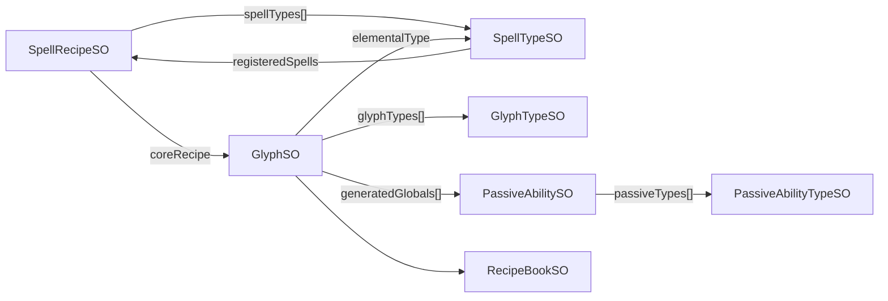
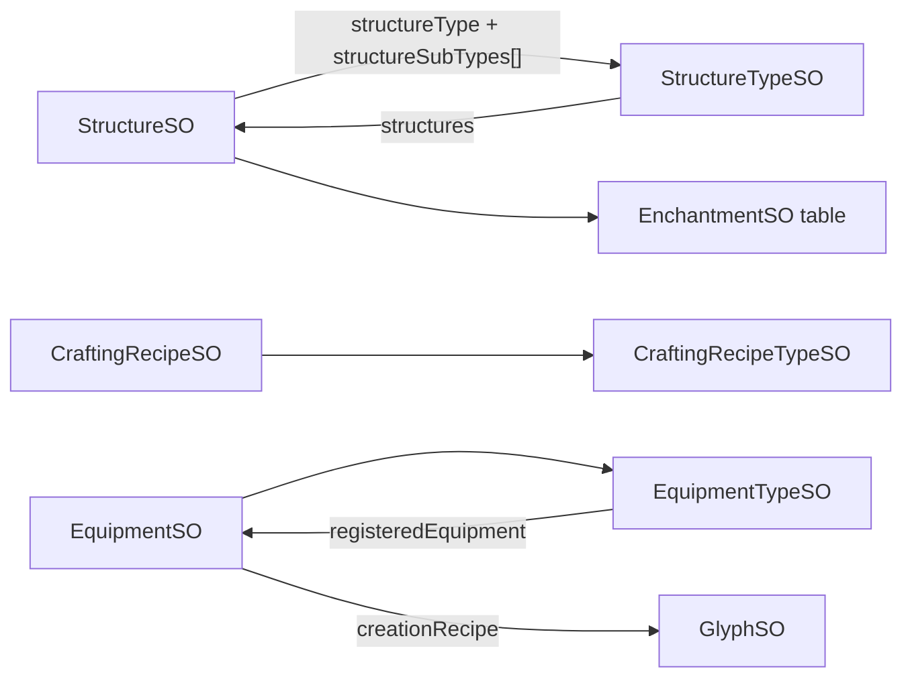
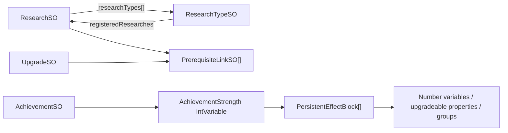
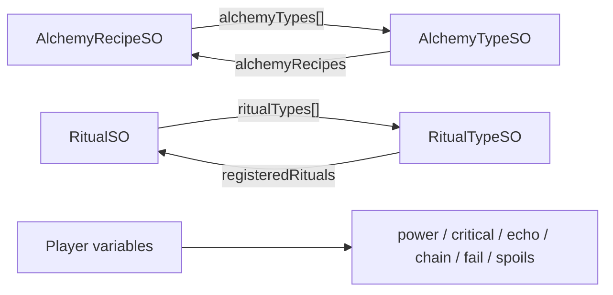
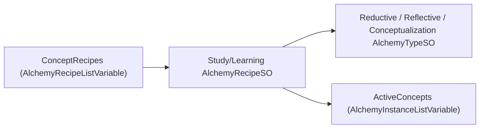
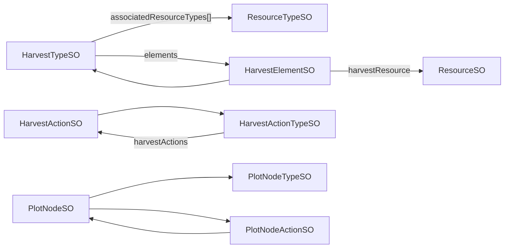
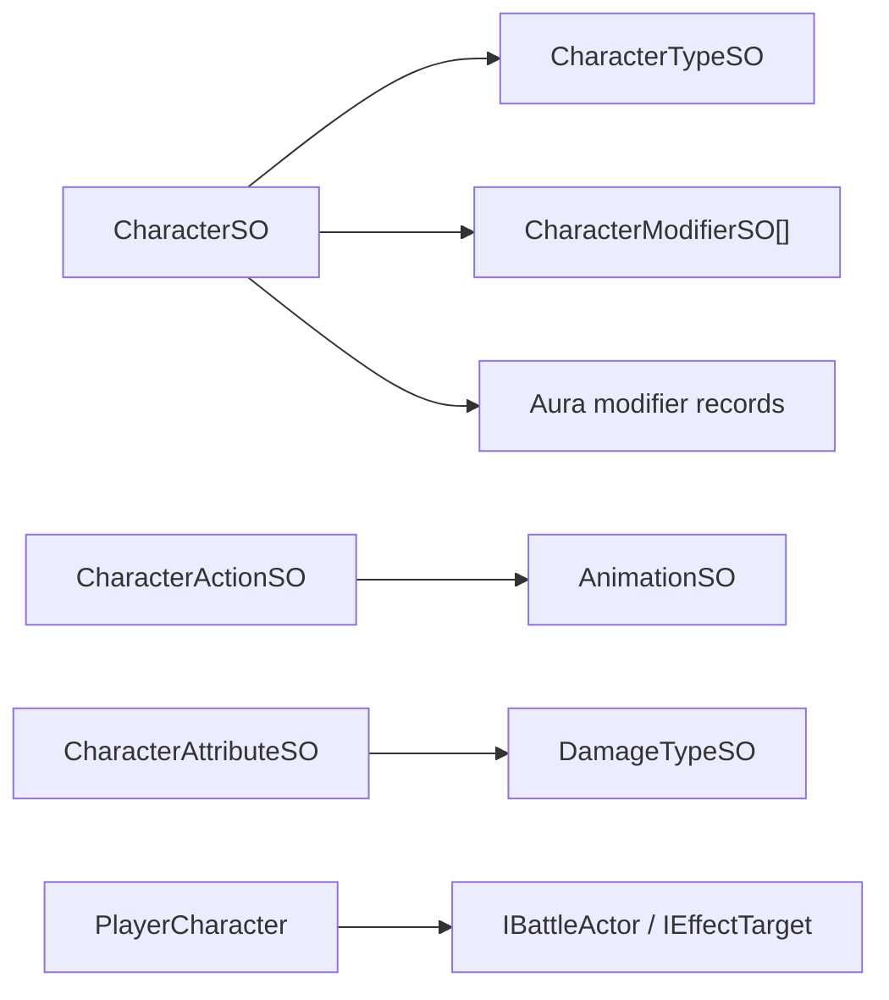
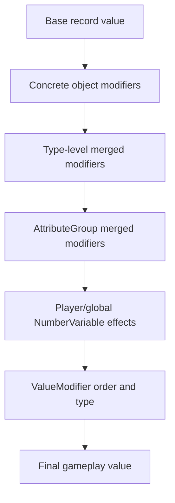

# Entity correlations

[Back to index](README.md) · [Entity catalog](entity-catalog.md) · [Global stats](global-stats-catalog.md)

## Reading this map

This page combines two evidence sources:

- **Mapped:** UUID, internal name, and runtime type from `entity-mappings.tsv`.
- **Verified in code:** managed fields, registration methods, interfaces, and modifier accessors decompiled from the current assembly.

The code proves that a relationship can exist. Exact per-asset membership is serialized data and should be logged at runtime before a mod assumes coverage or exclusivity.

## Common domain pattern

Most gameplay systems follow a repeated relationship:


Type assets are global-ish rather than universally global: they affect only instances registered with that type. An instance may belong to several types, so applying bonuses at both type and instance/group levels can double-apply.

## Resources

Verified relationships:



Correlations and implications:

- A `ResourceSO` may have multiple `ResourceTypeSO` memberships.
- Each type merges modifiers into registered resource records.
- `GlobalResourceType` excludes resources marked `excludeFromGlobals`.
- `GlobalCappedResourceType` receives only resources reporting a maximum during registration.
- `Rate` and `GainRate` are correlated but not identical; modifying both can compound passive production.
- Quantity is saved on the concrete `ResourceSO`; type/group modifiers derive rate and capacity without directly replacing quantity.

Mod guidance: target a resource UUID for one resource, a resource type for a category, and the global resource types for broad generation/capacity behavior.

## Spells, glyphs, and passives

Verified relationships:



Correlations and implications:

- Spell recipes can belong to several spell types.
- Glyph composition contributes power, special, duration, cost, cooldown, cast speed, XP, critical, echo, and charge-related modifiers.
- Player-wide `DoubleVariable`s provide a second global layer: spell power, special, duration, cast/cooldown speed, mastery, experience, charge, critical, echo, and flash stats.
- Spell type, spell recipe, glyph, player-global, and attribute-group modifiers may all feed the same final spell record.

Mod guidance: a “Casting” bonus should declare which layer it targets. Prefer player-wide variables for explicit global casting stats, and avoid also modifying every spell type/recipe unless the intended stacking is documented.

## Structures, crafting, and equipment



Correlations and implications:

- A structure has a primary type and can have subtypes; broad structure bonuses may overlap through multiple memberships.
- `GlobalStructureType` is the broadest mapped type-level target for structure power, scaling, speed, costs, build speed, ratings, and levels.
- Crafting recipes expose power, speed, cost, efficiency, and penalty records; `CraftingStructureSO` also references global numeric variables for type power/speed/time/cost.
- Equipment type power and player-wide `EquipmentPower` are distinct layers.

Mod guidance: separate construction speed, crafting speed/power, structure power scaling, and equipment power rather than calling them all “manufacturing power.”

## Research, upgrades, achievements, and prerequisites



Correlations and implications:

- Research and upgrades share prerequisite, cost, validation, purchase/action, save, and visibility concepts through interfaces rather than one common concrete class.
- Research types collect registered research and expose type-wide level/cap/requirement records.
- Achievements contribute raw values to Achievement Strength and can also have their own completion effects.
- Achievement Strength is therefore a derived global driver, not a replacement for individual achievement completion data.

Mod guidance: Achievement Resonance should attach new persistent effects to Achievement Strength. It should not multiply `AchievementSO.GetTotalAchievementStrength()`, because that would amplify every existing consumer too.

## Alchemy and rituals



Alchemy has recipe and type layers for power, speed, drain, special, experience, overdrive, completion time, time scaling, usage slots, and effect levels. Rituals similarly combine object, type, and player-global layers.

Mod guidance: cost/drain/completion-time modifiers are direction-sensitive. Keep them separate from positive power/speed multipliers.

### Concepts inside the alchemy model



The UI presents these entities as Concepts, but their runtime implementation reuses alchemy recipes, types, and instances. Auto Concept should enter through the concept-specific registries and audited native instance actions, not through class-name discovery or a broad ordinary-alchemy scan.

## Agromancy and harvesting



This domain bridges resource production, plot growth, actions, and type-wide stats. `AgromancyPowerGroup`, `AgromancySpeedGroup`, and `AgromancyRefundGroup` may overlap with these concrete/type records.

Mod guidance: log group membership before combining an agromancy group with direct harvest, plot, or resource-rate bonuses.

## Combat and actor effects



Combat objects use effect-target and actor interfaces alongside asset relationships. Runtime combat effects, status effects, and engaged effects live in list variables rather than as only static mapped definitions.

Mod guidance: static UUID mappings are enough to identify definitions, but live combat inspection must traverse runtime instance lists and target containers.

## Modifier correlation model

The same final statistic can receive modifiers through several layers:



This is conceptual ordering, not a claim that every stat uses every layer in that exact sequence. Actual `ValueModifier.order`, modifier type, ratios, exponent ratios, prerequisites, and record merging determine the final calculation.

For any broad mod bonus, log:

```text
source UUID and type
target UUID and type
propertyType[propertyIndex]
modifier UUID, ValueModifier type, value, and order
group/type ratio and prerequisites
current record contributors
```

That produces a correlation graph capable of detecting double application rather than relying on asset names.

## Discovery strategy for mods

Use this order when exploring a system:

1. Resolve the known UUID through `IdScriptableObject.RuntimeLookup`.
2. Confirm the runtime type matches the mapping.
3. Traverse explicit code-level references such as type lists and registered-member collections.
4. Inspect `GetAllModifierReferences()` / property accessors for upgradeable objects.
5. Inspect contributing modifier records and stable modifier UUIDs.
6. Observe related list variables for live instances and state.
7. Use names only for logging and human-readable configuration.

This approach supports Toolbox, Insights, Automata, and Achievement Resonance without maintaining separate hard-coded relationship lists for each plugin.
