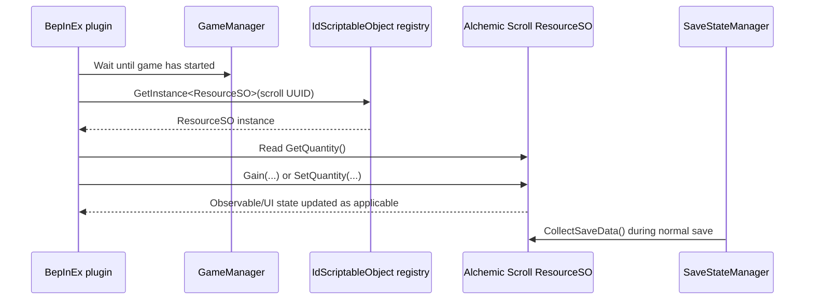

# Modding hooks

[Back to index](README.md)

## Recommended first runtime path

## Candidate hooks

| Target | Use | Risk |
|---|---|---|
| `GameManager.StartGame` postfix | Know that a game session began | Low |
| `SaveStateManager.ImplementLoadedJson` postfix | Act after save objects are populated | Low–medium |
| `ResourceSO.Gain` prefix/postfix | Global or selective gain multipliers | Medium; called frequently |
| `GameManager.AfterSave` or save triggers | Synchronize custom plugin state | Low–medium |
| `InputManager.Update` | Existing input path | Usually unnecessary; plugin `Update` is simpler |

## Existing developer-console functionality

The assembly already contains `DevConsoleEngine` methods:

- `ResourceRefresh`
- `ResourceVisible`
- `ResourceGain`
- `ResourceSetQuantity`

Inspected call references confirm that `ResourceGain` calls `ResourceSO.Gain`, while `ResourceSetQuantity` calls `ResourceSO.SetQuantity`. These methods are valuable examples and possibly direct command surfaces, but their parameter parsing still needs decompilation/runtime inspection.

## Suggested first mod

A safe first plugin should:

1. Wait until a loaded game is available.
2. Resolve Alchemic Scrolls through UUID `67acd892-8a8a-455a-aa71-3fb06e75bf38`.
3. Log its display name and current `BigDouble` value.
4. Bind an opt-in hotkey and configurable multiplier.
5. On key press, call the normal resource API.
6. Avoid bundling Harmony because BepInEx already provides it.

## Questions still requiring runtime testing

- Exact earliest safe lifecycle point for populated `RuntimeLookup`.
- Whether an extreme scroll amount is capacity-clamped by `SetQuantity` in the current progression state.
- Which `Gain` flag combination best matches a silent debug grant.
- Whether direct `SetQuantity` requires a manual observable update for immediate UI refresh.
- Whether the built-in developer console can be enabled cleanly without patching.

