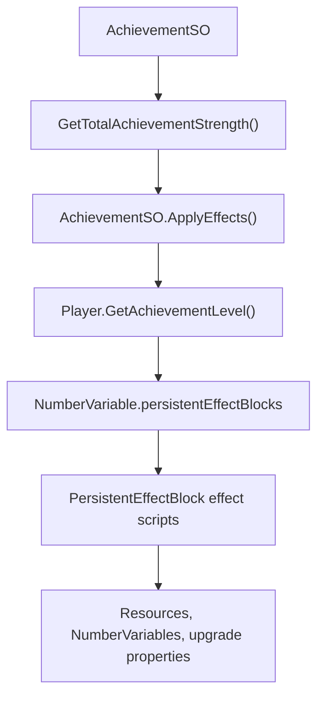
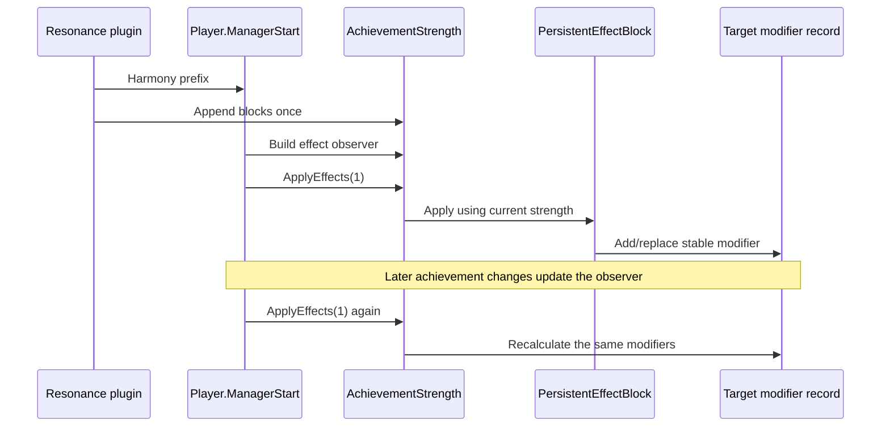

# Orb Achievement Resonance plan

> **Lifecycle: Experimental.** Native mutation remains disabled by default while runtime validation continues.

[Back to roadmap](roadmap.md) · [Reverse-engineering map](../reverse-engineering/README.md)

## Goal

Coordinated implementation iterations and the pre-worktree gate are defined in [Three-mod iteration plan](three-mod-iteration.md).

Expand **Achievement Strength** so it grants configurable bonuses to speed, power, duration, special effects, and carefully selected scaling properties in addition to the game's existing advancement/resource benefits.

Working mod name: **Orb Achievement Resonance**.

## Verified game architecture

The achievement reward pipeline is already generic and effect-driven:



Verified behavior:

1. Every completed `AchievementSO` calculates its total strength from a base value, per-level modifier, and completed level.
2. `AchievementSO.ApplyEffects()` adds that strength to `Player.GetAchievementLevel()` using the achievement UUID as the modifier key.
3. `Player.ManagerStart()` builds an observer from the Achievement Strength variable and all properties referenced by its persistent effects.
4. `Player.ManagerStart()` applies those effects once during startup.
5. `Player.ManagerUpdate()` reapplies the effects whenever the Achievement Strength observer changes.

The existing resource and time-advancement rewards are therefore serialized effect configuration, not a hard-coded limitation. A mod can extend the same native list.

## Recommended implementation

Patch `Player.ManagerStart()` with a Harmony **prefix** and append custom `PersistentEffectBlock`s to:

```csharp
Player.GetAchievementLevel().persistentEffectBlocks
```

The prefix timing is important. The original method calls `GetEffectObservables()` before applying Achievement Strength. Injecting later would omit the new targets from the native observer and would require a custom refresh loop.

Each injected block should use native effect scripts:

- `NumberVariable.PersistentEffect` for direct player/global number variables.
- `UpgradeableObject.UpgradeEffectModifier` for speed/power groups and selected upgrade properties.
- `ResourceSO.PersistentEffect` only when a resource-specific modifier is desired.

Each modifier must have a stable, mod-owned UUID so native reapplication replaces the prior value instead of stacking duplicates.

## Native recalculation path



## Candidate bonus targets

The exhaustive broad-target inventory is maintained in [Global and global-ish stat catalog](../reverse-engineering/global-stats-catalog.md). It includes all 24 mapped attribute groups, player-wide number variables, global type objects, and the complete static upgradeable-property vocabulary.

### Speed

Best first target:

| Entity | UUID |
|---|---|
| `GlobalSpeedGroup` | `8a199f0d-48dd-4c3e-840e-d97a1b7dca4b` |

`AttributeGroupSO` uses a `MergingModifierRecord`. Its overridden `Add`, `Remove`, `Stack`, and `UnStack` methods propagate group modifiers into every active member record, including configured ratios and order adjustments. This makes it the correct native mechanism for a broad speed bonus.

Additional narrower groups exist for agromancy, alchemy, mental, and physical speed. We must inspect group membership before deciding whether applying both global and narrow groups would double-count the same properties.

### Power / strength

There is no single `GlobalPowerGroup` in the known mappings. Candidate domain groups are:

| Group | UUID |
|---|---|
| `AgromancyPowerGroup` | `026977c7-9d5e-4762-b67a-8df4163c9a51` |
| `AlchemyPowerGroup` | `0861aea1-4f80-45f3-a190-1cac2533e41c` |
| `ManufacturingPowerGroup` | `317d234b-354e-41bb-a252-6a280fb506ff` |
| `MentalPowerGroup` | `633688bb-983e-4200-9d08-8c87779333f0` |

The first version can target these four groups separately under one configurable Power bonus. Direct player variables such as Spell Power, Equipment Power, Ritual Power, and Crafting Power are fallback targets if the group coverage is incomplete.

### Duration and special effects

Existing groups make these comparatively safe optional bonuses:

| Group | UUID |
|---|---|
| `AllDurationGroup` | `b096ccd2-7ff4-4ac2-8cc8-da215677e299` |
| `AllSpecialsGroup` | `bfed13da-c722-416b-a2fa-a0366a49d156` |

### Resource generation and capacity

The global resource type objects expose native merged records, so resource bonuses do not require patching `ResourceSO.Gain()` or enumerating resources manually:

| Target | Property | Meaning |
|---|---|---|
| `GlobalResourceType` | `Rate` | Passive flat generation rate |
| `GlobalResourceType` | `GainRate` | Multiplier applied by normal non-raw `Gain()` calls |
| `GlobalCappedResourceType` | `MaxQuantity` | Capacity of resources already registered as capped |
| `GlobalCappedResourceType` | `MaxQuantityRate` | Rate at which applicable capacity grows |

`ResourceSO.RegisterTypes()` adds eligible generated resources to `GlobalResourceType`, except assets marked `excludeFromGlobals`. It additionally registers resources that already report a maximum with `GlobalCappedResourceType`.

`Rate` and `GainRate` must be separate settings. Passive production ultimately interacts with the gain multiplier, so enabling both for the same Achievement Strength bonus can compound or double-dip. The balanced default should use `Rate`; `GainRate` should be an optional broader acquisition bonus.

Capacity should target `GlobalCappedResourceType.MaxQuantity`, not directly mutate quantities or maximum fields. `AllAlchemicCapacities` is a different, alchemy-specific capacity/slot group and should remain an advanced independent option.

### Casting improvements

Player exposes direct global spell variables suitable for one configurable Casting category:

| Positive-direction target | Purpose |
|---|---|
| `SpellCastSpeed` | Faster spell casting |
| `SpellCooldownSpeed` | Faster cooldown recovery |
| `SpellPower` | Stronger spell effects |
| `SpellSpecial` | Stronger special effects |
| `SpellDuration` | Longer durations |
| `SpellMasteryRate` | Faster mastery progression |
| `SpellExperienceRate` | Faster spell experience |

Charge time, cooldown time, spell cost, and drain cost are inverse-direction stats: lower is normally better. If supported, expose them as explicit reduction bonuses using the correct reduction modifier rather than including them in a generic positive Casting multiplier. Critical, echo, flash, charge effect, and charge special stats can be optional advanced casting subcategories.

### Scaling

Scaling needs a curated target list. The game exposes property names such as:

- `PowerScaling`
- `EffectScaling`
- `InstanceScaling`
- `CostScaling`
- `TimeScaling`

A blanket positive modifier is unsafe because increasing effect/power scaling is beneficial while increasing cost scaling may be harmful. Scaling v1 should include only verified beneficial properties. Cost scaling should either be excluded or receive an inverse/reduction modifier.

The assembly audit confirms that there is no single global scaling record. Structure and time-rune objects expose `PowerScaling`, while other systems separately expose cost, time, instance, duration, XP-requirement, and effect scaling. Resonance must model these as separate bonus directions.

## Bonus formula

Use the game's `ValueModifier.Stacking(perPointBonus)` type. Native `EffectExecutionInfo` scales a stacking modifier by raising its factor to Achievement Strength:

```text
multiplier = (1 + perPointBonus) ^ achievementStrength
```

Example only:

```text
perPointBonus = 0.0005
strength = 100
multiplier ≈ 1.0513
```

This provides smooth compounding and uses the game's native modifier ordering. Actual defaults should be chosen only after measuring normal early-, mid-, and late-game Achievement Strength.

Optional balance controls:

- Independent rate per bonus category.
- Per-category enable switches.
- Maximum multiplier cap.
- Global strength divisor.
- Presets: subtle, balanced, strong, custom.

## Runtime discovery probe

Before implementing bonuses, build a logging-only probe that runs after assets are initialized and records:

1. Current Achievement Strength.
2. Every existing Achievement Strength effect block, script type, target, modifier type, value, order, and UUID.
3. Every `AttributeGroupSO` and its member objects/property names, ratios, exponent ratios, order adjustments, and prerequisites.
4. Every registered `UpgradeableObject` property containing `Speed`, `Power`, `Scaling`, `Duration`, or `Special`.
5. Overlap between global and domain-specific groups.

This will answer the remaining double-application and scaling-direction questions without changing gameplay.

## Tooltip integration

The mod must extend the native Achievement Strength tooltip rather than replace it. When the mod is absent or disabled, tooltip behavior remains exactly the base game behavior.

Because custom bonuses are native persistent effect blocks, `NumberVariable.GetTooltipNodes()` and `GetAltTooltipNodes()` should include their detailed effect nodes automatically. A Harmony postfix can append a clearly labeled summary section:

```text
Achievement Resonance
Speed: +5.1%
Power: +8.2%
Duration: +2.5%
```

The mod should not replace the existing Achievement Strength tooltip.

Tooltip rules:

- Preserve the original list and every native node.
- Append only mod-owned content.
- Add nothing when all Resonance bonuses are disabled.
- Avoid duplicate sections when the tooltip refreshes.
- Keep full native effect details available in alternate tooltips.
- Remove the extension automatically when the plugin unloads; no tooltip data is saved.

## Save behavior

The bonuses are derived from Achievement Strength and do not need custom save data. Configuration belongs in the BepInEx config file. On load, the plugin injects the blocks and the native `Player.ManagerStart()` path recalculates them from the saved achievements.

## Implementation status

The current source implementation under `src/OrbAchievementResonance` is the guarded R1/R2 implementation:

- `Player.ManagerStart` and `NumberVariable.ApplyEffects(int)` are patched with Harmony prefixes through reflection targets, so the mod does not require compile-time access to those game types.
- `ResonanceTargetCatalog` owns the verified candidate UUIDs for `GlobalSpeedGroup`, the four power groups, duration/special groups, resource rate/capacity type targets, and direct spell variables.
- `ResonanceModifierIds` owns stable mod UUIDs. Repeated injection removes only those owned blocks before appending current configured blocks.
- `ResonanceConfig` exposes independent enable/rate/cap settings for speed, power, duration, special, resource rate, resource capacity, casting, and casting progression.
- Native blocks use the audited `effectScripts` list and native `NumberVariable.PersistentEffect` or `UpgradeableObject.UpgradeEffectModifier` layouts.
- Modifiers use `ValueModifier.Stacking(Guid, BigDouble)`. Before native application, the mod recalculates the per-level rate so native compounding produces `min((1 + rate)^(strength/divisor), MaximumMultiplier)`.
- `General.ApplyNativeEffectBlocks` defaults to `false`. The default load path logs diagnostics and does not mutate native effect blocks.

Remaining runtime gates before enabling mutation by default:

1. Confirm asset resolution and the existing Achievement Strength list in the read-only load probe.
2. Confirm native tooltip refresh, duplicate prevention, cap behavior, and rollback with only the global-speed slice enabled.
3. Capture group-member overlap reports before enabling power, duration, special, resource, or casting categories by default.

## Risks and safeguards

- Inject blocks exactly once per game initialization.
- Use stable unique modifier UUIDs.
- Do not patch `AchievementSO.GetTotalAchievementStrength()`; changing the source value would also amplify native rewards.
- Do not modify the saved achievement level or completion data.
- Verify group overlap before enabling several related groups.
- Exclude cost scaling until its direction is proven.
- Remove only mod-owned modifier UUIDs during cleanup; never call a broad native `RemoveEffects()` that could remove base-game effects.
- Re-test after game updates because serialized group membership may change without method signatures changing.

## Milestones

### Phase 0 — Probe

- Build the runtime discovery logger.
- Capture reports from a loaded save.
- Document existing native blocks and group membership.

### Phase 1 — Speed proof of concept

- Inject one native block targeting `GlobalSpeedGroup`.
- Verify native tooltip output and live recalculation after unlocking an achievement.
- Confirm no duplicate modifiers after load or scene changes.

### Phase 2 — Power categories

- Add the four domain power groups.
- Test coverage and overlaps.
- Add independent configuration rates.

### Phase 3 — Duration, specials, and curated scaling

- Add optional duration and special bonuses.
- Add independent resource rate, capped-resource capacity, and casting categories.
- Keep passive `Rate` and broad `GainRate` mutually independent to avoid accidental double-dipping.
- Add only verified beneficial scaling targets.
- Add caps and balance presets.

### Phase 4 — Public release

- Compatibility tests with Chronomancer and Automata.
- Document formulas and affected stats.
- Publish configuration examples and a changelog.

## Definition of done for v0.1

- Uses the native Achievement Strength observer and effect pipeline.
- Recalculates after a newly completed achievement without reload.
- Adds no new save data and changes no completion state.
- Speed and power bonuses appear in native or extended tooltips.
- No double application after repeated scene loads.
- All injected modifiers are removable by their stable UUIDs.
- Clean-game, Automata, and Chronomancer compatibility tests pass.
