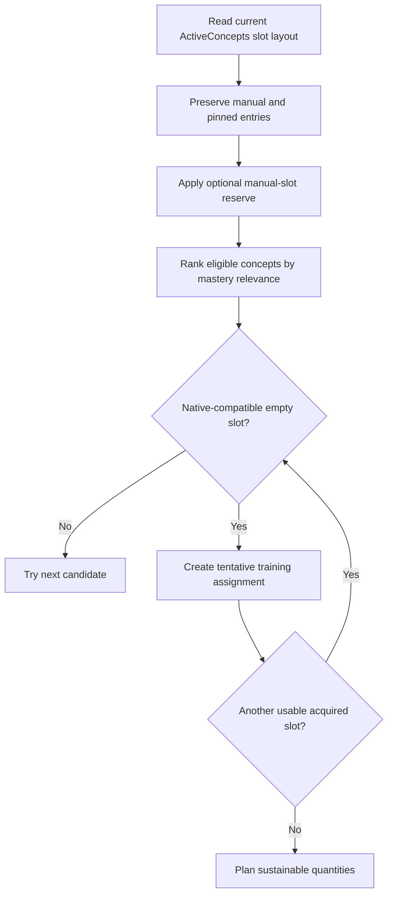
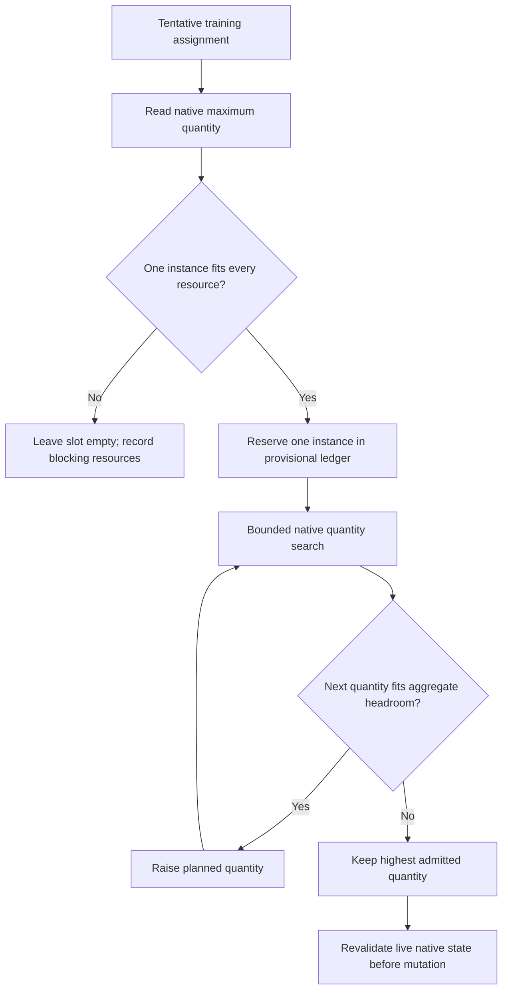
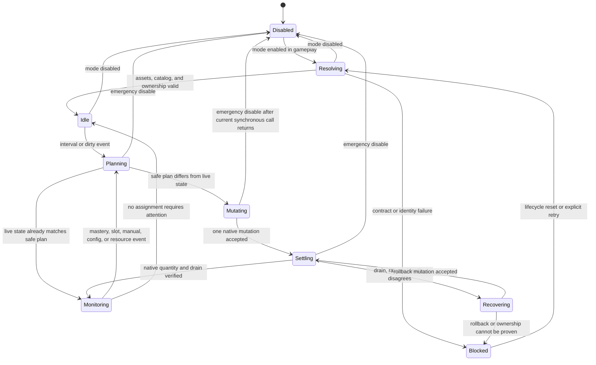
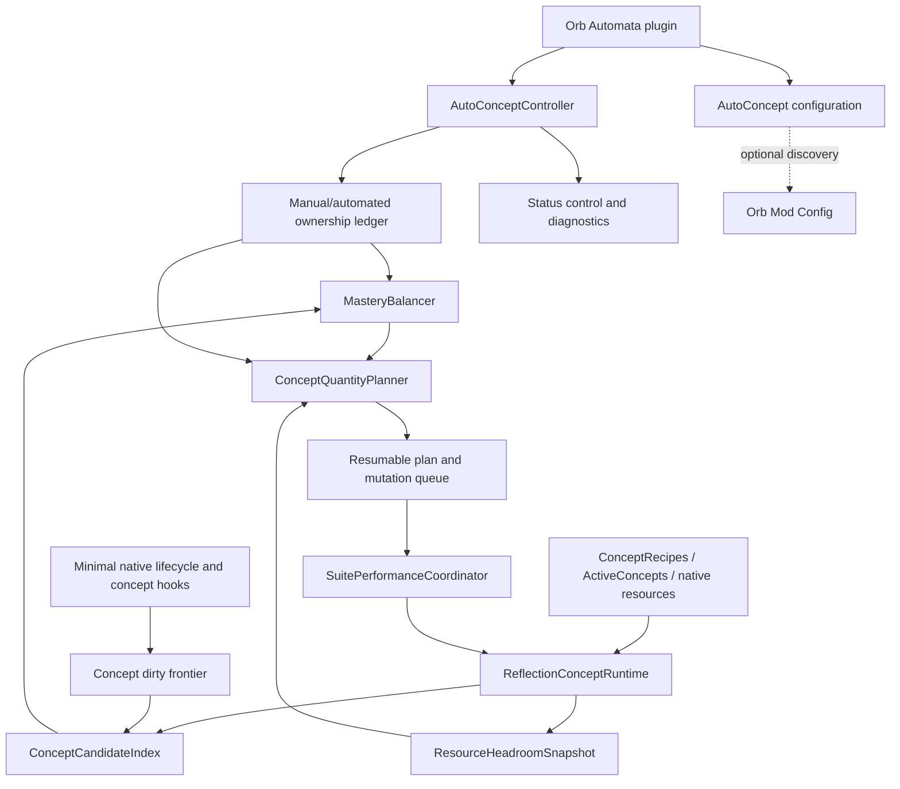

# Auto Concept mastery-balancing plan

> **Lifecycle: Release-candidate implementation; interactive validation pending.** The scoped catalog, native slot/quantity mutation, breadth/depth mastery balancer, manual-baseline ownership ledger, quality-adjusted prospective drain checks, shared scheduling, and rollback watchdog are implemented against the supported game assembly. Desktop and Steam Deck runtime validation is still required before public release.

[Back to plan index](README.md) · [Orb Automata plan](automata.md) · [Performance architecture](performance-suite.md) · [Runtime validation](../development/runtime-validation.md)

## Goal

Automate Scholar Concept mastery training without taking ownership of the player's entire concept loadout or allowing continuous concept drains to exhaust resources.

Auto Concept should periodically:

1. identify discovered concepts whose mastery progress is lowest;
2. assign those concepts to the currently acquired compatible Active Concept slots;
3. allocate as many instances of each assigned concept as its mastery and resource headroom safely allow;
4. let the native game award mastery XP and apply mastery effects;
5. rebalance after mastery, slot, lifecycle, configuration, or material resource changes.

The game remains authoritative for discovery, compatible slots, maximum instances, bandwidth usage, drain scaling, XP, mastery level changes, effects, and final mutations.

## Player-facing model versus native implementation

Concepts are a Scholar system in the player-facing game. The supported build implements them with shared alchemy runtime classes:

```text
Scholar Concepts
  ├─ concept definitions       AlchemyRecipeSO
  ├─ equipped concept entries  AlchemyInstance
  ├─ concept families          AlchemyTypeSO
  ├─ concept definition asset  ConceptRecipes
  └─ active loadout asset      ActiveConcepts
```

This reuse does not make ordinary alchemy part of Auto Concept. The adapter must resolve the concept-specific assets and validate the three concept type UUIDs. It must never treat every `AlchemyRecipeSO` as a concept.

## Terminology

| Term | Meaning |
|---|---|
| Concept definition | One discovered Scholar concept recipe, identified by stable UUID and expected `AlchemyRecipeSO` type. |
| Active Concept slot | One acquired loadout position that can hold one compatible concept definition. Slots may be typed or typeless. |
| Instance quantity | The count displayed on an active concept entry. Quantity scales training speed, effects, bandwidth, and drains; it does not create one Unity object per count. |
| Mastery level | Native `AlchemyRecipeSO.masteryLevel`. For mastery-limited concepts, the native maximum quantity is `masteryLevel + 1`. |
| Effective mastery | Mastery level plus bounded progress toward the next level, used only for deterministic training priority. |
| Manual baseline | Active quantity present when Automata begins owning a training plan or after an explicit rebaseline. |
| Automated delta | Quantity added by Auto Concept above the preserved manual baseline. Auto Concept may remove only this delta by default. |
| Training assignment | A concept selected by the balancer for one currently usable slot. |
| Resource headroom | Native resource rate and quantity capacity remaining after configured safety margins. |

## Product contract

### Default behavior

- Fresh installations start with Auto Concept disabled.
- Active mode uses all currently acquired compatible slots except slots occupied by preserved manual/pinned concepts or explicitly reserved for manual play.
- The training pool contains discovered, available, validated concepts that are not blocked by configuration.
- Concepts are ranked by effective mastery, lowest first, with stable UUID as the final tie-breaker.
- A rebalance runs on a multi-minute interval and may be requested sooner by a mastery-level change, acquired-slot change, manual loadout change, configuration change, or lifecycle invalidation.
- The balancer changes only quantities it owns. It does not clear the native loadout.
- Resource safety may leave an acquired slot empty or assign less than `masteryLevel + 1` instances.
- Emergency disable cancels pending plans and new mutations immediately. It does not rewrite native progression or remove accepted game state unless an explicit cleanup policy is later approved.

### Non-goals for the first release

- Discover concepts automatically.
- Purchase Scholar upgrades or selected concept-family levels.
- Rank concepts by guessed effect value, display name, tooltip text, or unlock order.
- Maximize a global economic objective across every possible loadout combination.
- Promise optimal XP per resource.
- Spend down finite resources merely because their current quantity is high.
- Modify ordinary alchemy recipes or active alchemy instances.
- Compete with another concept automation plugin.
- Edit save JSON or an active save file.

## Verified installed-game architecture

Static inspection was performed against the installed and repository-audited `Assembly-CSharp.dll` baseline:

- SHA-256: `5845797D40E4631517DE9F4D6296F10C7381AAD5DA733128B2C4685E66E8711F`
- Installed DLL and `.analysis/inputs/Assembly-CSharp.dll` matched at the time this plan was written.

### Stable concept identities

| Asset | UUID | Expected type |
|---|---|---|
| Reductive | `47b787b9-d4cd-43c8-a7e3-63a1e4e0ae94` | `AlchemyTypeSO` |
| Reflective | `8f258dcc-c39a-4d64-b915-4239e746c49d` | `AlchemyTypeSO` |
| Conceptualization | `69842862-dfce-4a9e-a73b-f757c72e49dc` | `AlchemyTypeSO` |
| ActiveConcepts | `9121924d-2692-428b-9599-165224ccd899` | `AlchemyInstanceListVariable` |
| ConceptRecipes | `c8ff8e01-c042-49c2-86a2-e374f82c280c` | `AlchemyRecipeListVariable` |

The current entity mapping contains 124 `AlchemyRecipeSO` definitions, of which 46 have the mapped Analyze, Learning, or Study concept families. Names are diagnostics only; membership must be proven by the concept asset and type UUIDs.

### Important native behaviors

- `AlchemyRecipeListVariable.GetAll()` returns the global `AlchemyRecipeSO.All` catalog. Auto Concept must not call it and assume the result is concept-scoped.
- `IdScriptableObject.RuntimeLookup` can resolve stable assets by UUID. Every result still requires exact native type validation.
- `AlchemyInstanceListVariable` maintains typed and typeless slot counts. Total slot count alone is insufficient; final assignment uses native `HasEmptySlotsForRecipe()` and `CanAddInstance()`.
- `AlchemyInstanceListVariable.EngageAlchemy(recipe)` follows the native UI path. It clamps the requested multi-buy quantity against compatible slots, maximum usage slots, and bandwidth availability before calling `AddAlchemyInstances`.
- `AddAlchemyInstances` creates one `AlchemyInstance` only when the recipe is not already active. Later additions change that instance's quantity rather than creating one native object per count.
- For a core concept type with `maxUsageByMastery`, `AlchemyRecipeSO.GetMaxUsageSlots()` returns `masteryLevel + 1`.
- `AlchemyInstance.GetExpPerSecond()` multiplies the native recipe XP rate by the active drain ratio, native instance speed, and the XP modifier. Quantity affects native instance speed and drain scaling.
- `AlchemyRecipeSO.GainMasteryXp()` uses the native `ExperienceContainer`, increments `masteryLevel` when ready, produces native notifications, and calls `ApplyMastery()`.
- `ApplyMastery()` contributes the concept's confirmed mastery level to its related `AlchemyTypeSO` effects.
- Quantity increases are queued for a native cooldown of approximately 0.25 seconds before `SubmitQuantityChange()` reapplies drains and effects. Quantity decreases submit immediately.
- `ResourceDrain` exposes current drain, actual ratio, necessary ratio, and usage ratio. `ResourceSO` exposes native quantity, capacity, true rate, drain, and effective drain ratios.

These observations define candidate contracts, not release approval. Installed-game contract tests and interactive evidence must cover every reflected field, method, and mutation path used by the implementation.

## Mastery relevance policy

The default priority is deterministic lowest-progress-first balancing.

```text
progressFraction = clamp(currentMasteryXp / requiredMasteryXp, 0, 1)
effectiveMastery = masteryLevel + progressFraction
```

Candidate order:

1. explicitly pinned training priority, if later exposed;
2. lower effective mastery;
3. longer time since last automated training, to prevent permanent starvation;
4. stable UUID.

An invalid, zero, negative, NaN, infinite, or contradictory XP requirement blocks the affected candidate from fractional scoring. The safe fallback ranks it by confirmed mastery level and stable UUID; it must not fabricate progress.

### Training pool

A candidate enters the training pool only when:

- its stable UUID resolves to an `AlchemyRecipeSO` in the current lifecycle epoch;
- it belongs to the concept registry and at least one verified concept type;
- native discovery and availability contracts pass;
- it is not blocked by user configuration;
- its native identity and mastery fields are valid;
- at least one compatible slot can hold it or it is already active;
- its drain vector can be decoded completely.

Locked, undiscovered, temporarily resource-blocked, incompatible, or unresolved concepts remain indexed for later reevaluation. They are never treated as completed.

## Dynamic slot ownership

`MaximumTrainingConcepts` is not a fixed configuration value. It is derived from the live acquired Active Concept slot layout.

```text
usable automated assignments
  = compatible acquired slots
  - preserved manual/pinned assignments
  - configured manual slot reserve
```

The exact number may differ by candidate because the native list contains typed and typeless slots.



Slot changes invalidate only the assignment plan. A newly acquired slot schedules an early rebalance; it does not rebuild native reflection metadata or run the optimizer inside the slot-change hook.

If slot capacity shrinks, Auto Concept removes its lowest-priority automated assignment first. It never removes a preserved manual/pinned entry to satisfy its own plan. Contradictory native slot state fails closed and pauses new mutations.

## Manual and automated ownership

The ownership model prevents the balancer from fighting the player.

For each active concept:

```text
current native quantity = preserved manual baseline + automated delta
```

Rules:

- Enabling Auto Concept snapshots the current active loadout as the manual baseline.
- An uncorrelated native quantity or assignment change is treated as manual input.
- Manual input pauses automated mutation for a configurable interval and requests a rebaseline.
- Automata-originated mutations are correlated to the exact ActiveConcepts asset, recipe identity, and expected quantity delta so their synchronous native hooks are not mistaken for manual input.
- Removing a training assignment removes at most its automated delta.
- Save load, reset, NG+, native-object replacement, or ambiguous ownership clears the ownership ledger and blocks mutation until a controlled rebaseline.
- Disabling Auto Concept leaves native quantities unchanged by default. Optional cleanup is deferred until player expectations and lifecycle behavior are validated.

## Resource-safety model

Concepts consume continuous resource rates. A high current quantity is not evidence that a drain is sustainable. Admission must use native rate, drain, capacity, and quantity information.

### Snapshot inputs

For every resource referenced by any tentative training assignment, capture once per planning epoch:

- stable resource UUID and expected native type;
- true/current quantity;
- maximum or functional capacity when finite;
- native true rate after current gains and drains;
- native modded drain and effective drain ratio;
- current concept drain contribution where available;
- quantity and rate observables or fingerprints;
- snapshot epoch.

Use `BigAmount`/native `BigDouble` semantics for stored values. Ordinary `double` is limited to bounded ratios, time durations, and diagnostics.

### Default no-dry admission

For every resource drained by the proposed plan:

```text
projectedNetRate = currentNetRate
                 + drainReleasedByRemovedAutomatedAssignments
                 - predictedDrainOfTentativeAssignments

projectedNetRate >= configuredRateReserve
currentQuantityPercent >= configuredQuantityFloor
```

The rate reserve should support both an absolute native-rate amount and a percentage margin. The larger reserve wins.

If a resource has no trustworthy generation/rate contract, the candidate fails closed in the first release. A future explicitly configured runway policy may allow a bounded negative rate only when time-to-floor remains above a minimum duration, but such a policy cannot honestly promise that the resource will never dry.

### Aggregate dependencies

Each concept may drain a different resource vector, and several assigned concepts may share one resource. The planner uses one provisional headroom ledger for the whole tentative loadout. A candidate is admitted only when every component of its vector fits.

The planner must account for the fact that concept effects can change resource production, drain modifiers, free usage, or other candidates after settlement. Prediction is therefore provisional; native post-mutation verification remains mandatory.

## Quantity planner

For each tentative assignment:

```text
native maximum = recipe.GetMaxUsageSlots()
desired maximum = min(native maximum, configured per-concept safety cap if any)
```

The planner should use native scaling/cost methods to evaluate prospective quantities. It must not independently reproduce instance scaling, overdrive, selected-level penalties, quality behavior, or rounding.

### Breadth before depth

To use acquired slots without letting the first low-level concept consume all shared resources:

1. **Breadth pass:** tentatively allocate one instance to each selected compatible concept whose complete drain vector fits.
2. **Depth pass:** in mastery-priority order, find the highest additional quantity that fits the remaining provisional resource headroom.
3. **Verification pass:** compare the completed plan with live slot and resource state immediately before mutation.

Per-candidate quantity search may use bounded binary search when native scaling is monotonic and that property is verified. Otherwise use a resumable bounded step search. Unknown or non-monotonic evidence rejects optimization for that candidate rather than guessing.



### Mutation order

Apply at most one concept mutation at a time:

1. remove an obsolete automated delta;
2. wait for native removal/effects to settle;
3. refresh affected resource headroom;
4. add or change one assignment through the native engagement path;
5. wait for the native quantity cooldown and effect/drain settlement;
6. verify actual quantity, drain ratio, resource rate, and ownership;
7. continue with the next assignment only when the previous result is safe.

This makes a multi-slot rebalance slower but prevents stale batch assumptions and spreads native effect work across frames.

## Runtime state machine



The state machine runs on the Unity main thread. Background threads may not read Unity objects, native resources, registries, or list variables.

## Event and reconciliation flow

Harmony hooks capture minimal identities and dirty reasons. They do not scan catalogs, evaluate resources, format detailed logs, or mutate another concept.

```mermaid
sequenceDiagram
    participant Game as Native concept/runtime event
    participant Hook as Minimal Harmony hook
    participant Dirty as Coalesced dirty frontier
    participant Scheduler as Suite coordinator
    participant Planner as Auto Concept planner
    participant Native as ActiveConcepts native API

    Game->>Hook: mastery, quantity, slot, or lifecycle change
    Hook->>Dirty: enqueue stable identity and reason
    Note over Hook,Dirty: constant-time; duplicate events coalesce
    Scheduler->>Planner: grant bounded planning work
    Planner->>Planner: update only affected cached state
    Planner->>Planner: build or resume safe assignment plan
    Scheduler->>Native: admit one native mutation
    Native-->>Planner: synchronous result
    Planner->>Planner: wait for native settlement
    Scheduler->>Planner: verify actual rates and quantity
```

Candidate refresh priority:

1. lifecycle and identity invalidation;
2. manual loadout and acquired-slot changes;
3. mastery-level changes;
4. current training concepts whose drain/resource state changed;
5. ordinary interval rebalance;
6. slow full concept-registry reconciliation fallback.

## High-level architecture



Responsibilities:

| Component | Ownership |
|---|---|
| `AutoConceptController` | Mode, state machine, interval, lifecycle, emergency stop, work coordination |
| `ReflectionConceptRuntime` | Exact UUID/type resolution, cached native methods/fields, final native validation and mutation |
| `ConceptCandidateIndex` | Stable definitions, live mastery/discovery state, slot compatibility, dirty flags |
| `MasteryBalancer` | Effective-mastery ranking, starvation prevention, tentative slot assignments |
| `ResourceHeadroomSnapshot` | One consistent native resource view for a planning epoch |
| `ConceptQuantityPlanner` | Breadth/depth allocation and provisional resource deductions |
| `ConceptOwnershipLedger` | Manual baseline, automated delta, mutation correlation, rebaseline policy |
| `ConceptWorkQueue` | Resumable scans, planning, settlement checks, rollback work |
| `AutoConceptStatusControl` | Active/off/blocked state and low-frequency explanation |

Keep pure balancing and resource-ledger policy testable without game assemblies. Native adapters remain inside Orb Automata; do not move Scholar gameplay ownership into `OrbModding.Common`.

## Shared scheduling and performance model

Auto Concept must register with the suite coordinator together with Auto Buy, Auto Cast, Mentor, and supported UI work. The existence of a per-module timer does not permit an independent full frame budget.

### Work classes

| Work | Proposed budget class | Behavior |
|---|---|---|
| Dirty-event capture | Constant-time hook | Mark only; no lease or scan inside hook |
| Catalog reconciliation | Soft-limited cooperative | Resumable candidate slices |
| Mastery ranking | Soft-limited cooperative | Reused buffers; bounded partial selection rather than routine full sort when useful |
| Resource snapshot and quantity planning | Soft-limited cooperative | One resource read per planning epoch; resumable search |
| Slot/resource safety verification | Hard-limited cooperative/native read | Small time-sensitive check |
| Engage/disengage quantity mutation | Non-preemptible native mutation | At most one expensive suite mutation per frame |
| Settlement verification/rollback | Hard-limited | Prompt but still bounded |

### Cadence

Proposed starting targets:

- ordinary mastery rebalance: every 3–5 minutes;
- mastery or acquired-slot change: early dirty rebalance after event coalescing;
- settlement verification: after the native quantity cooldown, then short bounded follow-up;
- active resource safety watchdog: 1 Hz for automated assignments only;
- slow concept registry reconciliation: 10–30 seconds or explicit lifecycle invalidation;
- UI status refresh: event-driven, with a slow visible-only fallback;
- disabled module: no catalog scans, optimizer work, resource polling, or mutation work.

The full concept catalog is small enough for infrequent work, but every scan must still be sliced and allocation-conscious. Do not call `FindInstance()` every frame; the native implementation allocates a closure/delegate. Cache validated active-instance references for the lifecycle epoch and invalidate them on list or identity changes.

### Performance acceptance targets

- No `Resources.FindObjectsOfTypeAll`, reflection discovery, full registry rebuild, or full candidate sort in a per-frame path.
- Steady maintained assignments produce no recurring managed allocations from Auto Concept.
- Shared non-mutation suite work normally remains below the suite's 0.75 ms soft target and stops new work after the 1 ms hard target is observed.
- At most one expensive native mutation begins in a suite frame.
- Quantity changes are batched; no one-native-call-per-instance loop.
- A concept quantity of 100 or more still represents one cached `AlchemyInstance`, not 100 mod-owned work items.
- A 30-minute combined Auto Buy, Auto Cast, Mentor, Mod Config, and Auto Concept run shows no unbounded pending work, catalog growth, ownership drift, or managed-memory growth.
- Measure native mastery popup/effect bursts separately because synchronous native work cannot be preempted by the coordinator.

## Player controls and proposed configuration

Names and defaults remain subject to runtime measurement and player approval.

### General

- `Mode`: `Disabled` or `Active`.
- `ToggleShortcut`: dedicated configurable shortcut.
- `ShowStatusButton`: native-styled status control near other Automata controls.
- `EmergencyDisable`: shared Automata safety switch.

### Balancing

- `RebalanceIntervalSeconds`: default 300 seconds, configurable from 10 through 1800 seconds.
- `UseAllAvailableConceptSlots`: proposed default true.
- `ReservedManualConceptSlots`: proposed default 0; applies only after preserved manual/pinned assignments.
- `MinimumTrainingDurationMinutes`: proposed default 3 minutes to prevent churn.
- `AllowedConceptUuids`: optional allowlist; empty means every validated discovered concept.
- `BlockedConceptUuids`: explicit denylist.
- `PinnedConceptUuids`: preserve or prioritize separately only after ownership semantics are validated.
- `PerConceptQuantityCap`: optional safety cap; zero means use the native mastery limit.

### Resource safety

- `RateReservePercent`: proposed conservative positive-rate margin.
- `AbsoluteRateReserve`: optional native-rate reserve parsed as `BigAmount`.
- `MinimumResourcePercent`: finite-cap quantity floor.
- `MinimumDrainRatio`: native post-settlement drain-ratio floor.
- `UnsafeGraceSeconds`: sustained failure window before rollback, except zero-resource or contract failures which stop immediately.

### Manual control and diagnostics

- `ManualPauseSeconds`: pause and rebaseline after uncorrelated native loadout input.
- `EnableOperationalLogging`: low-frequency plan summaries only.
- `DecisionLogLevel`: summary or bounded verbose rejection reasons.

The status tooltip should show mode, acquired/usable/assigned slots, current training concepts and quantities, next rebalance, blocked resources, and whether manual pause or settlement is active. It must not update all recipe cards every frame.

## Safety invariants

- Use stable UUID plus exact native type for every asset, concept, and resource identity.
- Never identify concept membership by Analyze/Learning/Study name prefixes alone.
- Never touch an ordinary alchemy recipe or active alchemy list.
- Never treat undiscovered, unavailable, missing, or resource-blocked as completed.
- Never exceed native `GetMaxUsageSlots()` or bypass compatible-slot checks.
- Never mutate a manual/pinned baseline to satisfy an automated plan.
- Never remove more than the recorded automated delta.
- Preserve global multi-buy across success, failure, early return, and exception paths.
- Revalidate slots, quantity, bandwidth, resource state, ownership, and identity immediately before every native mutation.
- Abort and replan when native results disagree with prediction.
- Do not reproduce the game's complete instance scaling or resource economy independently.
- Do not accept a partially decoded multi-resource drain vector.
- Do not read or mutate Unity objects off the Unity main thread.
- Do not edit active save files.
- Concurrent concept automation plugins are unsupported.

## Failure and recovery policy

| Failure | Required response |
|---|---|
| ConceptRecipes or ActiveConcepts identity/type mismatch | Block all Auto Concept mutation; rate-limited diagnostic |
| One candidate has invalid identity or drain schema | Quarantine that candidate; continue with validated candidates |
| Ownership cannot be reconstructed after lifecycle change | Clear pending plan, preserve native state, require controlled rebaseline |
| Native quantity differs from accepted mutation | Stop further mutations, refresh candidate/slot/resource state, replan |
| Post-settlement rate or drain ratio violates safety floor | Roll back only the last automated delta when ownership is proven |
| Rollback fails or would affect manual quantity | Block Auto Concept and leave native state untouched |
| Resource becomes zero or native state contradictory | Emergency stop new concept mutations immediately |
| Shared scheduler budget exhausted | Defer work without changing priority or dropping dirty state |
| Game assembly contract changes | Keep active mutation behind installed-contract compatibility gate |

Normal recovery must not clear the player's concept loadout.

## Implementation phases

### C0 — Runtime evidence and baseline instrumentation

- Add installed-game metadata contracts for concept assets, type UUIDs, mastery fields, slot methods, XP paths, drain methods, resource-rate methods, and native mutations.
- Add a development-only read/log probe for discovered concept UUID, mastery/XP, active quantity, maximum quantity, slot type, XP/s, drain vector, resource true rate, and ratio.
- Record disabled, concept-screen-open/closed, one-active-concept, and full-manual-loadout baselines.
- Measure `EngageAlchemy`, `SetQuantity`, delayed `SubmitQuantityChange`, `ReengageRecipe`, mastery level-up popups, and effect application.

Exit gate: the observed UI quantity, XP/s, mastery gain, maximum quantity, drains, and acquired-slot behavior match the audited native readings across save/load and at normal plus accelerated game speed.

### C1 — Pure mastery balancer and ownership model

- Implement effective-mastery scoring, stable ordering, starvation age, dynamic assignment count, typed-slot compatibility model, and manual/automated quantity accounting without game dependencies.
- Add deterministic tests for ties, invalid XP, locked candidates, slot growth/shrink, typed slots, manual baselines, and lifecycle rebaseline.

Exit gate: the pure engine selects the correct lowest-progress concepts for arbitrary slot layouts and never proposes removal of manual quantity.

### C2 — Read-only native catalog and status

- Resolve ConceptRecipes, ActiveConcepts, concept types, and concept candidates by stable identity.
- Build a lifecycle-aware cached index and dirty frontier.
- Expose read-only status showing what would be trained and why candidates are blocked.
- Register all work with the shared suite coordinator before enabling mutation.

Exit gate: long-session read-only operation has bounded CPU, allocations, and catalog size; ordinary alchemy never enters the candidate set.

### C3 — Single-assignment native vertical slice

- Allow one explicitly selected or lowest-ranked training concept.
- Preserve manual baseline, use native compatible-slot checks, and batch quantity through the audited engagement path.
- Preserve/restore native multi-buy and correlate own mutations.
- Add settlement verification and safe rollback.

Exit gate: one concept trains to its native mastery limit or resource-safe quantity, gains native mastery, survives manual interaction and lifecycle transitions, and cannot dry a protected resource in the focused runtime matrix.

### C4 — Dynamic acquired-slot mastery balancing

- Select as many distinct training assignments as current compatible acquired slots permit.
- Implement breadth-before-depth allocation across a shared provisional resource ledger.
- Rebalance on mastery and slot changes while enforcing minimum training duration and manual pause.
- Spread removals/additions across frames with settlement between candidates.

Exit gate: slot acquisition automatically expands training, slot loss removes only automated low-priority assignments, and shared-resource candidates never exceed aggregate headroom.

### C5 — Performance and policy hardening

- Add bounded prospective-quantity search only for verified monotonic native scaling.
- Measure incremental versus bounded rebuild strategies.
- Add adaptive backoff under frame pressure.
- Validate 30-minute combined suite behavior on desktop and Steam Deck.
- Finalize defaults and player-facing explanations from evidence.

Exit gate: combined suite frame work, allocations, loadout churn, native effect bursts, and resource floors meet the documented acceptance targets.

## Verification matrix

### Portable policy tests

- Effective mastery orders lower level and lower XP progress first.
- Stable UUID breaks exact ties deterministically.
- Invalid XP requirement never produces NaN priority.
- Dynamic training count follows acquired compatible slots, not a fixed maximum.
- Manual/pinned assignments and reserved manual slots reduce usable automated assignments.
- Typed slot incompatibility skips a candidate without consuming the slot permanently.
- Breadth pass assigns one sustainable instance before depth allocation.
- Shared resource vectors use one aggregate provisional ledger.
- One failing resource rejects the complete candidate quantity.
- Mastery increase raises the native-maximum model from `level + 1` to the next value.
- Ownership ledger never proposes removal below manual baseline.
- Manual signal pauses and rebases; correlated Automata signal does not.
- Budget deferral preserves the exact pending plan and dirty reasons.

### Installed-game contract tests

- Stable UUID/type resolution for ConceptRecipes, ActiveConcepts, and all three concept types.
- Concept-scoped list access does not silently return ordinary alchemy candidates.
- Discovery/availability, mastery XP/required XP/level, maximum usage slots, and active quantity signatures.
- Typed/typeless acquired-slot and compatibility methods.
- Native Engage/Disengage, global multi-buy, quantity cooldown, and settlement signatures.
- XP/s, instance scaling, current drain, drain ratio, resource true-rate, quantity, and capacity signatures.
- Save/reset methods and lifecycle hooks used for invalidation.

### Interactive runtime validation

- New save with few discovered concepts and one acquired slot.
- Mid-game save with several typed/typeless acquired slots.
- High-mastery save with quantities above 100.
- Concepts with disjoint resource drains run together.
- Concepts sharing one bottleneck resource respect aggregate headroom.
- Resource production changes after a spell, purchase, manual action, or concept effect.
- Lowest concept is unsustainable; the next candidate trains instead and the first retries later.
- Mastery level-up increases maximum instances and schedules a safe early rebalance.
- New Active Concept slot unlocks and receives the next eligible assignment.
- Slot capacity shrinks without removing manual/pinned concepts.
- Manual add/remove during planning, mutation, cooldown, and monitoring.
- Title → load → Main → title → different save → Main.
- Reset and NG+ invalidate all live references and ownership.
- Concept page open and closed during long training.
- Chronomancer 1×, 2×, 4×, and 8× where supported.
- Auto Buy, Auto Cast, Mentor, Mod Config, and Auto Concept active together for at least 30 minutes.

Runtime reports must record exact configuration, save scenario, game assembly hash, plugin versions, average/p95/max subsystem time, GC deltas, slot assignments, resource floors, native mutations, rollbacks, and any observed FPS/1%-low change.

## Planned source layout

```text
src/OrbAutomata/
  AutoConceptController.cs
  AutoConceptModel.cs
  AutoConceptConfig.cs
  AutoConceptCandidateIndex.cs
  AutoConceptOwnershipLedger.cs
  MasteryBalancer.cs
  ConceptQuantityPlanner.cs
  ConceptResourceHeadroom.cs
  ReflectionConceptRuntime.cs
  AutoConceptLifecycleSignal.cs
  AutoConceptToggleControl.cs
  AutoConceptToggleButton.cs
  AutoConceptTooltip.cs

tests/OrbModding.Tests/
  AutoConceptBalancerTests.cs
  AutoConceptResourceTests.cs
  AutoConceptOwnershipTests.cs
  AutoConceptLifecycleTests.cs

tests/OrbModding.GameContractTests/
  InstalledGameContractTests.cs
```

File boundaries may change after implementation proves which abstractions are genuinely separate. Avoid a single monolithic runtime class, but do not create shared abstractions before two modules need them.

## Open decisions and unresolved contracts

Resolved for the current candidate against the audited assembly:

- `ConceptRecipes` is read from the inherited runtime/save-loaded `AbstractListVariable<T>.value` on the exact UUID-scoped asset; its global `GetAll()` override is never used. Interactive validation showed the serialized `initialValue` empty while the native Concepts UI enumerated discovered recipes from `value`.
- Active instances are read from inherited `AbstractListVariable<T>.value`, avoiding the allocating native enumerator.
- Prospective drain is reconstructed with a temporary, uninitialized `AlchemyInstance`, its exact target quantity, `GetDrainCostMod().AsPercent()`, and the recipe's native `drainCost` vector. No effects, usage, or list mutation occur on that temporary object.
- Incremental raw drain is converted with each resource's live `GetTrueSpend`, which applies quality in the same direction as `GetModdedDrain`, before comparison with `GetTrueRate`.
- Disabling stops work and leaves current native quantities unchanged. A later enable treats them as a new manual baseline.
- Native Active Concept list changes plus concept discovery/mastery changes schedule an early re-evaluation; the 1 Hz watchdog reads cached owned assignments without rebuilding the catalog.

Still unresolved and gated by interactive evidence:

1. Which observable or native event most precisely signals acquired Active Concept slot changes beyond the current bounded list-count signal and ordinary rebalance?
2. Are prospective quantity drain calculations monotonic for every concept and selected level in the supported build? The candidate does not assume monotonicity: it validates the exact maximum target, then halves the delta until one exact safe target is found.
3. Should a concept that boosts its own drained resource be admitted through a one-instance settle-and-replan path? The candidate conservatively uses pre-mutation production.
4. Are the default 10% rate reserve, 10% quantity floor, and 0.95 native drain-ratio floor safe across early, mid, and late game?
5. How should pinned concepts divide ownership when the player manually changes their quantities? The candidate conservatively rebaselines the complete settled quantity as manual and relinquishes removal ownership.
6. Is lowest effective mastery sufficient, or should a later optional policy consider XP-per-resource efficiency?
7. How frequently do simultaneous concept mastery level-ups create popup/audio or effect-application frame spikes?
8. Which exact save, reset, and NG+ events invalidate ActiveConcepts object identity in runtime practice beyond the patched scene/load/manager lifecycle paths?

Record resolved answers here with assembly hash, method signature, and runtime evidence before changing lifecycle status.

## Definition of done for the first supported release

- Auto Concept is explicitly disabled by default and can be stopped immediately.
- Only validated Scholar concept definitions enter the catalog; ordinary alchemy remains untouched.
- Training assignments follow the live compatible acquired-slot layout rather than a fixed maximum.
- Lowest-progress discovered concepts receive deterministic, starvation-resistant training priority.
- Each assigned quantity stays within the native mastery limit and verified resource headroom.
- Manual/pinned quantities are preserved, and Auto Concept removes only proven automated deltas.
- Native XP, mastery, effects, bandwidth, drains, and save behavior remain authoritative.
- Save load, reset, NG+, slot changes, manual interaction, and object replacement invalidate and rebuild safe state correctly.
- Disabled and steady-state operation perform no unbounded scans, allocations, logging, or pending-work growth.
- Combined suite performance meets the shared scheduler and 30-minute validation targets on desktop and Steam Deck.
- Behavior documentation, configuration reference, versions, changelog, installed-game contracts, portable tests, and runtime evidence are updated together before release.
