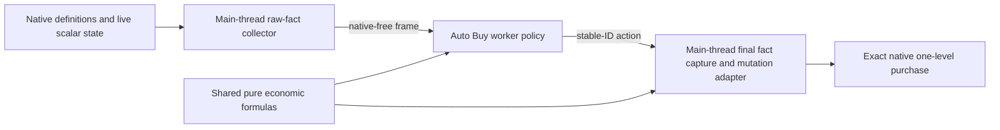

# Auto Buy raw-fact ServiceCycle port

> **Lifecycle: Proposed / raw input graph mapped / serialized parity capture pending.** Replace the legacy main-thread
> Auto Buy scheduler with one typed service on the neutral Automata ServiceCycle host. The target collector
> copies raw game facts only; shared pure code reproduces purchase, resource, and ranking calculations on the
> worker; a small main-thread adapter re-captures the required facts and performs one exact native mutation.

[Back to plans](README.md) ·
[Current native pipeline](../reverse-engineering/auto-buy-native-pipeline.md) ·
[Raw-fact input graph](../reverse-engineering/auto-buy-raw-fact-inputs.md) ·
[Queue and completion evidence](../reverse-engineering/auto-buy-queue-and-completion.md)

## Decision

Auto Buy should not ask the game to calculate policy answers on the Unity main thread when the inputs to
those answers can be captured more cheaply.

The target design therefore does not treat `CanPurchase()`, `GetPurchaseCost()`, `IsAvailable()`,
`GetTrueQuantity()`, or similar convenience methods as permanent worker inputs. Their current results are
useful parity evidence during migration, but the intended steady state is:

1. resolve audited native definitions and formula inputs;
2. copy immutable or scalar facts into native-free records;
3. reproduce the relevant game mathematics in pure shared code;
4. evaluate candidates and choose actions on the ServiceCycle worker; and
5. re-capture the small authoritative input set immediately before one native mutation.

The installed-game IL formulas and bulk collection roots are now mapped. The remaining evidence gate is
the installed candidates' serialized prerequisite and modifier topology plus pure/native parity fixtures.

### Compatibility constraints

The port changes data collection and execution ownership, not the current product policy:

- Spell Leveling stays configured under Auto Buy and keeps its current controller and gating.
- Every current Auto Buy configuration key remains bound during the port.
- Current ranked-pass, batch, and grouping behavior remains, including `Single`, `Fixed`,
  `BulkDevelopment`, and `ActionMultiplier`.
- One exact native level may be submitted per Auto Buy service frame. A group therefore continues across
  frames instead of becoming a same-frame native burst.
- Cost/quality Structure priority, allow/block lists, independent affordability, reserves, and manual queue
  reservation retain their current meaning.

If an old scheduler-tuning setting cannot map honestly to one coherent ServiceCycle capture, it receives a
separate compatibility decision. It is not silently removed, moved, or reinterpreted as part of this port.

## Why this direction

The current Auto Buy core contains approximately 6,100 lines across its engine, catalog, candidate index,
resource cache, and model. The wider Auto Buy production surface is about 7,500 lines, and its dedicated
test and simulator surface is more than 9,000 lines.

Most of that code does not implement purchase policy or native mutation. It maintains a second scheduler:
CPU slices, pending scans, dirty-resource indexes, hot and slow refresh cursors, prepared groups, batch
quotas, queue polling, multi-call bursts, timed retries, settlement generations, and repeated diagnostic
state.

ServiceCycle already owns capture, worker execution, wake policy, action dispatch, lifecycle replacement,
configuration publication, replay, tracing, and one-poll-per-service frame admission. Reusing those
contracts should let Auto Buy delete the duplicate scheduler instead of translating it.

## Target boundary

The worker and final adapter both call the same pure formulas. The adapter invokes them synchronously over
freshly captured scalar records before mutation; it does not trust an older worker recommendation as
mutation authority.

### Common and feature ownership

`OrbModding.Common` may own gameplay-neutral numeric and economic primitives:

- exact large-number values and operations;
- immutable resource amounts, capacities, and cost vectors;
- pure modifier composition;
- native-compatible significant-digit rounding;
- reserve and affordability calculations;
- generic cost-vector validation; and
- generic condition comparison and composition.

Automata remains responsible for mapping audited Orb of Creation definitions into those neutral records and
for composing the exact Structure and Upgrade formulas, ranking candidates, and applying grouping and batch
policy. Common must not reference `StructureSO`, `UpgradeSO`, Auto Buy configuration, or feature-specific
decision codes.

## Required raw facts

The detailed field and formula evidence lives in the
[raw-fact input graph](../reverse-engineering/auto-buy-raw-fact-inputs.md). The collector uses three bulk
roots—`StructureSO.All`, `UpgradeSO.All`, and `ResourceSO.All`—then copies the transitive dependency closure
of current candidates.

The lifecycle definition snapshot contains stable identities, base cost tuples, modifier programs,
prerequisite topology, maximum-level definitions, and indexes into deduplicated dependency tables.

The live frame contains:

- Structure quantity/queued quantity or Upgrade level/queued levels/max level;
- current candidate and resource modifier operands;
- stored resource quantities, visibility, quality, maximum quantity, attribute-cost inputs, and bandwidth
  classification;
- the cached availability bit and current values of reachable prerequisite subjects;
- queue total/capacity, Player economic modifiers, Bulk Development, and action multiplier;
- lifecycle, configuration, ownership, and emergency generations; and
- the small ranked-pass, group, and batch cursor state required for compatibility.

Rate, drain, loss, decay, and replenishment are not part of current Auto Buy eligibility, affordability,
reserves, or ranking. They stay out of the first frame. The game remains responsible for the exact native
spend and its side effects.

Static reflection metadata is process-bound to an admitted assembly hash. Unity references, registry
membership, definition objects, and prerequisite graphs remain lifecycle-bound until a fingerprint proves a
cheaper lifetime.

### Final action capture

Immediately before mutation, the action adapter re-resolves the stable UUID and exact type and re-captures:

- lifecycle and ownership;
- prerequisite and availability inputs;
- current and queued level inputs;
- current queue capacity and remaining room;
- all resources and modifiers required by the candidate's next-level formula;
- native multi-buy state for Upgrade isolation; and
- queued state for the mutation postcondition.

It then runs the same pure calculation used by the worker. A changed fact rejects the advisory action
without calling the native purchase method.

## Pure calculations

The worker should own all calculations that do not require a Unity object:

1. reconstruct Structure or Upgrade availability from prerequisite, level, and lifecycle facts;
2. derive the exact next queued level;
3. reproduce the native next-level cost vector;
4. combine duplicate resource costs and reject contradictory identities;
5. derive true resource availability, bandwidth headroom, quality, and effective attribute cost from raw
   inputs;
6. apply absolute and relative reserves;
7. apply Structure and Upgrade affordability policy;
8. derive queue room after the manual reservation;
9. rank the eligible candidate set deterministically;
10. advance a small fair ranked-pass cursor; and
11. emit at most one stable-ID purchase action for the service frame.

This target removes game-side calculation from the collector. During migration, native method results may
be captured beside raw inputs as comparison evidence, but they must not become hidden production
dependencies of the worker.

## `CanPurchase()` replacement gate

The two native methods have different verified semantics:

- Structure `CanPurchase()` checks only the per-level prerequisite at completed quantity and native queue
  room. Availability and Automata affordability remain separate checks.
- Upgrade `CanPurchase()` checks max queued level, native per-tuple affordability, availability, the
  per-level prerequisite at `level + queuedLevels + 1`, and queue room in that order.

The replacement also preserves the no-argument prerequisite cache, native per-tuple cost admission,
Automata's stricter duplicate-resource combination, ordinary quality-adjusted spending, bandwidth integer
rounding, and exact Structure/Upgrade cost formulas.

Acceptance requires parity tests built from reviewed native input/output fixtures plus an installed-game
comparison capture. A mismatch blocks removal of the native call; it does not add a fallback path that tries
both indefinitely.

## Formula audit result

The exact installed-game IL input graph is recorded in
[the reverse-engineering dossier](../reverse-engineering/auto-buy-raw-fact-inputs.md), including Structure
and Upgrade cost composition, modifier order, significant-digit rounding, ordinary and bandwidth
admission, prerequisite cache behavior, queue admission, and mutable lifetimes.

Still required before implementation can remove native convenience calls:

- a runtime inventory of the actual prerequisite subtypes and target properties reachable from installed
  Structure and Upgrade definitions;
- pure/native cost and admission fixtures across current and queued levels;
- Upgrade private cost-cache invalidation evidence;
- bandwidth boundary fixtures; and
- the final pre-mutation parity comparison.

## Configuration compatibility

The first port preserves the complete current Auto Buy configuration and behavior. Spell Leveling remains
under the Auto Buy section and keeps its current separate action path. Structure priority remains available.

The worker owns a small compatibility state:

- ranked stable-ID pass and cursor;
- current group target, target size, and committed count;
- current batch target and committed count; and
- bounded definite-rejection retry state where the current behavior requires it; and
- last action receipt needed to continue or advance.

This preserves grouping across one-action frames without carrying across the old main-thread scan engine,
prepared mutation bursts, dirty index, or queue poller.

`CpuBudgetMilliseconds` is the one known mismatch: one synchronous complete capture cannot reproduce the
old resumable scan budget without reintroducing a partial-capture scheduler. The setting stays bound while
the collector is measured. Its Auto Buy meaning must be decided explicitly from that evidence rather than
silently changed during the port.

## What remains exact and single-level

Removing scheduler baby steps does not mean using an unchecked native bulk mutation.

Each accepted Auto Buy action initially performs one exact native level:

- Structure captures queued quantity, calls `Purchase(true)`, and requires delta `+1`;
- Upgrade forces native multi-buy to one, verifies the value, captures queued purchase level, calls
  `Purchase()`, requires delta `+1`, and restores the prior global value on every exit.

Native Upgrade multi-buy is not queue-safe in the supported runtime, and a bulk call would skip
per-level rising-cost and reserve validation. One purchase per Auto Buy service frame is the simple
baseline. Tracing with both Auto Harvest and Auto Buy will determine whether throughput work is justified.

## Simplification target

The port should delete rather than translate:

- the legacy/coordinated dual `AutoBuyEngine` scheduler;
- pending scan, queue-wait, and same-frame multi-call burst state;
- CPU stopwatches and 16-call bursts;
- ten-hertz queue polling;
- per-candidate timed retry dictionaries;
- dirty-reason and threshold-crossing indexes;
- active/slow maintenance cursors;
- completion settlement sweeps; and
- tests whose only concern is one of those deleted mechanisms.

Keep or rewrite around focused ports:

- exact registry and UUID/type resolution;
- raw definition and live-fact capture;
- pure formula and policy tests;
- ranked-pass, grouping, and batch behavior in small worker state;
- queue reservation;
- lifecycle replacement;
- final ownership and emergency admission;
- exact native mutation and Upgrade multi-buy restoration; and
- replay and profile evidence for capture, calculation, action revalidation, native invocation, and
  postcondition.

## Initial implementation sequence

1. Capture the installed serialized prerequisite and modifier topology required by the audited IL formulas.
2. Define strict native-free Common game-math values and Automata Structure/Upgrade formula records.
3. Build pure parity tests for next-level costs, resource economics, availability, and admission.
4. Add the typed Auto Buy ServiceCycle definition with a deliberately direct bulk collector.
5. Preserve ranked-pass, batch, grouping, and current configuration semantics across one-action frames.
6. Add final main-thread raw-fact revalidation and the existing exact mutation transaction.
7. Run the legacy and ServiceCycle paths against the same read-only fixture corpus.
8. Remove the legacy engine, obsolete scheduler tests, and transitional comparison code.
9. Profile the live two-service host before adding optimizations.

No dirty index, burst scheduler, alternate admission path, or speculative recovery layer is part of the
initial port.
