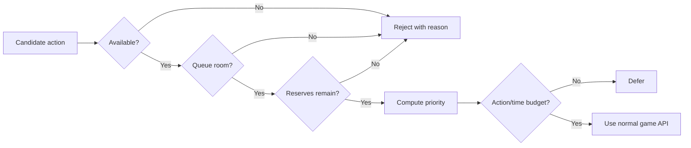

# Orb Automata plan

> **Lifecycle: Implemented / evolving.** Auto Buy, Auto Cast, Auto Concept, and progression-aware spell leveling are in public beta. This plan also records later work.

[Back to roadmap](roadmap.md)

## Goal

Automate repetitive actions through transparent, configurable rules without silently consuming resources the player intended to reserve.

## Product priorities

Automata now prioritizes the actions that players repeat most often:

1. **Auto Buy** — attributes/structures first, then verified upgrades and other levelable purchases.
2. **Auto Cast** — selected player spells, subject to readiness, targeting, cooldown, channel, and reserve rules.
3. **Auto Concept** — balance Scholar Concept mastery across acquired slots without exhausting continuously drained resources.
4. **Auto Harvest** — execute selected ready harvest actions without taking over planting or plot strategy in the first slice.
5. **Original expansion modules** — crafting, scribing, ordinary alchemy, and finally optional auto-research.

Research is no longer the MVP. The release plugin removes the deprecated research runtime and cleans its legacy configuration keys while preserving the shared resource-admission model used by Auto Buy and Auto Cast.

## Current implementation status

The first A1 implementation slice now covers both audited native purchase families:

- `StructureSO.All`: availability, one-level cost, queue state, and `Purchase(true)`.
- `UpgradeSO.All`: availability, one-level cost, queued level verification, and `Purchase()` while native multi-buy is temporarily forced to one and restored.
- Progression-aware spell leveling: exact native discovery, prerequisites, readiness, live cost, single-level purchase, and completed `UnlockLevelAllSpells` capability validation.
- Disabled/Active release modes, independently configurable spell leveling, independent excess thresholds, optional shared reserves, UUID allowlist/denylist, queue-slot reservation, live action-multiplier handling, resumable bounded scans with an Auto Buy-specific registry cap, ranked multi-candidate batches, and final per-level pre-purchase revalidation.

Portable behavior tests and installed-assembly contract tests pass. Runtime validation has covered repeated native Structure and Upgrade purchases. The current `0.7.0` candidate still requires the focused desktop and Steam Deck matrix for its shared scheduling, timed concept cycling, multi-slot and zero-resource handling, progression-aware spell leveling, and unified configuration behavior.

## AutobuyOrb reference boundary

[AutobuyOrb](https://github.com/IngoHHacks/AutobuyOrb) was a useful behavior and reverse-engineering reference, not a runtime dependency or supported companion. Its implementation buys available `StructureSO.All` entries through native `Purchase()`, ranks by true-spend/current-resource ratio, respects action-queue room, supports excess thresholds, bulk limits, a buy interval, a per-frame time budget, optional native action-multiplier behavior, and a restart-time LeanTween capacity override.

Automata does not patch AutobuyOrb, depend on its types, or implement coexistence behavior. The supported installation has one auto-buy plugin. Running multiple buyers is explicitly unsupported because they can race for resources, queue room, and the global multi-buy value.

## Core rule model

Every candidate action is evaluated against the same policy:



Common conditions:

- Module enabled.
- Object is available and unlocked.
- Prerequisites are met.
- Queue has sufficient room.
- Cost does not violate absolute or relative reserves.
- Cost/current-resource ratio is under the configured threshold.
- Per-tick action and CPU budgets are not exhausted.

## Resource reserves

Support both reserve types:

- **Absolute:** keep at least `1e9` of a resource.
- **Relative:** keep at least 100 times the evaluated action cost.

When an action costs multiple resources, all reserve checks must pass. Calculations must use `BigDouble` rather than conversion to `double`.

Reserves have two enforcement modes:

- **Atomic purchases/casts/actions:** validate immediately before invoking the native action.
- **Progressive drains:** admission checks only unless the native system exposes a safe pause/resume contract. Unrelated manual actions and other mods can still change quantities afterward.

## Priority model

Start simple and deterministic:

1. User-pinned targets.
2. Explicit category priority.
3. Lowest cost/current-resource ratio.
4. Stable UUID ordering as the final tie-breaker.

Do not introduce opaque scoring until the deterministic rules are proven.

## Original module delivery order

The A1–A3 sections below record the design path that produced the current implementation. References to probes or early release shapes are historical; current player behavior is defined by the [Orb Automata reference](../../src/OrbAutomata/README.md).

### A1 — Auto Buy vertical slice

- Reproduce the useful AutobuyOrb modes for native attribute/structure purchases: disabled, buy all, and 10x/100x/1000x excess.
- Add Automata's absolute/relative reserve policy, dry-run explanations, queue-space reservation, action limits, resumable scans, and emergency disable.
- Use `GetTrueSpend()` semantics and `BigDouble`; a zero resource quantity must never create a falsely attractive ratio.
- Start with `StructureSO` because its native availability, next-cost, global registry, queue, and `Purchase()` path are statically known from AutobuyOrb and the game assembly.
- Probe `UpgradeSO` and each additional levelable family separately. “Purchasable” is not permission to invoke an arbitrary method.

Exit: structure and upgrade affordability thresholds can be tuned independently, and Automata active mode buys through the normal queue without overspending reserves or blocking manual play in a supported single-buyer installation.

### A2 — Auto Cast

The agreed first slice is specified in [Auto Cast MVP](auto-cast-mvp.md). It operates on the complete active loadout in native slot order, uses a round-robin cursor, admits casts at a configurable resource-fullness threshold plus shared reserves (0% on fresh installs), automatically fulfills owned target requests with native random-valid selection, skips active auras, and waits behind active channels. Charge-capable spells can use the native full-charge hold or fire immediately according to configuration. Manual casts pause the rotation for a configurable two seconds.

Exit: the equipped rotation casts through `SpellManager.FireSpellIndex`, never hijacks manual targeting or interrupts a channel, respects cost and drain admission, and leaves all persistent-spell shutdown to the game or player.

### A3 — Auto Concept

Concepts reuse alchemy runtime types in this build:

- Reductive, Reflective, and Conceptualization are `AlchemyTypeSO` families.
- Study/Learning concept definitions are `AlchemyRecipeSO` assets.
- `ConceptRecipes` is an `AlchemyRecipeListVariable` and `ActiveConcepts` is an `AlchemyInstanceListVariable`.

The module must filter the concept registries rather than treating all alchemy recipes as concepts. It periodically ranks discovered concepts by confirmed mastery plus progress toward the next mastery level, fills the currently acquired compatible Active Concept slots with the lowest-progress concepts, and assigns as many instances as native mastery limits and conservative aggregate resource headroom allow. The training-assignment count follows live acquired slots rather than a fixed maximum.

The detailed ownership, resource-rate, scheduling, lifecycle, and validation design is specified in [Auto Concept mastery-balancing plan](auto-concept.md). Automatic discovery, effect-value optimization, ordinary alchemy automation, and a global economic loadout optimizer remain outside the first supported slice.

Exit: validated discovered concepts are balanced through the native concept runtime, manual quantities remain owned by the player, acquired compatible slots and native `masteryLevel + 1` instance limits are respected, aggregate continuous drains retain configured resource headroom, and no ordinary alchemy recipe is touched.

### A4 — Auto Harvest

- Discover `HarvestElementSO`, `HarvestTypeSO`, `HarvestActionSO`, live `HarvestActionInstance`, and plot-node relationships.
- Start with an allowlisted ready harvest action on an existing plot; do not choose seeds, replace plants, or redesign plot layouts.
- Validate readiness, repeatability, action cost, action-queue room, yield state, and whether an action destroys or preserves the plant.
- Add replanting and plot strategies only as later explicit policies.

Exit: Automata harvests only selected ready targets through the native action path and never destroys a plant when the configured policy requires preservation.

### A5+ — Original expansion modules

Add auto-crafting, auto-scribing, ordinary auto-alchemy, and optional auto-research one vertical slice at a time. Reuse the same policies and diagnostics, but keep separate adapters because availability, queueing, costs, drains, cancellation, and completion differ by domain.

## Explainability

Automation must expose decisions in two forms:

- BepInEx log entries at configurable verbosity.
- Enhanced tooltip lines such as:

```text
Automata: Eligible
Priority: 3
Reserve check: Pass
Next evaluation: 0.8s
```

Rejected actions should have a concise reason: locked, insufficient queue space, reserve violation, disabled category, or lower priority.

## Performance controls

The cross-plugin target architecture and lifecycle rules are maintained in the [mod suite performance plan](performance-suite.md).

- Evaluation interval defaults to 0.5 seconds of unscaled time.
- Maximum actions per evaluation defaults to 1.
- Auto Buy caps scan and purchase slices at 1 ms, and the implemented shared coordinator bounds combined suite work and admits at most one native suite mutation per frame.
- Cache static candidate lists and invalidate on relevant observable changes.
- Never scan and sort every game object every frame.

## Original long-term definition of done

This list predates the narrower supported release sequence. Auto Harvest and the A5+ domains remain planned and are not part of the current beta.

- Auto Buy supports the audited Structure/attribute scope in dry-run and active modes.
- Auto Cast supports the complete active loadout with round-robin ordering, native target selection, resource admission, and persistent-spell guardrails.
- Auto Concept balances validated discovered concepts across live compatible acquired slots while preserving manual quantities and conservative aggregate resource headroom.
- Auto Harvest supports one explicitly selected non-destructive harvest policy.
- Every module rejects unknown state, cost, or action contracts instead of guessing.
- Automata never starts an action whose conservative admission calculation would cross configured reserves.
- Manual actions remain available.
- It behaves consistently at normal and accelerated game speeds supported by the game environment.
- Disabling the plugin stops new actions immediately.
- Existing queued actions are not deleted or rewritten.
- Documentation and packaging state that concurrent auto-buy plugins are unsupported.
