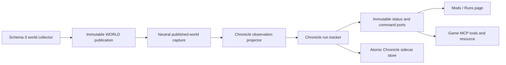

# Chronicle run comparison

> **Lifecycle: Active implementation.** This replaces the pre-ServiceCycle proposal from
> `codex/orb-chronicle-cloud`; Chronicle is a module in the single ModSuite DLL, not another
> BepInEx plugin, scheduler, native resolver, or free-standing overlay.

[Back to plans](README.md) · [Project roadmap](roadmap.md) ·
[Runtime architecture](../runtime-architecture/README.md) · [Game MCP](../user-guide/game-mcp.md)

## Outcome

Add a **Runs** page to Mods which records progression splits, compares the active run with a
personal best, previous run, or selected compatible run, and finishes when the world is restored.
Chronicle observes immutable published world state and never purchases, unlocks, completes,
resets, or edits a game save.

The current implementation supplies the trustworthy backend, bounded sidecar history,
comparison projection, native Mods UI, and Game MCP controls. Interactive end-to-end evidence is
tracked separately in Slice 4.

## Verified supported-build contracts

The exact supported Windows Steam pair was re-audited on 2026-08-01:

- `Assembly-CSharp.dll` SHA-256
  `436210E61D9F8B84658609D35E32BC274356170005AC15FE93FA36D4D9F7AA4C`;
- `Assembly-CSharp-firstpass.dll` SHA-256
  `D14D52652591ED3CB5ACF55186478DD3873F3C836871E0F68AA861D1767F480A`.

No Chronicle-specific reflection or Harmony target is needed. The shared schema-3 world already
publishes every accepted predicate:

| Split | Stable identity | Published predicate |
|---|---|---|
| Magic | suite run start | elapsed `0` |
| Scholar | `9ea5d6e1-739b-4dec-832b-f5f3ba3ad2ca` `ViewSO` | `WorldView.Available` |
| World | `efd92b91-780a-4e47-b65b-4056a9d81af5` `ViewSO` | `WorldView.Available` |
| Workshop | `c662d72a-2211-4cd6-b9d2-104071a5e6e9` `ViewSO` | `WorldView.Available` |
| Alchemy | `3ae45ec0-4449-4903-b3d0-b5182e03dca3` `ViewSO` | `WorldView.Available` |
| Rituals | `9cfb2e96-ee2f-4001-8397-7c1680ab9573` `ViewSO` | `WorldView.Available` |
| Restoration unlocked | `14b35ebc-f284-4d53-bd3f-f57a885cf2b1` `UpgradeSO` | `WorldUpgrade.IsExhausted` |
| World restored | `dcabdc8a-3e8f-4991-88f2-9374279b694b` `BoolVariable` | saved value is `true` |

The final flag is the authoritative Restoration completion boundary. The Restoration ritual asset
(`e92345c1-753a-40a0-b4bd-6fdfc75feb74`) raises `WorldComplete` only after its fifth successful
wave. That event calls `FinalAnimationManager.InitiateAnimation` and
`PersistentResetManager.CompleteWorldCycle`, whose first completion sets the saved
`PersistenceHasCompletedWorld` flag above. The later New Game+ reset is a separate player action
which clears the flag and increments `WorldResets`; Chronicle must not confuse it with finishing.

Starting while a predicate is already true marks that split **Preexisting** without inventing a
time. Starting while the final flag is already true does not immediately finish; only a false to
true observation during the active run may record the final split.

## Current architecture

Chronicle is a read-only consumer beside automation, not a gameplay service:

- The projector runs on Unity's main thread after the ordinary ServiceCycle host tick and reads
  only the world, generation, lifecycle, and monotonic timestamp exposed by a neutral capture port.
  Automata does not interpret Chronicle policy. The projector emits primitive availability,
  blocked, and reached masks plus the pinned immutable resource table used to observe curated
  resource discoveries. It retains no native object.
- The projector trusts a predicate only when the exact `views`, `upgrades`, `bool variables`, and
  `resources` category collections are clean. A transient partial collection makes the whole
  observation unavailable instead of permanently blocking a split or producing a partial
  resource discovery.
- The tracker owns exact ticks from the ServiceCycle monotonic clock (`gameplay-active-monotonic-v1`).
  It counts only while the run is `Running` and gameplay is lifecycle-ready in `Main`; it performs
  no game call.
- Lifecycle replacement, loss of a valid publication, backward world/clock movement, or regression
  of previously observed native progression pauses an active run. It never backfills a split or
  duration across an unobserved interval.
- UI receives neutral Chronicle snapshot and command interfaces. It gets no pump, world, writer,
  or filesystem authority.
- Sidecar persistence lives at `BepInEx/config/OrbModSuite/chronicle-history.json`, uses
  write-temp plus atomic replacement, retains at most 50 completed runs, and becomes read-only
  instead of overwriting an invalid file. It never opens an Orb save. An interrupted active-run
  summary is diagnosed but never auto-resumed because Chronicle cannot prove save identity.

This read-only observer is not registered as an ordinary ServiceCycle automation service because
it cannot produce a `GameAction`. It shares the same published-world boundary and lifecycle
generation, and runs only after the host tick; it is not a second collector or scheduler.

## Run and comparison model

Run states are `Dormant`, `Running`, `Paused`, `Finished`, and `Abandoned`. Each frozen milestone
schema records `Pending`, `Reached`, `Preexisting`, or `Blocked`. Reached cumulative timestamps are
monotonic and immutable. When several predicates first appear in one world generation they receive
the same observation time.

The Runs split table will contain:

| Column | Meaning |
|---|---|
| Split | stable milestone label |
| Current | active/completed cumulative time |
| Segment | difference from the prior timed split |
| Compare | matching cumulative time from PB/previous/selected run |
| Delta | Current minus Compare |

Only runs with the same clock ID and milestone-schema ID are comparable. Personal best is the
lowest final duration among compatible completed runs. Preexisting and blocked rows remain visibly
untimed and never enter segment or sum-of-best math.

### Resource KPI subsections

Every major feature has a curated, non-exclusive resource subsection based on the system that
produces or directly uses the resource, not the point in the critical path when it happens to
unlock. This distinction matters because later cross-feature upgrades can reveal an earlier
feature's resource: `Innovation:ArcaneGlyph` reveals the Magic resource Arcanum during later
progression, while `Upgrade:World:CreateCraggySpire` reveals the World resource Ore during the
Rituals phase. A resource may intentionally appear in more than one subsection when both
relationships are useful; Ore is in World as an Agromancy product and Restoration as an endgame
input.

| Section | Curated producer/usage relationship |
|---|---|
| Magic | Mana, Knowledge, Thaumaturgy, Spark, Space, Verdant Energy, Skill, Control, Water, Arcanum, Blaze |
| Scholar | Psi |
| World | Wood, Force Bark, Magebloom, Ironwood, Dark Thistle, Dreamberry, Ore |
| Workshop | Paper, Thaumic Scroll, Alchemic Scroll, Sigil, Dimensional Core, Cognitive Disc, Ingots |
| Alchemy | Organic/Occult/Tempered Essence, Amber, Elementia, Soul Shard, Hexsteel |
| Rituals | Zeal, Ceremony, Spectral Dust, Soul, Divine Fragments, Beacon |
| Restoration | Divine Fragments, Ore, Ingots, Hexsteel, Beacon |

The tracker therefore does not freeze a whole subsection at a major split. Every pending row
captures independently on its first complete published observation with `Visible == true`, storing
its cumulative discovery ticks plus visibility, quantity, true quantity, true net rate, capped
state, capacity, fill fraction, and at-capacity state. A resource already visible when the run
starts is `Preexisting` with no invented discovery time or reading. A resource absent from an
otherwise clean collection is `Missing` only for that row. The section exposes row-state counts and
`captureMode: first-visible`. It also names the stable relationship (`spell-output`,
`scholar-resource`, `agromancy-output`, `craft-output`, `alchemy-output`, `ritual-output`, or
`restoration-input`) so duplicate membership is unambiguous. Resource comparisons require the same
`orb-feature-resource-discoveries-v2` schema ID.

The catalog follows the current [Orb of Creation 1.0 critical-path walkthrough](https://steamcommunity.com/sharedfiles/filedetails/?id=3753721594)
and exact identities from the repository entity map. Future additions must remain bounded and bump
the resource schema whenever membership or capture semantics change.

## Game MCP contract

Game MCP is perf-debug only, but it must expose the same Chronicle port as Mods:

| Tool/resource | Behavior |
|---|---|
| `chronicle_status` / `orb://chronicle/status` | immutable current run, archive/comparison, split, first-visible KPI, and ratio/delta snapshot |
| `chronicle_start` | start from the latest complete observation; reject if unavailable |
| `chronicle_pause` | pause a running run |
| `chronicle_resume` | resume only with a current compatible lifecycle observation |
| `chronicle_abandon` | end the active run without changing the game |
| `chronicle_select_comparison` | choose PersonalBest, Previous, or one exact compatible archived run ID |

Commands cross the existing bounded primitive-only Game MCP mailbox, execute on Unity's main
thread, and return a terminal result inline within the existing two-second budget. They report zero
native calls and mutations. The HTTP worker never calls the tracker directly.

No arbitrary path, member name, save operation, or native action is accepted.

## Delivery slices

### Slice 1 — observation, run engine, Restoration, MCP

- [x] Add immutable milestone definitions and primitive observation projection.
- [x] Add deterministic start/pause/resume/abandon and exactly-once split state.
- [x] Freeze elapsed time on the saved final-world flag's false-to-true transition.
- [x] Pause on lifecycle replacement or observation loss; never fabricate missed time.
- [x] Require clean source categories and reject regressed clock/world/progression observations.
- [x] Capture curated feature-resource discoveries independently without fabricated history.
- [x] Add `chronicle_status`, start, pause, resume, and abandon MCP tools/resource.
- [x] Add portable/profile tests and current behavior documentation.

### Slice 2 — durable history and comparisons

- [x] Add validated schema-v1 active/history sidecars with atomic event-driven writes.
- [x] Recover valid completed history without ever touching game saves; diagnose but do not resume an unproven active run.
- [x] Add PB, previous, selected-compatible comparison selection and delta projection.
- [x] Add resource quantity/rate/capacity ratios and deltas for schema-compatible discoveries.
- [x] Define 50-run retention and fail-closed corruption diagnostics.

### Slice 3 — Mods / Runs page

- [x] Add Runs to the existing native-styled Mods rail with its own audited Rituals glyph.
- [x] Render the comparison table from neutral ports at the normal open-page cadence.
- [x] Render collapsible resource KPI subsections beneath each major feature.
- [x] Add start, pause/resume, abandon confirmation, comparison cycling, and archived-run selection controls.
- [x] Keep staged configuration, Runtime, quick controls, and native navigation ownership intact.

### Slice 4 — runtime evidence and refinements

- [x] Validate the installed perf-debug DLL exposes `Mods -> Runs` through the audited native
  screen catalog, navigate there through Game MCP, and capture the rendered Chronicle frame.
- [x] Validate the live MCP status includes all eight major splits, all seven resource subsections,
  and the exact archived-run comparison selector.
- [ ] Validate a disposable fresh run through each split and Restoration completion.
- [ ] Validate title/load/reset/NG+ transitions and another save without mixed histories.
- [ ] Validate Chronomancer speeds and manual/Automata progression paths.
- [ ] Consider an optional exact-frame `CompleteWorldCycle` postfix only if measured 250 ms
  publication precision is insufficient; it would require a new manifest contract and UAT.

## Verification boundary

Portable tests cover state transitions, duplicate/simultaneous observations, preexisting and
blocked splits, lifecycle loss, partial source collections, exact monotonic ticks, regression
detection, authored Restoration contracts, final-edge behavior, and MCP schemas/terminal commands.
Installed-game contracts and the real-reference build prove the shared predicates retain their
admitted native shape. Installed Game MCP evidence additionally proves the current DLL can discover
the native Mods shell, navigate to Runs, render the dormant Chronicle, and publish the complete
split/resource schema. Interactive runtime validation remains required for claims about active-run
timing, save/load behavior, or end-to-end Restoration completion.
