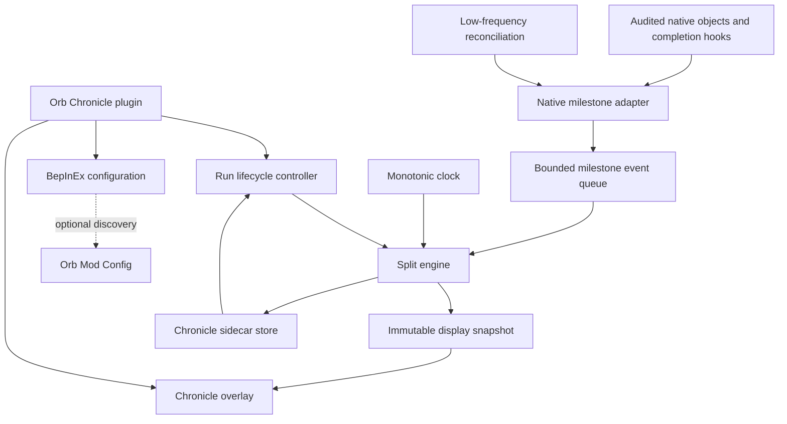
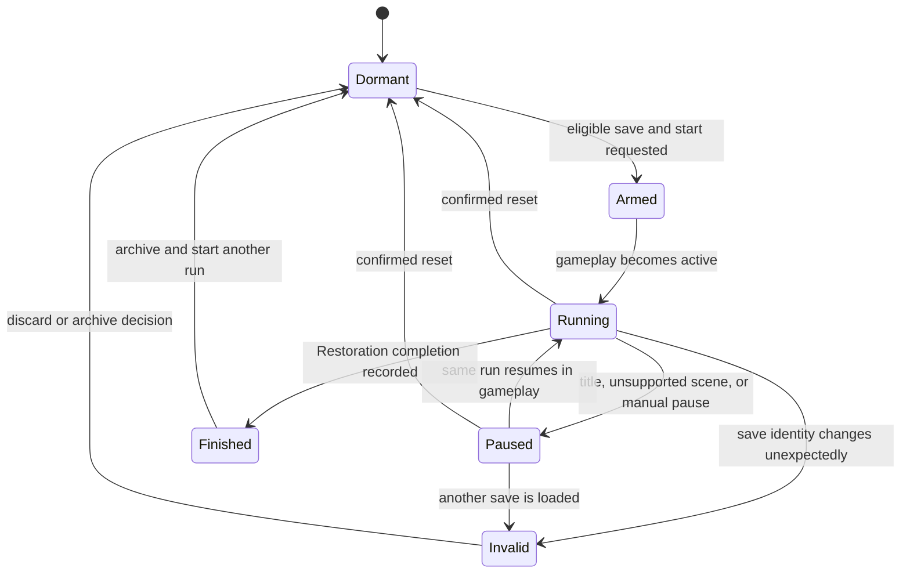
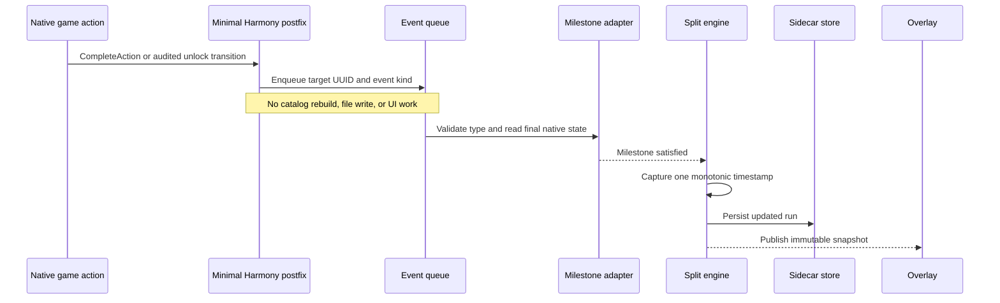
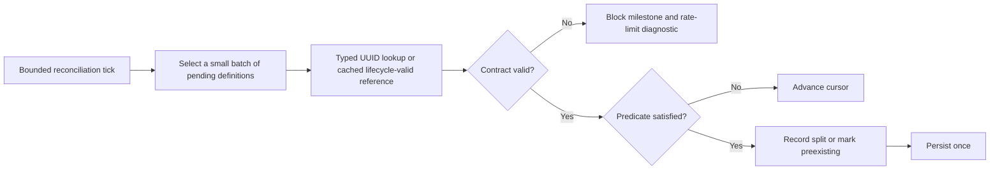
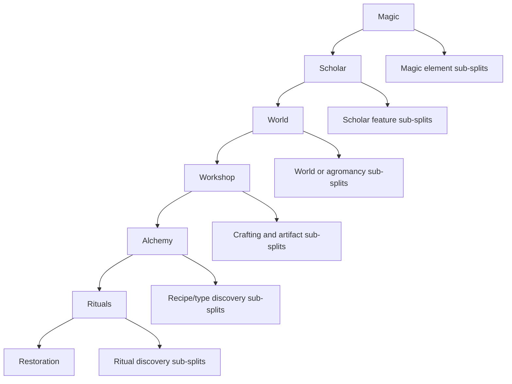
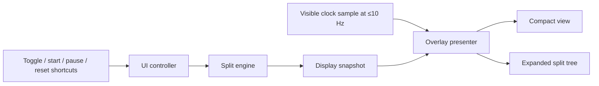

# Orb Chronicle plan

> **Lifecycle: Planned.** Architecture and milestone research only; no released plugin behavior is implied.

[Back to roadmap](roadmap.md) · [Plan index](README.md) · [Runtime validation](../development/runtime-validation.md)

## Goal

Provide a read-only run timer for Orb Of Creation that records elapsed time between major progression stages:

```text
Magic → Scholar → World → Workshop → Alchemy → Rituals → Restoration
```

Orb Chronicle should also support optional sub-splits for discoveries such as individual elements, screens, systems, or other explicitly audited progression milestones. It must observe the game without purchasing content, changing unlock state, editing an active save, or altering simulation speed.

## Product position

Chronicle is a separate plugin rather than a Chronomancer or Automata module:

- **Orb Chronicle** observes progression and records time.
- **Orb Chronomancer** controls simulation speed.
- **Orb Automata** performs scheduled player actions.
- **Orb Mod Config** may expose Chronicle's ordinary BepInEx settings, but is optional.

Keeping timing independent makes Chronicle usable for manual runs and prevents automation or speed-control failures from owning run history. Chronicle must remain read-only even when other suite plugins are installed.

## Non-goals

- Reconstruct split times for milestones reached before Chronicle was installed or armed.
- Modify the game's `timePlayed` value or any progression object.
- Write timing data into the active game save.
- Automatically submit runs to a leaderboard.
- Infer milestones from display names, visible text, or screen hierarchy.
- Treat an unavailable entity as proof that it was completed.
- Support arbitrary reflection expressions in user configuration.

## Default run and display

The proposed default is a gameplay-active real-time clock. It advances while an armed run is in the supported gameplay scene, pauses outside gameplay, and is independent of `Time.timeScale`.

```text
ORB CHRONICLE
Total         02:41:18.4

Magic         00:00:00.0
Scholar       00:12:43.2   +12:43.2
World         00:31:09.8   +18:26.6
Workshop      00:54:27.0   +23:17.2
Alchemy       01:23:51.5   +29:24.5
Rituals       02:02:16.1   +38:24.6
Restoration   --:--:--.-
```

Each completed row shows cumulative time from the run start and segment duration since the previous completed split. A later increment may add comparison deltas. The compact display shows only total time, current segment, and the next milestone; the expanded display shows the complete split tree.

## Clock semantics

Chronicle must name its clock honestly because Orb Chronomancer and the game's own timing can diverge.

| Clock | Definition | Chronomancer effect | Planned status |
|---|---|---|---|
| Gameplay-active real time | Monotonic wall duration accumulated only in supported gameplay state | None | Default MVP clock |
| Continuous real time | Monotonic wall duration including menus and loading while the process remains open | None | Optional after MVP |
| Native played time | Game-owned `SaveInfo.timePlayed` | Scaled in the audited build | Candidate; contract audit required |
| Simulation time | Chronicle accumulator based on scaled Unity delta | Scaled | Deferred |

Use `Stopwatch.GetTimestamp()` or an equivalent monotonic source for real-time modes. Do not use `DateTime.Now` for elapsed measurement because wall-clock adjustments can make durations jump or move backward.

For the default clock:

- display resolution: tenths of a second;
- internal resolution: monotonic clock ticks;
- UI refresh cadence: at most 10 Hz when visible;
- lifecycle reconciliation: proposed 4 Hz while running, plus a slow fallback;
- persistence: event-driven, never per frame.

The displayed resolution does not limit stored precision.

## Milestone identity and current evidence

Every built-in milestone definition uses a stable UUID, expected managed type, explicit predicate, and diagnostic label. Names are diagnostics only.

The current entity mapping provides these candidates:

| Milestone | Candidate identity | Expected type | Proposed meaning | Contract status |
|---|---|---|---|---|
| Magic | Run-start event | Chronicle-owned | Timer armed in a new eligible run | Design decision |
| Scholar | `e5e5598d-cfd1-4ee9-89cf-2df4f37ae2b7` | `UpgradeSO` | `UnlockScholarism` completes | Mapped; runtime behavior to verify |
| World | `6c22e48d-72e7-474e-b47a-b9724865a793` | `UpgradeSO` | `UnlockTheWorld` completes | Mapped; runtime behavior to verify |
| Workshop | `a2973494-98a6-439b-99be-84de67cf04f7` | `PrerequisiteLinkSO` | `TimerWorkshop` becomes satisfied | Mapped; predicate audit required |
| Alchemy | `f95e84dd-b2a6-4635-aa4c-240fa2ff5564` | `PrerequisiteLinkSO` | `TimerAlchemy` becomes satisfied | Mapped; predicate audit required |
| Rituals | `924308a0-5faa-4e2b-af30-8d22367ac6a1` | `PrerequisiteLinkSO` | `RitualsUnlocked` becomes satisfied | Mapped; predicate audit required |
| Restoration | `14b35ebc-f284-4d53-bd3f-f57a885cf2b1` | `UpgradeSO` | Finite `Restoration` upgrade reaches its completed level | Mapped; runtime behavior to verify |

The mapping also contains `Restoration` as `RitualSO` UUID `e92345c1-753a-40a0-b4bd-6fdfc75feb74`. The implementation must not guess between the ritual and upgrade by name. The contract probe must prove which native completion ends the intended run and whether the final upgrade is completed immediately or through the native action queue.

Screen `ViewSO` objects exist for Magic, Scholar, World, Workshop, Alchemy, and Rituals. They are useful reconciliation candidates only after an availability/unlock contract is audited. `ViewSO.IsActive()` means selected/active presentation state and must not be treated as an unlock predicate.

## Milestone definition model

The logical model should remain independent of reflected game objects:

```csharp
internal sealed record MilestoneDefinition(
    string Id,
    string Label,
    string? ParentId,
    Guid TargetUuid,
    string ExpectedNativeType,
    MilestonePredicate Predicate,
    int TargetValue,
    bool DefaultEnabled,
    int DisplayOrder);

internal enum MilestonePredicate
{
    UpgradeLevelAtLeast,
    UpgradeMaxLevel,
    PrerequisiteSatisfied,
    ViewAvailable,
    EntityDiscovered
}
```

Only predicates with installed-game contracts and runtime evidence may be enabled. An unknown type, missing method, unresolved UUID, or ambiguous predicate blocks that milestone and emits a rate-limited diagnostic. It must not fall back to a same-named object.

Milestone runtime state is separate from the definition:

```text
Pending      target is valid but the condition is false
Reached      an exact cumulative timestamp was recorded
Preexisting  condition was already true when the run was armed
Blocked      identity or native contract could not be validated
Disabled     definition is intentionally excluded from this run
```

`Preexisting` is not assigned a fabricated timestamp. A run armed on a progressed save must either start from the next pending milestone with an explicit incomplete-history marker or require the player to reset/start a fresh run.

## High-level architecture



Responsibilities:

| Component | Ownership |
|---|---|
| `ChroniclePlugin` | BepInEx lifecycle, Harmony setup, scene transitions, configuration |
| `RunLifecycleController` | Arm/start/pause/resume/finish/reset policy |
| `ChronicleClock` | Monotonic elapsed-time accumulation |
| `MilestoneCatalog` | Built-in stable definitions and optional sub-splits |
| `NativeMilestoneAdapter` | Typed UUID resolution and audited predicates |
| `MilestoneEventQueue` | Small, coalesced native-event frontier |
| `SplitEngine` | Ordering, one-time timestamp capture, segment calculation |
| `ChronicleStore` | Sidecar serialization, versioning, atomic replacement |
| `ChronicleOverlay` | Read-only compact/expanded presentation and controls |

Gameplay objects remain authoritative for progression state. Chronicle owns only timing state.

## Run lifecycle



The controller must distinguish title → gameplay for the same save, same-save resume, loading another slot, native progression reset or NG+, manual Chronicle reset, and plugin reload during an unfinished run.

Until a stable save-slot/run identity contract is audited, automatic cross-session resume remains blocked. A manual named run can still persist safely, but Chronicle must warn when it cannot prove that the loaded save matches the stored run.

## Detection flow

Use exact native completion events where audited, with reconciliation as correctness insurance.



Reconciliation handles events that occurred before hooks were attached, during load, or through a progression path without an audited hook:



The engine coalesces duplicate event and polling observations. A milestone can transition to `Reached` only once per run.

## Split ordering and out-of-order events

Major milestones form an ordered chain. Sub-splits form ordered children under a major stage.



Rules:

- Major-stage timestamps are monotonic and immutable after recording.
- A later stage observed before an earlier stage triggers reconciliation of the missing prefix.
- If the earlier condition is already satisfied but its historical time is unknown, mark it `Preexisting`; do not assign the later timestamp to it.
- Simultaneous conditions receive the same captured observation timestamp unless an exact event ordering is available.
- Disabled sub-splits do not affect the major-stage chain or finish condition.
- Configuration changes apply to the next run by default; they do not rewrite an active run's schema silently.

## Sub-split catalog

Sub-splits should ship as curated groups rather than accepting arbitrary native member names. Candidate groups include:

- Magic glyph or element discoveries.
- Scholar research screens or concept systems.
- World aspects, dimensional systems, agromancy, and harvest elements.
- Workshop crafting, artifacts, and material systems.
- Alchemy recipe books, recipe families, or alchemy types.
- Individual ritual discoveries or ritual categories.

Each group requires stable UUID and expected native type, an audited predicate, deterministic display order, fresh-run and mid-run tests, and documented reset/NG+ behavior. Large groups must use a cached catalog and bounded reconciliation cursor. Chronicle must not sort or scan every discovered entity per frame.

## Persistence architecture

Chronicle stores timing records outside the game's save files. A versioned JSON sidecar is the proposed format because split trees and future comparisons are more structured than ordinary scalar configuration.

```text
BepInEx/config/OrbChronicle/
  settings.cfg
  active-run.json
  history.json
```

The exact path should follow BepInEx conventions established during implementation. The plugin must never open or rewrite `ooc_save_*.sav`.

Proposed active-run envelope:

```json
{
  "schemaVersion": 1,
  "runId": "generated-id",
  "runLabel": "Fresh run 1",
  "clockMode": "GameplayActiveRealTime",
  "accumulatedTicks": 0,
  "clockFrequency": 10000000,
  "state": "Running",
  "milestoneSetId": "major-v1",
  "saveIdentity": null,
  "splits": []
}
```

Persistence rules:

- Serialize a durable duration representation rather than process-local raw timestamps.
- Write after start, pause, split, finish, reset/archive, and orderly shutdown.
- Use write-to-temporary plus atomic replacement where the runtime permits it.
- Keep the last valid file if serialization or replacement fails.
- Validate schema, ordering, non-negative durations, and known milestone IDs on load.
- Never let a persistence failure affect native progression or player control.
- Do not include save contents, personal paths, or unrelated game state in logs/history.

## UI architecture

Increment 2 may begin with a small IMGUI overlay using the proven Chronomancer approach. The release-quality direction is a retained Unity UI overlay constructed once per gameplay lifecycle and updated only when its display snapshot changes or the visible tenth-second rolls over.



UI requirements:

- Configurable visibility and corner placement.
- Compact and expanded modes.
- Unscaled input and refresh so Chronomancer does not make controls unusable.
- Clear `PAUSED`, `FINISHED`, `BLOCKED`, and incomplete-history indicators.
- Confirmation before reset or destructive history replacement.
- No scene-wide object discovery in `Update()` or `OnGUI()`.
- Overlay teardown on unsupported scenes and plugin unload.
- Native UI remains fully interactive; Chronicle does not consume unrelated input.

Orb Mod Config may expose visibility, clock mode, precision, position, shortcut, and enabled sub-split groups. Run controls and history remain in Chronicle's own overlay because they are actions, not static configuration values.

## Performance model

Chronicle should be one of the cheapest plugins in the suite.

- Harmony hooks enqueue only a compact event descriptor.
- Event processing is bounded per frame.
- Stable definitions are cached separately from lifecycle-bound Unity references.
- Unity object references are invalidated after save load, reset, manager restart, or relevant scene transition.
- Reconciliation checks only pending milestones, not reached or disabled entries.
- Major milestones can be checked together because the set is tiny.
- Large sub-split groups use an operation budget and resumable cursor.
- File I/O occurs only at lifecycle and split boundaries.
- UI text is rebuilt at no more than the configured visible refresh rate.
- Routine observations do not log.

Proposed initial budgets:

| Work | Initial limit |
|---|---:|
| Visible timer refresh | 10 updates/second |
| Major milestone reconciliation | 4 passes/second |
| Sub-split reconciliation | 8 definitions/tick |
| Event processing | 16 coalesced events/frame |
| Slow integrity reconciliation | 1 pass/10 seconds |

These are starting bounds, not promises. Runtime measurement on the supported game build determines final defaults.

## Failure policy

Chronicle fails closed per milestone:

| Failure | Behavior |
|---|---|
| UUID missing | Block that milestone; retain run data |
| Runtime type mismatch | Block that milestone; never use a same-named object |
| Predicate method missing/changed | Block affected predicate family |
| Save identity uncertain | Pause cross-session resume and request explicit player action |
| Sidecar corrupt | Preserve file, start no automatic run, offer diagnostic recovery |
| Overlay construction fails | Continue timing if safe; log once and keep keyboard controls |
| Hook fails | Use audited bounded reconciliation when sufficient; otherwise block exact timing |
| Clock anomaly | Pause run and preserve last valid accumulated duration |

Failure must never purchase, complete, reveal, reset, or otherwise mutate native content.

## Delivery increments

### Increment 0 — milestone contract probe

Research and tests only:

- Verify the exact native condition for Scholar, World, Workshop, Alchemy, and Ritual screen unlocks.
- Distinguish the Restoration ritual from the final Restoration upgrade.
- Confirm the action-queue timing boundary: purchase, queue completion, effect completion, or unlocked view.
- Audit `PrerequisiteLinkSO` read APIs and relevant discovery APIs.
- Audit stable save-slot or run identity surfaces.
- Record UUID, native type, predicate, reset behavior, and runtime evidence for every major split.

Exit: all seven major milestones have an explicit observable contract, or unresolved milestones are documented and blocked.

### Increment 1 — portable clock and split engine

No game integration or overlay required:

- Implement injectable monotonic clock abstraction.
- Implement lifecycle, milestone state, ordering, and segment calculations.
- Implement duplicate-event coalescing and out-of-order handling.
- Implement versioned active-run serialization with corruption validation.
- Add portable tests using game stubs or pure domain objects.

Exit: deterministic tests cover start, pause, resume, simultaneous splits, finish, reset, reload, corruption, and preexisting milestones.

### Increment 2 — major-stage MVP

- Add the separate `OrbChronicle` BepInEx plugin project.
- Resolve all major targets by UUID plus expected native type.
- Add exact hooks and bounded reconciliation supported by Increment 0 evidence.
- Add compact/expanded overlay and keyboard controls.
- Record Magic through Restoration for a fresh run.
- Keep history to one active run plus one completed result initially.

Exit: a complete fresh run records exactly one monotonic timestamp for each major stage and stops on the audited Restoration completion boundary.

### Increment 3 — lifecycle and persistence hardening

- Add same-run resume across title/gameplay transitions and process restarts where save identity is proven.
- Handle another save, rollback, progression reset, and NG+ without carrying stale native references.
- Add atomic history archive and recovery diagnostics.
- Add optional continuous-real-time mode.
- Verify compatibility with Chronomancer at every supported speed.

Exit: run state survives supported lifecycle transitions without fabricated or cross-save splits.

### Increment 4 — curated sub-splits

- Add opt-in element and feature groups using audited predicates.
- Add parent/child split presentation and group-level configuration.
- Bound reconciliation for large catalogs.
- Freeze the enabled milestone schema when a run begins.

Exit: each enabled sub-split records once, remains correctly nested, and cannot delay or alter a major milestone.

### Increment 5 — comparisons and export

- Store named completed runs.
- Add personal-best and selected-comparison deltas.
- Add sum-of-best only if segment comparability rules are explicit.
- Export a documented, non-sensitive JSON or CSV result.
- Consider LiveSplit integration only as a separately scoped, opt-in adapter.

Exit: comparisons are derived from immutable completed runs and exports round-trip without affecting active timing.

## Verification strategy

### Portable tests

- Monotonic accumulation across pause/resume.
- No elapsed time outside the selected clock domain.
- Exactly-once split recording under duplicate hook/poll observations.
- Out-of-order and simultaneous milestone handling.
- Preexisting milestone behavior without invented timestamps.
- Restoration finish freezes the final duration.
- Reset and NG+ policies.
- Persistence schema migration, truncation, corruption, and atomic-recovery behavior.
- Display formatting beyond 24 hours and at sub-second boundaries.

### Installed-game contract tests

- Major target UUIDs resolve to the expected native types.
- Predicate methods and fields match exact audited signatures.
- Exact Harmony targets retain expected signatures.
- Save identity and scene lifecycle members match the supported assembly hashes.

### Interactive runtime validation

- Fresh save from Magic to each major unlock.
- Native action queue delay between purchase and actual completion.
- Save/load immediately before and after every major split.
- Title → gameplay → title transitions.
- Different save slot and rolled-back save.
- Progression reset and NG+.
- Chronomancer at 1×, 2×, 4×, and any runtime-approved higher speed.
- Automata completing a milestone versus manual completion.
- Overlay hidden, compact, expanded, and failed-construction fallback.
- Complete Restoration and confirm the clock cannot advance or finish twice.

Runtime evidence must record the game assembly hashes and Chronicle version. Runtime behavior is not complete until the appropriate interactive validation gate passes.

## Planned source layout

```text
src/OrbChronicle/
  OrbChronicle.csproj
  Plugin.cs
  ChronicleConfig.cs
  ChronicleClock.cs
  RunLifecycleController.cs
  MilestoneCatalog.cs
  NativeMilestoneAdapter.cs
  MilestoneEventQueue.cs
  SplitEngine.cs
  ChronicleStore.cs
  ChronicleOverlay.cs
  README.md

tests/OrbModding.Tests/
  ChronicleClockTests.cs
  ChronicleSplitEngineTests.cs
  ChroniclePersistenceTests.cs

tests/OrbModding.GameContractTests/
  Chronicle contract coverage in InstalledGameContractTests.cs
```

Shared extraction is deferred. Chronicle should initially own its clock, run model, sidecar format, and UI. Move code into `OrbModding.Common` only after another plugin proves the same stable abstraction is needed.

## Open decisions before implementation

1. Does the default gameplay-active clock pause while an in-game modal or pause menu is open, or only outside `Main`?
2. Is the intended final event the `Restoration` upgrade completion, the `Restoration` ritual completion, or a later world-cycle flag?
3. Should a mid-save run be allowed with incomplete-history markers, or should the default require a fresh progression state?
4. Which exact discoveries count as “elements” for the first sub-split pack?
5. Does NG+ finish the current run, start a new category, or invalidate an active base-game run?
6. Is save-slot identity stable enough for automatic resume, or should v0.1 use explicit named runs only?

## Definition of done for v0.1

- The seven major stages use audited UUID, type, and predicate contracts.
- Gameplay-active real time is monotonic and unaffected by Chronomancer.
- Each split records exactly once at the native completion boundary.
- Restoration freezes and persists the final time.
- Mid-save milestones are never assigned fabricated historical times.
- Save/load, title transitions, reset, and another save cannot silently mix run histories.
- The overlay remains readable and does not interfere with native input.
- Chronicle performs no progression mutation and never edits an active save.
- Portable tests, installed-game contracts, real-reference build, and interactive runtime validation pass for the supported assembly hashes.
