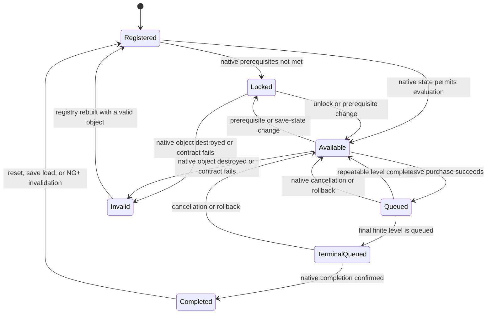

# Mod suite performance architecture

> **Lifecycle: Planned / hotfix groundwork implemented.** The Steam Deck hotfix adds immediate throttling and cache fixes. This document defines the larger architecture and must be implemented in measured, separately testable phases.

[Back to plan index](README.md) · [Runtime validation](../development/runtime-validation.md)

## Purpose

Keep Orb Automata, Orb Mentor, and Orb Mod Config responsive during long sessions on constrained hardware, including Steam Deck, without making unsafe assumptions about progression state or reproducing the game's economy incorrectly.

The suite should own its indexes, scheduling, caches, and pending-work structures. The game remains authoritative for unlocks, costs, resource spending, queue state, completion, and final action validation.

## Required progression behavior

The performance design must account for these game rules:

- The static game registries can contain resources, structures, attributes, and upgrades that are still locked in the current save.
- Additional content can become unlocked or registered later in the same session.
- Availability can change because of prerequisites, queued levels, completed actions, resets, save loads, or NG+ transitions.
- Structures and attributes are generally repeatable level purchases.
- Many upgrades are finite or effectively one-shot. After purchase they enter the native queue and later transition to a completed state.
- An unavailable candidate is not automatically completed. It may instead be locked, temporarily blocked, already queued, at a level requirement boundary, or invalid for the current scene.
- A completed candidate may become relevant again after loading another save, rolling back a save, resetting progression, or entering a new game cycle.

No candidate may be permanently discarded solely because it was locked or unavailable when the initial index was built.

## Goals

- No full Unity object search in a per-frame path.
- No complete candidate discovery, reflection lookup, catalog rebuild, or recommendation sort after every purchase.
- Bound the combined suite workload, not only each plugin independently.
- Keep disabled modules effectively idle.
- Avoid steady hot-path allocations and log I/O.
- Preserve deterministic priority, reserves, and explainability.
- Submit actions only through audited native game APIs.
- Recover correctly after title transitions, save loads, resets, and NG+.
- Fail closed when native state is unknown or contradictory.

## Non-goals

- Do not maintain a permanent independent copy of every resource quantity.
- Do not duplicate the complete Structure cost formula and its rank, attribute, quality, requirement, and rounding modifiers.
- Do not bypass native `CanPurchase`, queue, cost, or completion behavior.
- Do not optimize by reducing or silently dropping Mentor XP.
- Do not make Steam Deck behavior a separate code path when adaptive scheduling can solve the same problem for every platform.
- Do not make cost-reducer investment strategy a requirement of the initial performance architecture. Effect classification and special purchase priority remain deferred until profiling proves they are needed and gameplay policy is approved separately.

## Current groundwork

The Steam Deck hotfix already establishes the first safety layer:

- Static AutoBuy candidate discovery is cached.
- AutoBuy scan and purchase slices are capped at 1 ms.
- Native queue polling while blocked is limited to 10 Hz.
- UI attachment retries use a five-second cadence instead of scene-wide searches every frame.
- Mod Config retries after slow UI initialization rather than failing permanently.
- Mentor caches reflected catalogs briefly and uses conservative operation and CPU defaults.
- Disabled Mentor stops clearing state on every frame.
- AutoBuy, AutoCast, Mentor, and Mod Config now use one process-wide coordinator and the same Unity frame identity. Cooperative work is round-robin budgeted, while AutoBuy and Mentor share a one-native-mutation-per-frame gate. Mentor domains with due, active, denied, or follow-up cooperative work cannot request a stale mutation lease. A final-validation miss parks that UUID in a bounded ledger until a later completed authoritative refresh, avoiding hot retry loops and head-of-line blocking.
- Mod Config marks cooperative UI work pending only for delayed install/retry, integrity cadence, navigation events, or detected shell repair. Loaded-plugin catalog enumeration and catalog logging occur once inside the first admitted installation lease.

These changes provide the first shared scheduling layer, but do not yet provide lifecycle-aware candidate indexing, dirty updates, resource snapshots, or bounded purchase prediction.

## Candidate lifecycle model

Registry membership and player progression are separate dimensions. The index retains stable identity while the live state moves through the following lifecycle:



### State meanings

| State | Meaning | Scheduling behavior |
|---|---|---|
| `Registered` | Stable UUID and expected native type are known, but live progression has not been classified. | Evaluate soon. |
| `Locked` | Native evidence says the candidate cannot currently become a purchase. | Retain and recheck slowly or after invalidation. |
| `Available` | Native availability and level rules allow affordability evaluation. | Keep in the active evaluation set. |
| `Queued` | At least one non-terminal level is in the native action queue. | Observe queue/completion; avoid redundant discovery. |
| `TerminalQueued` | The final known level of a finite upgrade has been accepted into the native queue. | Do not submit again; wait for completion evidence. |
| `Completed` | Native level/completion evidence confirms the finite candidate is finished. | Remove from the hot set but retain an indexed tombstone. |
| `Invalid` | Object identity, type, or required native contract is no longer valid. | Fail closed until a controlled rebuild resolves it. |

### Classification rules

- `IsAvailable() == false` is insufficient evidence for `Completed`.
- Completion requires a type-specific native signal, such as current finite level reaching maximum with no queued levels remaining.
- A final level that has only been queued is `TerminalQueued`, not `Completed`.
- Repeatable structures return to `Available` after completion unless another rule locks them.
- Completed entries remain visible to diagnostics but are excluded from affordability scans and priority ordering.
- Any save implementation, gameplay-manager reset, title transition, or NG+ boundary invalidates all live state, including completed tombstones. Stable definitions may remain cached only if their native object identity is still valid.

## Proposed runtime architecture

```text
SuitePerformanceCoordinator
  ├─ frame budget and fair work scheduling
  ├─ lifecycle invalidation epochs
  └─ rolling performance counters

AutomataCandidateIndex
  ├─ stable candidate definitions by UUID
  ├─ live lifecycle state
  ├─ cached native accessors
  ├─ resource dependency map
  └─ dirty candidate queues

ResourceSnapshotCache
  ├─ one live quantity read per resource per evaluation epoch
  └─ provisional deductions for a planned native batch

MentorWorkQueue
  ├─ coalesced XP events
  ├─ cached recipient definitions and UUID lookup
  └─ bounded native grant jobs

UiAttachmentCoordinator
  ├─ scene-aware delayed installation
  ├─ retry backoff
  └─ infrequent integrity checks
```

## Shared suite scheduler

Independent plugin budgets can stack in the same Unity frame. A cooperative coordinator should provide one total budget for work performed by supported suite plugins.

### Scheduling contract

- Each module registers small resumable work items.
- Safety toggles and state transitions remain constant-time and can be checked every frame.
- Catalog discovery, lifecycle evaluation, cost reads, sorting, Mentor grants, and UI recovery require a budget lease.
- Work stops after the current native call when the frame budget is exhausted. Native methods cannot be preempted midway.
- Round-robin selection prevents Mentor or AutoBuy from starving the other.
- Native mutations are limited separately from read work; initially, submit no more than one potentially expensive mutation per frame.
- Disabled modules unregister pending work and perform no background scans.

### Initial budget policy

These are measurement targets, not permanent promises:

- Shared soft budget: 0.75 ms per frame.
- Shared hard stop after observed work reaches 1 ms.
- Queue-wait polling: 10 Hz.
- Idle availability refresh: 2 Hz for active candidates.
- Locked-candidate refresh: every 2–5 seconds, spread across frames.
- Full registry reconciliation: after explicit invalidation and as a slow 10–30 second fallback.
- UI retry: every 5 seconds while unattached, with optional longer backoff after repeated failures.

The scheduler should adapt downward when recent frame time exceeds the player's frame target. It should recover gradually rather than oscillating every frame. Platform detection may choose an initial conservative profile, but measured frame pressure should control runtime behavior.

## AutoBuy candidate index

Build the index from audited native registries after gameplay initialization. Store:

- Stable UUID and expected native type.
- Native object reference valid for the current lifecycle epoch.
- Candidate kind and repeatability/finite-level capabilities.
- Cached method and field accessors.
- Last observed current level, queued level, maximum level, availability, and completion evidence.
- Resource UUIDs required by the current native cost.
- Last native cost vector and the epoch in which it was read.
- Current lifecycle state and dirty reasons.
- Last evaluation result and deterministic priority key.

Do not use display names as identity. A recreated native object with the same UUID replaces the previous object only after validating its expected runtime type.

### Dynamic registry reconciliation

- Run an initial registry build only after the gameplay manager is ready.
- Reconcile again when a save is implemented, the manager restarts, the active gameplay scene changes, or NG+ resets progression.
- Keep a slow fallback reconciliation because not every unlock path is known or hookable.
- Add newly registered UUIDs without rebuilding unaffected entries.
- Mark missing or destroyed objects `Invalid`; do not call stale Unity objects.
- Reclassify locked entries when their prerequisites may have changed.

## Dirty-state evaluation

Each candidate carries dirty flags rather than relying on repeated full scans:

- `IdentityDirty`
- `AvailabilityDirty`
- `LevelDirty`
- `CostDirty`
- `ResourceDirty`
- `PriorityDirty`
- `CompletionDirty`

Events mark only the minimum necessary flags. Examples:

| Event | Required invalidation |
|---|---|
| Native purchase accepted | Purchased candidate level, queue, cost, priority, and completion state; affected resources. |
| Native action completes | Candidate level, queue, availability, cost, and completion state. |
| Resource snapshot changes | Candidates depending on that resource become affordability-dirty, not identity-dirty. |
| Unlock/prerequisite change | Affected locked candidates become availability-dirty. If no precise hook exists, the slow locked refresh covers it. |
| Save load, reset, or NG+ | New lifecycle epoch; all live state and native references require validation. |
| Configuration change | Only policy-dependent decisions and priorities become dirty. |
| Emergency disable | Clear pending plans and native-mutation work immediately. |

Unknown events use controlled fallback invalidation. Correctness takes precedence over preserving a cache.

## Progression frontier and impact settling

Newly registered, newly unlocked, newly queued, and newly completed content should form a small progression frontier processed before routine reevaluation of the older cached set. This is a work-scheduling priority, not automatically a purchase priority.

Maintain separate frontier queues:

- `NewDefinitions`: native UUIDs registered after the initial index build.
- `NewlyAvailable`: previously locked candidates whose native prerequisites now pass.
- `QueueChanged`: candidates whose queued level or quantity changed.
- `EffectsCompleted`: native actions that completed and may have changed unlocks, production, resources, or costs elsewhere.

Process completion-driven invalidation first, then new definitions/unlocks, ordinary dirty active candidates, and finally the slow locked-candidate reconciliation. Coalesce multiple events in the same frame or action-completion window before reevaluating dependent candidates.

Installed-game inspection establishes different effect timing for the current native families:

- `UpgradeSO.Purchase()` spends resources and queues levels. `CompleteAction()` increments the level, executes `onPurchaseEffects`, enables prerequisite links, and applies permanent effects. Cross-candidate cost and unlock invalidation therefore belongs after completion, not merely after queue submission.
- `StructureSO.QueueBuild()` immediately changes `queuedQuantity` and reapplies that Structure's rank cost modifiers, so its own next-cost state becomes dirty on queue submission. Broader Structure effects are applied through completion and quantity increment paths, so dependent candidates become dirty after completion.

This timing allows a settling policy:

1. Queue an admitted impactful candidate through the native API.
2. Mark its own queue and next-cost state dirty immediately.
3. Keep unaffected dependency groups usable while it is building.
4. When native completion is observed, coalesce its effect invalidations with any other completions from that window.
5. Refresh only affected older candidates, or perform a bounded broad invalidation when effect dependencies cannot be classified safely.

### Evaluation priority versus purchase priority

- Newly unlocked candidates should always receive prompt evaluation because the frontier is small and their state may invalidate old assumptions.
- They must not automatically be purchased ahead of every older candidate. A newly unlocked item can be expensive, irrelevant to cost scaling, or compete for reserved resources.
- A future optional purchase policy may boost candidates whose audited effect metadata proves they alter costs, unlock dependencies, or materially expand production.
- Unknown-impact candidates retain normal deterministic economic priority. Do not guess their impact from display names or unlock order.
- Reserves, user allowlists/blocklists, queue room, and final native validation always override any frontier or impact boost.

The expected performance win comes from evaluating a small frontier and postponing/coalescing dependent recalculation. Buying newly unlocked content indiscriminately is a gameplay strategy and is not required for the optimization.

### Future note: cost-reduction impact flags

> **Deferred.** Do not implement this classification in phases P0–P3. Revisit it only if the lifecycle-aware index, dirty updates, resource snapshots, and shared scheduler still leave a material AutoBuy bottleneck, and only after the desired gameplay priority is approved separately.

Flagging verified cost reducers is preferable to treating all newly unlocked content as high priority. Keep effect target, direction, and scope separate:

```text
CostImpactDirection: None | Unknown | Reduction | Increase
CostImpactScope: Candidate | Resource | Category | Global
CostImpactTarget: stable UUID/type/property tuple
```

The current native effect model exposes useful deterministic targets:

- A `StructureSO` upgrade effect targeting `Cost` affects that Structure's cost modifier.
- A `StructureSO` upgrade effect targeting `CostScaling` affects that Structure's level-cost scaling.
- A `ResourceSO` effect targeting `AttributeCost`/`AttributeCostMod` can affect every Structure cost paid with that resource.
- A `ResourceSO` effect targeting `Quality` affects the true spend and affordability of every candidate paid with that resource. Structure costs can receive an additional quality-derived attribute-cost adjustment.
- Exact audited global cost attributes may use category-wide or global scope.
- Dynamic target references, instant effects, and unrecognized property paths remain `Unknown` until their concrete target and direction are proven.

Property names identify that an effect is cost-affecting, but not whether it reduces cost. Direction must be derived through audited native `ValueModifier` behavior or an equivalent non-mutating native preview. Never infer reduction from a sign, tooltip string, display name, or modifier type name alone.

A candidate can carry multiple impact records. If one effect reduces one target but increases another, preserve both records instead of collapsing them into a single boolean.

Purchase policy:

1. Evaluate `Reduction` candidates promptly when they become available.
2. Apply an optional, explicit cost-reducer priority tier only after normal availability, affordability, reserves, and queue safety pass.
3. Queue an impactful finite Upgrade conservatively, normally one completion boundary at a time.
4. On completion, invalidate only the recorded scope when safe; use bounded broad invalidation for unknown/global effects.
5. Recalculate dependent candidates once, then resume ordinary priority ordering.

Expose the detected flag, scope, and evidence in diagnostics so a mistaken classification can be found without reverse-engineering the priority result from purchases.

### Future note: repeatable cost-reducer Structures

> **Deferred.** This is a possible economic policy, not a prerequisite for the performance work. Existing `BulkDevelopment`, `Fixed`, and `Single` behavior remains authoritative unless a later feature explicitly changes it.

Repeatable cost-reducer Structures should follow the player's existing Structure repeat policy. The settlement boundary is one admitted native group, not necessarily one level.

Initial group sizing:

- `BulkDevelopment`: queue up to the live `Player.GetBulkDevelopment()` value.
- `Fixed`: queue up to the configured fixed Structure level count.
- `Single`: queue one level.
- When native action-multiplier behavior is explicitly enabled, follow that configured policy instead of silently applying a separate cost-reducer override.

Every group is additionally capped by free native queue room, reserved manual slots, configured batch limits, affordability, reserves, and the shared mutation budget. Each level is still submitted and validated individually so `queuedQuantity`, rank boundaries, and the next native cost update between submissions.

The current native `StructureSO.CompleteQueuedQuantity()` completes up to `min(Player.GetBulkDevelopment(), queuedQuantity)` levels together and then increments quantity for that completed group. This makes a Bulk Development group a natural effect-settlement boundary:

1. Build the group using live per-level native costs.
2. Wait for the native group completion and broader effects to become active.
3. Coalesce the group's invalidations into one dependency refresh.
4. Refresh the reducer's next cost and only the affected scope.
5. Rerank and immediately queue another group if it remains the best admitted choice.

This preserves Bulk Development throughput and avoids a full scan between every level. The tradeoff is intentional: if early levels reduce the same Structure's future costs through quality or another indirect path, later levels in the same group are prepaid before that completed-group reduction becomes active. `Single` remains available for players who prefer maximum economic precision.

Do not extend a cost-reducer group beyond the selected repeat policy merely because more resources are affordable. Other queue slots may be used for candidates outside the reducer's affected scope; dependent candidates whose prices will change should wait for group settlement.

A later economic policy may compare marginal reducer cost with projected savings, but performance optimization alone must force neither unlimited investment nor a one-level override.

## Resource snapshots and affordability

Read each referenced native resource once per evaluation epoch and store:

```text
resource UUID → current quantity, capacity, native reference, snapshot epoch
```

Candidate admission uses the same snapshot, which avoids repeated reflection and makes ranking internally consistent. A planned batch also maintains a provisional ledger that subtracts predicted costs from the snapshot before admitting its next level.

Resource definitions also have a lifecycle. A resource may be present as an asset but locked or hidden for the current save, or it may appear only after later initialization. Therefore:

- Keep stable resource definitions separate from live quantity snapshots.
- Reconcile newly registered resources without rebuilding unrelated candidate definitions.
- Mark dependent candidates dirty when a resource unlocks, disappears, or is recreated.
- Reject affordability when a required resource reference or live quantity cannot be resolved; zero must not be used as a substitute for unknown state.
- Do not infer that a candidate is permanently impossible merely because one required resource is currently locked.

The current native quality contract is cost-relevant:

```text
ResourceSO.GetTrueQuantity() = stored quantity × quality
ResourceSO.GetTrueSpend(nominal cost) = nominal cost ÷ quality
ResourceSO.GetAttributeCostMod() = attributeCostMod ÷ quality^Player.AttributeQualityBonus
```

`ResourceCostList.HasEnough()` and `PerformCost()` ultimately use true-spend semantics for every purchase. Structure next-cost calculation also calls `AdjustAsAttribute()`, which incorporates `GetAttributeCostMod()` before the eventual true spend. Upgrade nominal costs do not necessarily change when quality changes, but their affordability and actual stored-resource deduction still do.

For each resource snapshot, retain or fingerprint:

- native/stable resource identity;
- nominal stored quantity and native true quantity;
- quality/effective quality value;
- effective attribute-cost modifier;
- any global Attribute Quality bonus epoch;
- capacity and visibility/availability state;
- snapshot epoch.

Calculations must use one consistent unit system. Comparing a nominal cost with native true quantity is equivalent to comparing native true spend with stored quantity while quality remains unchanged. A provisional ledger using true quantity therefore subtracts nominal cost. If quality changes during a planned batch, discard the affected provisional values and replan.

Quality invalidation scope:

- A resource quality change marks every candidate paid with that resource affordability-dirty.
- Structure candidates using that resource also become cost-dirty because their nominal next cost may change through `AdjustAsAttribute()`.
- Upgrade candidates normally retain their nominal cost vector but still become affordability-dirty because true spend changed.
- A change to the global Attribute Quality bonus marks all Structure candidates with resource costs cost-dirty.
- A verified quality increase can be classified as a resource-scoped indirect cost reduction only after native modifier direction is proven.

The snapshot is deliberately short-lived:

- Resource generation, drains, spells, manual actions, and other supported systems may change quantities at any time.
- The provisional ledger is planning data, not a replacement for native state.
- Immediately before each mutation, recheck queue room and the candidate's native purchase contract.
- Abort or replan when native validation disagrees with the snapshot.

All reserve and affordability calculations continue using `BigAmount`/native `BigDouble` semantics. Conversion to ordinary `double` is allowed only for bounded ratios and diagnostics where overflow behavior is already handled.

## Future-cost prediction

Prediction is bounded by free queue room, configured batch size, and the shared mutation budget. It must never calculate an unlimited number of levels.

### Upgrades

- Use the native future-level cost path when the audited game contract exposes it.
- Stop prediction at maximum level, a failed per-level requirement, reserve boundary, or available queue limit.
- Classify the final accepted finite level as `TerminalQueued`.
- Do not treat it as `Completed` until the native queued level is consumed and the completed level is confirmed.
- Remove completed upgrades from the active priority set so they do not become permanent scan noise.

### Structures and attributes

- Treat the native current next-cost result as authoritative.
- Because queued quantity can update rank and cost-scaling modifiers, refresh after each accepted purchase unless an exact audited native cumulative-cost API becomes available.
- Do not independently reproduce rank boundaries, attribute cost modifiers, quality effects, soft-requirement penalties, or game rounding.
- Repeat only up to queue room and the configured structure policy.

### Concurrency rule

Prediction is optimistic planning. Native `CanPurchase`, queue room, and purchase success remain the final authority. Manual actions or other game systems may invalidate a plan between frames; the correct response is to stop and replan, not force the planned purchase.

## Recommendation maintenance

Avoid rebuilding and sorting a complete recommendation array after every batch.

- Keep deterministic keys: user priority, category priority, cost ratio, stable UUID.
- Maintain a heap or ordered set containing only currently eligible candidates.
- Remove `Locked`, `Queued` when duplicate submission is unsafe, `TerminalQueued`, `Completed`, and `Invalid` entries from the hot set.
- Reinsert only candidates whose priority-affecting state changed.
- If many resource changes make incremental maintenance more expensive than a bounded rebuild, schedule that rebuild across frames.

The implementation should measure both strategies. A complex heap is not beneficial if the active set is small; the lifecycle-aware hot set and cached accessors are required regardless.

## Mentor optimization

Mentor is event-driven and should not rebuild recipient catalogs for every XP grant.

- Build recipient definitions after gameplay initialization and reconcile them with the same lifecycle epochs.
- Keep locked or undiscovered recipients indexed but outside the eligible set.
- Mark them eligible when discovery changes.
- Coalesce multiple source events received in the same frame or scheduling window.
- Consolidate pending XP by recipient UUID.
- Resolve native recipient objects through a cached UUID lookup valid for the current epoch.
- Recalculate the mentor/recipient relationship only when mastery level, discovery state, domain configuration, or lifecycle epoch changes.
- Process native grants through the shared scheduler.
- Budget limits may delay grants but must not reduce or discard calculated XP.
- Let an active bounded relationship pass finish when newer invalidations arrive, then run the latest requested follow-up immediately; do not restart the current pass on every generation.
- Cap immutable relationship evidence per domain. Coalesce only an unpinned latest UUID delta, and move captures holding unsafe heads to bounded fail-closed storage before controlled rebasing.
- Count XP only when that bounded storage itself overflows; never redirect a capture to a newer relationship merely to reclaim evidence history.
- Clear pending generated work on disable, emergency stop, save load, reset, or invalid native identity.

Artifact and alchemy domains must use separate adapters because their discovery, active-instance, and completion rules differ from spells.

## UI optimization

- Install only in the `Main` scene after a short readiness delay.
- Prefer known native navigation containers and cached direct references.
- Never depend on AutoQueue existing merely to make Mod Config available.
- Avoid `Resources.FindObjectsOfTypeAll` except as an infrequent, budgeted compatibility fallback.
- Once attached, verify the Mods tab ordering only after a navigation/layout change or on a slow integrity timer, not every frame.
- Ensure the Mods tab remains the last navigation element whenever native tabs are added later by progression.
- Dispose UI references on scene exit and rebuild them in the next lifecycle epoch.

## Reflection and allocation policy

- Resolve types, overloads, fields, properties, and methods once per validated native type.
- Cache accessors or delegates where Mono compatibility and exception behavior are proven.
- Cache the cost container schema and resource references; read only live values during an evaluation epoch.
- Replace hot-path LINQ, `ToArray`, `GroupBy`, and repeated string formatting with reusable buffers and dictionaries.
- Pre-size collections from known registry sizes.
- Do not pool or retain destroyed Unity objects across lifecycle epochs.
- Keep detailed per-purchase and per-recipient logging disabled by default.
- Aggregate diagnostics and format strings only when the reporting interval expires.

## Diagnostics and measurement

Optimization must be evidence-driven. Add rolling counters for:

- Suite work time per frame and per subsystem.
- Average, maximum, and high-percentile work time over a bounded window.
- Work items processed, deferred, and dropped because of invalidation.
- Registry reconciliations and candidates by lifecycle state.
- Candidate evaluations, native cost reads, full rebuilds, and dirty updates.
- Mentor events received, coalesced, pending, and granted.
- UI attachment attempts and fallback searches.
- Queue polls and native mutations.
- Managed-memory samples and GC collection deltas where the runtime exposes them safely.

Normal logs should contain startup state, lifecycle resets, warnings, and an optional low-frequency summary. They must not write one line for every normal purchase or XP grant unless detailed diagnostics are explicitly enabled.

### Initial performance acceptance targets

- Disabled suite modules perform no scans, catalog rebuilds, or queue polling.
- No scene-wide object discovery occurs every frame.
- Shared non-mutation work normally remains below 0.75 ms per frame and stops scheduling more work after 1 ms is observed.
- No more than one expensive native mutation is initiated in a frame by the suite.
- A continuous 30-minute AutoBuy plus Mentor test shows no unbounded pending-work, catalog, or managed-memory growth.
- A locked-to-unlocked transition becomes eligible without a restart.
- A terminal upgrade leaves the hot set after native completion.
- Save load and NG+ rebuild correct state without using stale object references or completed tombstones from the previous lifecycle.

Targets must be validated on desktop and Steam Deck. If a single native call exceeds the target, record it separately; the scheduler can prevent additional work in that frame but cannot preempt the native call.

## Failure and fallback behavior

- Unknown identity, cost, quantity, level, completion, or queue state rejects mutation.
- A failed optimized adapter can fall back to a bounded legacy evaluator for that candidate family, not to an unbounded per-frame scan.
- Repeated adapter failures quarantine the affected feature and produce one rate-limited warning.
- Emergency disable clears planned mutations immediately but does not delete native actions already accepted by the game.
- Cache corruption or contradictory lifecycle evidence triggers a new lifecycle epoch and controlled rebuild.
- Game assembly hash changes keep active mutation behind the existing audited-contract safety policy.

## Implementation phases

### P0 — Baseline instrumentation

- Add subsystem timing and count metrics without changing decisions.
- Record desktop and Steam Deck baselines for disabled, AutoBuy-only, Mentor-only, and combined operation.
- Identify native calls that individually exceed the desired budget.

Exit: before/after performance can be compared using the same save and workload.

### P1 — Shared coordinator and hot-path cleanup

- Introduce cooperative suite budgeting and fair scheduling.
- Remove remaining per-frame UI maintenance and inactive work.
- Cache reflection accessors and replace hot-path allocation-heavy collection operations.
- Coalesce Mentor events before native recipient processing.

Exit: combined work cannot consume independent full budgets in the same frame.

### P2 — Lifecycle-aware candidate index

- Add stable definitions, live lifecycle states, lifecycle epochs, and dynamic reconciliation.
- Add explicit finite-upgrade queued and completed handling.
- Keep locked content indexed and slowly re-evaluated.
- Invalidate correctly across save load, reset, scene transition, and NG+.

Exit: startup state is not assumed final, and completed upgrades no longer remain in the hot evaluation set.

### P3 — Dirty updates and resource snapshots

- Add candidate dirty flags and resource dependency mapping.
- Read each live resource once per evaluation epoch.
- Replace routine complete scans with dirty-candidate processing.
- Retain a slow, budgeted full reconciliation fallback.

Exit: ordinary resource or queue changes do not trigger full candidate reflection and sorting.

### P4 — Bounded purchase planning

Begin this phase only if P0–P3 runtime measurements show that planning or repeated cost evaluation remains a material bottleneck. Cost-reducer detection and special investment priority are an optional later P4b policy, not part of the P4 exit requirement.

- Add provisional resource deductions.
- Predict Upgrade future costs through audited native methods.
- Keep Structure prediction stepwise and native-authoritative.
- Maintain recommendations incrementally when measurement proves it beneficial.

Exit: AutoBuy can estimate a safe queue-sized batch without duplicating the game's economy or purchasing a completed upgrade.

### P5 — Adaptive scheduling

- Use recent frame pressure and backlog to adjust optional work cadence.
- Add conservative preset selection for constrained devices only as an initial condition.
- Verify fairness and gradual recovery after frame-time spikes.

Exit: the suite backs off under load while safety actions and eventual progress remain reliable.

## Automated test matrix

### Lifecycle tests

- Registered → Locked → Available after a later unlock.
- Candidate registered after the initial index build.
- Several unlock/completion events in one frame coalesce into one frontier update.
- Available repeatable Structure → Queued → Available.
- Available finite Upgrade → TerminalQueued → Completed.
- Terminal queued purchase cancelled or rolled back → Available.
- Unavailable but not completed remains eligible for future recheck.
- Completed candidate is absent from the hot set but retained in diagnostics.
- Queued Upgrade effects do not invalidate dependent costs until native completion.
- Queued Structure invalidates its own next cost immediately and broader dependencies on completion.
- A newly unlocked unknown-impact candidate receives prompt evaluation without bypassing normal purchase policy.
- A verified Structure `Cost` reducer invalidates only its target when completed.
- A verified Resource `AttributeCost` reducer invalidates every candidate depending on that resource.
- A Resource Quality change invalidates affordability for every dependent candidate and nominal costs for dependent Structures.
- A global Attribute Quality bonus change invalidates all resource-costed Structures.
- Upgrade affordability changes after resource quality changes even when its nominal cost vector is unchanged.
- A repeatable cost reducer follows `BulkDevelopment`, `Fixed`, or `Single`, then settles and reranks after the completed group.
- A Bulk Development cost-reducer group performs one scoped dependency refresh after native group completion, not one full scan per level.
- A cost reducer never exceeds the selected repeat policy merely because additional levels are affordable.
- An unverified cost-affecting direction receives no purchase-priority boost.
- Mixed reduction/increase effects retain separate scope records.
- Save load changes Completed back to Locked or Available.
- NG+ invalidates all live state and rebuilds availability.
- Native object is destroyed and recreated with the same UUID.
- Same display name with different UUID/type never aliases.

### Scheduler tests

- AutoBuy and Mentor share one frame budget.
- Long AutoBuy scans do not starve Mentor indefinitely.
- Large Mentor backlogs do not block queue safety checks.
- Emergency disable prevents subsequent native mutations.
- Work resumes without loss after budget deferral.

### Economy tests

- Multiple-resource costs use one consistent snapshot.
- Provisional deductions stop at reserves.
- Native state changing between planning and execution aborts safely.
- Upgrade prediction stops at maximum level and queue room.
- Structure cost is refreshed after a queued level changes its scaling state.
- `BigAmount` behavior remains valid at very large quantities.

### Runtime tests

- New game with most content locked.
- Mid-game save with progressive unlocks.
- NG+ save with broad registries and many completed upgrades.
- Continuous AutoBuy with native action multiplier and Bulk Development variants.
- High-frequency Mentor spell XP workload.
- Combined AutoBuy, AutoCast, and Mentor for at least 30 minutes.
- Title → load → Main → title → different save → Main.
- Mods tab installation before Time/AutoQueue progression and final-tab ordering after later tabs unlock.

## Release strategy

- Keep the immediate Steam Deck hotfix isolated from the larger evaluator rewrite.
- Publish Deck validation builds as clearly named GitHub prereleases without replacing the current public release.
- Introduce each performance phase behind an internal or hidden compatibility gate until its runtime matrix passes.
- Compare every phase against the P0 baseline and keep rollback artifacts.
- Do not combine experimental Chronomancer or Achievement Resonance binaries with performance test packages.

## Definition of done

- The suite remains responsive with AutoBuy and Mentor active together on Steam Deck.
- Locked content can become eligible later without restart or manual cache clearing.
- Newly registered content is discovered through controlled reconciliation.
- Completed upgrades are removed from active work and never purchased again in the same lifecycle.
- Save load, rollback, reset, and NG+ correctly invalidate completion and object identity.
- Resource and cost decisions remain native-authoritative and reserve-safe.
- Combined CPU work, allocations, logging, and catalog size stay bounded over a long session.
- Performance improvements are supported by repeatable metrics rather than subjective FPS observations alone.
