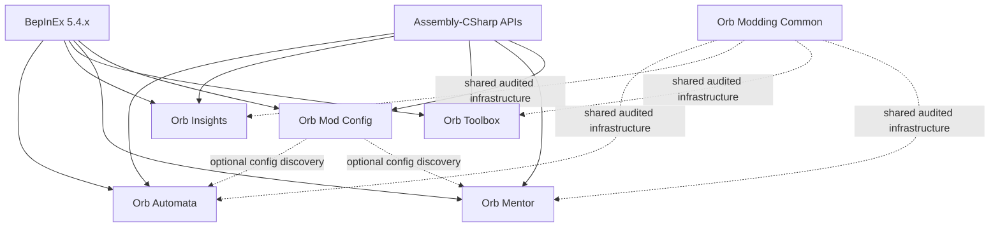

# Project roadmap

> **Lifecycle: Active.** This is the portfolio-level source of current direction and sequencing.

[Back to documentation](../README.md) · [Reverse-engineering map](../reverse-engineering/README.md)

## Product direction

The supported `main` branch contains four focused gameplay BepInEx 5 plugins plus an optional in-game configuration UI:

1. **Orb Automata** — automates repetitive progression decisions through configurable rules.
2. **Orb Insights** — extends existing tooltips into an inspection and explanation layer.
3. **Orb Toolbox** — provides explicit resource/debug operations and development safeguards.
4. **Orb Mentor** — shares a controlled portion of earned mastery experience with lower-level discovered spells, with artifacts and alchemy deferred to separately audited extensions.

**Orb Mod Config** is optional shared UI infrastructure that exposes loaded BepInEx configuration inside the game without becoming a dependency of the gameplay plugins.

The public positioning is: **reduce idle waiting and repetitive management while preserving meaningful progression decisions.** Cheats and resource editing may be useful as private development tools, but they are not the first public product.

Experimental modules are developed on dedicated branches and enter `main` only after explicit lifecycle promotion and release-scope approval.

## Design principles

- Opt-in actions and conservative defaults.
- Never mutate a save file directly during gameplay.
- Use normal game APIs whenever possible.
- Keep UI and input responsive at different game speeds.
- Put configurable action and CPU-time budgets on automation.
- Make every automated decision explainable in logs or tooltips.
- Use third-party mods as design references without patching or depending on them.
- Support one owner for each automated action family; concurrent overlapping automation mods are unsupported.

## Dependency strategy

Keep the shared library focused on stable duplicated code such as keybind parsing, game-state detection, diagnostics, scheduling, and status controls.

## Milestones

### Phase 0 — Development foundation

- Maintain the `netstandard2.1` BepInEx 5 solution.
- Reference game assemblies without copying them into release output.
- Keep structured logging and reproducible build-to-staging workflows.
- Verify load/unload and configuration generation.

Exit criterion: supported plugins load without BepInEx errors and survive scene changes.

### Phase 1 — Automation foundation

- Maintain rule evaluation, reserves, priorities, action budgets, and diagnostics.
- Preserve native game ownership of availability, cost, queues, and final mutations.
- Keep Auto Buy as the first product vertical slice.

Exit criterion: Auto Buy runs for an extended session without overspending reserved resources or blocking manual play in a supported single-buyer installation.

### Phase 2 — Orb Automata modules

- Maintain Auto Buy, Auto Cast, and Auto Concept.
- Add Auto Harvest only after its native contracts are audited.
- Add crafting, scribing, ordinary alchemy, and optional research automation afterward.
- Reuse the same rule engine, shared scheduler, and diagnostics.

Auto Concept's Scholar mastery-balancing, dynamic acquired-slot, ownership, continuous-drain, and performance contracts are specified in the [Auto Concept plan](auto-concept.md).

### Phase 3 — Orb Insights

- Extend native resource tooltips with exact values and UUIDs.
- Add contextual extensions for research, structures, spells, and alchemy.
- Let Automata contribute decision explanations without creating a hard dependency.
- Provide a diagnostic mode for mod development.

Exit criterion: extensions preserve native tooltip content and degrade safely when a target type is unsupported.

### Phase 4 — Orb Toolbox

- Add searchable resource selection and explicit add/set/multiply operations.
- Add dry-run previews, audit logging, and optional save snapshots.
- Keep unsafe operations behind an advanced confirmation gate.

Exit criterion: supported actions change only the selected runtime objects, survive normal save/load, and are recoverable through documented backups.

### Phase 5 — Orb Mentor

- Maintain installed-game contracts around the verified spell mastery, catalog, save, and type-XP surfaces.
- Use native recipient XP grants, stable UUID ordering, recursion suppression, per-frame aggregation, and bounded processing.
- Keep live Mod Config integration, `Alt+M`, and the queue-adjacent ON/OFF/BLOCKED control.
- Defer automatic mastery confirmation to Automata and audit artifacts/alchemy as later independent extensions.

See [Orb Mentor plan](mentor.md) for the resolved spell contract, verified native XP path, delivery stages, and verification requirements.

Exit criterion: eligible discovered lower-mastery spells receive exactly the configured XP through native progression behavior, grants never recurse or directly modify spell-type XP, and saves remain stable across extended sessions and plugin removal.

### Phase 6 — In-game mod configuration UI

- Keep the Mods navigation item available from a new game and last among available top-level tabs.
- Open a standalone, mod-owned Unity panel rather than extending native content panels.
- Discover loaded BepInEx configurations without requiring participating mods to depend on the UI plugin.
- Group settings by mod and section and provide type-appropriate, validated editors.
- Preserve `.cfg` files as the source of truth with staged Apply/Revert behavior and honest live/restart status.
- Keep the panel usable with unscaled time, keyboard/controller navigation, scene changes, and other UI mods.

See [In-game mod configuration UI plan](mod-config-ui.md) for architecture, delivery stages, risks, and acceptance criteria.

Exit criterion: the suite's supported configuration types round-trip safely in game, the compatibility matrix passes, and removing the UI plugin leaves every mod configurable through its normal `.cfg` file.

### Phase 7 — Shared library and public ecosystem

- Extract genuinely shared infrastructure.
- Publish stable configuration and compatibility contracts.
- Document extension points for future modules.

## Immediate next task

Complete interactive desktop and Steam Deck validation for the Automata, Mentor, and Mod Config release candidate, then run the supported-suite release review.
