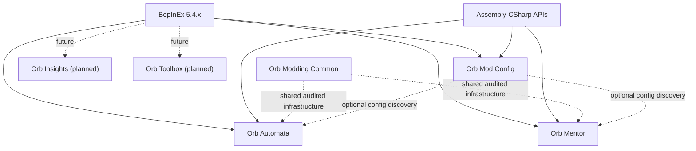

# Project roadmap

> **Lifecycle: Active.** This is the portfolio-level source of current direction and sequencing.

[Back to documentation](../README.md) · [Reverse-engineering map](../reverse-engineering/README.md)

## Product direction

The supported branch currently contains two gameplay plugins, an optional in-game configuration UI, and their shared library:

1. **Orb Automata** — Auto Buy, Auto Cast, Auto Concept, and progression-aware spell leveling.
2. **Orb Mentor** — independently configurable mastery-XP sharing for spells, artifacts, and alchemy.
3. **Orb Mod Config** — optional shared UI that exposes loaded BepInEx configuration without becoming a gameplay-plugin dependency.
4. **Orb Modding Common** — shared audited infrastructure bundled with the supported plugins.

Orb Insights and Orb Toolbox remain design plans. `OrbChronomancer` and `OrbAchievementResonance` are isolated on the dedicated experimental branch and enter the supported branch only after explicit lifecycle promotion and release-scope approval.

The public positioning is: **reduce idle waiting and repetitive management while preserving meaningful progression decisions.** Cheats and resource editing may be useful as private development tools, but they are not the first public product.

## Design principles

- Opt-in actions and conservative defaults.
- Never mutate a save file directly during gameplay.
- Use normal game APIs whenever possible.
- Keep UI and input responsive at different game speeds.
- Put configurable action and CPU-time budgets on automation.
- Make automated decisions explainable through bounded diagnostics.
- Use third-party mods as design references without patching or depending on them.
- Support one owner for each automated action family; concurrent overlapping automation mods are unsupported.

## Dependency strategy

Keep the shared library focused on stable duplicated code such as keybind parsing, game-state detection, diagnostics, scheduling, configuration metadata, and status controls.

## Milestones

### Phase 0 — Development foundation

- Maintain the `netstandard2.1` BepInEx 5 solution.
- Reference game assemblies without copying them into release output.
- Keep structured logging and reproducible build-to-staging workflows.
- Verify load/unload and configuration generation.

Exit criterion: supported plugins load without BepInEx errors and survive scene changes.

### Phase 1 — Automation foundation

- Maintain rule evaluation, reserves, priorities, action budgets, and diagnostics.
- Preserve native game ownership of availability, cost, queues, and final mutations.
- Keep Auto Buy as the first product vertical slice.

Exit criterion: Auto Buy runs for an extended session without overspending reserved resources or blocking manual play in a supported single-buyer installation.

### Phase 2 — Orb Automata modules

- Maintain Auto Buy, Auto Cast, Auto Concept, and progression-aware spell leveling.
- Keep spell leveling under Auto Buy because it spends progression resources and invokes native purchase actions; it is not a Mentor or concept responsibility.
- Add Auto Harvest only after its native contracts are audited.
- Add crafting, scribing, ordinary alchemy, and optional research automation only after separate audits.
- Reuse the shared scheduler, lifecycle-aware indexes, resource snapshots, and bounded diagnostics.

Auto Concept's balancing, timed cycling, dynamic acquired-slot, ownership, zero-resource, lifecycle, and performance contracts are specified in the [Auto Concept plan](auto-concept.md).

### Phase 3 — Orb Insights (planned)

- Extend native resource tooltips with exact values and UUIDs.
- Add contextual extensions for research, structures, spells, and alchemy.
- Let Automata contribute decision explanations without creating a hard dependency.
- Provide a diagnostic mode for mod development.

Exit criterion: extensions preserve native tooltip content and degrade safely when a target type is unsupported.

### Phase 4 — Orb Toolbox (planned)

- Add searchable resource selection and explicit add/set/multiply operations.
- Add dry-run previews, audit logging, and optional save snapshots.
- Keep unsafe operations behind an advanced confirmation gate.

Exit criterion: supported actions change only selected runtime objects, survive normal save/load, and are recoverable through documented backups.

### Phase 5 — Orb Mentor

- Maintain installed-game contracts for spell, artifact, and alchemy mastery, catalogs, saves, availability, and native XP paths.
- Keep the three domains independently configurable and fail closed per domain.
- Use native recipient progression, stable UUID ordering, recursion suppression, aggregation, and bounded processing.
- Maintain `EquippedSpells` and `HighestDiscovered` spell source policies.
- Keep live Mod Config integration, `Alt+M`, and the independent ON/OFF/BLOCKED control.
- Keep resource-spending spell leveling in Automata rather than Mentor.

See the [Orb Mentor plan](mentor.md) for spell contracts and [Mentor artifacts and alchemy](mentor-artifacts-alchemy.md) for the released beta extensions and remaining interactive gates.

Exit criterion: every enabled domain grants exactly the configured XP through its audited native progression behavior, grants never recurse, disabled or unresolved domains stay silent, and saves remain stable across extended sessions and plugin removal.

### Phase 6 — In-game mod configuration UI

- Keep the Mods navigation item available from a new game and last among available top-level tabs.
- Open a standalone, mod-owned Unity panel rather than extending native content panels.
- Discover loaded BepInEx configurations without requiring participating mods to depend on the UI plugin.
- Group settings by mod and section and provide type-appropriate, validated editors.
- Preserve `.cfg` files as the source of truth with staged Apply/Revert behavior and honest live/restart status.
- Keep the panel usable with unscaled time, keyboard/controller navigation, scene changes, and other UI mods.

See the [In-game mod configuration UI plan](mod-config-ui.md) for architecture, delivery stages, risks, and acceptance criteria.

Exit criterion: supported configuration types round-trip safely in game, the compatibility matrix passes, and removing the UI plugin leaves every mod configurable through its normal `.cfg` file.

### Phase 7 — Shared library and public ecosystem

- Extract genuinely shared infrastructure.
- Publish stable configuration and compatibility contracts.
- Document extension points for future modules.

## Immediate next task

Complete post-release Steam Deck/Proton and extended combined-suite validation for ModSuite 0.3.0 Beta 1, then address any release-blocking regressions before stable promotion.
