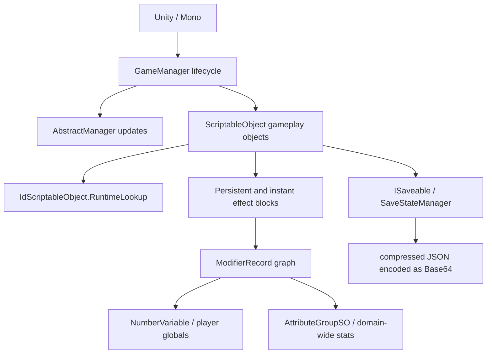

# Reverse-engineering audit

[Back to index](README.md) · [Global stat catalog](global-stats-catalog.md)

## Audited build

This audit was repeated on 2026-07-13 against the assemblies currently installed with the game.

| Item | Verified value |
|---|---|
| Unity | `6000.0.70` |
| Runtime | 64-bit Mono / CLR 4.x |
| Active mod loader | BepInEx `5.4.23.5` |
| `Assembly-CSharp.dll` modified | 2026-07-11 08:19:58 |
| `Assembly-CSharp.dll` SHA-256 | `5845797D40E4631517DE9F4D6296F10C7381AAD5DA733128B2C4685E66E8711F` |
| `Assembly-CSharp-firstpass.dll` SHA-256 | `D14D52652591ED3CB5ACF55186478DD3873F3C836871E0F68AA861D1767F480A` |

The copied analysis inputs and installed assemblies have identical lengths and hashes. ILSpyCmd `10.1.0.8386` decompiled the key types to C# and ILSpy GUI was opened on the installed main assembly; repeatable metadata and IL checks were also made with Mono.Cecil. No game files were changed.

## Mind-map result

The high-level map remains correct:

### Reverified claims

- `GameManager.FixedUpdate()` passes `Time.fixedDeltaTime` into the game-element increment loop and then updates managers.
- The lifecycle phases and centralized iterators remain present.
- `IdScriptableObject.RuntimeLookup` is still the central `Guid -> object` registry.
- `SaveStateManager.CollectJsonData()` collects registered `ISaveable` objects, calls `CollectSaveData()`, builds `SaveInfo`, compresses it, and serializes it.
- `SaveStateManager.ImplementLoadedJson()` resolves each saved UUID through `IdScriptableObject.GetInstance(Guid)` before calling `ISaveable.LoadSaveData()`.
- `ResourceSO.SetQuantity()` still clamps capped resources between zero and `maxQuantity`.
- `ResourceSO.Gain()` still follows the normal gain-rate, lifetime-gain, observable, and reverberation path.
- `AchievementSO.ApplyEffects()` still adds raw strength to `Player.GetAchievementLevel()` under the achievement UUID and applies completion effects.
- `Player.ManagerStart()` builds observers before applying persistent effects; `ManagerUpdate()` reapplies them when observers update.
- `AttributeGroupSO.BindAllMods()` binds serialized target records into one `MergingModifierRecord` with ratio, exponent ratio, and order-adjust delegates.

### Corrections and sharper boundaries

1. The previous index called the examined build “dated 2026-07-09.” The current main gameplay assembly is dated 2026-07-11; 2026-07-09 is still the timestamp of the first-pass numeric assembly and the game build shown in the BepInEx banner.
2. `ResourceSO.MakeVisible()` is **private** in the current assembly. It is not a supported public Toolbox call. Visibility should be changed only through a proven public gameplay path or a deliberately labeled reflection/Harmony operation.
3. There are both BepInEx 5 and BepInEx 6-named binaries in `BepInEx/core`, but the runtime log proves that the active chainloader is BepInEx `5.4.23.5`. Plugins should continue targeting BepInEx 5.
4. Attribute-group membership is serialized asset data, not encoded in `Assembly-CSharp.dll`. ILSpy proves how groups propagate modifiers but cannot prove the membership of each group from code alone. The logging probe remains required before enabling overlapping groups.
5. “Scaling” is not one stat. The code exposes beneficial power/effect scaling and harmful cost/time requirement scaling through different accessors. A blanket scaling modifier is not safe.

## Confidence after audit

| Area | Result | Remaining runtime work |
|---|---|---|
| Lifecycle | Verified | Timing classification at accelerated speed |
| UUID registry | Verified | Earliest populated lifecycle point |
| Resource operations | Verified with one visibility correction | UI refresh and extreme-cap behavior |
| Save pipeline | Verified | Safe snapshot timing |
| Achievement Strength | Verified | Existing serialized blocks and tooltip presentation |
| Modifier records | Verified | Balance and double-application tests |
| Attribute groups | Mechanism verified | Exact serialized members and overlap graph |
