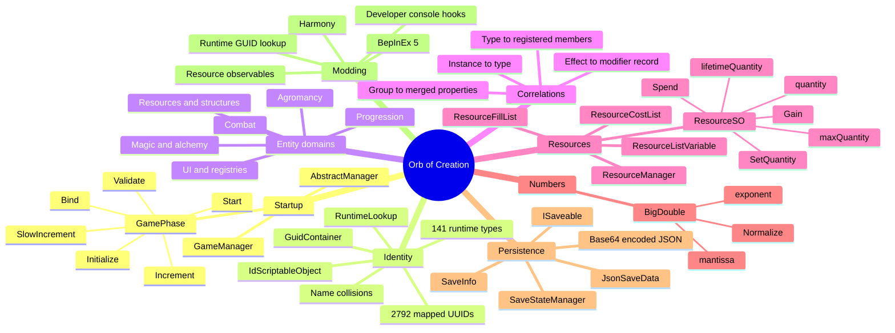

# Orb of Creation reverse-engineering notes

[Back to documentation](../README.md)

These notes describe the managed-code architecture of the installed Orb of Creation build. The current main assembly was re-audited on 2026-07-13; see the [reverse-engineering audit](audit.md) for hashes, corrections, and confidence boundaries.

## Examined build

- Unity `6000.0.70`
- 64-bit Mono runtime
- BepInEx `5.4.23.5`
- Main game assembly: `Orb Of Creation_Data/Managed/Assembly-CSharp.dll`
- Numeric library: `Orb Of Creation_Data/Managed/Assembly-CSharp-firstpass.dll`
- Save format version observed: `6`

The findings come from assembly metadata and selected IL method bodies read with Mono.Cecil. No game binaries were modified. Runtime-resolved compatibility findings are also recorded in the machine-readable [`data/native-contracts.json`](../../data/native-contracts.json); maintain it through the [native contract workflow](../testing/native-contracts.md).

## Knowledge map

## Suggested reading order

1. [Architecture](architecture.md)
2. [Identity and registries](identity-and-registries.md)
3. [Entity catalog and taxonomy](entity-catalog.md)
4. [Entity correlations](entity-correlations.md)
5. [Evidence strength](evidence-strength.md)
6. [Alchemy gameplay-domain classification](alchemy-domain-classification.md)
7. [Resources and large numbers](resources-and-bigdouble.md)
8. [Save system](save-system.md)
9. [Modding hooks](modding-hooks.md)
10. [Reverse-engineering audit](audit.md)

Implementation plans and maintainer procedures are indexed separately in the [documentation hub](../README.md).

## Important discovered identifier

| Entity | UUID | Runtime type |
|---|---|---|
| Alchemic Scroll | `67acd892-8a8a-455a-aa71-3fb06e75bf38` | `ResourceSO` |

## Historical confidence labels

- **Verified:** directly present in metadata or inspected IL. New code-facing results use `StaticallyVerified` or `SerializedAssetVerified` from the [evidence model](evidence-strength.md).
- **Inferred:** conclusion based on verified structure but not yet confirmed at runtime.
- **Candidate:** promising target that should remain `Unresolved` until tested in a logging-only plugin.
