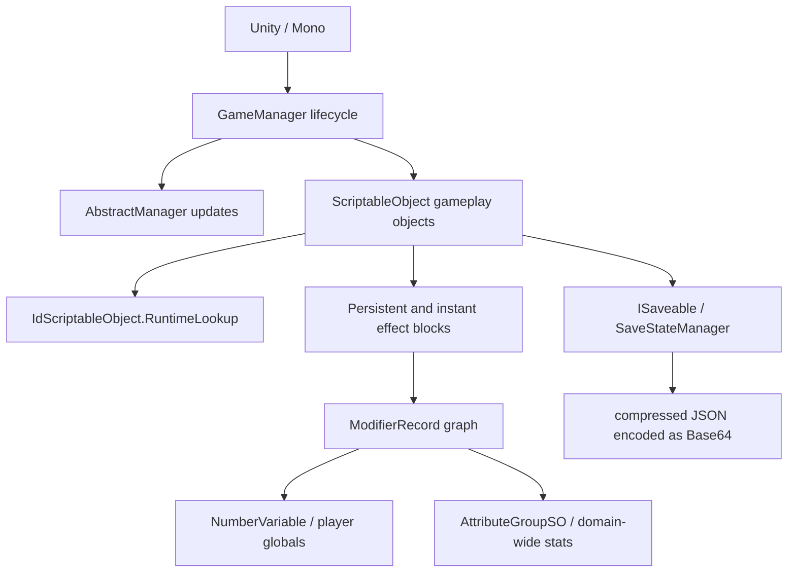

# Reverse-engineering audit

[Back to index](README.md)

## Audited build

The current audited baseline is `steam-windows-2026-07-29`, the Windows Steam build `24426975` of Orb of Creation v1.0.5-2.

| Item | Verified value |
|---|---|
| Baseline | `steam-windows-2026-07-29` |
| Game build | Orb of Creation v1.0.5-2 |
| Steam build | `24426975` |
| Platform | Windows Steam managed build |
| Unity | `6000.0.70f1` |
| Runtime | 64-bit Mono / CLR 4.x |
| Active mod loader | BepInEx `5.4.23.5` |
| Audit input | Read-only installed assemblies plus user-triggered in-game differential verifier |
| `Assembly-CSharp.dll` SHA-256 | `436210E61D9F8B84658609D35E32BC274356170005AC15FE93FA36D4D9F7AA4C` |
| `Assembly-CSharp-firstpass.dll` SHA-256 | `D14D52652591ED3CB5ACF55186478DD3873F3C836871E0F68AA861D1767F480A` |

The installed assembly pair hashes exactly to this baseline. The suite compiled against it, all portable and profile tests passed, all installed-game metadata contracts passed, and the in-game verifier reported exact parity for costs, rates, modifiers, affordability, accessors, and structure and upgrade requirements. The audit used no Computer Use and changed no game or save files.

The audited hashes and active runtime-resolved member contracts are mirrored in [`data/native-contracts.json`](../../data/native-contracts.json). Installed-game tests validate the manifest directly, including type/member visibility and staticness. The manifest hash baseline is also checked against the runtime `GameAssemblyAudit` constants so those fail-closed warnings cannot drift independently.

## Mind-map result

The high-level map for the audited baseline is:

### Verified claims

- `GameManager.FixedUpdate()` passes `Time.fixedDeltaTime` into the game-element increment loop and then updates managers.
- The lifecycle phases and centralized iterators are present.
- `IdScriptableObject.RuntimeLookup` is the central `Guid -> object` registry.
- `SaveStateManager.CollectJsonData()` collects registered `ISaveable` objects, calls `CollectSaveData()`, builds `SaveInfo`, compresses it, and serializes it.
- `SaveStateManager.ImplementLoadedJson()` resolves each saved UUID through `IdScriptableObject.GetInstance(Guid)` before calling `ISaveable.LoadSaveData()`.
- `ResourceSO.SetQuantity()` clamps capped resources between zero and `maxQuantity`.
- `ResourceSO.Gain()` follows the normal gain-rate, lifetime-gain, observable, and reverberation path.
- `AchievementSO.ApplyEffects()` adds raw strength to `Player.GetAchievementLevel()` under the achievement UUID and applies completion effects.
- `Player.ManagerStart()` builds observers before applying persistent effects; `ManagerUpdate()` reapplies them when observers update.
- `AttributeGroupSO.BindAllMods()` binds serialized target records into one `MergingModifierRecord` with ratio, exponent ratio, and order-adjust delegates.

### Corrections and sharper boundaries

1. Assembly timestamps are diagnostics only; baseline admission matches the complete SHA-256 pair. The v1.0.5-2 main assembly differs from the preceding macOS baseline, while the first-pass numeric assembly is unchanged.
2. `ResourceSO.MakeVisible()` is **private** in the audited assembly. It is not a supported public Toolbox call. Visibility should be changed only through a proven public gameplay path or a deliberately labeled reflection/Harmony operation.
3. The suite targets BepInEx 5. The active chainloader banner, rather than the names of binaries present in the loader directory, establishes the runtime.
4. Attribute-group membership is serialized asset data, not encoded in `Assembly-CSharp.dll`. ILSpy proves how groups propagate modifiers but cannot prove the membership of each group from code alone. The logging probe remains required before enabling overlapping groups.
5. “Scaling” is not one stat. The code exposes beneficial power/effect scaling and harmful cost/time requirement scaling through different accessors. A blanket scaling modifier is not safe.

## Confidence after audit

| Area | Result | Remaining runtime work |
|---|---|---|
| Lifecycle | Verified | Timing classification at accelerated speed |
| UUID registry | Verified | Earliest populated lifecycle point |
| Resource operations | Verified with one visibility correction | UI refresh and extreme-cap behavior |
| Save pipeline | Verified | Safe snapshot timing |
| Achievement Strength | Verified | Existing serialized blocks and tooltip presentation |
| Modifier records | Verified | Balance and double-application tests |
| Attribute groups | Mechanism verified | Exact serialized members and overlap graph |
