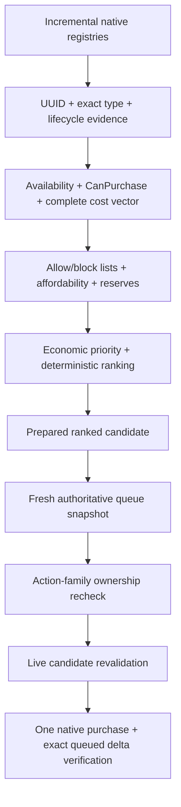

# Auto Buy native purchase pipeline

[Reverse-engineering index](README.md) · [Queue and completion](auto-buy-queue-and-completion.md) · [Simulation evidence](auto-buy-simulation-evidence.md) · [Native contracts](../testing/native-contracts.md)

## Scope and evidence boundary

This document connects the audited game-member inventory to Automata's active
purchase path. It describes three different kinds of evidence and does not
promote one into another:

- **Static native contract:** exact type/member shape in the audited installed
  assemblies, recorded in [`data/native-contracts.json`](../../data/native-contracts.json).
- **Automata implementation:** ordering and fail-closed behavior in
  [AutoBuyEngine.cs](../../src/OrbAutomata/AutoBuyEngine.cs),
  [AutomationAdmission.cs](../../src/OrbAutomata/AutomationAdmission.cs), and
  [ReflectionAutoBuyCatalog.cs](../../src/OrbAutomata/ReflectionAutoBuyCatalog.cs).
- **Runtime behavior:** side effects and callback order observed in Unity. Only
  statements explicitly labelled runtime-observed carry this authority.

The manifest proves that the selected members exist with the expected shape.
It does not by itself prove the internal IL order of resource deduction, queue
insertion, echo actions, UI refresh, or completion effects.

This document describes the current production path. The proposed
[raw-fact ServiceCycle port](../plans/autobuy-service-cycle-port.md) targets a collector that copies the
[audited raw input graph](auto-buy-raw-fact-inputs.md) and reproduces its mathematics in pure worker code.
Native convenience calls remain required until the installed serialized condition graph and formula parity
have runtime evidence.

## Audited native surface

| Concern | Structure contract | Upgrade contract | Evidence |
|---|---|---|---|
| Registry | `StructureSO.All` | `UpgradeSO.All` | Static contract |
| Availability | `IsAvailable()` | `IsAvailable()` | Static contract |
| Native admission | `CanPurchase()` | `CanPurchase()` | Static contract |
| Cost | `GetPurchaseCost()` → `ResourceCostList` | `GetPurchaseCost()` → `ResourceCostList` | Static contract |
| Current level | `GetPurchaseLevel()` | `GetPurchaseLevel()` | Static contract |
| Queued state | `GetQueuedQuantity()` | `GetQueuedPurchaseLevel()` | Static contract |
| Mutation | `Purchase(bool)` | `Purchase()` | Static contract |
| Completion | `CompleteAction()` | `CompleteAction()` | Static contract/Harmony target |
| Queue signal | `QueueBuild(int)` | `Purchase()` | Static contract/Harmony target |
| Finite lifecycle | not used by adapter | `HasFiniteLevels()`, `IsMaxLevel()`, `IsMaxQueuedLevel()` | Static contract |

The shared queue contract is `ActionManager.GetRemainingRoom()` plus
`ActionManager.instance.actionableItems.maxQueuedItems.AsInt()`. Upgrade
single-level isolation additionally uses `GlobalVariables.GetMultiBuy()` and
`IntVariable.AsInt()/SetValue(int)`. Structure fallback grouping may read
`Player.GetBulkDevelopment()`.

## Candidate discovery and lifecycle admission

1. `ReflectionAutoBuyCatalog` incrementally enumerates both native registries.
2. Identity is the stable UUID plus the exact audited native type. A UUID/type
   contradiction is invalid; a same-UUID native-reference replacement advances
   the lifecycle epoch and replaces the wrapper.
3. Lifecycle evidence reads availability, current level, and queued state.
   Upgrade evidence also reads finite/max/max-queued flags. Negative or
   contradictory evidence is rejected by the candidate index.
4. Locked content stays lifecycle-visible and can become active after
   progression or registry invalidation. Registry presence is never treated as
   availability or completion.
5. Reconciliation and lifecycle maintenance are sliced. The current catalog
   processes at most 32 registry items and 32 lifecycle items in an evaluation,
   with smaller periodic active/slow refresh slices.

These are Automata implementation facts exercised against game-shaped stubs.
The earliest real Unity point at which every registry is complete remains a
runtime contract; lifecycle hooks therefore invalidate and reconcile instead
of assuming one permanent startup snapshot.

## Evaluation and ranking

`AutoBuyAdmissionAdapter` requires stable identity, known availability, known
native admission, a fully resolved immediate-cost vector, no unresolved drain
vector, and one known queue slot. Structure admission reads availability before
calling `CanPurchase`; Upgrade admission calls `CanPurchase` and then reads
availability. Both paths fail closed if the complete adapter contract is not
available.

The cost decoder accepts a vector only when every bounded entry has a stable
resource identity and readable live values. Duplicate contradictory resources,
negative costs, negative quantities, missing identities, and partial reads make
the candidate unresolved. Reserve and affordability policy evaluate that whole
vector; no partial vector may authorize a purchase.

## Immediate pre-mutation validation

Every individual level repeats the following checks on the Unity main thread:

1. capture a consistent shared-queue snapshot;
2. refresh completion-sensitive lifecycle/cost evidence when required;
3. reevaluate identity, availability, native admission, costs, affordability,
   reserves, finite level, and policy;
4. capture the shared queue again after native reads;
5. confirm action-family ownership;
6. enter an automated-mutation identity scope;
7. call the candidate adapter.

The second queue capture is intentional: availability and cost reads can invoke
native code, so an earlier room observation is not sufficient mutation
authority.

## Mutation transaction

### Structure

1. Capture `GetQueuedQuantity()`.
2. Invoke `StructureSO.Purchase(true)`.
3. Capture `GetQueuedQuantity()` again.
4. Accept only an exact delta of `+1`.

The Boolean argument shape and exact queued-state methods are statically
verified. The meaning of the `true` argument and the internal native order of
resource spending versus `QueueBuild` are not asserted here without a reviewed
IL/runtime observation.

### Upgrade

1. Resolve and read the global multi-buy variable.
2. Set it to `1` and verify the readback.
3. Capture `GetQueuedPurchaseLevel()`.
4. Invoke `UpgradeSO.Purchase()`.
5. Capture `GetQueuedPurchaseLevel()` again.
6. Accept only an exact delta of `+1`.
7. Restore the original global multi-buy value and verify restoration on every
   exit path.

If multi-buy entry or restoration cannot be verified, Upgrade mutation is
quarantined. Structure purchasing is independent of that global quarantine.

## Mutation outcomes

`NativeMutationVerifier` distinguishes the observable boundary, not the game's
internal intent:

| Outcome | Native invocation known to have started? | Safe interpretation |
|---|---:|---|
| Before capture failed | No | No mutation authority was obtained |
| Execution threw | Yes | Ambiguous even when an after-state can be read |
| After capture failed | Yes | Ambiguous |
| Postcondition failed | Yes | Ambiguous/no verified exact delta |
| Verified | Yes | Exact queued delta `+1` observed |

Any attempted but unverified mutation blocks that candidate until a newer
lifecycle. This is why the simulator separates pre-mutation rejection from
post-mutation ambiguity.

The scheduler distinguishes a definite rejection before any native call from
an attempted or ambiguous mutation. Definite rejection advances to the next
ranked candidate and records an exponential 0.25-to-5-second retry; attempted or
ambiguous mutation remains blocked until lifecycle recovery. `NF-03` enforces
that a permanently rejecting highest rank cannot starve healthy lower ranks and
that a transiently rejecting candidate later recovers.

## What remains unknown

- exact native IL order of queue insertion, resource deduction, notifications,
  and `QueueBuild`/`Purchase` callbacks;
- which native failures can throw after a partial side effect in the audited
  game build;
- whether all completion/echo paths produce the same Harmony callback order;
- whether queue capacity can change outside the currently observed progression
  paths;
- exact availability/registry populations at named player progression stages.

These unknowns require an installed-assembly IL audit or sanitized runtime
observation before they can strengthen simulation authority.
