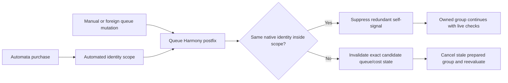
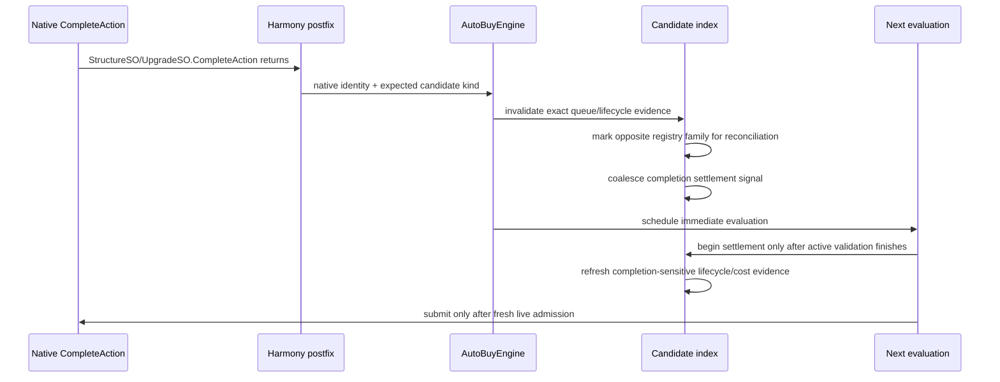

# Auto Buy queue and completion model

[Reverse-engineering index](README.md) · [Native purchase pipeline](auto-buy-native-pipeline.md) · [Runtime validation](../testing/runtime-validation.md)

> **Scope.** This records the game's queue and completion behavior. The Automata side it describes is
> the legacy Auto Buy runtime, which has been deleted: the queue-signal patches are gone, there is no
> `AutoBuyEngine` and no incremental catalog, and Auto Buy no longer polls the queue — it reads
> structure and upgrade levels off the world snapshot and paces on `AfterDecision`. The
> `CompleteAction` postfix is gone too: it nudged unmigrated Spell Leveling, which now gates on the
> world generation like every other migrated service. Read the native
> observations as current and every Automata mechanism named below as history.

## Shared queue authority

Automata does not use an Auto Buy-only queue count. The authoritative snapshot
combines:

- native total capacity from
  `ActionManager.instance.actionableItems.maxQueuedItems.AsInt()`;
- native remaining room from `ActionManager.GetRemainingRoom()`;
- the configured automation usage limit; and
- the configured manual reservation.

`QueueCapacitySnapshot` rejects negative capacity, negative remaining room,
remaining room greater than capacity, and negative policy inputs. For a valid
snapshot:

```text
occupancy = native capacity - native remaining room
room after reservation = max(0, native remaining room - manual reservation)
usable automation room = min(automation usage limit, room after reservation)
```

The manual reservation is applied exactly once. A queue snapshot is live
admission evidence only; every individual purchase captures it again.

## Queue signals



`StructureSO.QueueBuild(int)` and `UpgradeSO.Purchase()` postfixes publish queue
changes. A thread-local scope suppresses only the exact native identity being
mutated by Automata. Manual actions, foreign automation, and another candidate's
signal remain visible and invalidate prepared work.

Suppression does not bypass safety: the engine still recaptures queue room,
availability, cost, reserve, level, and ownership before the next individual
level.

## Full queue and reopening

When the shared queue has no usable automation room, the engine retains the next
prepared ranked candidate instead of rescanning. Ten-hertz queue polling wakes
that candidate when room reopens, but its live evidence is revalidated before
mutation. A manual action taking the reopened slot wins because the final native
submission fails its live queue check.

Capacity increases can be consumed without a lifecycle reload. A contradictory
snapshot fails closed. Capacity shrinkage is safe only when the native capacity
and remaining-room pair is internally consistent; a synthetic capacity below
current occupancy is deliberately rejected by the simulator/catalog contract.

## Completion signal and settlement



The completion postfix occurs after the native `CompleteAction()` returns. The
catalog invalidates the exact native candidate, schedules conservative
cross-family registry reconciliation because completion can unlock other
content, and coalesces repeated completion notifications. Settlement does not
start over an already-active settlement-validation pass.

Before a prepared candidate mutates after completion, it refreshes lifecycle
evidence and marks costs dirty once per completion generation. Failure to
refresh ends that prepared batch and forces reevaluation.

## Lifecycle boundaries

The following native hooks advance or invalidate lifecycle state:

| Native boundary | Automata transition |
|---|---|
| `SaveStateManager.ImplementLoadedJson()` prefix/postfix | save-load started / save loaded |
| `PersistentResetManager.PersistentResetLogic()` prefix | NG+ started |
| `GameManager.ResetGameState()` prefix | reset started |
| `GameManager.InitGame()` postfix | registry rebuilt, then runtime ready |

Lifecycle invalidation clears cached resources, deferred invalidations,
registry-reconciliation state, completion settlement, and prepared engine work.
Same-UUID replacement native references are treated as a new epoch. Attempted
but unverified mutation blocks recover only through the audited lifecycle/circuit
contract; stale wrappers do not gain authority over replacement objects.

## Modeled completion behaviors

The deterministic simulator additionally models:

- exact Structure multi-level completion;
- manual actions at the queue front;
- echo actions consuming reopened room;
- malformed UUID/type/count observations;
- nested completion rejection; and
- queue clearing during active settlement.

These are valuable safety models, but not every modeled echo/bulk ordering has
been observed in the installed game. The exact native callback trace must be
captured before a modeled ordering is promoted to runtime-observed evidence.

## Runtime observations still needed

1. Capture queue depth immediately before native completion effects, at the
   `CompleteAction` postfix, and on the following Unity frame.
2. Repeat for a Structure bulk completion and for any action that enqueues an
   echo/repeat action.
3. Interleave one manual action with the reopened slot and record native order.
4. Repeat across save/load and NG+ with the same stable UUID, recording whether
   the native object reference is replaced.
5. Record the live capacity/remaining-room pair at every observation; never
   infer capacity from a UI label.
