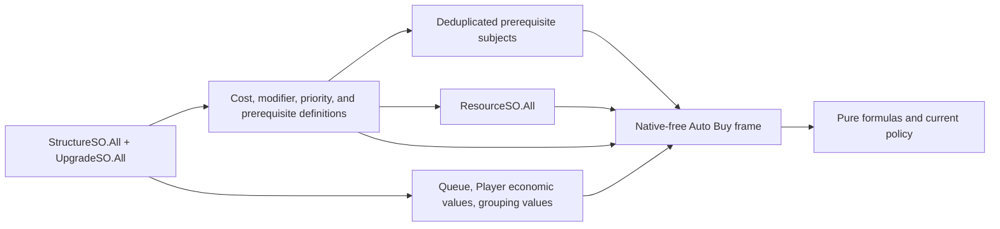

# Auto Buy raw-fact input graph

[Reverse-engineering index](README.md) ·
[Current native pipeline](auto-buy-native-pipeline.md) ·
[ServiceCycle port plan](../plans/autobuy-service-cycle-port.md)

## Scope and evidence

This document identifies the native data that can replace game-calculated Auto Buy answers with a
native-free worker calculation. It records static IL evidence, not completed production behavior.

The audit used Mono.Cecil against this admitted installed-game assembly pair:

- `Assembly-CSharp.dll`
  `5652EBE35A4B87223A014EAA7B364AE921477D2E016789CB4E13C8C892055DE4`;
- `Assembly-CSharp-firstpass.dll`
  `CAFE3F4FC522B3AF33A10CB363731A0985C249A55A51A710EE0ADF94910A0891`;
- main MVID `1ca9f623-3310-4e13-a004-4fdfc1be7fc1`; and
- firstpass MVID `18707adf-0256-424c-9b70-c896ca37639b`.

These findings do not prove equivalent behavior for another platform or assembly hash. Serialized asset
membership also remains runtime evidence: IL proves which condition types and formula shapes are possible,
not which graph is attached to every installed candidate.

## Answer: capture a dependency closure

The game exposes three public bulk roots:

- `StructureSO.All`;
- `UpgradeSO.All`; and
- `ResourceSO.All`.

`ResourceListVariable.GetAll()` returns `ResourceSO.All`; it is not a richer snapshot API. The collector
therefore performs one coherent main-thread traversal of those registries and their reachable formula
inputs. It does not need a scene search or a native convenience call per policy question.

The useful capture is the transitive dependency closure of the current Auto Buy candidates:



Copying every resource is simpler than maintaining a dependency index: the mapped build has 80 resource
definitions. Candidate counts are similarly modest at 180 mapped Structures and 223 mapped Upgrades.
Those mapping counts describe definitions, not guaranteed live registry membership; the collector uses the
current registry counts.

Prerequisites are the exception. Their subjects span several gameplay domains, so the collector should
compile and deduplicate only the subjects reachable from current Structure and Upgrade prerequisite graphs.
It should not copy the rest of the game.

## Bulk-readable graph

The installed assembly exposes these collection edges:

| Parent | Bulk-readable children |
|---|---|
| `ResourceCostList` | `costs : List<ResourceTuple>`; `GetEntries()` returns the same list |
| `Prerequisites.Container` | `prerequisites : List<IRequirementCondition>` |
| `AndRequirement` / `OrRequirement` | nested condition lists |
| `ValueModifierList` | `modifiers` and `exponents` |
| `ModifierRecord` | `passiveModifiers` and `activeModifiers` dictionaries |
| `ActionableListVariable` | queue list and maximum queued-item variable |

The collector copies these into dense, reusable native-free arrays. Native object references stay in the
binding catalog and final mutation adapter; they never enter the worker frame.

## Definition snapshot

A definition snapshot is rebuilt at least at each save/load, reset, NG+, manager replacement, registry
replacement, or same-UUID native-reference replacement. A later fingerprint may prove that some copied
values can live for the whole process, but the initial port does not assume that.

Each candidate definition contains:

- stable UUID, exact native family, and diagnostic name;
- base `ResourceTuple` resource identities and raw `BigDouble` values;
- the Structure cost-per-quantity modifier or Upgrade per-level modifier list;
- prerequisite and per-level prerequisite topology;
- finite maximum-level definition;
- definition evidence required by the existing cost/quality priority option; and
- indexes into deduplicated resource, modifier, and prerequisite-subject tables.

Each modifier operand contains the native operation type, order, real adjustment, and identity needed to
preserve native combination order. A `ValueModifierList` additionally preserves its separate exponent
list. A `ValueModifierRecord` contains its base value and current passive and active modifier entries.

## Live cycle frame

The ordinary capture copies current scalars into one reusable `AutoBuyCycleFrame`.

### Candidate rows

Structure rows need:

- `quantity` and `queuedQuantity`;
- current `costScalingMod`, `passiveCostMod`, and `activeCostMod` operand graphs;
- current prerequisite-container cache state; and
- live values for the referenced per-level prerequisite subjects.

Upgrade rows need:

- `level`, `queuedLevels`, and `maxLevel`;
- current per-level cost modifier operands if their fingerprint changed;
- current prerequisite-container cache state; and
- live values for the referenced per-level prerequisite subjects.

### Resource rows

Each resource is copied once by stable UUID and same-reference evidence:

- stored `quantity`;
- `visible`;
- `bandwidthResource`;
- `quality`, `maxQuantity`, and `attributeCostMod` operand graphs; and
- any raw values required to evaluate those records.

Gross rate, drain, loss, decay, and replenishment are not inputs to current Auto Buy eligibility,
affordability, reserves, or ranking. They do not belong in the first frame. They would be required for a
future income forecast or an exact prediction of post-spend resource state.

### Prerequisite-subject rows

`Prerequisites.Container` can contain nested AND/OR graphs and conditions over Upgrades, Structures,
Research, Resources, Numbers, Lists, Views, Spells, Alchemy, Rituals, Equipment, prerequisite links, and
generic upgradeable values.

The definition snapshot records the condition program. The live frame copies the current subject values
required by that program once per unique subject/property pair. Exact subtype coverage must be measured
from the installed serialized candidate graphs before the native predicates are removed.

The container's `available` field is itself live input. The no-argument native `Check()` permanently caches
`true` until `Reset()`. Re-evaluating only the current conditions would change behavior when a previously
satisfied condition later becomes false. Per-level `Check(ConditionInfo)` is uncached.

### Once-per-frame globals

- current queue total and maximum;
- `Player` Structure-cost modifier;
- `Player` attribute-quality bonus;
- `GameManager.DEBUG`;
- Bulk Development and native action-multiplier values used by current grouping modes;
- lifecycle and configuration generations; and
- current action-family ownership and emergency state.

Configuration is a separate immutable publication, not copied into every candidate row.

## Verified Structure formulas

Let `q = quantity + queuedQuantity`.

```text
attributeCost = baseCost.AdjustAsAttribute()
scaling = costPerQuantity.GetModifier()
    .MultiplyScalar(costScalingMod.AsPercent())
scaledCost = attributeCost.AdjustWith(scaling.MultiplyScalar(q))
purchaseCost = scaledCost
    .Multiply(GetNextCostMod().AsPercent())
    .RoundToTwoSigsEarly()
```

`AdjustAsAttribute()` multiplies each tuple by:

```text
resource.GetAttributeCostMod().AsPercent()
```

The resource factor is:

```text
attributeCostMod.GetValue()
/ Pow(quality.AsPercent(), Player.AttributeQualityBonus)
```

`GetNextCostMod()` combines:

```text
passive = passiveCostMod.GetValue()
scaled = costPerQuantity.GetMod().MultiplyScalar(q).Adjust(1)
base = Max(passive / 100, scaled)
active = activeCostMod.GetValue() * Player.GetStructureCost().AsPercent()
result = base * active.AsPercent()
```

Structure admission is narrower than previously assumed:

```text
IsAvailable() = prerequisites.Check()

CanPurchase() =
    prerequisitesPerLevel.Check(ConditionInfo(quantity))
    && queue.HasRoom()
```

`CanPurchase()` does not check availability or resource cost. The current Automata policy performs those
checks separately, and the worker must continue to do so.

## Verified Upgrade formulas

For the current purchase:

```text
index = level + queuedLevels
if maxLevel > 0:
    index = Min(index, maxLevel - 1)

levelArgument = index + 1
if levelArgument == 1:
    cost = clone(resourceCost)
else:
    modifiers = resourceCostModPerLevel
        .MultiplyScalar(levelArgument - 1)
    cost = modifiers.Adjust(each base tuple)

purchaseCost = cost.RoundToTwoSigs()
```

Upgrade admission short-circuits in this order:

```text
!IsMaxQueuedLevel()
&& purchaseCost.HasEnough()
&& !IsMaxLevel()
&& prerequisites.Check()
&& prerequisitesPerLevel.Check(ConditionInfo(level + queuedLevels + 1))
&& queue.HasRoom()
```

The native object caches its calculated cost by cost level. Runtime parity must determine whether modifier
changes also invalidate that cache before the worker is allowed to replace the convenience method.

## Verified resource admission

For an ordinary resource:

```text
qualityFactor = quality.GetValue().AsPercent()
trueQuantity = quantity * qualityFactor
trueSpend(nominalCost) = nominalCost / qualityFactor
hasAmount = GameManager.DEBUG || quantity >= trueSpend(nominalCost)
```

For a bandwidth resource:

```text
missing = Max(maxQuantity.GetValue() - quantity, 0)
hasAmount =
    RoundToInt(missing.ToFloat())
    >= RoundToInt(nominalCost.ToFloat())
```

Native `ResourceCostList.HasEnough()` checks tuples independently. Current Automata additionally combines
duplicate resource tuples by stable UUID and same native reference before applying its reserve and
affordability policy. The worker must preserve both behaviors rather than silently replacing them with one
combined check.

Native spending remains authoritative. Resource spending can involve decay and replenishment behavior, so
admission parity does not authorize the worker to predict or perform the mutation itself.

## Game-math library boundary

`OrbModding.Common` can own native-free, gameplay-neutral mathematics:

- strict mantissa/exponent arithmetic compatible with the audited `BigDouble` operations;
- ordered modifier operations and modifier-list evaluation;
- exact significant-digit rounding used by cost formulas;
- immutable resource amounts and normalized cost vectors;
- resource quality, capacity, ordinary-spend, and bandwidth comparisons;
- duplicate-cost, reserve, and affordability primitives; and
- generic boolean/comparison condition primitives.

Automata owns the game mapping:

- decoding Orb native records into those values;
- the exact Structure and Upgrade formula composition;
- prerequisite subtype and subject-property mapping;
- current configuration, ranking, grouping, and batch policy; and
- final native revalidation and mutation.

The existing Automata `BigAmount` is a useful starting point, not a drop-in Common primitive: it mixes
native reflection with arithmetic and silently maps some invalid numeric inputs to zero.

## Acceptance gates

Before `CanPurchase()`, `GetPurchaseCost()`, or the resource convenience calculations leave the production
path:

1. capture the installed candidates' actual prerequisite subtype/topology inventory;
2. implement the exact native modifier order and both rounding variants;
3. compare pure Structure and Upgrade costs with native results over current and queued levels;
4. compare ordinary and bandwidth admission at rounding boundaries;
5. verify prerequisite cache behavior across lifecycle reset;
6. verify the Upgrade cost-cache invalidation behavior;
7. preserve current Automata duplicate-cost, reserve, affordability, priority, grouping, and batch policy;
8. repeat the comparison immediately before the exact one-level mutation; and
9. fail closed on an unknown formula, condition subtype, identity, or assembly hash.

Parity evidence is a temporary migration oracle. Once the pure path is accepted, the native convenience
calls are removed rather than retained as a permanent alternate path.
