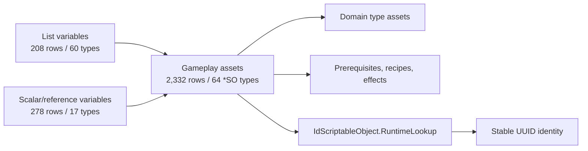

# Entity catalog and taxonomy

[Back to index](README.md) · [Entity correlations](entity-correlations.md) · [Identity and registries](identity-and-registries.md)

## Mapping snapshot

The normalized mapping currently contains:

| Measure | Count |
|---|---:|
| Entity rows | 2,818 |
| Unique UUIDs | 2,818 |
| Managed runtime types | 141 |
| Unique internal names | 2,777 |
| Name labels used by more than one entity | 39 |
| Rows participating in a name collision | 80 |

Every mapped UUID is unique. Names are not unique and must never be treated as primary identity.

The exhaustive machine-readable count for every managed type is stored in [`data/entity-types.tsv`](../../data/entity-types.tsv); the catalog below explains how those types fit together.

The mapped objects divide into four structural layers:

## Base-class families

IL inspection groups the mapped managed types by their direct architectural base:

| Family | Mapped managed types | Role |
|---|---:|---|
| `GenericListVariable<T>` descendants | 45 | Serialized/runtime registries and filtered collections |
| `UpgradeableObject` descendants | 32 | Gameplay objects exposing modifier accessors |
| `TooltipableObject` descendants | 24 | Displayable objects without the full upgrade-property surface |
| Direct `IdScriptableObject` descendants | 18 | Variables, definitions, scaling assets, and utility objects |
| `EmptyTypeListVariable<T>` descendants | 9 | Runtime instance, snapshot, and state collections |
| `StackableListVariable<T>` descendants | 5 | Stack-aware gameplay collections |
| `AbstractItemRefVariable<T>` descendants | 4 | Selected-item references |
| `AbstractVariable<T>` descendants | 2 | GUID and upgradeable-object references |
| `NumberVariable` descendants | 2 | `DoubleVariable` and `IntVariable` persistent modifier targets |

This distinction matters for mods:

- UUID lookup works for all registered `IdScriptableObject` descendants.
- Native upgrade-property modification requires an `UpgradeableObject` accessor or an effect script aimed at another record.
- Tooltip extension can cover `TooltipableObject` descendants even when they are not upgradeable.
- List variables are discovery/index surfaces, not merely UI lists.

## Domain coverage

### Progression and unlocks

| Entity family | Mapped count | Primary role |
|---|---:|---|
| `UpgradeSO` | 229 | Purchasable upgrades and modifier/effect delivery |
| `ResearchSO` / `ResearchTypeSO` | 148 / 11 | Research progression, levels, dependencies, and categories |
| `ChallengeSO` / `ChallengeTypeSO` | 98 / 7 | Challenge state, rewards, and categories |
| `TimeRuneSO` / `TimeRuneTypeSO` | 62 / 6 | Persistent/meta progression and rune categories |
| `AchievementSO` | 50 | Achievement completion, strength, and completion effects |
| `AdvancementSO` | 48 | Advancement power and progression effects |
| `PrerequisiteLinkSO` | 41 | Reusable dependency links |
| `RecipeBookSO` | 34 | Recipe grouping/unlock presentation |
| `DiscoveryTreeSO` | 7 | Choice trees, rerolls, unlock presentation, and research links |
| `ThoughtStreamSO` | 1 | Thought-stream progression state |

### Resources, construction, and items

| Entity family | Mapped count | Primary role |
|---|---:|---|
| `StructureSO` / `StructureTypeSO` | 180 / 32 | Purchasable structures and shared type modifiers |
| `ResourceSO` / `ResourceTypeSO` | 80 / 21 | Quantities, rates, capacity, and resource-wide merged modifiers |
| `EquipmentSO` / `EquipmentTypeSO` | 71 / 19 | Equipment progression and type-wide power |
| `ConsumableSO` / `ConsumableTypeSO` | 68 / 10 | Consumable actions, costs, and shared type effects |
| `CraftingRecipeSO` / `CraftingRecipeTypeSO` | 14 / 2 | Crafting recipes and shared recipe modifiers |
| `CraftingStructureSO` | 1 | Crafting-instance controller and type-wide numeric variables |
| `EnchantmentSO` | 8 | Structure/equipment enchantment definitions |
| `TreasurePoolSO` | 5 | Weighted or categorized treasure outputs |

### Magic, alchemy, and rituals

| Entity family | Mapped count | Primary role |
|---|---:|---|
| `AlchemyRecipeSO` / `AlchemyTypeSO` | 125 / 9 | Alchemy recipes, categories, overdrive, and usage slots |
| `SpellRecipeSO` / `SpellTypeSO` | 65 / 15 | Spell recipes, spell categories, and shared casting modifiers |
| `GlyphSO` / `GlyphTypeSO` | 47 / 6 | Spell composition, elemental typing, and generated passives |
| `RitualSO` / `RitualTypeSO` | 32 / 4 | Ritual execution, power, ratings, and categories |
| `PassiveAbilitySO` / `PassiveAbilityTypeSO` | 63 / 10 | Passive effects, stacks, durations, cooldowns, and categories |
| `RuneStoneSO` | 4 | Rune-stone definitions |

Concepts do not have a separate `ConceptSO` class in this build. Reductive, Reflective, and Conceptualization are `AlchemyTypeSO` assets; Study/Learning concepts are `AlchemyRecipeSO` assets; `ConceptRecipes` and `ActiveConcepts` provide the concept-specific recipe and live-instance registries. Mods must filter those registries rather than treating every alchemy recipe as a concept.

### Agromancy and harvesting

| Entity family | Mapped count | Primary role |
|---|---:|---|
| `PlotNodeActionSO` | 38 | Actions available on plot nodes |
| `PlotNodeSO` / `PlotNodeTypeSO` | 14 / 6 | Plot state, growth, yield, and node categories |
| `HarvestElementSO` / `HarvestTypeSO` | 7 / 3 | Harvest resources, growth systems, and resource-type associations |
| `HarvestActionSO` / `HarvestActionTypeSO` | 6 / 7 | Harvest action definitions and action categories |

### Combat and actors

| Entity family | Mapped count | Primary role |
|---|---:|---|
| `CharacterSO` / `CharacterTypeSO` | 21 / 1 | Character definitions and typing |
| `CharacterActionSO` | 11 | Character actions and animations |
| `CharacterAttributeSO` | 8 | Actor stats, including damage-type associations |
| `CombatStatusSO` | 8 | Combat status definitions |
| `DamageTypeSO` | 7 | Damage categories |
| `CombatTargetSO` | 5 | Targeting categories |
| `CharacterModifierSO` | 4 | Character/aura modifiers |
| `PlayerCharacter` | 1 | Registered player battle actor and effect target |

### Modifiers, scaling, and presentation

| Entity family | Mapped count | Primary role |
|---|---:|---|
| `AttributeSO` | 211 | Named modifier concepts and tooltip references |
| `ScalingWeightSO` | 55 | Reusable effect-scaling weights |
| `AttributeGroupSO` | 24 | Broad merged modifier targets |
| `InstanceScalingSO` | 11 | Instance-level scaling definitions |
| `DisplayTypeSO` | 3 | Numeric/display formatting definitions |
| `ViewSO` | 98 | UI navigation and view unlock state |
| `LocalizedStringSO` | 61 | Localized text references |
| `TutorialSO` | 34 | Tutorial state and triggers |
| `AnimationEffectSO` / `AnimationSO` | 23 / 13 | Visual action/effect presentation |
| `DisplayEffectSO` | 10 | Display-effect definitions |
| `MusicTrackSO` | 10 | Music definitions |

## Registry and variable assets

The mapping includes 208 list-variable assets across 60 managed types. Important examples are:

- `ResourceListVariable`, `ResourceTypeListVariable`
- `StructureListVariable`, `StructureTypeListVariable`
- `ResearchListVariable`, `ResearchTypeListVariable`
- `SpellRecipeListVariable`, `SpellTypeListVariable`, `SpellListVariable`
- `AlchemyRecipeListVariable`, `AlchemyTypeListVariable`, `AlchemyInstanceListVariable`
- `EquipmentListVariable`, `EquipmentTypeListVariable`
- `ViewListVariable`, `RecipeBookListVariable`, `UpgradeListVariable`
- runtime-state collections such as `StatusEffectListVariable`, `EngagedEffectListVariable`, and instance/snapshot lists

The remaining 278 rows across 17 managed types are the scalar/reference assets. The largest are:

| Type | Count | Typical use |
|---|---:|---|
| `DoubleVariable` | 82 | Global numeric stats and timers |
| `IntVariable` | 70 | Levels, slots, limits, counters, and selections |
| `KeyBindingVariable` | 52 | Input bindings and attached views |
| `ValueModifierVariable` | 33 | Reusable single modifier/scaling values |
| `BoolVariable` | 13 | Saved or observable flags |
| `StringVariable` | 7 | Observable text state |
| `GuidVariable` | 6 | Persistent/reference UUID state |
| `FilterVariable` | 4 | Filter state |

These variables are often better global mod targets than patching every consumer. They must still be classified by direction: a larger speed/power value may be beneficial, while a larger cost, cooldown time, or requirement scaling value may be harmful.

## Name collisions and lookup safety

Examples of mapped name collisions include:

| Name | Mapped types |
|---|---|
| `SpellDuration` | `DoubleVariable`, `ModifierListVariable`, `ScalingWeightSO` |
| `SpellCastSpeed` | `AttributeSO`, `DoubleVariable` |
| `Arcane` | `GlyphSO`, `SpellTypeSO` |
| `Dragon` | `GlyphSO`, `SpellTypeSO` |
| `Discipline` | `RitualSO`, `StructureSO` |
| `SpiritStone` | `RuneStoneSO`, `StructureSO` |
| `WorkshopStructures` | `StructureListVariable`, `StructureTypeSO`, `ViewSO` |

Correct resolution order:

1. UUID.
2. Expected managed type.
3. Internal name only as a diagnostic/display hint.

Never select an entity by name alone. For configuration, store the UUID and optionally the expected type/name for readable validation errors.

## Coverage boundaries

The mapping proves that an asset UUID, internal name, and managed type exist. It does not by itself
prove the following; the separate serialized [progression graph](progression-map.md) now proves the
authored relationships for the audited v1.0.5-2 assets where noted:

- which assets reference one another in serialized data (**covered by the progression graph**);
- whether an entity is currently unlocked, visible, or registered in a loaded save;
- the authored members of an `AttributeGroupSO` (**covered by the progression graph**);
- the authored contents of list variables (**covered by the graph**), or their runtime contents at a
  specific lifecycle phase (**not covered**);
- the direction or balance impact of every modifier.

Those relationships come from managed field metadata, decompiled methods, serialized asset inspection,
or runtime logging. See [Entity correlations](entity-correlations.md) for the verified relationship model
and generate the local progression graph when an exhaustive decoded requirement inventory is needed.
