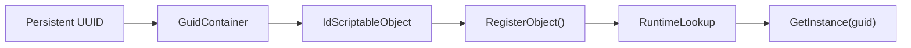

# Identity and registries

[Back to index](README.md)

## IdScriptableObject

Game entities derive from `IdScriptableObject`, which derives from Unity `ScriptableObject`.

Verified fields:

```csharp
static Dictionary<Guid, IdScriptableObject> RuntimeLookup;
GuidContainer guidContainer;
```

Verified lookup APIs:

```csharp
Guid GetGuid();
Guid GetId();
static IdScriptableObject GetInstance(Guid guid);
static T GetInstance<T>(Guid guid);
static List<IdScriptableObject> GetAllInstances();
```

The inspected IL for `GetInstance(Guid)` checks `RuntimeLookup` and returns the object for that UUID. The generic overload casts the stored object to `T`.

## Runtime lookup flow



## Why this matters for mods

The registry is a better integration surface than scene searches:

- It is stable across UI layouts.
- It avoids relying on Unity object names.
- It uses the same UUIDs present in saves.
- It supports typed lookup.

A runtime test should wait until game initialization has populated `RuntimeLookup`; calling it in the earliest part of plugin `Awake()` may return no object.

## Mapping identity rules

The current mapping contains 2,818 rows and 2,818 unique UUIDs across 141 managed types. It contains
only 2,777 unique internal names: 39 labels are reused, covering 80 rows. The current serialized scan
and its catalog delta are documented in the [progression mind map](progression-map.md).

Examples include `SpellDuration` across `DoubleVariable`, `ModifierListVariable`, and `ScalingWeightSO`, and `WorkshopStructures` across `StructureListVariable`, `StructureTypeSO`, and `ViewSO`.

Therefore:

- UUID is the primary identity.
- Runtime type is the validation boundary.
- Internal/display name is diagnostic metadata only.
- Configuration should store UUID plus an optional expected type and name.
- A failed type check should disable only that feature and log the mismatch; it should not fall back to a same-named object.

See [Entity catalog and taxonomy](entity-catalog.md) for mapping coverage and [Entity correlations](entity-correlations.md) for safe traversal between related assets.

## Related base classes

```text
UnityEngine.ScriptableObject
  └─ IdScriptableObject
      └─ TooltipableObject
          └─ UpgradeableObject
              └─ ResourceSO
```

`TooltipableObject` adds display name, description, icon, color and search terms. This means resource names are presentation data on the asset, while identity remains GUID-based.
