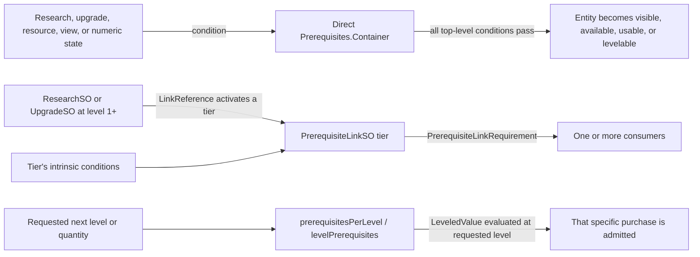
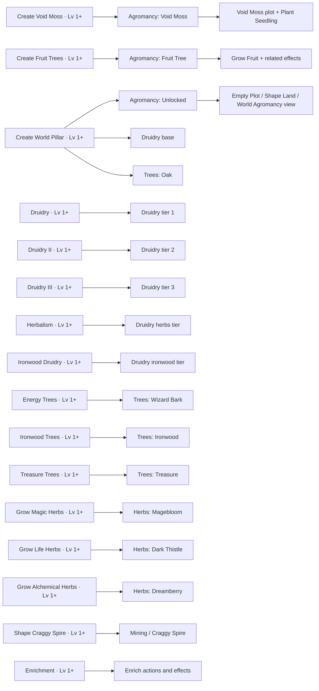
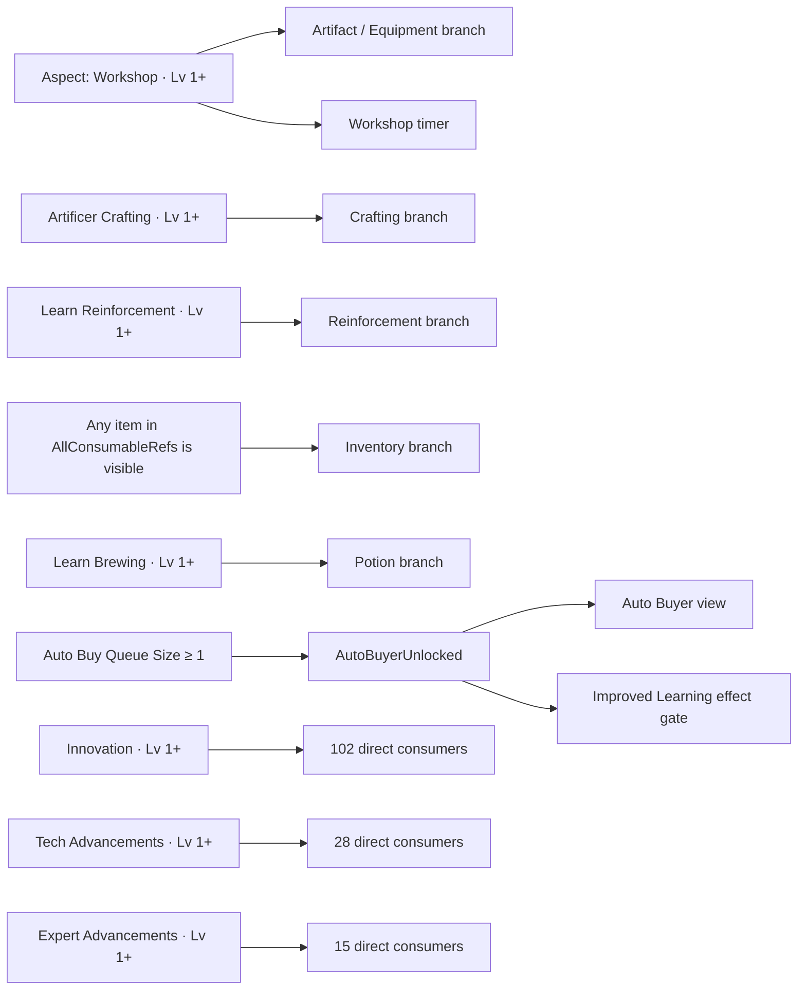
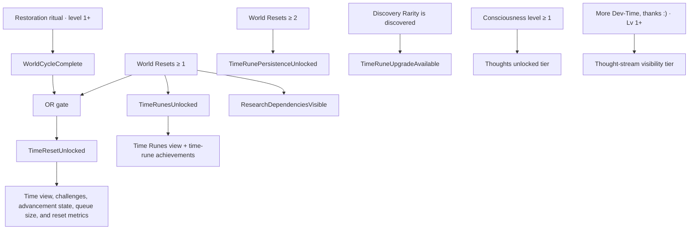
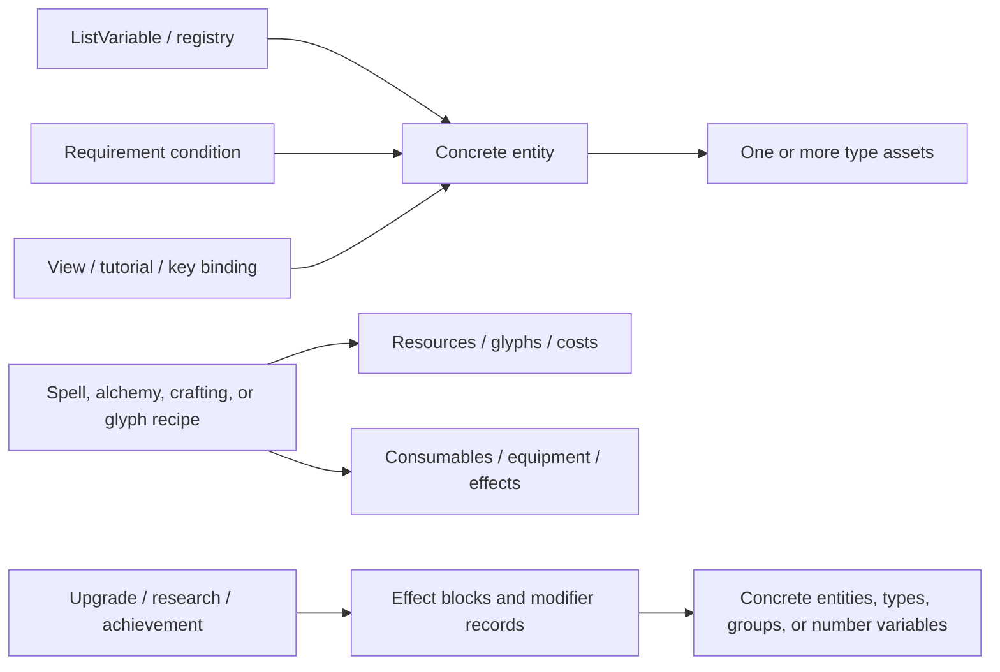

# Progression mind map

[Back to reverse-engineering notes](README.md) · [Entity correlations](entity-correlations.md)

This is the navigable progression map for the audited Windows Steam build of Orb of Creation
v1.0.5-2. It is generated from the game's serialized Unity assets, then interpreted against the
verified prerequisite code in `Assembly-CSharp.dll`.

The scan covers:

| Measure | Verified count |
|---|---:|
| Serialized entities | 2,818 |
| Managed entity types | 141 |
| Entity-to-entity references | 19,077 |
| Non-empty requirement containers | 1,804 |
| Reusable prerequisite links | 41 |

This page is the reviewed, deliberately compact result of the scan. The complete machine-readable
graph and exhaustive atlas can be reproduced locally with the checked-in tools, but are intentionally
not committed because they duplicate a substantial amount of authored game data.

## How an unlock actually works

There are three related mechanisms. They should not be collapsed into one generic arrow:



- A `Prerequisites.Container` is an **AND** across its top-level conditions. Nested
  `OrRequirement` and `AndRequirement` objects introduce explicit grouping.
- A prerequisite-link tier is enabled only when **all** bound owners are active and its intrinsic
  conditions pass. Most tiers have no bound owners and are purely condition-driven.
- `ScribeTiers/Base` is unusual: Echoing Scroll plus Scribism Scrolls II–V are all bound owners,
  so every one must be level 1+ in addition to the intrinsic Scribism requirement.
- `available` and `gameId` inside a serialized container are runtime cache fields, not authored
  progression truth. The graph intentionally records the conditions instead.

## Progression backbone

This map shows the major systems and the milestone that opens each reusable branch. “Lv 1+” means
the referenced research, upgrade, spell, ritual, or other levelled entity has at least one level.

```mermaid
flowchart TD
    WorldPillar["Create World Pillar · Lv 1+"] --> Agro["Agromancy unlocked"]
    WorldPillar --> DruidBase["Druidry base"]
    WorldPillar --> Oak["Tree tier: Oak"]

    Transmute["Learn Transmute · Lv 1+"] --> Alchemy["Alchemy"]
    CraftingResearch["Artificer Crafting · Lv 1+"] --> Crafting["Crafting"]
    WorkshopAspect["Aspect: Workshop · Lv 1+"] --> Artifacts["Artifacts / Equipment"]
    WorkshopAspect --> WorkshopTimer["Workshop timer"]
    Scholarism["Scholarism · Lv 1+"] --> Scholar["Scholar progression"]
    Innovation["Innovation · Lv 1+"] --> InnovationBranch["Innovation branch"]
    Tech["Tech Advancements · Lv 1+"] --> Technology["Technology branch"]
    Expert["Expert Advancements · Lv 1+"] --> ExpertBranch["Expert branch"]

    Dragon["Learn Dragon · Lv 1+"] --> Flame["Flameweaver branch"]
    StormSpell["Learn Storm · Lv 1+"] --> Storm["Storm branch"]
    Arcane["Arcane Glyph · Lv 1+"] --> Arcanist["Arcanist branch"]
    Principle["Principle Stone · Lv 1+"] --> Rituals["Rituals"]
    RunicResearch["Learn Runic · Lv 1+"] --> Runic["Runic capacity"]

    Restoration["Restoration ritual · level 1+"] --> WorldComplete["World cycle complete"]
    Reset1["World Resets ≥ 1"] --> TimeRunes["Time Runes"]
    Reset1 --> ResetOr["either condition"]
    WorldComplete --> ResetOr
    ResetOr --> ResetFeatures["Reset-gated features"]
```



These are gates, not a recommended play order. An entity can still have additional direct
visibility, usage, resource, or per-level requirements after its branch opens.

## World, agromancy, and druidry



## Magic, spells, and rituals

```mermaid
flowchart TD
    Wizardry["Wizardry · Lv 1+"] --> W1["Wizardry tier 1"]
    ImprovedWizardry["Improved Wizardry · Lv 1+"] --> W2["Wizardry tier 2"]
    AdvancedWizardry["Advanced Wizardry · Lv 1+"] --> W3["Wizardry tier 3"]
    W3 --> AuraCunning["Wizard's Aura + Cunning"]

    ArcaneGlyph["Arcane Glyph · Lv 1+"] --> A0["Arcanist base"]
    Arcanism["Arcanism · Lv 1+"] --> A1["Arcanist tier 1"]
    Arcanism2["Arcanism II · Lv 1+"] --> A2["Arcanist tier 2"]
    ArcaneElementia["Arcane Elementia · Lv 1+"] --> A3["Arcanist tier 3"]

    LearnDragon["Learn Dragon · Lv 1+"] --> F0["Flameweaver base"]
    Flame1["Flameweaver · Lv 1+"] --> F1["Flameweaver tier 1"]
    Flame2["Flameweaver II · Lv 1+"] --> F2["Flameweaver tier 2"]
    Flame3["Flameweaver III · Lv 1+"] --> F3["Flameweaver tier 3"]

    LearnStorm["Learn Storm · Lv 1+"] --> S0["Storm base"]
    Storm1["Stormshaper · Lv 1+"] --> S1["Storm tier 1"]
    Storm2["Stormshaper II · Lv 1+"] --> S2["Storm tier 2"]

    Principle["Principle Stone · Lv 1+"] --> Rituals["Ritual consumers"]
    RunicResearch["Learn Runic · Lv 1+"] --> Runic["Runic Capacity"]
    GlyphUpgrade["Upgrade Glyphs · Lv 1+"] --> GlyphUI["Glyph Upgrade view"]
```



The “base” Arcanist and Wizardry tiers currently have no direct serialized consumers. They still
exist as link definitions and may be used indirectly or by runtime presentation, so the extractor
retains them rather than pruning apparently empty nodes.

## Scholar, concepts, and alchemy

```mermaid
flowchart TD
    Scholarism["Scholarism · Lv 1+"] --> Sch0["Scholar base"]
    Novice["Novice Study · Lv 1+"] --> Sch1["Scholar tier 1"]
    Improved["Improved Study · Lv 1+"] --> Sch2["Scholar tier 2"]
    Advanced["Advanced Study · Lv 1+"] --> Sch3["Scholar tier 3"]
    Concepts1["Improved Concepts · Lv 1+"] --> Sch4["Scholar concept tier 1"]
    Concepts2["Dense Concepts · Lv 1+"] --> Sch5["Scholar concept tier 2"]
    Artificer["Scholarism, Artificer · Lv 1+"] --> Sch6["Scholar artificer tier"]

    Conceptualization["Conceptualization · Lv 1+"] --> C0["Concepts base"]
    C0 --> ConceptRecipes["39 concept recipes, views, and modifier targets"]
    ExpertScholar["Expert Scholar · level ≥ 1"] --> C1["Concept tier 1"]

    LearnTransmute["Learn Transmute · Lv 1+"] --> Alchemy["Alchemy loadout + research branch"]
    LearnBrewing["Learn Brewing · Lv 1+"] --> Potions["Potion branch"]
    DiscoverAmber["Discover Amber · Lv 1+"] --> Amber["Transmute Amber"]
    AlchemyAspect["Aspect: Alchemy Lab · Lv 1+"] --> AlchemyTimer["Alchemy timer"]
```



`ConceptTiers` tiers 2 and 3 contain null `UpgradeRequirement.item` references in the serialized
v1.0.5-2 assets. The graph marks them as unresolved instead of guessing that “World” and
“Artificer” in their tier labels identify the missing upgrades.

## Workshop, inventory, automation, and cross-system branches



The Auto Buyer entities are new in the current serialized scan and were absent from the older
2,792-row identity snapshot. Refreshing the catalog from this scan adds their stable UUIDs and
the rest of the v1.0.5-2 additions.

## Time and reset progression



## How entities connect beyond unlocks

The progression graph also retains every serialized reference between stable game entities. Those
references explain why a single visible object can participate in several systems at once:



| Relationship classification | Edges |
|---|---:|
| General references | 10,810 |
| Costs and usage | 3,542 |
| Type membership | 2,574 |
| Effects and modifiers | 887 |
| Recipes and glyphs | 818 |
| Resources | 311 |
| Views | 69 |
| Tutorials | 50 |
| Explicit progression references outside decoded requirement payloads | 16 |

The classification is a navigation aid based on the serialized field path. The exact path, source
UUID/type, and target UUID/type are preserved in the JSON graph.

## Evidence and limits

- **Serialized-asset verified:** entity UUIDs/types, exact field references, requirement kinds,
  operators, values, AND/OR grouping, link tiers, bound link owners, and direct consumers.
- **Statically verified:** container AND semantics; link-owner activation at level 1+; link owners
  combining with `All`; and per-level checks receiving the requested level or quantity.
- **Not a live-save claim:** current quantity, level, visibility, queue state, runtime registry
  membership, and cached `available` values still belong to the running game.
- **Not a balance guide:** resource costs and 19,077 structural references are present, but this
  map describes dependency topology rather than an optimal strategy.
- **Fail closed on broken data:** null targets, missing referenced objects, unknown requirement
  enums, and extraction failures must remain visible. The current scan has two authored null
  targets in `ConceptTiers` and zero entity deserialization failures.

## Refresh workflow

The extractor reads only the installed game and writes ignored local artifacts:

```powershell
python -m pip install UnityPy TypeTreeGeneratorAPI
python tools/extract-progression-graph.py `
  --game-dir "C:\path\to\Orb Of Creation" `
  --sync-entity-catalog
python tools/generate-progression-atlas.py
python tools/generate-progression-atlas.py --verify
```

Do not commit `data/progression-graph.json` or
`docs/reverse-engineering/progression-atlas.md`; both are listed in `.gitignore`.
Run the repository's normal audit and test gates before treating a graph from a new assembly pair
as current evidence. Never infer compatibility from asset readability or hashes alone.
