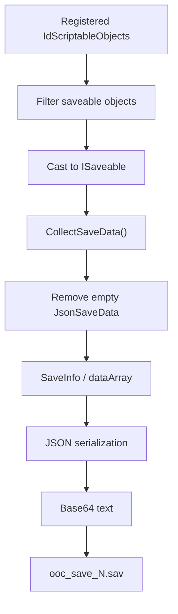

# Save system

[Back to index](README.md)

## Format

The save is Base64-encoded UTF-8 JSON. Its top-level `SaveInfo` model contains:

```csharp
int v;
List<List<JToken>> dataArray;
List<JsonSaveData> savedData;
double timePlayed;
string saveDate;
```

The observed save uses version `6`.

## Collection pipeline

The compiler-generated delegates in `SaveStateManager.CollectJsonData()` show this sequence:



`JsonSaveData` associates a `GuidContainer` with serialized object data. During load, `SaveStateManager.ImplementLoadedJson()` calls `IdScriptableObject.GetInstance(Guid)` and applies data to the registered runtime object.

## Resource persistence

`ResourceSO.CollectSaveData()` creates `ResourceSO.ResourceSaveData`. Its exact fields are documented in [Resources and BigDouble](resources-and-bigdouble.md).

Both resource load overloads deserialize `ResourceSaveData`, apply it to the `ResourceSO`, then call `ClearNans()`.

## File safety

`SaveStateManager` has explicit file and backup paths and an asynchronous `WriteFileAndBackupAsync` operation. Mods should prefer the game’s normal save pipeline rather than writing save files concurrently.

Practical rule: mutate runtime objects on the Unity/game thread and allow the game to save them normally.

