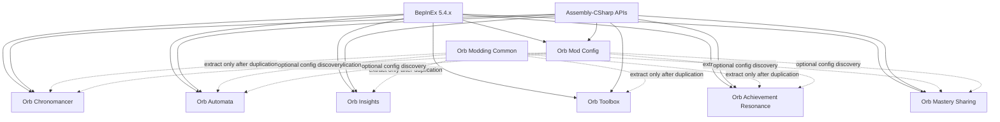

# Project roadmap

[Back to project index](../README.md) · [Reverse-engineering map](README.md)

## Product direction

The project will produce six focused gameplay BepInEx 5 plugins plus an optional in-game configuration UI:

1. **Orb Chronomancer** — controls simulation speed while keeping input and UI usable.
2. **Orb Automata** — automates repetitive progression decisions through configurable rules.
3. **Orb Insights** — extends existing tooltips into an inspection and explanation layer.
4. **Orb Toolbox** — provides explicit resource/debug operations and development safeguards.
5. **Orb Achievement Resonance** — extends Achievement Strength through the game's native persistent-effect pipeline.
6. **Orb Mastery Sharing** — shares a controlled portion of earned mastery/experience with unlocked, underused spells, artifacts, and alchemy entities.

**Orb Mod Config** is optional shared UI infrastructure that exposes loaded BepInEx configuration inside the game without becoming a dependency of the gameplay plugins.

The public positioning is: **reduce idle waiting and repetitive management while preserving meaningful progression decisions.** Cheats and resource editing may be useful as private development tools, but they are not the first public product.

## Design principles

- Opt-in actions and conservative defaults.
- Never mutate a save file directly during gameplay.
- Use normal game APIs whenever possible.
- Keep UI/input responsive at accelerated simulation speeds.
- Put a configurable action and CPU-time budget on automation.
- Make every automated decision explainable in logs or tooltips.
- Use third-party mods as design references without patching or depending on them.
- Support one owner for each automated action family; concurrent overlapping automation mods are unsupported.

## Dependency strategy

Do not create a shared library on day one. First prove both plugins independently. Extract only stable duplicated code such as keybind parsing, game-state detection, diagnostics, and status overlays.

## Milestones

The coordinated execution order for Chronomancer, Automata, and Achievement Resonance is defined in [Three-mod iteration plan](three-mod-iteration-plan.md). Its pre-worktree discovery gate takes precedence over beginning the older phase list in parallel.

### Phase 0 — Development foundation

- Create a `netstandard2.1` BepInEx 5 solution.
- Reference game assemblies without copying them into release output.
- Add structured logging and a build-to-staging workflow.
- Detect `Start` and `Main` scenes.
- Verify load/unload and configuration generation.

Exit criterion: a minimal plugin loads with no BepInEx errors and survives scene changes.

### Phase 1 — Timing probe

- Record `Time.deltaTime`, `fixedDeltaTime`, `unscaledDeltaTime`, and game phase.
- Trace `GameManager.FixedUpdate`, manager updates, increment loops, and representative timers.
- Classify subsystems as scaled, fixed, or unscaled.
- Test `Time.timeScale` at 0.5×, 2×, and 8× without shipping it yet.

Exit criterion: a timing matrix identifies the correct speed-control surface and known exceptions.

### Phase 2 — Orb Chronomancer MVP

- Implement 1×/2×/4×/8× presets, reset, and visible status.
- Add scene and save safety.
- Test independently with only the intended plugin set installed.
- Package a release with configuration documentation.

Exit criterion: all critical test scenarios pass at 1×, 2×, 4×, and 8×.

### Phase 3 — Automation foundation

- Implement rule evaluation, reserves, priorities, dry-run mode, and action budgets.
- Add a decision log explaining why actions were or were not taken.
- Preserve the auto-research source as an archived diagnostic prototype without constructing it at runtime, then ship Auto Buy as the first product vertical slice.

Exit criterion: Auto Buy runs for an extended session without overspending reserved resources or blocking manual play in a supported single-buyer installation.

### Phase 4 — Orb Automata modules

- Add Auto Cast, Auto Concept, and Auto Harvest in that order.
- Add crafting, scribing, ordinary alchemy, and optional research automation afterward.
- Reuse the same rule engine and diagnostics.
- Add enhanced tooltips explaining automation state.

### Phase 4a — Orb Insights

- Extend native resource tooltips with exact values and UUIDs.
- Add contextual extensions for research, structures, spells, and alchemy.
- Let Automata contribute decision explanations without creating a hard dependency.
- Provide a diagnostic mode for mod development.

Exit criterion: extensions preserve native tooltip content and degrade safely when a target type is unsupported.

### Phase 4b — Orb Toolbox

- Add searchable resource selection and explicit add/set/multiply operations.
- Add dry-run previews, audit logging, and optional save snapshots.
- Keep unsafe operations behind an advanced confirmation gate.

Exit criterion: supported actions change only the selected runtime objects, survive normal save/load, and are recoverable through documented backups.

### Phase 4c — Orb Achievement Resonance

- Probe the native Achievement Strength effect blocks and attribute-group membership.
- Add a speed proof of concept using `GlobalSpeedGroup`.
- Add domain power bonuses and carefully curated beneficial scaling targets.
- Reuse native tooltips and Achievement Strength recalculation.

Exit criterion: bonuses update immediately when achievements change, never duplicate across loads, and do not alter achievement save data.

### Phase 4d — Orb Mastery Sharing

- Audit native XP gain, mastery, level-up, active-state, and save ownership for spells, artifacts, and alchemy.
- Build a logging-only event probe before changing progression.
- Add same-domain catch-up sharing one vertical slice at a time: spells, artifacts, then alchemy.
- Use native XP paths, stable UUID eligibility, recursion suppression, deterministic distribution, and strict per-event caps.
- Support bonus and total-preserving split modes with dry-run and emergency-disable safeguards.

See [Orb Mastery Sharing plan](mastery-sharing-plan.md) for balance defaults, domain questions, delivery stages, and verification requirements.

Exit criterion: eligible underused entities receive exactly the configured XP through native progression behavior, grants never recurse, and saves remain stable across extended sessions and plugin removal.

### Phase 5 — In-game mod configuration UI

- Add a Mods button after Time in the main navigation.
- Open a standalone, mod-owned Unity panel rather than extending native content panels.
- Discover loaded BepInEx configurations without requiring participating mods to depend on the UI plugin.
- Group settings by mod and config section and provide type-appropriate, validated editors.
- Preserve `.cfg` files as the source of truth with staged Apply/Revert behavior and honest live/restart status.
- Keep the panel usable with unscaled time, keyboard/controller navigation, scene changes, and other UI mods.

See [In-game mod configuration UI plan](mod-config-ui-plan.md) for architecture, delivery stages, risks, and acceptance criteria.

Exit criterion: the suite's supported configuration types round-trip safely in game, the compatibility matrix passes, and removing the UI plugin leaves every mod configurable through its normal `.cfg` file.

### Phase 6 — Shared library and public ecosystem

- Extract genuinely shared infrastructure.
- Publish stable configuration and compatibility contracts.
- Document extension points for future modules.

## Immediate next task

Complete P0/P1 from the [Three-mod iteration plan](three-mod-iteration-plan.md), then build the unified runtime probe before creating feature worktrees.
