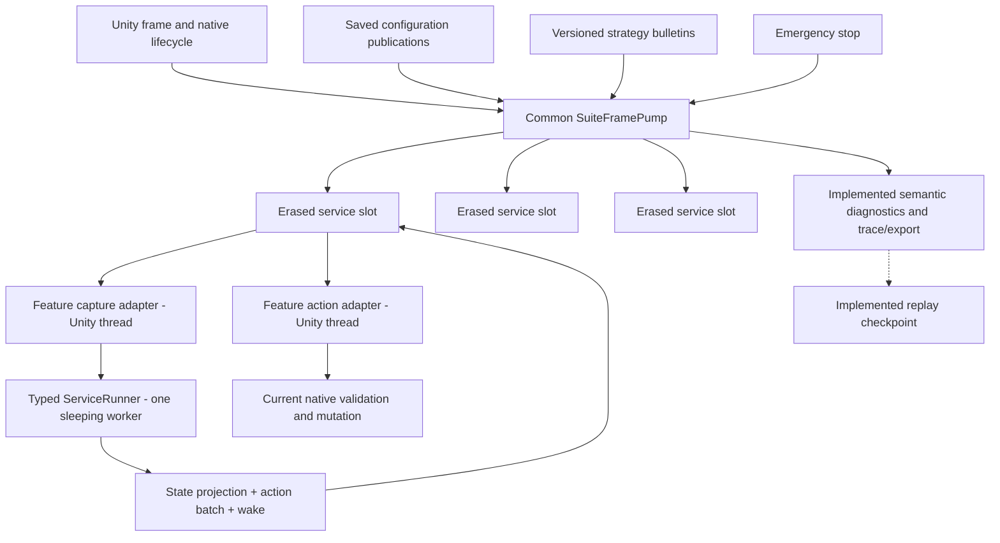
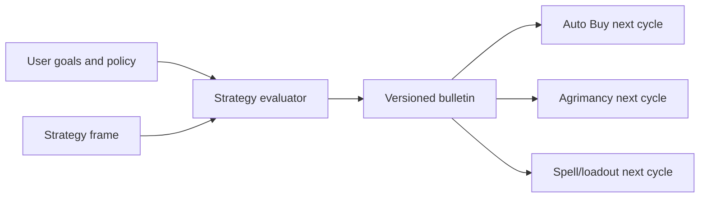

# North-star runtime architecture

> **Lifecycle: Accepted production foundation / live slice passed / observation products implemented.**
> Common ServiceCycle is the sole production Auto Harvest executor. The architecture is aggregate-reviewed,
> the fruit/treasure slice passed in the game, and the separately owned full-trace, decision-journal, and
> performance-profile products passed their portable gates. Release remains separate.

[Back to dossier](README.md) | [Service-cycle runtime](service-cycle-runtime.md) | [Goals and invariants](goals-and-invariants.md)

## System shape



The architecture has four dependency layers:

1. **Common contracts and orchestration** define service identities, context versions, runners, frame pump, action outcomes, wake policies, lifecycle, emergency control, diagnostics transport, and telemetry.
2. **Feature services** define typed frames/configuration/state/actions, pure evaluation, and semantic state projection.
3. **Feature native adapters** capture and execute on the Unity main thread through audited game contracts.
4. **Strategy services** publish high-level immutable bulletins consumed as next-cycle inputs.

The logical boundaries do not depend on DLL packaging. Common never imports feature implementations.

Auto Harvest's lifecycle-bound binding resolver is one cache-coherence owner with separate shared-contract
and pair-contract source responsibilities. One pair-set resolution admits both pair circuits, refreshes the
shared active-list/scaling binding once, resolves each unblocked pair independently, then performs one
whole-set lifecycle-coherence check. It does not repeat the shared pass for each pair or introduce per-pair
resolver objects.

The feature's native state reader keeps shared active-action traversal separate from pair fact/prototype
capture while using one adapter instance and one profile-operation source. Pair fact capture validates the
available-action list's native type closure and exact target membership in one pass; it does not rescan an
unchanged list before projecting immutable facts.

## Common module structure

The target Common source is intentionally small and cohesive:

```text
Runtime/ServiceCycle/
  Contracts/       phases, identities, contexts, outcomes, wake policies
  Configuration/   immutable saved-config and strategy publications
  Execution/       feature ports, validation, runner handoff, worker, storage
  Registration/    deterministic erased-slot composition and sealing
  Orchestration/   SuiteFramePump and lifecycle/emergency control
  Diagnostics/     neutral snapshots and state-projection transport
  Tracing/         semantic schema, bounded capture, schema-v5 codec, graph validation
    Emission/      causal writer plus context, cycle, admission, evaluation, and batch emitters
    Export/        opt-in snapshot admission and background persistence
  Observation/     mode-specific full trace, compact journal, and compile-time profile composition
  Replay/
    Contracts/     implemented detached-record rules, codecs/comparers, stable outcomes
    Recording/     implemented bounded sidecar and coherent fences
    Format/        implemented strict container, join, decoder, exporter
    Execution/     implemented detached oracle and constrained production driver
```

Exact filenames may change, but dependency direction may not. The pump does not become a god class: registration, runner handoff, reusable action storage, diagnostics, tracing, and lifecycle replacement remain separate components. Runtime-to-trace translation is split across context, cycle, admission/capture, evaluation/state, and batch responsibilities; the public recorder is a stable facade, while only the causal writer owns append heads and delayed-operation anchors. The fixed numeric payload is organized by semantic family without introducing runtime payload builders. The snapshot exporter remains one synchronization object whose admission, worker, storage, and lifetime source boundaries share the same two slots and wake handle.

The post-cutover observation products do not share one mutable recorder or writer. Full trace, decision
journal, and performance profile each own independent reusable-block lanes, a sleeping writer, format,
status, and failure lifecycle. A lane is single-producer; products with owner- and worker-thread facts merge
separate lanes only on their background writer. They reuse only format-neutral block-transport and
atomic-storage mechanics. Profiling probes are omitted from ordinary builds at compile time.

## Typed feature definition

Conceptually, a feature supplies a main-thread definition that creates a distinct worker-only definition:

```csharp
IServiceCycleDefinition<TFrame, TConfig, TState, TAction>
IServiceCycleWorkerDefinition<TFrame, TConfig, TState, TAction>
```

The objects and responsibilities are separated by thread:

```csharp
// Main-thread definition: identity, policy, capture, and native execution.
TFrame CreateFrame();
IServiceCycleWorkerDefinition<TFrame, TConfig, TState, TAction>
    CreateWorkerDefinition();

ServiceStartDecision ShouldStart(
    in TConfig config,
    in ServiceCycleStartContext context);
ServiceCaptureResult Capture(
    ref TFrame frame,
    in TConfig config,
    in ServiceCaptureContext context);
ServiceActionResult TryExecute(
    in TAction action,
    in TConfig config,
    in ServiceActionContext context);

// Distinct worker-only definition: state, evaluation, and projection.
TState CreateState(LifecycleGeneration lifecycle);
void ReleaseState(ref TState state);
void ReleaseFrame(ref TFrame frame);
WakePolicy Evaluate(
    in TFrame frame,
    in TConfig config,
    in ServiceCycleContext context,
    ref TState state,
    ServiceActionWriter<TAction> actions);
void ProjectState(
    in TState state,
    in ServiceProjectionContext context,
    ServiceStateProjectionBuilder output);
```

Common rejects a worker definition that is the main definition or retains main/native adapters, delegates, opaque framework objects, or mutable Common runtime owners. This is a fail-closed structural boundary; feature-specific code review still verifies the absence of ambient static side channels.

The public runner remains the requested four-generic shape:

```csharp
ServiceRunner<TFrame, TConfig, TState, TAction>
```

Common may provide a separately typed `ServiceStrategyPublisher<TStrategy>`, but `TStrategy` is not hidden in the four-generic runner or erased as `object`. The feature capture adapter owns that publisher, atomically reads the latest immutable bulletin, copies only the relevant strategy facts into `TFrame`, and returns the exact `StrategyGeneration` used in `ServiceCaptureResult`. The evaluator therefore receives strategy as captured frame data plus its generation in `ServiceCycleContext`. Diagnostics use a bounded Common projection builder rather than another hidden generic payload. The pump type-erases whole service slots, not individual values, and there are no `object` action/configuration/strategy casts in the hot path.

`TFrame` and `TState` may be reference types for reusable storage. `TConfig`, captured strategy facts, actions, and diagnostics are reviewed neutral snapshots. C# 10 cannot enforce deep immutability; structural tests and narrow ownership APIs close that gap.

## Registration and composition

Composition is explicit:

```text
SuiteFramePump
  -> Register Auto Harvest definition and adapters
  -> Register future Auto Buy definition and adapters
  -> Register future Agrimancy definition and adapters
```

Registration:

- rejects duplicate service IDs and capacity overflow;
- records stable immutable ordinals and seals composition before pumping;
- creates the typed runner, sleeping worker, reusable frame/action/projection storage, and configuration publication; the worker creates lifecycle state lazily so factory faults enter the same debounced recovery circuit;
- returns a typed configuration-publication handle; separately typed strategy publishers are feature dependencies whose generation is reported by capture;
- provides an erased `IServiceCycleSlot` to the pump;
- is transactional and releases earlier resources if construction fails.

Each registered service has exactly two physical runner positions for current/retiring lifecycle ownership. A position is reused only after the worker has cleared/released resources, disposed its wake handle, actually terminated, and the owner has published `Stopped` without joining. Construction faults retain the newest desired lifecycle behind monotonic bounded backoff and may attempt only once per accepted-frame reconciliation epoch. The shared typed configuration publisher is slot-owned, while every runner resource is generation-fresh and one preallocated registry-wide identity ledger rejects live worker-definition, frame, or state aliases across every role, service, and generation. Every external reference factory first reserves an exact slot and acquires one ledger-wide token by single CAS; busy admission fails immediately before feature code and follows a separate 16–1000 ms contention backoff. The token owner runs finite feature code outside locks, requires the returned candidate to remain valid through immediate finalization, and performs one definitive bounded identity scan. Claims remain identity-visible through cleanup callbacks, then retire for exact removal. Token close transitions `Open` to `Closing`, sweeps retired claims while the global token remains installed, and exact-clears it last, preventing ABA, stale-sweep overlap, and the release-versus-factory race. Factory callbacks must not synchronously depend on another reference factory succeeding.

The pump owns a fixed registered slot array. No service scans assemblies or reaches through a global service locator.

## Runner ownership

Each runner owns:

```text
one reusable TFrame
one lifecycle-scoped TState
one grow-only reusable TAction buffer
one response/state-projection store
one named sleeping worker thread
one short synchronization gate
one cycle/batch cursor
one wake and fault-retry state
```

An internal phase machine provides ownership and publication fences:

```text
Empty -> RequestReady -> Evaluating -> ResponseReady
      -> MainOwnedBatch -> Empty
      -> Stopping -> Stopped
```

Unity writes the frame (including captured strategy facts), pinned configuration, and cycle context, then publishes `RequestReady` under the gate. The worker observes it, owns the stores, and evaluates outside the gate. It publishes `ResponseReady` under the same gate. Unity then owns the response and batch until terminal.

The implementation uses `Thread`, `Monitor`/events, arrays, and ordinary C# 10 generics available to `netstandard2.1`. It does not add Channels, an async runtime, or a custom lock-free protocol. Worker-side locks protect only phase transitions and are never held while feature/native code runs. The Unity pump uses only zero-time gate probes; captured request publication and terminal ownership return remain pending when contended, then retry on a later frame without repeating feature work. Worker sleep/wake and shutdown use an event, and Unity never joins a worker.

## Per-frame orchestration

The pump is called once per Unity frame and rejects or ignores duplicate frame identities. It records its creating thread and asserts Unity-thread affinity for every mutating operation.

For each frame:

1. Reconcile lifecycle, enablement, emergency stop, and retiring runners.
2. Scan slots for worker responses and acquire them without blocking.
3. Publish successful state projections and install returned action batches.
4. Reject all current or late-arriving batches if emergency stop is active.
5. Scan slots from the rotating start index; attempt at most one action for each active service.
6. Finalize batch completion, first rejection/fault suffix abortion, or lifecycle orphaning.
7. Evaluate wake policies for empty current runners.
8. Capture each eligible service at most once and signal its worker.
9. Publish common timing and causal evidence.

A service performs at most one meaningful phase transition per pump call where doing more would collapse deterministic frame boundaries. A response need not execute an action in the same frame, and a terminal batch need not recapture immediately.

There is no cross-service priority scheduler or global action slot. Stable registration order plus a rotating start gives deterministic fairness. Each service receives one bounded meaningful-transition opportunity per frame; internal zero-wait probes do not create additional service work. The pump measures total main-thread duration but initially imposes no additional time gate.

## Definition catalogs and frames

Lifecycle catalogs enumerate finite definitions after registries are ready. Each definition retains:

- stable UUID;
- expected native type;
- diagnostic name;
- dense suite-local handle;
- verified static relationships and provenance.

Hot paths index dense arrays by handle. Native boundaries continue resolving UUID plus expected type.

Frames contain changing values only:

- resource quantities, rates, capacities, and relevant costs;
- levels, availability, completion, and queue state;
- active agriculture state and remaining durations;
- slots, loadouts, or current goals required by the feature.

The capture adapter fills the service's reusable frame on Unity. The worker receives read-only access. There is no ordinary view broker or lease pool because a strict cycle never overlaps one service's capture and evaluation.

## Cycle context

At capture, the slot snapshots:

```text
LifecycleGeneration
ConfigGeneration + immutable TConfig
StrategyGeneration + relevant immutable strategy facts copied into TFrame
CaptureSequence
CycleId
previous BatchReceipt
monotonic decision time
explicit game/wall time values if policy needs them
```

These values remain pinned until that cycle terminates. New configuration publication replaces only the slot's latest prospective `TConfig`; new strategy publication replaces only the separately typed publisher snapshot that a later capture may read. Neither mutates nor invalidates the active context.

The next empty cycle uses the latest publications. This creates simple transactional semantics: Save publishes, current work finishes, next work observes the latest complete snapshot.

## Worker evaluation and state

Evaluation is synchronous and Unity-free. It may:

- read frame (including captured strategy facts), configuration, previous receipt, and explicit time/random inputs;
- mutate its private `TState`;
- append typed actions to its private reusable writer;
- create a small immutable semantic diagnostics projection.

It may not:

- call Unity, reflection adapters, registries, native APIs, or I/O;
- block on another service or a main-thread callback;
- retain frame/configuration aliases outside the cycle;
- reach shared mutable planner state;
- use unrecorded ambient inputs for behavior.

Per-service random state is valid when explicit and replayable. A shared order-dependent RNG is not.

The live mutable state object is never published. The worker projects through `ServiceStateProjectionBuilder` into a bounded Common-owned immutable snapshot; Unity publishes it after acquiring the response. Rich arrays require a bounded feature-owned copy rather than retaining worker storage.

The worker treats action-store reset, evaluation, state projection, response validation, and synchronized response publication as one failure-atomic gameplay transaction. Any exception in those stages before `ResponseReady` clears written references and count, publishes no actions/state/wake result, and replaces potentially mutated state before a debounced retry. State recreation faults use the same circuit and cannot spin.

The ordinary runner exposes no replay callback. Replay is added only through a separate opt-in replayable registration whose feature adapter produces detached, recursively value-only readonly cycle-input, state, and action records as explicit outputs of the same feature path whether capture retention is enabled or disabled. Gameplay action append succeeds before its detached record is encoded. Codecs receive only record value copies, never live frame/state/action storage. Common can therefore isolate codec/storage failure; feature parity tests establish that record production is noninterfering and semantically complete. Enabled encoding may add bounded measured worker latency, but performs no Unity work or I/O.

## Reusable action storage

The runner's action store is a checked geometrically growing array:

- starts empty;
- grows only when the service returns a larger finite batch;
- never truncates due to a suite policy cap;
- retains capacity for reuse within the runner lifecycle;
- clears used reference-bearing entries when terminal;
- exposes count, cursor, capacity, and high-water bytes to diagnostics.

Common does not allocate a global action message per proposal. The main thread owns the whole ready batch and advances a cursor.

There is no universal Common count cap. Each feature must document why evaluation terminates with a finite batch from its captured domain. Growth uses checked arithmetic; an impossible capacity or allocation failure faults before response publication rather than exposing a partial batch. Diagnostics include current and retiring retained capacity.

## Action dispatch

For each service and Unity frame:

1. select the next action once;
2. re-resolve stable native identity;
3. check current lifecycle, native availability/completion/resources/queue/ownership, and apply the cycle-pinned affordability, reserve, and strategy policy;
4. invoke through the audited adapter;
5. capture current postcondition evidence;
6. produce one exact typed result.

`Committed` advances. `Rejected` or `Faulted` terminates the batch, clears the untouched suffix, and publishes a receipt. The pump continues to later services in the same frame.

No `Deferred` state exists. Queue-full or unavailable work is a rejection of the current stale proposal. A future cycle may produce a new batch.

## Emergency control

`SetEmergencyStop(true)` immediately changes Common control state:

- the action pass makes no native calls;
- main-owned batches abort with `Rejected(EmergencyStop)` and a suffix count;
- evaluating runners retain their worker state and, on return, publish valid state projection/wake evidence while every returned action is rejected without native execution;
- new captures pause;
- latest configuration and strategy remain available for the eventual next cycle.

Clearing emergency stop waits for safe frame ownership, then allows fresh cycles. It never resumes a rejected batch.

## Lifecycle and runner replacement

A lifecycle transition cannot reset a frame or state currently owned by a worker. The slot therefore retires ownership by generation:

- current main-owned batches and captures become terminal without native calls;
- an evaluating runner is marked orphaned and exits after returning;
- a fresh runner/frame/thread/factory-created state may begin the new generation when the live-runner bound permits;
- late old results publish only orphan evidence.

Each service slot has exactly two physical runner positions. Normally one is current and at most one is retiring; during a lifecycle storm both may be retiring and the service has no current runner. No third runner is created. Later transitions coalesce to the newest requested generation. A stale runner enters `Stopping`, clears worker-owned references, completes state/frame release, and disposes its wake handle; the owner polls actual thread termination and only then publishes `Stopped` and reuses the position. Unity never joins or waits. Retirement preserves any already-authoritative receipt, including a zero-action `Completed` receipt, while later thread exit is cleanup evidence. This hard bound does not require cancellation or preemption, and a stuck service does not stop sibling slots from progressing.

## Fault recovery

Three failure boundaries remain separate:

- **Capture fault** on Unity: return ownership, publish typed evidence, and schedule a monotonic retry.
- **Evaluation fault** on worker: catch at loop boundary, publish no actions/state, safely recreate state, keep the thread alive, and enter retry backoff.
- **Action fault** on Unity: terminate the current batch, preserve exact native evidence, and allow a future fresh cycle after policy-selected retry timing.

Fault episodes are keyed by stable codes, counted, debounced, and rate-limited. Exception text and paths stay in local diagnostic logging only where safe; exported/common evidence uses reviewed categories. A successful cycle closes its episode.

## Strategy control plane

The strategist is another explicitly registered service or a future specialized service. It consumes reviewed frames and publishes immutable bulletins rather than native actions.



Bulletins may contain resource targets, reserves, spend ceilings, embargoes, pauses, priorities, horizons, provenance, and explanations. Domain services translate them into local legal actions. Absent or late strategy falls back to service configuration.

Strategy publication uses the same next-cycle rule as configuration. It never reaches into current state or aborts a draining batch.

## Diagnostics and UI

Common publishes a neutral snapshot per service:

- `Idle`, `Capturing`, `Evaluating`, `DrainingBatch`, `RetryBackoff`, `EmergencyStopped`, `Disabled`, `Faulted`, or `Orphaned`;
- current cycle and pinned context identities;
- latest config/strategy versions and whether they await the next cycle;
- evaluation duration and age;
- action count, cursor, committed count, and suffix-abort count;
- wake anchor, due time, and lateness;
- last decision/native outcome;
- fault count and next retry time;
- lifecycle and retiring-runner facts.

Feature projectors add bounded semantic details. Orb Mod Config renders the production implementation and
capability health on its dedicated Runtime page; it does not carry the deleted kernel-cycle model. It never
reads worker state or native objects and never synthesizes fake configuration entries.

## Semantic trace and replay

Common retains the bounded causal ring, opt-in disk writer, atomic segment publication, and corruption defenses from the merged prototype. It replaces kernel/process events with one append-only service-cycle schema.

Schema-v5 trace header metadata includes `ServiceCapacity`. Implemented events include the configuration and strategy generations consumed by a cycle, lifecycle/emergency transitions, explicit cycle-start and capture-admission evidence, concrete resolved wakes, cycle/capture/evaluation/state/batch/action/fault/terminal events, and every accepted pump summary. Otherwise idle pumps remain in the stream so replay preserves their fairness rotation; they still perform no rich formatting or disk I/O. Lateness-, drop-, and fault-triggered summaries and opt-in profiling samples remain planned measurement extensions. Every emitted event carries causal parent and context identities.

The first action rejection emits one action result and one batch-abort summary containing the untouched suffix count. Emergency rejection of an arriving whole batch similarly avoids per-action live-event spam.

Replay requires exact typed inputs. Contracts, registration/recording, canonical container/decoder, detached
evaluator oracle, and production-shaped registry/pump execution exist. Each feature codec serializes only
reviewed detached records and never observes live mutable gameplay objects. Parent-graph validation remains
useful but is not called replay by itself.

Production replay intentionally accepts less than the detached oracle. Its participants must cover the full
contiguous registered topology represented by the artifact's `ServiceCapacity` header and each slot must
have at least one detached cycle for initial configuration hydration. Configuration publications must be
gap-free from generation one, and the shared initial lifecycle comes from consistent pre-cycle
`LifecycleActivated` evidence rather than the first cycle. Sparse and zero-cycle artifacts are
detached-oracle-only.

The driver uses lifecycle-unique clock scripts, retains every accepted pump's fairness rotation, waits for
worker readiness by complete cycle identity rather than global footer order, and rejects a
`CaptureCompleted -> CycleQueued` handoff split across pumps. It independently checks reconstructible
action/capture phase totals and the overall pump-phase sum before pumping. Lifecycle-construction evidence
fails in callback-free preflight; callback-issued lifecycle, emergency, configuration, and
non-capture-derived external strategy mutations fail later before pumping, while capture-derived strategy
publication remains supported evidence. Containable production construction, callback, adapter, comparison,
and cleanup exceptions become stable failures and preserve the primary failing phase;
`StackOverflowException`, `OutOfMemoryException`, and `AccessViolationException` escape containment.

Trace backpressure never changes gameplay. For an opt-in replayable service, the feature pairs each gameplay action with a detached action record and the worker-side writer incrementally encodes that record into a separate bounded byte buffer. It never scans/copies the returned batch on Unity or retains gameplay storage for I/O. A dropped or exhausted required payload marks capture incomplete, stops further replay encoding, and makes replay fail before evaluator comparison. Large batches continue into gameplay without a Common action cap. Ordinary services create no replay records and execute no replay branch.

After registration and capacity warm-up, the idle pump, waiting scan, response handoff, in-capacity action append/drain, terminal receipt, and fixed-size semantic event paths allocate zero managed bytes. Type erasure cannot box generic values. Named frame/action/diagnostic/trace growth is observable; strings and rich arrays belong only to rate-limited UI/export projection.

## Migration boundary

The completed migration sequence was:

1. add Common service-cycle source and portable tests;
2. build Auto Harvest adapters over its hardened typed native boundary;
3. compare old and new deterministic behavior without composing both in the game;
4. atomically switch Plugin/composition to the Common pump and runner;
5. remove the old Auto Harvest process/driver;
6. remove obsolete Host, Lanes, Process, scheduler/kernel, live-view broker, trace vocabulary, and legacy-only tests;
7. verify no selector, fallback, or hidden alternate runtime remains.

The new Common code must not reference `SuiteRuntimeHost`, `SuiteProcessRuntime`, `RuntimeLaneSet`, `DeterministicRuntimeKernel`, `DemandPulledLiveView`, `LiveViewBufferPool`, shared scheduling descriptors, incumbents, or checkpoints.

## Initial policy versus measurement

Accepted initial policy:

- one sleeping worker per enabled service;
- one frame/response store per current runner;
- one batch per service with no item-count cap;
- one action attempt per active service per Unity frame;
- one rotating service pass and no extra time gate;
- one complete capture per eligible service where measured practical;
- first rejection/fault aborts the suffix;
- current-cycle context never changes;
- emergency and lifecycle are immediate Common controls.

Measurement may later tune capture splitting, buffer retention, fault backoff, multiple action rounds, or a main-thread start gate. Those changes do not alter the half-duplex service contract.
