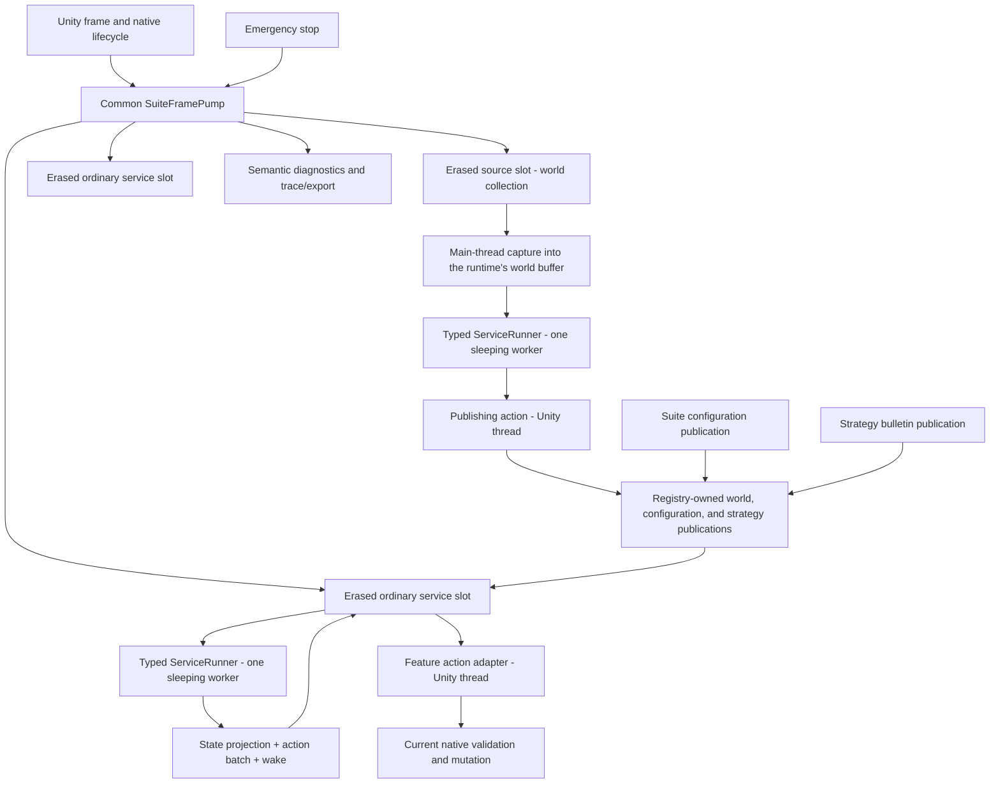
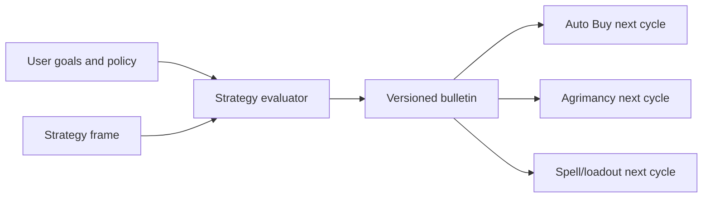

# North-star runtime architecture

> **Lifecycle: Accepted production foundation.** Component boundaries and data flow for the composed
> ServiceCycle runtime and its observation products. Execution, scheduling, and lifecycle mechanics are
> [service-cycle-runtime.md](service-cycle-runtime.md)'s; this document is where the pieces sit.

[Back to dossier](README.md) | [Service-cycle runtime](service-cycle-runtime.md) | [Goals and invariants](goals-and-invariants.md)

## System shape



The architecture has four dependency layers:

1. **Common contracts and orchestration** define service identities, context versions, runners, frame pump, action outcomes, wake policies, lifecycle, emergency control, diagnostics transport, and telemetry.
2. **Feature services** define typed state and actions, pure evaluation, and semantic state projection.
3. **Feature native adapters** execute actions on the Unity main thread through audited game contracts, and — for the one service that reads the game — capture there too.
4. **Strategy services** publish high-level immutable bulletins consumed as next-cycle inputs.

The logical boundaries do not depend on DLL packaging. Common never imports feature implementations.

A feature's native side owns its own cache coherence. Auto Harvest's lifecycle-bound resolver admits
both pair circuits from one pair-set resolution, refreshes the shared binding once, resolves each
unblocked pair independently, then performs one whole-set coherence check — it does not repeat the
shared pass per pair, and its state reader validates the available-action list's type closure and
target membership in the same traversal that projects the facts.

## Common module structure

The target Common source is intentionally small and cohesive:

```text
Runtime/ServiceCycle/
  Contracts/       phases, identities, contexts, outcomes, wake policies
  Configuration/   immutable saved-config and strategy publications
  Execution/       feature ports, validation, runner handoff, worker, storage
  Registration/    deterministic erased-slot composition and sealing
  Orchestration/   SuiteFramePump and lifecycle/emergency control
  Diagnostics/     neutral snapshots and state-projection transport
  Tracing/         semantic schema, bounded capture, schema-v7 codec, graph validation
    Emission/      causal writer plus context, cycle, admission, evaluation, and batch emitters
  Observation/     mode-specific full trace, compact journal, and compile-time profile composition
```

Exact filenames may change, but dependency direction may not. The pump does not become a god class:
registration, runner handoff, reusable action storage, diagnostics, tracing, and lifecycle replacement
remain separate components. Runtime-to-trace translation is split across context, cycle,
admission/capture, evaluation/state, and batch responsibilities; the public recorder is a stable
facade, while only the causal writer owns append heads and delayed-operation anchors.

The observation products do not share one mutable recorder or writer — each owns its lanes, sleeping
writer, format, status, and failure lifecycle, and they reuse only format-neutral block transport and
atomic storage. [Observability](observability.md) specifies them.

## The two service shapes

A feature supplies a main-thread definition that hands back a distinct worker-only definition. There are exactly two shapes of service, and no third:

```csharp
IServiceCycleDefinition<TState, TAction>        // ordinary: consumes the published world
IServiceCycleSourceDefinition<TState, TAction>  // source: reads the game and publishes it
```

They are siblings rather than one extending the other. What they share is the main-thread half, `IServiceCycleMainThreadDefinition<TAction>` — identity, policy, and native execution:

```csharp
ServiceId ServiceId { get; }
WakePolicy DefaultWakePolicy { get; }
ServiceFaultRecoveryPolicy FaultRecoveryPolicy { get; }

ServiceStartDecision ShouldStart(
    in SuiteRuntimeConfiguration config,
    in ServiceCycleStartContext context);
ServiceActionResult TryExecute(
    in TAction action,
    in SuiteRuntimeConfiguration config,
    in ServiceActionContext context);
```

What they do not share is the worker they hand back, because the two evaluations read different things and take different arguments. Naming the worker in a common base would force one shape to return a contract it cannot honour. Both worker contracts do share the state half:

```csharp
TState CreateState(LifecycleGeneration lifecycle);
void ReleaseState(ref TState state);
void ProjectState(
    in TState state,
    in ServiceProjectionContext context,
    ServiceStateProjectionBuilder output);
```

An **ordinary** service has no capture stage at all. Its worker is handed the three publications the runtime pinned for the cycle:

```csharp
IServiceCycleWorkerDefinition<TState, TAction> CreateWorkerDefinition();

WakePolicy Evaluate(
    in SuiteRuntimeConfiguration config,
    GameWorldState world,
    SuiteStrategy strategy,
    in ServiceCycleContext context,
    ref TState state,
    ServiceActionWriter<TAction> actions);
```

There is nothing an ordinary service could read on the main thread that the shared world does not already say, and a main-thread read costs frame time to learn it twice. Projecting the world and deciding from the projection are one step: they run on the same thread, back to back, against the same pinned snapshot, and nothing between them can observe the projection. A service that needs a buffer keeps it in its state, whose arrays survive the lifecycle; a service that does not projects into a local.

A **source** service is the one that produces the world rather than consuming it, and is the only shape with a main-thread capture:

```csharp
IServiceCycleSourceWorkerDefinition<TState, TAction> CreateWorkerDefinition();

ServiceCaptureResult Capture(
    GameWorldCycleFrame frame,
    in SuiteRuntimeConfiguration config,
    in ServiceCaptureContext context);

WakePolicy Evaluate(
    GameWorldCycleFrame frame,
    in SuiteRuntimeConfiguration config,
    in ServiceCycleContext context,
    ref TState state,
    ServiceActionWriter<TAction> actions);
```

The capture may report the reading unavailable, in which case no cycle starts and the runtime sleeps on the returned wake policy. That is a decision, not a failure: a game that is not ready to be read has nothing wrong with it. One source is composed today, `orbautomata.world-collection`.

Neither `TFrame` nor `TConfig` exists. There is one suite, so configuration is the named `SuiteRuntimeConfiguration`; there is one game, so the source's buffer is the named `GameWorldCycleFrame`. A type parameter in either position would only be a promise that a second one could exist, and it cannot. The runtime constructs one buffer per source lifecycle and hands the same instance to the capture and to the evaluation.

Common rejects a worker definition that is the main-thread definition, implements the main-thread contract, or retains native adapters, delegates, opaque framework objects, unsafe handles, or mutable Common runtime owners. This is a fail-closed structural boundary; feature-specific code review still verifies the absence of ambient static side channels.

The public runner matches the definition:

```csharp
ServiceRunner<TState, TAction>
```

### Three publications

The registry constructs and owns `ServiceWorldPublisher<GameWorldState>`, `ServiceConfigurationPublisher`, and `ServiceStrategyPublisher`. [The three publications](service-cycle-runtime.md) specifies how a cycle pins them; what belongs here is why they arrive the way they do.

Handing over one reference is O(1) regardless of how much the publication holds. The alternative — copying selected facts per service — obliges every consumer to declare a mirror field per fact, and a shared world snapshot holding a table per entity category has no bounded set of "relevant facts" to mirror at all, so copying would reproduce the whole model per service per cycle. That is exactly the per-service duplication the shared publication exists to remove.

What no service gets is the publisher. One that could reach a publisher itself could read it twice in a cycle and evaluate against one snapshot while acting against another; because the snapshots arrive as arguments, the two halves of a cycle cannot disagree about what the game looked like.

Publication introduces no cross-service ordering. A service whose cycle begins before a newer snapshot lands uses the previous one and picks the new one up next cycle, exactly as configuration already behaves, so the absence of a cross-service priority scheduler is preserved. A service that wants to skip redundant work compares the pinned generation against the last one it consumed and returns `Wait`.

`TState` may be a reference type for reusable storage. Configuration, world, strategy, actions, and diagnostics are reviewed neutral snapshots. C# 10 cannot enforce deep immutability; structural tests and narrow ownership APIs close that gap.

## Registration and composition

Composition is explicit:

```text
SuiteFramePump
  -> Register world collection definition and adapters   (source shape)
  -> Register Auto Harvest definition and adapters       (ordinary)
  -> Register Auto Buy definition and adapters           (ordinary)
  -> Register Spell Leveling definition and adapters     (ordinary)
  -> Register Auto Cast definition and adapters          (ordinary)
  -> Register Auto Concept definition and adapters       (ordinary)
```

World collection registers first so the world is published before the services that read it
evaluate. That ordering is a convenience, not a guarantee: nothing enforces order between
services, and a consumer whose first cycle beat the first collection would simply wait a
frame. Mentor is the seventh registration and uses the same ordinary-service path as the other
feature services. This list is the complete production runtime roster.

Registration:

- rejects duplicate service IDs and capacity overflow;
- records stable immutable ordinals and seals composition before pumping;
- creates the typed runner, sleeping worker, and reusable action/projection storage, plus the one world buffer a source shape needs; the worker creates lifecycle state lazily so factory faults enter the same debounced recovery circuit;
- returns a handle and nothing else: the registry constructs the three publications itself, so there is nothing to install;
- provides an erased `IServiceCycleSlot` to the pump;
- is transactional and releases earlier resources if construction fails.

Each registered service has exactly two physical runner positions for current/retiring lifecycle
ownership, and one preallocated registry-wide identity ledger rejects live worker-definition or state
aliases across every service and generation. [Lifecycle retirement](service-cycle-runtime.md)
specifies the claim protocol that keeps those admissions exact.

The pump owns a fixed registered slot array. No service scans assemblies or reaches through a global service locator.

## Runner ownership

Each runner owns:

```text
one lifecycle-scoped TState
one grow-only reusable TAction buffer
one response/state-projection store
one named sleeping worker thread
one short synchronization gate
one cycle/batch cursor
one wake and fault-retry state
```

A source runner additionally owns the one `GameWorldCycleFrame` its capture fills. Ordinary runners own no frame storage: their evaluation reads the publications the cycle pinned, which the runtime owns.

An internal phase machine provides ownership and publication fences:

```text
Empty -> RequestReady -> Evaluating -> ResponseReady
      -> MainOwnedBatch -> Empty
      -> Stopping -> Stopped
```

Unity pins the cycle's publications and context — and, for a source, fills its world buffer first — then publishes `RequestReady` under the gate. The worker observes it, owns the stores, and evaluates outside the gate. It publishes `ResponseReady` under the same gate. Unity then owns the response and batch until terminal.

The implementation uses `Thread`, `Monitor`/events, arrays, and ordinary C# 10 generics available to `netstandard2.1`. It does not add Channels, an async runtime, or a custom lock-free protocol. Worker-side locks protect only phase transitions and are never held while feature/native code runs. The Unity pump uses only zero-time gate probes; captured request publication and terminal ownership return remain pending when contended, then retry on a later frame without repeating feature work. Worker sleep/wake and shutdown use an event, and Unity never joins a worker.

## Per-frame orchestration

The pump is called once per Unity frame, rejects duplicate frame identities, and asserts Unity-thread
affinity for every mutating operation. [The Common frame pump](service-cycle-runtime.md) specifies the
frame's phases and their order.

Two of those orderings are architectural rather than incidental. Publishing services dispatch before
mutating ones, so a snapshot a worker handed back this frame is live before any service acts on it
instead of a frame behind; fairness is preserved within each class, and only the classes are ordered.
And a service performs at most one meaningful phase turn per pump call, because doing more would
collapse deterministic frame boundaries — an action turn may contain several independently validated
callbacks up to its fixed registration limit, but it cannot consume the next service's turn.

There is no cross-service priority scheduler or global action slot. Stable registration order plus a rotating start gives deterministic fairness. The pump measures total main-thread duration but imposes no wall-clock time gate.

### World-freshness gate

A service does not start a cycle against a world collected before it went live, before its own last change to the game, or after a pre-native skip proved its pinned snapshot stale. Both halves matter: the gate is born armed, so a service cannot act on the seed publication, and it re-arms on every committed change or stale-snapshot skip. The gate is unconditional, lives in the runtime rather than in any feature, and is a start refusal rather than a wake policy. [Shared world collection](world-collection.md) states the rule and what arms it.

## Definition catalogs and changing values

Lifecycle catalogs enumerate finite definitions after registries are ready. Each definition retains:

- stable UUID;
- expected native type;
- diagnostic name;
- dense suite-local handle;
- verified static relationships and provenance.

Hot paths index dense arrays by handle. Native boundaries continue resolving UUID plus expected type.

The world publication carries the changing values:

- resource quantities, rates, capacities, and relevant costs;
- levels, availability, completion, and queue state;
- active agriculture state and remaining durations;
- slots, loadouts, or current goals required by the feature.

The source's capture adapter fills the runtime's world buffer on Unity; its worker derives the immutable snapshot from that buffer, and the publishing action makes it live. Every other service reads the snapshot as an evaluation argument and projects whatever shape it needs off-thread. There is no ordinary view broker or lease pool because a strict cycle never overlaps one service's capture and evaluation.

Only the raw grab of native values belongs on the main thread. Classification, ranking, and every derived quantity are computed off-thread from those raw readings, because main-thread time is the scarce resource and derivation does not need the Unity thread. One exception is declared and bounded: a modifier record is read as the game's own `GetValue()` would answer it — its memo while it is clean, its fold over base value and both modifier sets while it is dirty. That is arithmetic on the Unity thread, taken deliberately, because the alternative is a snapshot carrying a number the game will not act on. See [D16](decisions.md) and [W5](world-collection-decisions.md).

## Cycle context

At cycle start, the slot pins one reading of each publication and mints the cycle's identity:

```text
ServiceId
LifecycleGeneration
ConfigGeneration + the immutable SuiteRuntimeConfiguration
StrategyGeneration + the immutable SuiteStrategy bulletin
WorldGeneration + the immutable GameWorldState
CycleId
previous BatchReceipt
monotonic decision time
```

A source's capture context carries the same identity plus its own `CaptureSequence`, which counts captures rather than cycles and therefore only exists where the capture is the thing being identified. The cycle identity names all three generations, so a decision is answerable after the fact: which configuration, which bulletin, and which collection did this act on.

These values remain pinned until that cycle terminates. A new publication of any of the three replaces only the latest snapshot, which every service's next cycle will pin. None of them mutates or invalidates an active context, which gives simple transactional semantics: a change publishes, current work finishes, next work observes the latest complete snapshot.

## Worker evaluation and state

Evaluation is synchronous and Unity-free. It may:

- read the pinned world, configuration, and strategy publications, the previous receipt, and explicit time/random inputs;
- mutate its private `TState`;
- append typed actions to its private reusable writer;
- create a small immutable semantic diagnostics projection.

It may not:

- call Unity, reflection adapters, registries, native APIs, or I/O;
- block on another service or a main-thread callback;
- retain publication aliases outside the cycle;
- reach shared mutable planner state;
- use unrecorded ambient inputs for behavior.

Per-service random state is valid when explicit and seeded from the service's own context. A shared order-dependent RNG is not.

The live mutable state object is never published. The worker projects through `ServiceStateProjectionBuilder` into a bounded Common-owned immutable snapshot; Unity publishes it after acquiring the response. Rich arrays require a bounded feature-owned copy rather than retaining worker storage.

The worker treats action-store reset, evaluation, state projection, response validation, and synchronized response publication as one failure-atomic gameplay transaction. Any exception in those stages before `ResponseReady` clears written references and count, publishes no actions/state/wake result, and replaces potentially mutated state before a debounced retry. State recreation faults use the same circuit and cannot spin.

Gameplay action append succeeds before the corresponding trace record is encoded. Codecs receive only record value copies, never live frame/state/action storage, so Common can isolate codec/storage failure.

## Reusable action storage

The runner's action store is a checked geometrically growing array:

- starts empty;
- grows only when the service returns a larger finite batch;
- never truncates due to a suite policy cap;
- retains capacity for reuse within the runner lifecycle;
- clears used reference-bearing entries when terminal;
- exposes count, cursor, capacity, and high-water bytes to diagnostics.

Common does not allocate a global action message per proposal. The main thread owns the whole ready batch and advances a cursor. Each feature must document why evaluation terminates with a finite batch from its captured domain; growth uses checked arithmetic, and an impossible capacity or allocation failure faults before response publication rather than exposing a partial batch.

## Action dispatch

For each service and Unity frame:

1. select the next action once;
2. re-resolve stable native identity;
3. check current lifecycle, native availability/completion/resources/queue/ownership, and apply the cycle-pinned affordability, reserve, and strategy policy;
4. invoke through the audited adapter;
5. capture current postcondition evidence;
6. produce one exact typed result.

[Terminal outcomes](service-cycle-runtime.md) defines what each result does to the batch. There is no `Deferred` state: queue-full or unavailable work is a rejection of the current stale proposal, and a future cycle may produce a new batch.

## Emergency control and lifecycle replacement

Both are immediate Common controls and are specified in [service-cycle-runtime.md](service-cycle-runtime.md). Architecturally, what matters is that neither reaches into a worker: emergency stop rejects at the action pass and lets a running evaluator finish, and lifecycle replacement retires ownership *by generation* rather than preempting, because a transition cannot reset state a worker currently owns or a world buffer a capture is filling.

## Fault recovery

Three failure boundaries remain separate:

- **Capture fault** on Unity, which only the source shape can raise: return ownership, publish typed evidence, and schedule a monotonic retry.
- **Evaluation fault** on worker: catch at loop boundary, publish no actions/state, safely recreate state, keep the thread alive, and enter retry backoff.
- **Action fault** on Unity: terminate the current batch, preserve exact native evidence, and allow a future fresh cycle after policy-selected retry timing.

Fault episodes are keyed by stable codes, counted, debounced, and rate-limited. Exception text and paths stay in local diagnostic logging only where safe; exported evidence uses reviewed categories. A successful cycle closes its episode.

## Strategy control plane

The strategist is another explicitly registered service or a future specialized service. It consumes reviewed frames and publishes immutable bulletins rather than native actions.



Bulletins may contain resource targets, reserves, spend ceilings, embargoes, pauses, priorities, horizons, provenance, and explanations. Domain services translate them into local legal actions. Absent or late strategy falls back to service configuration, and a bulletin may only tighten what user configuration already permits — the [strategy invariants](goals-and-invariants.md) are the contract.

Strategy publication uses the same next-cycle rule as configuration. It never reaches into current state or aborts a draining batch.

## Diagnostics and UI

Common publishes a neutral snapshot per service:

- `Idle`, `Capturing`, `Evaluating`, `DrainingBatch`, `RetryBackoff`, `EmergencyStopped`, `Disabled`, `Faulted`, or `Orphaned`;
- current cycle and pinned context identities;
- latest config/strategy versions and whether they await the next cycle;
- evaluation duration and age;
- action count, cursor, committed count, and suffix-abort count;
- wake anchor, due time, and lateness;
- last decision/native outcome;
- fault count and next retry time;
- lifecycle and retiring-runner facts.

Feature projectors add bounded semantic details, and the feature bridge projects bounded capability
health: emergency, ownership, progression, native readiness, and contract failures. Rich phase,
context, batch, wake, and fault evidence stays in the diagnostics and trace surfaces rather than being
folded into that projection.

Orb Mod Config renders the production implementation and capability health on its dedicated Runtime
page. It never reads worker state or native objects and never synthesizes fake configuration entries,
and ordinary settings keep their staged editing, Save/Revert behavior, navigation, and scroll
position. Registry callbacks enqueue bounded typed transitions or mark a dirty latch; projection and
rendering happen on the coordinated main-thread UI pass.

## Semantic trace

Common owns a bounded causal ring, an opt-in disk writer, atomic segment publication, and one append-only service-cycle schema. [Observability](observability.md) owns the event inventory, the header schema, and the retention and failure boundaries; what belongs here is the architectural constraint it operates under.

Trace backpressure never changes gameplay. The worker-side writer incrementally encodes records into a separate bounded byte buffer; it never scans or copies the returned batch on Unity and never retains gameplay storage for I/O. A dropped or exhausted required payload marks the capture incomplete and stops further encoding. Large batches continue into gameplay without a Common action cap.

After registration and capacity warm-up, the idle pump, waiting scan, response handoff, in-capacity action append/drain, terminal receipt, and fixed-size semantic event paths allocate zero managed bytes. Type erasure cannot box generic values. Named frame/action/diagnostic/trace growth is observable; strings and rich arrays belong only to rate-limited UI/export projection.

## Superseded paths stay gone

There is one production path, no runtime selector, and no fallback implementation. The superseded host, lanes, process, kernel, live-view, and duplicate trace vocabulary were deleted rather than retained, and `ArchitectureBoundaryTests` — not this document — holds the list of namespaces and type names that may not come back.
