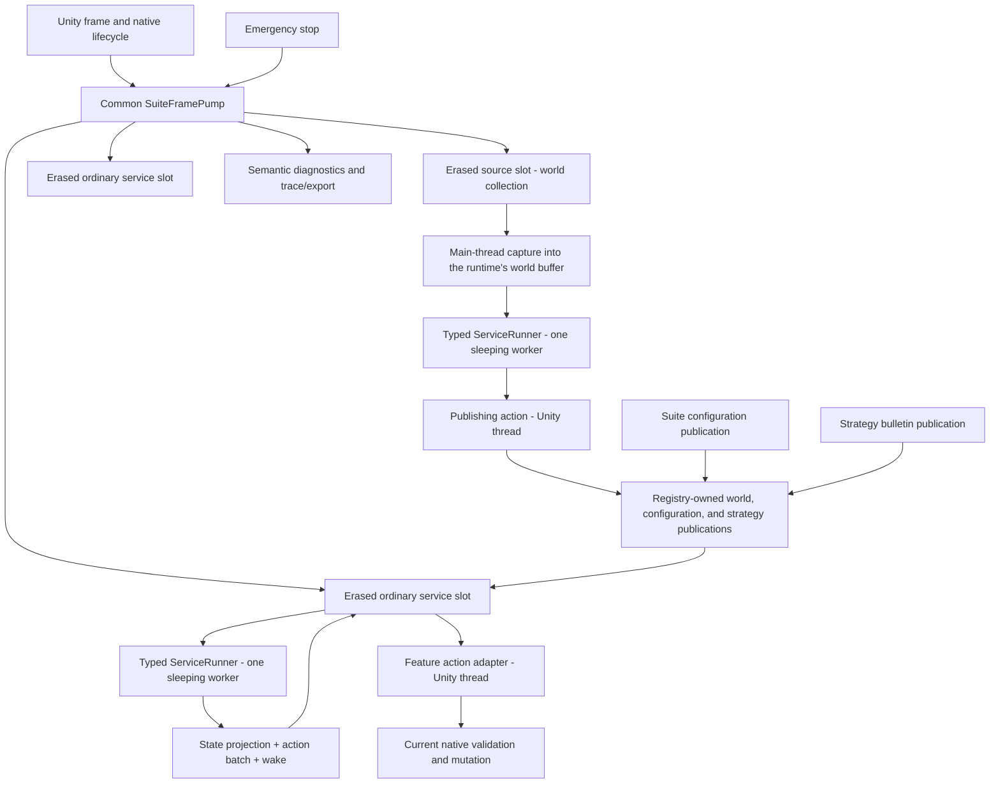

# Runtime architecture

Where the pieces sit and what depends on what. Execution, scheduling, and lifecycle mechanics belong to
[service-cycle-runtime.md](service-cycle-runtime.md).

[Back to dossier](README.md)

## System shape



## Dependency layers

1. **Common contracts and orchestration** — service identities, context versions, runners, frame pump,
   action outcomes, wake policies, lifecycle, emergency control, diagnostics transport, telemetry.
2. **Feature services** — typed state and actions, pure evaluation, semantic state projection.
3. **Feature native adapters** — execute actions on the Unity main thread through audited game
   contracts, and, for the one service that reads the game, capture there too.
4. **Strategy services** — publish immutable bulletins consumed as next-cycle inputs.

The logical boundaries do not depend on DLL packaging. Common never imports feature implementations, and
a feature's native side owns its own cache coherence.

## Common module structure

```text
Runtime/ServiceCycle/
  Contracts/       phases, identities, contexts, outcomes, wake policies
  Configuration/   immutable saved-config and strategy publications
  Execution/       feature ports, validation, runner handoff, worker, storage
  Registration/    deterministic erased-slot composition and sealing
  Orchestration/   SuiteFramePump and lifecycle/emergency control
  Diagnostics/     neutral snapshots and state-projection transport
  Tracing/         semantic schema, bounded capture, schema-v7 codec, graph validation
    Emission/      causal writer plus context, cycle, admission, evaluation, and batch emitters
  Observation/     mode-specific full trace, compact journal, and compile-time profile composition
```

Exact filenames may change; dependency direction may not. The pump does not become a god class:
registration, runner handoff, reusable action storage, diagnostics, tracing, and lifecycle replacement
remain separate components, and the observation products share only format-neutral block transport and
atomic storage. [Observability](observability.md) specifies them.

## The two service shapes

A feature supplies a main-thread definition that hands back a distinct worker-only definition. There are
exactly two shapes and no third:

- `IServiceCycleDefinition<TState, TAction>` — **ordinary**: consumes the published world, with no
  capture stage at all.
- `IServiceCycleSourceDefinition<TState, TAction>` — **source**: fills the runtime's
  `GameWorldCycleFrame` on Unity and derives the publication from it.

They are siblings, not one extending the other. What they share is the main-thread half,
`IServiceCycleMainThreadDefinition<TAction>` — identity, wake and fault policy, `ShouldStart`,
`TryExecute`. What they do not share is the worker they hand back, because the two evaluations take
different arguments; naming the worker in a common base would force one shape to return a contract it
cannot honour. Common rejects a worker definition that is the main-thread definition, implements the
main-thread contract, or retains native adapters, delegates, opaque framework objects, unsafe handles,
or mutable Common runtime owners.

Neither `TFrame` nor `TConfig` exists. There is one suite, so configuration is the named
`SuiteRuntimeConfiguration`; there is one game, so the source's buffer is the named
`GameWorldCycleFrame`. A type parameter in either position would only promise a second could exist.

## Why the publications arrive as they do

Handing over one reference is O(1) regardless of how much the publication holds. Copying selected facts
per service would oblige every consumer to declare a mirror field per fact, and a shared world snapshot
holding a table per entity category has no bounded set of "relevant facts" to mirror at all — copying
would reproduce the whole model per service per cycle, exactly the duplication the shared publication
removes. What no service gets is the publisher, so the two halves of a cycle cannot disagree about what
the game looked like. Publication introduces no cross-service ordering: a service whose cycle begins
before a newer snapshot lands uses the previous one and picks the new one up next cycle, preserving the
absence of a cross-service priority scheduler.

`PublicationTable<T>` is the one audited bounded container permitted inside an immutable publication.
C# 10 cannot enforce deep immutability; structural tests and narrow ownership APIs close that gap.

## Registration and composition

Composition is explicit and ordered. Nine services are registered:

```text
SuiteFramePump
  -> orbautomata.world-collection    (source)
  -> orbautomata.auto-items          (ordinary)
  -> orbautomata.auto-scribe         (ordinary)
  -> orbautomata.auto-harvest        (ordinary)
  -> orbautomata.auto-buy            (ordinary)
  -> orbautomata.spell-level         (ordinary)
  -> orbautomata.auto-cast           (ordinary)
  -> orbautomata.auto-concept        (ordinary)
  -> orbmentor.mastery-sharing       (ordinary)
```

World collection registers first so the world is published before the services that read it evaluate.
That ordering is a convenience, not a guarantee: nothing enforces order between services, and a consumer
whose first cycle beat the first collection would simply wait a frame. These nine registrations are the
complete production runtime roster.

Registration rejects duplicate service IDs and capacity overflow; records stable immutable ordinals and
seals composition before pumping; creates the typed runner, sleeping worker, and reusable
action/projection storage, plus the one world buffer a source needs; returns a handle and nothing else,
because the registry constructs the three publications itself; provides an erased `IServiceCycleSlot` to
the pump; and is transactional, releasing earlier resources if construction fails. Each service has
exactly two physical runner positions for current and retiring lifecycle ownership, and one preallocated
registry-wide identity ledger rejects live worker-definition or state aliases across every service and
generation. No service scans assemblies or reaches through a global service locator.

## Definition catalogs and changing values

Lifecycle catalogs enumerate finite definitions after registries are ready, each retaining a stable
UUID, its expected native type, a diagnostic name, a dense suite-local handle, and verified static
relationships and provenance. Hot paths index dense arrays by handle; native boundaries continue
resolving UUID plus expected type.

The world publication carries the changing values — quantities, rates, capacities, costs, levels,
availability, completion, queue state, active agriculture state and remaining durations, and the slots,
loadouts, and goals features need. Every service reads the snapshot as an evaluation argument and
projects whatever shape it needs off-thread; there is no view broker or lease pool, because a strict
cycle never overlaps one service's capture and evaluation. Only the raw grab of native values belongs on
the main thread, and the one declared exception is the modifier memo rule that
[world collection](world-collection.md) owns.

## Superseded paths stay gone

There is one production path, no runtime selector, and no fallback implementation.
`ArchitectureBoundaryTests` — not this document — holds the list of namespaces and type names that may
not come back.
