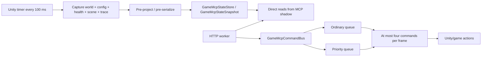
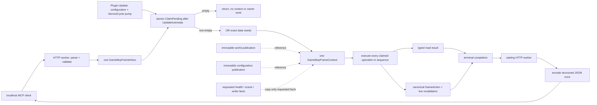

# Game MCP frame operations

> **Lifecycle: Accepted perf-debug architecture.** The Game MCP is a thin localhost transport into
> one request-scoped Unity-frame operation boundary. It owns no shadow world, update cadence,
> gameplay scheduler, or permanent action authority.

[Back to dossier](README.md) · [Game boundary doctrine](game-boundary-doctrine.md) ·
[Shared world collection](world-collection.md) · [User guide](../user-guide/game-mcp.md)

## Why this exists

The first MCP implementation periodically copied and projected world, configuration, health, scene,
and trace state whether or not a client was connected. It also put mutations on a second bounded
ordinary/priority scheduler. That made a debug transport a competing runtime and put authored graph
walks, health arrays, reflection, and serialization pressure on Unity's frame budget.

This document is the closed replacement contract. The MCP now receives a request, asks the next
Unity frame to perform exactly that operation, and returns the typed answer. Data that belongs in the
shared world stays in the shared world. Request-specific UI/native inspection happens only for the
request that named it.

## Retired architecture

The two defects are structural: speculative capture paid for requests that did not exist, while the
command bus invented capacity, priority, admission, and backlog behavior unrelated to either HTTP or
ServiceCycle.

## As-built replacement

`GameMcpFrameBatchExecutor.Drain` is the only claim site. It runs after
`UpdateAutomata`, so the context observes the configuration and ServiceCycle publications accepted
for that frame. The same `Plugin.Update` then continues to Mentor and UI maintenance after the MCP
batch.

## Exact frame and concurrency semantics

1. Each validated stateful `tools/call` or dynamic `resources/read` submits one immutable
   `GameMcpFrameOperation` to `GameMcpFrameInbox` and waits on that operation's completion.
2. `ClaimPending` locks once, claims the complete pending set, and preserves assigned submission
   sequence. There is no item cap, priority queue, or backlog policy.
3. An operation submitted after the claim is not in the claimed array and belongs to the next
   frame. It is neither lost nor allowed to overtake an earlier operation.
4. The executor ORs the claimed operations' `GameMcpFrameData` flags and constructs exactly one
   context. The context holds the already-immutable world and configuration publication references;
   it does not clone them.
5. Claimed operations execute sequentially. Every read sees the pinned initial context. Every
   gameplay action also performs its canonical live native revalidation, so a later action sees a
   native mutation committed by an earlier action in the same batch.
6. Emergency stop has no scheduler priority. It takes effect at its submitted position. Once it
   executes, synchronous cancellation and native admission close before the following operation.
7. Parameterized UI/native reads run only in their named operation. Multi-frame UI operations
   (navigation and end-of-frame framebuffer capture) retain their original pinned context and own
   completion until their terminal callback.

### Cancellation and shutdown

- **Before claim:** the HTTP wait may atomically transition a pending operation to terminal
  `request_canceled_before_claim`. `ClaimPending` omits it, so no Unity handler or mutation can run.
- **After claim:** cancellation loses ownership. The HTTP worker waits without a second timeout for
  the actual terminal result. A client cannot receive a timeout while a hidden mutation executes
  later.
- **Completion:** exactly one terminal result is legal; duplicate completion throws.
- **Shutdown:** closing the inbox completes every still-pending operation once with
  `suite_shutdown`. Already-claimed operations retain terminal ownership.

## Finite off-frame exception set

Only protocol mechanics and static schema discovery bypass the inbox:

- `initialize`
- `ping`
- `notifications/initialized`
- `tools/list`
- `resources/list`
- `resources/templates/list`

Every advertised stateful tool, including read-only tools, uses the inbox. The HTTP router does not
read `WorldPublication`, `ConfigurationPublication`, owner registries, Unity objects, or gameplay
state.

## Responsibility table

| Concern | HTTP worker | Unity frame operation |
| --- | --- | --- |
| HTTP headers, loopback/origin checks, body size | Owns | Never |
| JSON-RPC/MCP parsing and request-shape validation | Owns | Never |
| Tool/resource static schema enumeration | Owns | Never |
| Immutable operation submission and terminal wait | Owns | Completes |
| World/configuration publication selection | Never | Pins existing references once |
| Feature/service/trace health owner reads | Never | Only when requested |
| Scene, tooltip, screen, probe, framebuffer reads | Never | Only for the named operation |
| Requirement/cost/recipe explanation | Never | Evaluates typed data from one context |
| Gameplay policy and mutation | Never | Canonical GameAction only |
| General JSON serialization/reflection projection | Owns, after completion | Executably forbidden |
| MCP response/socket write | Owns | Never |

`GameMcpFrameThreadBoundary` makes the JSON/protocol half executable: encoding, reflective object
projection, or protocol routing attempted during frame execution throws and becomes an exact typed
operation fault. Unity creates only native-free `GameMcpValue` documents.

## Data-lifetime and owner inventory

Every datum exposed by the M2 read surface belongs to exactly one row below. “250-ms dynamic” means
the existing shared `GameWorldState` publication, not an MCP cadence. “Request-time” means one
claimed operation on Unity's main thread; it is never retained as an MCP snapshot.

| Surface and exact fields | Lifetime | Owner and collection rule |
| --- | --- | --- |
| Entity catalog: `uuid`, `name`, optional differing `internalName`, `nativeType`, and addressable `category` | Lifecycle-structural | Common enumerates `IdScriptableObject.RuntimeLookup` once on Unity at the first shared Playing capture after `RuntimeReady`, validates stable generation/count and `value.GetGuid() == key`, and attaches the one UUID-sorted immutable snapshot to every world in the lifecycle. MCP only filters the exact snapshot reference pinned by the answering world; hidden loaded entities remain searchable, while pre-bind/failed bind is explicitly unavailable. |
| Tool/resource schemas, protocol versions, operation classification, entity category/native-type/capability descriptors | Build-time | Compiled finite tables in the router and `GameMcpEntityCapabilityMap`. |
| Writable configuration metadata: section, key, setting type, description, accepted constraint/domain | Lifecycle-structural | Created once from bound BepInEx entries at perf-debug startup. No request enumerates settings or properties. |
| Configuration values and `configurationGeneration` | Request-time | One existing immutable `ConfigurationPublication` pinned in the frame context. Each writable value is selected by the static typed mapping; no mutable `ConfigEntry` value is read. |
| Requirement authoring: owner UUID/type/level, container/group/condition order, `AND`/`OR`, condition kind, requirement UUID/type, comparison/value selector, base requirement, per-level scaling, modifier-per-level scaling, prerequisite-link target and expanded tier/link order | Lifecycle-structural | `WorldEntityRequirementReader` and prerequisite-link structural readers traverse once per lifecycle. |
| Requirement evaluation: selected current value, required scaled/effective threshold, met/unmet, native `Check(ConditionInfo)` owner/level/verdict, availability/visibility/discovery/mastery/quantity/level inputs | 250-ms dynamic | Structural graph is re-derived against current published entity rows; `WorldRequirementNativeVerdictReader` invokes only compiled live verdict delegates each ordinary capture. Native/suite disagreement fails loud. |
| Research gates and adjustments: base/effective required level, leeway, visible/available/canDevelop, adjustment amount/order/passive state and source UUID/type | 250-ms dynamic | Research/challenge/modifier state in the shared world; explanation consumes the one generation and never re-queries from HTTP. |
| Purchase cost authoring: owner UUID/type, cost resource UUID, base exact amount, group amount/level, structural modifier-source identity and authored coefficients | Lifecycle-structural | Structure and upgrade raw cost readers run once per lifecycle. |
| Purchase effective cost: `effectiveExactAmount`, combined effective amount, active modifier-source values, resource available amount/headroom, per-resource affordability, whole-purchase affordability/reason | 250-ms dynamic | `WorldExactCostMath.TryCombinedExactCost` over structural cost inputs plus same-generation resources/modifiers. This is the sole exact-cost lineage. |
| Crafting family/recipe authoring: recipe UUID, crafting type UUIDs, input/output resource UUID+amount edges, consumable output UUID/effect kind, engagement effect/block identities | Lifecycle-structural | `WorldCraftingRecipeTypeReader` and `WorldCraftingRecipeAuthoringReader` traverse once per lifecycle. |
| Crafting live state: visible, starting quantity, `CanBuyAt`, output-capacity verdict, necessary drain ratio/block, time, joined resource visibility/quantity/capacity/bandwidth/usage/headroom | 250-ms dynamic | `WorldCraftingRecipeReader` invokes compiled live evaluators; worker joins current resource rows. Authored lists are not traversed again. |
| Discovery decision state: tree UUID, visibility, mode, rerolls/used flag, remaining/immediate-required state, ordered current offer UUIDs, selected UUID, exact next-item cost components, resource true quantities, and native `HasEnough` | 250-ms dynamic | The lifecycle-bound `WorldDiscoveryTreeBinder` copies only native-free values during the ordinary world capture. MCP derives initiate/reroll verdicts and resolves offers against the same immutable generation; it performs no direct or speculative read. |
| Entity explanation envelope and predicates: world/lifecycle generations; visible, available, canDevelop, canPurchase, canDiscover, canUse; stable false reason codes; queue/cap/leeway/discovery/bandwidth/drain blockers | 250-ms dynamic | Pure typed evaluation over one pinned world, plus the structural tables retained in that world. No snapshot token crosses calls. |
| World row/list/search/batch fields, resource quantities/rates/capacities, levels/quantities, queue/slot occupancy, discovery state, recipe state, affordability and collection-category status | 250-ms dynamic | Existing shared world collector and worker deriver. MCP only selects/projects requested rows. |
| Feature health fields: feature ID/name/state/reason; service health fields: service ID/name/runner phase/fault; emergency state; scene; native-contract health | Request-time | One requested `suite_health` operation reads `FeatureStatusRegistry` and the ServiceCycle frame facts already owned by the pump. Scene and native-contract facts are read only because this operation declares them. No MCP registry/revision exists. |
| Trace health fields: writer state/result, accepted/written/discarded records, bytes, written/retained segments, pending/peak blocks, artifact, fault site/message, writer revision | Request-time | One `trace_health` operation reads `DecisionJournalStatusRegistry`; scope is writer health only. No event stream or gameplay trace is mirrored. |
| Tooltip catalog paths; typed `TooltipNode` kind/text/value/children; nested/alternate/computed/inspected panels | Request-time | `game_tooltips`/`game_tooltip` only, through lifecycle-bound tooltip accessors on Unity. Unrelated operations make zero tooltip calls. |
| Screen tab/subtab catalog, navigation destination/candidates, exact probe value, Continue scene/runtime result, framebuffer PNG and optional generated save path | Request-time | Only the matching screen/navigation/probe/continue/screenshot operation. These are UI/diagnostic facts, never shared-world state. |
| Response status, one read generation, requested rows or mutation post-state, and exact failure evidence | Request-time | Typed terminal document on Unity; encoded once by the waiting HTTP worker. Action generations, success codes/reasons, payment stanzas, counters, null/empty/default fields, timestamps, and mailbox fields are not protocol data. |

### Why authored collection is no longer ordinary work

`GameWorldCollector` marks exactly these readers lifecycle-structural: plot authoring, effect blocks,
entity requirement graphs, crafting recipe types, crafting recipe authoring, structure costs, and
upgrade costs. It retains their buffers and reports for the lifecycle epoch. Ordinary captures still
refresh the paired live readers: prerequisite-link/native requirement gates, crafting verdicts, and
resource/modifier/affordability inputs. Two-capture tests destroy authored input objects and mutate
live state between captures; authored rows survive and live verdicts change.

## Gameplay ownership

The listener and an empty inbox acquire no action-family lease. A claimed gameplay operation asks
`AutomataActionFamilyOwnership.TryBeginGameMcpOperation` for only its mapped family, holds that scope
around one `AutomataServiceCycleRuntime.ExecuteGameMcp` call, and releases it immediately. Runtime
execution delegates to the same purchase, cast, concept, harvest, spell-level, or Discovery Tree
offer GameAction used by features/tests. UUID category and expected native type come from the one
`GameMcpEntityCapabilityMap` used by both read validation and action admission.

## Minimal terminal protocol

Reads use `available`/`unavailable`, one `worldGeneration`, and the requested rows/evidence.
Mutations use `committed`/`refused`/`faulted`; success returns the newer post-state and omits action
generations, payment evidence, request echoes, and counters, while failure keeps named target,
reason, mismatches that actually occurred, native outcome, and decomposed receipt. `content` is
reserved for text-first tools and actual image media; structured data appears once in
`structuredContent`. Committed, refused, and faulted GameAction results are all successful MCP tool executions:
their domain `status`/`reasonCode` carries the outcome and `isError` stays false so an MCP client cannot
replace a quarantine receipt with a generic transport error. `isError` is reserved for failures that
occur before a canonical domain result exists, such as frame-operation dispatch failure.

The protocol does not expose submission/processing/responded/captured timestamps, queue occupancy,
queue capacity, priority, operation sequence, pending handles, receipt IDs, or snapshot tokens.

Collection partiality is localized only from published evidence. In particular, an unknown
entity-requirement leaf is owner-local when the published unknown rows exactly reconcile with the
collector's skipped count. Reads and searches over other owners remain authoritative; any result
touching that owner carries the partial row plus its UUID, container, ordinal, runtime condition
type, and collector reason. An unreconciled skipped count remains category-global and fail-closed.

## Deletion inventory

The replacement removed, rather than deprecated, the following old mechanisms:

| Removed symbol/mechanism | Replacement |
| --- | --- |
| `GameMcpCaptureIntervalSeconds`, `_gameMcpCaptureElapsed`, `CaptureGameMcpState` | No timer. Empty frame is one inbox check; non-empty work is request-driven. |
| `GameMcpStateStore`, `GameMcpStateSnapshot`, `GameMcpRuntimeState` | One non-retained `GameMcpFrameContext` referencing real publications. |
| Pre-serialized writable configuration, feature/service health and trace JSON in the shadow | Typed requested owner facts, encoded once after completion. |
| `GameMcpCommandBus` | `GameMcpFrameInbox`. |
| `_pending`, `_priorityPending`, pending STOP slot | One FIFO pending list claimed atomically. |
| `MaximumPending=64`, `MaximumPriorityPending=8`, `EmergencyStopPrioritySlots=1`, `MaximumTotalPending` | No arbitrary queue capacity or priority reservation. |
| `maximumCommandsPerFrame=4`, `DrainGameMcpCommands`, `TryDequeue` | Claim and execute the complete boundary set. |
| `ObserveEmergencyStop` command-bus admission and general priority scheduling | Emergency stop executes at submission position and synchronously closes later admission. |
| `RefreshForGameMcp`, `allowManualMcpActions` | One exact per-operation family scope. |
| Router `ReadLatest()`/shadow fast paths and state parse-back | Every stateful tool submits one typed operation. |
| `submittedAtUtc`, `processedAtUtc`, `respondedAtUtc`, `collectedAtUtc`, `structuralEpoch`, `collectedEpoch`, queue/capacity response fields | One read generation or mutation post-state plus requested/failure evidence. |

## Hard boundary

This code exists only under `SERVICE_CYCLE_PROFILE`, listens only on IPv4 loopback, and is a debug
tool rather than a production control plane. Unity and game APIs stay on Unity's main thread.
Gameplay changes use GameActions. Navigation, tooltip opening, Continue, and tab selection are
truthfully UI state mutation, not read-only gameplay. `trace_health` is writer-health-only. Every
operation returns one inline terminal response; there is no polling or retained receipt API.
