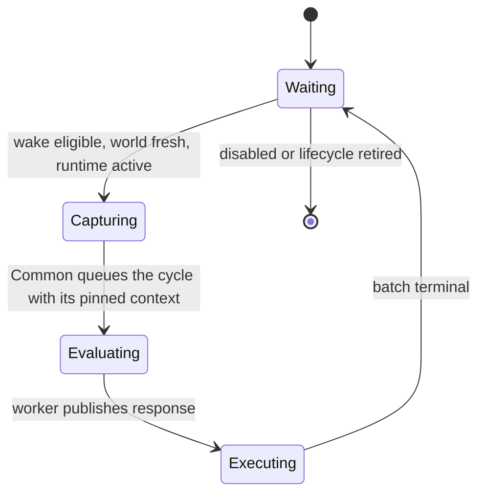

# Service-cycle runtime

> **Lifecycle: Accepted production foundation.** Common owns the generic registry, runners and pump;
> Automata owns one feature-neutral host around them. This document specifies execution, scheduling,
> lifecycle, and action ownership.

[Back to dossier](README.md) | [Observability](observability.md) | [Goals and invariants](goals-and-invariants.md) | [Architecture](architecture.md) | [Engineering decisions](decisions.md)

## Purpose

The default automation workload is a strict service cycle, not a general asynchronous process runtime:

1. Common identifies a waiting service whose wake policy is eligible and whose last change to the game is already reflected in the published world.
2. Common pins one reading of each of the three publications — world, configuration, and strategy — and mints the cycle's identity from them.
3. Common transfers that immutable cycle context to one dedicated service thread.
4. The service evaluates synchronously and updates its private state.
5. The service publishes a semantic state projection, zero or more advisory actions, and a wake policy.
6. Common attempts the batch over later Unity frames with fresh native validation.
7. Only after the batch is terminal may the service begin another cycle.

Step 2 is where the two shapes differ, and it is the only place they do. An ordinary service reads the world the runtime pinned for it. The one source service reads the game itself, on the Unity main thread, into a runtime-owned buffer its worker then derives the published snapshot from — it cannot consume the publication it produces. Every other stage is identical.

This model makes the ordinary path easy to understand, test, trace, and remove from the Unity frame. A future workload may earn a separate specialized execution contract, but speculative complexity does not belong in the default service API.

## Core state machine



`Capturing` is the phase a service is in while its own main-thread callbacks run. For an ordinary service that is `ShouldStart` and nothing else: a ready start decision becomes a queued cycle immediately, with no stage between them to fail, which is why an ordinary cycle carries no capture fact rather than an empty one. For the source it is `ShouldStart` followed by `Capture`, which may report the game unavailable and open no cycle at all.

The cycle is half-duplex:

- Common and the worker never own the same mutable store at the same time.
- Common never refills the source's world buffer while its worker derives from it.
- The worker cannot begin another evaluation while its current batch drains.
- The worker cannot mutate a response after publishing it.
- Actions contain copied suite-owned values, never Unity, reflected-object, native-token, configuration-entry, or adapter references.

## Typed service boundary

A service declares two type parameters, state and action, and composes through one of two entry points:

```csharp
AutomataService.Define<TState, TAction>(
    metadata, createWorker, shouldStart, execute);

AutomataService.DefineSource<TState, TAction>(
    metadata, createWorker, shouldStart, capture, execute);
```

Only the second takes a capture, because only the service that reads the game has one. Automata supplies its one immutable `SuiteRuntimeConfiguration` automatically. [The two service shapes](architecture.md) carries the full contracts.

Feature code owns:

- `TState`, lifecycle-scoped mutable planner memory owned only by its worker;
- `TAction`, a typed, Unity-free advisory action;
- evaluation, state projection, and action execution — plus, for the source alone, main-thread capture;
- whatever projection of the published world one decision needs, computed on the worker thread;
- default wake and evaluator-fault recovery policies.

Common owns:

- deterministic explicit registration and type erasure at the composition boundary;
- the world, configuration, and strategy publishers, and the lifecycle, cycle, batch, action, and publication identities;
- one response store per current runner, plus the one world buffer a source needs;
- one named sleeping background thread for the normal current runner of each registered service, with a second physical runner position reserved only for lifecycle retirement;
- the ownership handoff and memory-ordering protocol;
- one top-level Unity frame pump;
- batch cursors, action rotation, emergency stop, and terminal receipts;
- common health, diagnostics transport, semantic tracing, and snapshot export.

Common depends only on neutral contracts. It never references Auto Harvest, Auto Buy, Agrimancy, Mentor, or another feature implementation.

## Automata production host

Common owns the generic runner, registry, and pump contracts. Automata owns one small product composition
host around them. The host:

- seals an explicitly populated typed registry and claims its one frame pump;
- reads the authoritative frame identity and publishes the resulting pump timing;
- centralizes emergency-stop control and native lifecycle replacement;
- composes and schedules the independent full-trace, decision-journal, and opt-in profile controllers around
  each accepted pump;
- owns an optional exclusive pump-shutdown lease for observation products such as the decision journal; and
- contains no feature, native adapter, configuration, or Auto Harvest type.

Feature runtimes do not tick, dispose, or select individual observation controllers. They provide one neutral
observability-options value when attaching the host. Sharing the host attachment point does not make the
three observation products one sink. Feature-specific profiling stage codes remain at the native adapter edge.

Nine services are composed today — world collection, Auto Harvest, Auto Items, Auto Scribe, Auto
Buy, Spell Leveling, Auto Cast, Auto Concept, and Mentor — each through an explicit typed registration, and
none of them introduces another registry abstraction, pump, or generic service locator.

Orb Automata chooses one complete `SuiteRuntimeConfiguration` for every service. BepInEx entries deserialize
and persist values, but they are not application state. `AutomataConfigurationStore` owns the one committed
immutable reading and the one `ConfigGeneration`; all runtime, ownership, control, and presentation reads use
that store. A binding's initial change notification is absorbed into generation 1 instead of being replayed
as a duplicate publication. `ServiceCycleRegistry` constructs its own `ServiceConfigurationPublisher`, and
publishing once advances the same generation every service reads. Service definitions declare only state and
action types: they do not select a configuration generic or build feature-specific configuration mirrors.

`Plugin` owns the one deferred ServiceCycle activation directly; there is no application-level registry
around it. Every saved-value writer feeds the store. Quick buttons and shortcuts compute their next value
from its committed snapshot and drain the write synchronously. Mods-page apply/revert, BepInEx's configuration
manager, and external-file changes coalesce behind the binding and commit at the start of the next application
frame. A pending raw edit cannot affect ownership, button visibility, resume preview, or host activation before
that commit.

The store sends the same `(snapshot, ConfigGeneration)` to two consumers: the registry publication and one
application presentation join. Feature runtimes publish only health facts such as operational, waiting,
blocked, or faulted. They carry no configured mode, emergency flag, or second configuration generation.
`AutomataFeatureStatuses` combines the latest committed intent with the latest health for the six
player-facing feature rows; world collection has no row. A delayed cycle can therefore update health but
cannot repaint configured intent. The reporter replaces its current snapshot before the registry emits a
synchronous transition, so a transition-triggered repaint cannot reread the previous joined result.

Profile builds carry the pump's exact service ordinal and frame identity through `ServiceActionContext`, so
feature adapters may report native action substages. Ordinary builds compile that coordinate and probe path
out. This is observation only: stage results do not alter admission, action results, or lifecycle behavior.

## Context identities

Different changes have different meanings and use different identities:

- `LifecycleGeneration` changes for save/load, reset, NG+, scene replacement, or another audited native-lifetime boundary.
- `ConfigGeneration` changes when the suite publishes a configuration snapshot. There is one publication, so the number is the same for every service.
- `WorldGeneration` identifies the collection the world snapshot describes.
- `StrategyGeneration` changes when a new immutable strategy bulletin is published.
- `CaptureSequence` changes for every capture, and therefore exists only on the source's capture context — it moves in lockstep with the cycle id, so on the cycle identity it would only restate what that id already says.
- `CycleId` identifies one capture/evaluate/execute cycle.
- `BatchId` identifies the action batch returned by one evaluation.
- `StatePublicationId` identifies one immutable diagnostic/state projection.

A generation is not reused as a generic counter. Traces and rejection evidence retain all relevant identities.

## The three publications

The registry constructs and owns three publishers, one of each for the whole suite:
`ServiceWorldPublisher<GameWorldState>`, `ServiceConfigurationPublisher`, and `ServiceStrategyPublisher`.
Each is latest-wins, immutable, and generation-stamped, so a generation is suite-wide — every service
reading that publication reads the same number.

At cycle start Common pins one reading of each, whichever shape the service is, and the cycle identity
names all three generations. What reaches the worker differs by shape: an ordinary evaluation is handed
the world, the configuration, and the strategy; the source's is handed the configuration and its own
buffer, because it produces the world and cannot consume it. A service never reaches a publisher itself,
ignores the publications it does not need, and cannot be handed a bulletin from a different moment than
the world and configuration it was pinned beside. Common stores no publication as `object` and adds no
hidden runner generic.

- Publishing any of the three never cancels, orphans, rewrites, or partially updates current work.
- A running evaluation finishes with the world, configuration, and strategy it was pinned with, and a draining batch terminates under that same policy context.
- The next cycle consumes the latest publications; intermediate publications may coalesce.
- The state projection exposes both pinned and latest generations so the UI can explain that a saved change applies next cycle.

Editable UI values and raw entry notifications are not runtime configuration. A committed persisted change
publishes a new immutable `SuiteRuntimeConfiguration` snapshot and generation, whatever changed it — the
suite's own panel, BepInEx's configuration manager, or an edited file reloaded from disk. Draft edits,
previews, validation failures, failed persistence, and pending watcher notifications are invisible to
services and controls. Trace records name the configuration generation the recorded service actually
consumed.

The world publication is produced by the source service, and becomes live on the main thread during the
action pass rather than on the worker that derived it. Publishing services dispatch before mutating ones, so
a snapshot acquired this frame is visible to every consumer in that same frame. A world generation is the
pump frame its readings were collected on.

The strategy bulletin is the neutral one until a strategist exists, and the neutral bulletin reproduces
unstrategised behaviour exactly.

Native game state remains authoritative. Pinning policy context does not permit an action that current native validation rejects.

## The source's world buffer

The source service — and only it — has one reusable buffer, a `GameWorldCycleFrame`. It is named rather
than generic: there is one game and therefore one shape of raw reading. The runtime constructs one per
lifecycle.

1. Common owns it while the service waits or executes actions.
2. The feature-owned capture adapter fills it on the Unity main thread.
3. Publication transfers ownership to the worker, which derives the immutable snapshot from it.
4. Evaluation returns ownership together with the response.
5. Common does not refill it until the batch is terminal and the next wake is eligible.

It crosses threads once per cycle and only in one direction. No double or triple buffer is required,
because capture, evaluation, and action execution do not overlap for one service; a second buffer is a
future measured optimization, not a default contract.

The buffer holds dense handles, primitives, immutable suite values, and feature-owned storage with
read-only surfaces. It does not clone Unity graphs. Stable definitions live in lifecycle catalogs; the
buffer updates only live values.

Ordinary services own no such buffer. A service that needs to keep a projection across cycles keeps it in
its `TState`, where the arrays underneath survive the lifecycle; one that does not projects into a local.

C# 10 generic constraints cannot prove deep immutability or prove that one generic type never references another. The implementation therefore combines narrow APIs, non-escapable builders where supported, no exposed mutable backing arrays, structural architecture tests, and review. It must not claim that a passing signature alone establishes safety.

## Service state

`TState` is deliberately stateful. It may retain sequence progress, planner history, estimates, previous outcomes, or a per-service random state across cycles.

It is:

- constructed explicitly and testable without Unity;
- accessed only by the service worker;
- never read directly by Unity, UI, tracing, another service, or Common orchestration;
- forbidden from retaining frames, response writers, native objects, adapters, live configuration objects, or another service's state;
- scoped to one lifecycle unless a separately reviewed persistence contract exists.

After evaluation, the service projects `TState` into a small immutable semantic snapshot. The UI and traces consume that projection, not the mutable state object. State-resource ownership — construction, exact reference claims, same-lifecycle recreation, contention backoff, and shutdown release — stays inline in the worker and lends the state to evaluation by reference, so the separation adds no heap object and copies no mutable state between cycles.

On lifecycle replacement, a fresh runner always receives state from the fresh-state factory. A previous lifecycle's projection is diagnostic evidence only and cannot seed the new state. The last successfully published neutral projection may support evaluator-fault recovery within the same lifecycle; cross-lifecycle persistence requires a versioned serializer, compatibility policy, and save-safety review.

## Action batches

A service returns zero to any finite number of actions. Common imposes no configured item-count ceiling, does not truncate the batch, and does not reject it because it contains hundreds or thousands of actions.

The batch model is still structurally bounded:

- there is at most one active batch per service;
- the service cannot publish another batch while the current one drains;
- one reusable response buffer grows as needed and may retain its high-water capacity;
- Common holds a cursor into that buffer rather than copying actions into one global queue;
- high-water action count and retained bytes are observable.

A feature must have a reviewable termination argument for producing a finite batch from its captured domain. Capacity arithmetic is checked, growth failure faults the evaluation before `ResponseReady`, and partial actions are never published.

The dispatch policy is exactly:

- scan services in stable registration order from a rotating start index;
- give each active service one action turn, bounded by its registered fixed attempt limit, in one Unity frame;
- continue scanning other services after one service commits, rejects, or faults;
- advance rotation so registration order cannot dominate;
- use no additional action time budget until measurement demonstrates a need.

With six default-policy feature services, up to six native actions may be attempted in one Unity frame. A burst-capable service may explicitly raise its own fixed limit without taking another service's turn. A batch larger than that limit drains over multiple frames while the game processes previously committed work.

Every attempted action receives fresh main-thread identity resolution, current native safety and ownership admission under the cycle's pinned configuration and strategy, native validation, mutation, and postcondition evidence. Queue reservations and similar execution policies live at this native boundary. Planning information is advisory.

Validation boundaries are intentionally non-overlapping. Common rotation selects an action; it does not make a gameplay decision. The feature action callback maps pinned configuration and ownership to a terminal result, then resolves one lifecycle-coherent native binding set. The native submission boundary captures current stable identities and policy facts from one pre-mutation snapshot, and only the separate post-mutation snapshot proves the exact native transition; an unchanged preflight traversal is not repeated as a second safety boundary.

The Automata definition surface exposes no scheduler-admission callback: Common owns the
rotation and invokes each selected action directly. There is no legacy coordinator or
cross-runtime lease. Local frame guards for Mods maintenance and gameplay-invalidation delivery
do not admit feature actions and are not another scheduler.

### Terminal outcomes

- `Committed`: the native mutation was accepted and verified; advance the cursor.
- `Skipped`: a native mutation was attempted and proved to have committed nothing; advance the cursor without incrementing the committed count.
- `Rejected`: current authoritative state or pinned policy does not admit the action; terminate the batch.
- `Faulted`: an unexpected adapter, contract, or mutation failure occurred; terminate the batch and publish fault evidence.

There is no `Deferred` outcome and no automatic retry of the old action. A skip emits one `ActionSkipped` fact and continues. The first rejection or fault preserves the processed prefix and discards the untouched suffix without executing it; one `BatchAborted` fact records the terminal index and suffix count rather than one event per untouched action.

A later cycle may replan from a fresh frame. The rejected batch is never resumed. The next cycle receives a terminal receipt containing the batch identity, pinned context, committed count, derivable skipped count, terminal index, stable result code, native outcome evidence, and terminal timestamp.

## Emergency stop

Emergency stop has one persisted desired value and one immediate Common enforcement path. STOP/resume first
cancels prepared work, then commits `Safety.EmergencyDisable` through the same store so clearing the saved
value cannot race behind cancellation and leave the pump stopped. At the Common boundary:

- no further native action is attempted;
- every unattempted action in every current batch is terminally `Rejected(EmergencyStop)`;
- a response that arrives later publishes its valid state projection and wake policy normally, retains the worker's state, and rejects its entire action batch with the same reason;
- a running evaluator is not forcibly cancelled;
- no new cycle starts until emergency stop clears, which pauses the one main-thread capture with them;
- clearing stop never resurrects a rejected batch.

Emergency stop does not roll back pure evaluation. The response's wake anchor continues to age while capture is paused; after clearing, a fresh cycle may be immediately eligible if that policy is already due. Semantic evidence records state/projection/wake publication and action rejection separately, so neither implies a native mutation.

## Wake policy

Action execution and continuation timing are separate response fields. Initial policies are:

- `Immediate`;
- `AfterDecision(duration)`, anchored when the worker publishes its response;
- `AfterBatch(duration)`, anchored when the batch becomes terminal;
- `At(monotonicTimestamp)`;
- `Default`, resolved from explicit registration.

The service never overlaps its active batch. If an `AfterDecision` or absolute deadline expires while the batch drains, the next cycle becomes eligible immediately when the batch terminates. `AfterBatch` intentionally starts its delay at termination.

A zero-action response is terminal on publication. All timing uses a monotonic clock. Wall-clock or game-time inputs required by policy are explicit context fields, not ambient reads.

## Worker and handoff

Each registered slot normally has one current runner with one named background thread. Disabled services keep that worker asleep; enable/disable never constructs or retires a worker. A second physical runner position exists only so one stale worker can retire without blocking a safe replacement.

Each runner has capacity-one ownership handoffs:

```text
Unity/Common -> RequestReady -> service worker
Unity/Common <- ResponseReady <- service worker
```

The implementation uses a small explicit phase machine with synchronization-provided happens-before edges: one synchronization-owning type and one gate, using a private monitor/event plus sequence checks. No lock is held during native capture, service evaluation, diagnostics projection, or native mutation. There is no hot polling and no bespoke lock-free claim. Response installation, native action invocation, outcome handling, batch completion, and lifecycle retirement are separate collaborators wired directly into the runner — there is no forwarding-only batch controller and no per-frame allocation from this composition.

The Common pump sees a non-generic service slot produced by typed registration. It scans the finite explicitly registered array without blocking. There is no reflection discovery, filesystem autoloading, or general service locator.

## Lifecycle retirement

Lifecycle replacement immediately invalidates old native work:

1. advance `LifecycleGeneration`;
2. reject old pending captures and action suffixes without another native call;
3. wake and retire sleeping old runners;
4. create a fresh runner, response store, and factory-created state — plus a fresh world buffer for the source — when the per-service live-runner bound permits;
5. allow an evaluator already running in the old generation to finish in isolation;
6. discard its state projection and actions by generation;
7. let the old background thread exit.

Each registered slot has exactly two physical runner positions. Normally one is `Current` and at most one is `Retiring`; during a lifecycle storm both may be `Retiring`, leaving the service with no current runner. No third runner is ever created, and later lifecycle requests coalesce to the newest generation while the service is paused. A stale runner enters `Stopping` and continues counting as live while it clears worker-owned references, releases state/frame resources, and disposes its wake handle. The owner then observes `Thread.IsAlive == false` without joining and publishes `Stopped`; only that complete exit evidence permits position reuse.

Retirement publishes one bounded terminal fact immediately when ownership is available. A main-owned untouched suffix produces `Orphaned`; an already-entered ordinary terminal remains authoritative; and a zero-action `ResponseReady` receipt is acquired nonblockingly and remains `Completed`. Gate contention defers retirement instead of dropping or rewriting that receipt. Worker exit is cleanup evidence, not a second terminal. Workers are background threads before they start, so the aggregate physical worker bound is twice the fixed registration capacity.

Lifecycle invalidation is latched while an already-entered `ShouldStart`, capture, or native action callback finishes. The stale runner is checked after `ShouldStart`, after capture, immediately before request publication, and after the native action returns; no later old-generation callback is entered. An already-entered action remains authoritative for its own outcome. Execution and lifecycle semantic translation share the same exact receipt-identity comparison, so their duplicate-terminal suppression cannot disagree about whether a retained terminal was already emitted.

The registry owns the suite's initial and desired lifecycle generation. Newer requests coalesce; equal or older requests are ignored. Initial and replacement construction are failure-atomic and use the service fault policy's real monotonic timestamp and bounded backoff. Every accepted pump frame has one allocation-free reconciliation epoch shared by its initial and final reconciliation, and a slot may attempt construction only once in that epoch. One registry-wide construction scope guards every composition and lifecycle mutation, so a construction callback cannot recursively install a candidate, seal or dispose the registry, release a slot, enter lifecycle reconciliation, or create an untracked worker.

### The identity ledger

The configuration publisher survives replacement; worker definition, action store, handoff, thread, state, projection storage, and fault trackers are factory-fresh. External references are admitted through one fixed ledger:

- Six claim slots are preallocated per configured service. There are two claim roles — worker definition and state — so a live runner holds two and an overlapping replacement bounds it at four; the extra pair is deliberate headroom, since exhausting the array fails a construction and never doing so costs one null reference per service.
- Before every external reference factory the runtime reserves a fresh exact slot and single-CASes that handle into one ledger-wide factory token. Admission is bounded and fails before the callback without waiting, spinning, or holding a monitor; contention retries on a monotonic 16–1000 ms deadline through the normal handoff or a typed construction result, and never advances the feature-fault streak.
- The token owner invokes finite feature code outside locks, publishes a candidate that must remain valid through immediate finalization, and performs one definitive bounded cross-role scan. A factory callback must not synchronously depend on another reference factory succeeding.
- State ownership stays identity-visible until `ReleaseState` returns; frame and worker-definition ownership stay visible through worker cleanup.
- Token finalization CASes `Open` to `Closing` while the global token remains installed, sweeps claims retired under the open token, and exact-clears the global token last. A release after `Closing` self-removes. No successor factory can overlap a stale sweep, which gives exact-handle ABA safety without identity maps, tombstones, release queues, or registry retention.

The runtime does not use `Thread.Abort`, cooperative checkpoints, cancellation tokens inside ordinary evaluation, or mid-evaluation state transfer. An orphan's elapsed time is diagnostic evidence. A non-returning evaluator violates the service contract but cannot mutate Unity or block other services. Background threads do not keep the process alive; graceful shutdown signals sleeping workers and never waits on native work from a background thread.

## Fault recovery

Expected domain refusal is represented by a normal decision or action rejection. Exceptions are unexpected faults. Evaluation is one failure-atomic gameplay transaction: action-store reset, `Evaluate`, state projection, response validation, and synchronized `ResponseReady` publication.

The worker loop catches evaluator exceptions:

- no new actions or current state projection are published from the failed evaluation;
- every written reference-bearing action entry is cleared and the partial action count becomes zero;
- the last successful projection remains current;
- the worker thread survives;
- the failure becomes a stable typed episode without exception messages, paths, or stacks in public diagnostics;
- identical failures are debounced and counted;
- Common schedules one monotonic retry with bounded backoff and coalesces additional retry demand;
- the service recreates safe working state from its state factory or last successful neutral publication rather than trusting partially mutated state;
- state-factory/recovery failure enters the same bounded debounced retry circuit and cannot spin;
- one successful evaluation resets the fault episode and backoff.

Capture and action-adapter faults use the same episode/debounce principles but never retry an already rejected action. Lifecycle replacement or a new successful cycle resolves obsolete fault state explicitly.

## Common frame pump

Common owns one top-level frame pump. It exists independently of Orb Automata. `SuiteFramePump` is the owner-thread API facade; its private collaborators separate mutable pump state, lifecycle and emergency control, accepted-frame execution, per-service transitions, trace- and journal-session ownership, evidence emission and scanning, and semantic profiling — while preserving one scheduling path and one cross-sink event order.

Before the frame opens, the pump brings its emergency stop in line with the configuration
publication. That is read rather than pushed: nothing outside has to notice a setting changed and
remember to tell the pump, so the state the pump is in cannot drift from what the suite is configured
to do. Doing it before the frame leaves the frame's own rejection step to reject the active batches and
count them, which is what a reader of the rejection count wants.

Each Unity frame then performs deterministic phases:

1. **ReconcileLifecycle** — observe lifecycle, enablement, and retiring runners;
2. advance any main ownership left pending by a contended gate on an earlier frame;
3. **AcquireResponses** — ingest completed worker responses without blocking, publishing state projections and installing action batches;
4. reject current and arriving batches if emergency stop is active;
5. **DispatchActions** — scan active services from the rotating index and execute each service's bounded action turn, finalizing completed, rejected, faulted, or lifecycle-orphaned batches and publishing receipts; publishing services dispatch before mutating ones;
6. **StartCycles** — from the same rotating index, ask each waiting service whose wake policy is eligible and whose world is fresh; the source captures at most once here, and a ready decision becomes a queued cycle;
7. **ReconcileLifecycle** again, so a transition raised during the frame settles inside it;
8. advance the rotation and publish per-frame timing and causal evidence.

Those four named phases are the frame's own profiler spans, nested inside `OverallPump`.
`ReconcileLifecycle` is two occurrences per frame, because a frame reconciles before it acts and again
after.

The initial design has no additional time-budget scheduler. Capture and action durations, total Common main-thread time, active service count, and wake lateness are measured so a later budget decision can be based on evidence without changing the service API.

The pump never waits for the worker-owned handoff gate. Response acquisition, captured-request publication, and normal or cleanup ownership return use zero-time probes; contention retains the existing owner and defers the transition to a later frame without repeating capture or native execution. Worker wake and stop use a sleeping event, so disposal signals and returns without joining. If a worker observes the published stop flag and disposes its wake handle before the owner resumes the final signal, only that exact published-disposal race is treated as an already-completed wake. `SuiteFramePumpReport.LifecyclePositionTransitions` is the exact cumulative-counter delta for all physical position transitions during that accepted frame. An emergency episode marks any outstanding request, evaluation, or response until that exact response is consumed, even when the player clears the stop first, so clearing cannot resurrect work that existed during the stopped episode.

### World-freshness gate

A service does not start a cycle against a world collected before it went live, or before its own last
change to the game. [Acting twice on one world](world-collection.md) specifies what arms the gate and
why; what belongs here is where it sits in the frame.

The gate runs inside **StartCycles**, before any feature callback: a held service is skipped and asked
again next frame, nothing is scheduled, and the hold is recorded as its own fact because holding a
service is otherwise indistinguishable from that service having nothing to do. It is not a wake policy,
because nothing about it is a timing condition — the answer can change on any frame. A source is exempt
by shape, since gating the collector behind a generation only it can produce would deadlock the suite on
its first frame, and shape is read off where the service's turn falls rather than declared.

A composition with no world publisher is a test fixture rather than a case to design for, and those
fixtures supply worlds the way production's collector does. A fixture that publishes none never starts a
mutating cycle at all; that is the rule holding, not a hang.

## Semantic observability

[Observability](observability.md) specifies the products, storage, and retention. The trace is one causal
service-cycle story rather than separate kernel/process/thread logs:

```text
latest context publication -> start decision -> capture (source only) -> cycle queued
                           -> evaluation -> state publication -> batch publication
                           -> action attempt/result -> batch terminal -> next wake
```

The generic event vocabulary covers configuration and strategy publication; lifecycle and emergency
transitions; cycle queued, started, completed, orphaned, or faulted; capture identity and duration for
the cycles that had one; evaluation duration, result, and fault episode; state publication identity and
fingerprint; batch count, capacity, age, cursor, and terminal disposition; action selection, exact
native outcome, and call/attempt/commit counts; retry scheduling and recovery; and every accepted pump's
fairness rotation with its service, action, and capture counts. Profiling samples are deliberately not
in that list: the profiler is its own product with its own format and compile-time gate.

Common keeps that story behind three cohesive boundaries. Payload validation enforces the shared wire
shape and then delegates to explicit lifecycle/context, cycle/evaluation, or execution rules. One causal
writer owns the ring, service and suite heads, delayed anchors, and emergency ancestry. The stable
recorder facade routes the public event API directly to the context, cycle/admission, evaluation, and
batch emitters. Pump-side execution translation likewise remains one object partitioned by fact family,
preserving event order, terminal-receipt deduplication, and duration calculation without adding runtime
dispatch or per-event allocation.

Every event carries stable causal identifiers and pinned context generations. Publication facts are a monotonic, once-only observed high-water; unobserved intermediate publications may coalesce. Capture and cycle facts independently record the exact generations they consumed, so a delayed older cycle may truthfully appear after a newer publication fact without inventing a regressing publication.

Unity never waits for diagnostics, telemetry, or I/O, and observability never changes gameplay outputs. The recording layer appends gameplay actions first, catches record/codec failures except process-fatal stack overflow, latches incomplete, and stops encoding without suppressing gameplay. Buffer exhaustion marks the capture incomplete while gameplay action production continues unchanged.

## Registration preflight and containment

Lifecycle-construction evidence fails during callback-free preflight. Callback-issued lifecycle, emergency,
configuration, and non-capture-derived external strategy mutations fail after typed preparation but before
pumping; capture-derived strategy publication remains supported evidence. Containable callback, adapter,
and cleanup failures preserve the primary failing phase; `StackOverflowException`, `OutOfMemoryException`,
and `AccessViolationException` remain outside containment.

`ServiceRunner<TState, TAction>` is the whole execution contract — there is no replayable registration or
alternate driver beside it.

No reflection serializer, raw save structure, native object, path, user/host name, arbitrary string, or exception text enters the trace. Large action batches are encoded incrementally as bounded streamed records; decoder bounds come from available bytes and schema, not a gameplay action cap.

After registration and capacity warm-up, idle pumping, waiting-slot scans, response handoff, in-capacity action append/drain, terminal receipt publication, and fixed-size semantic event emission allocate zero managed bytes. Whole-slot erasure does not box generic values. Strings and rich arrays are created only by rate-limited UI/export projections. Every permitted growth allocation is named and observable.

## Explicitly excluded from the default runtime

- custom async tasks or method builders;
- shared latency/deep worker lanes;
- polling awaiters;
- cooperative checkpoints or continuation scheduling;
- incumbents or automatic soft supersession;
- ordinary multi-buffer live-view leasing;
- one suite-global action slot or global action queue;
- configured action-count ceilings or truncation;
- deferred action outcomes or automatic old-action retry;
- configuration/strategy invalidation of current work;
- service-owned Unity `Update` loops or frame budgets.

Future deep search, mid-step native questions, or anytime planning may introduce a separate specialized contract only after a real service demonstrates the need. The ordinary service API must remain unchanged.
