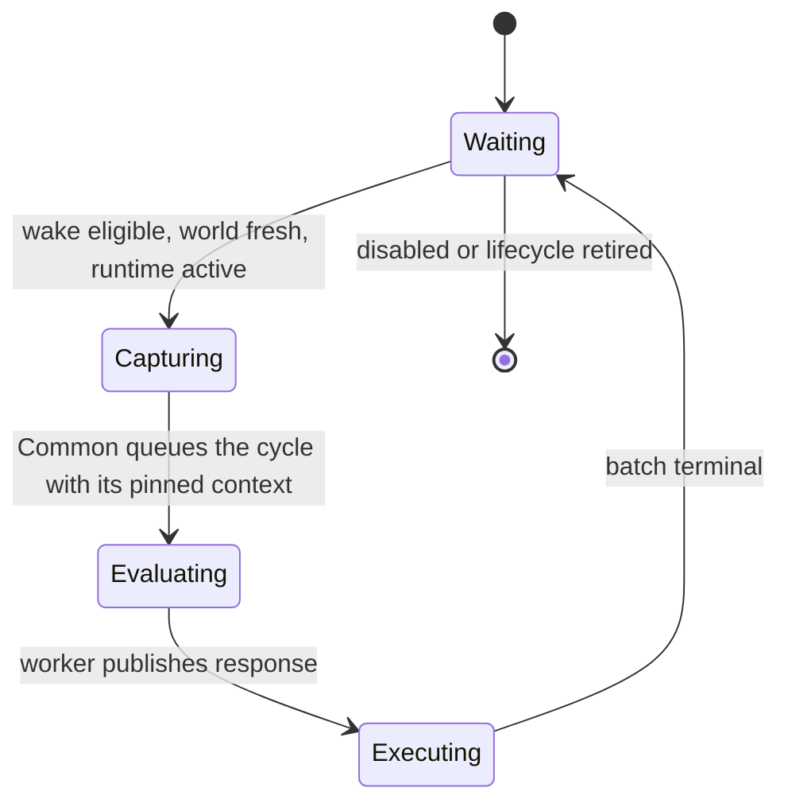

# Service-cycle runtime

How a cycle executes, from wake to terminal receipt. Common owns the generic registry, runners and
pump; Automata owns one feature-neutral host around them.

[Back to dossier](README.md) · [Observability](observability.md) · [Architecture](architecture.md)

## Purpose

The default automation workload is a strict service cycle, not a general asynchronous process runtime:

1. Common identifies a waiting service whose wake policy is eligible and whose last game-facing action
   attempt predates the published world.
2. Common pins one reading of each of the three publications and mints the cycle's identity from them.
3. Common transfers that immutable cycle context to one dedicated service thread.
4. The service evaluates synchronously and updates its private state.
5. The service publishes a semantic state projection, zero or more advisory actions, and a wake policy.
6. Common attempts the batch over later Unity frames with fresh native validation.
7. Only after the batch is terminal may the service begin another cycle.

Step 2 is the only place the two shapes differ. An ordinary service reads the world the runtime pinned
for it; the one source service reads the game itself, on the Unity main thread, into a runtime-owned
buffer its worker then derives the published snapshot from — it cannot consume the publication it
produces.

## Core state machine



`Capturing` is the phase a service is in while its own main-thread callbacks run. For an ordinary
service that is `ShouldStart` and nothing else — a ready start decision becomes a queued cycle
immediately, with no stage between them to fail, which is why an ordinary cycle carries no capture fact
rather than an empty one. For the source it is `ShouldStart` followed by `Capture`, which may report
the game unavailable and open no cycle at all.

The cycle is half-duplex: Common and the worker never own the same mutable store at once, Common never
refills the source's buffer while its worker derives from it, the worker cannot begin another
evaluation while its batch drains or mutate a response after publishing it, and actions carry copied
suite-owned values only — never Unity, reflected-object, native-token, configuration-entry, or adapter
references.

## Entry points

```csharp
AutomataService.Define<TState, TAction>(metadata, createWorker, shouldStart, execute);
AutomataService.DefineSource<TState, TAction>(metadata, createWorker, shouldStart, capture, execute);
```

Only the second takes a capture, because only the service that reads the game has one. Automata
supplies its one immutable `SuiteRuntimeConfiguration` automatically.

Feature code owns `TState` (lifecycle-scoped mutable planner memory), `TAction` (a typed Unity-free
advisory action), evaluation, state projection, action execution — plus, for the source alone,
main-thread capture — whatever projection of the published world one decision needs, and its default
wake and fault-recovery policies. Common owns registration and type erasure, the three publishers and
every identity, the response and world stores, one sleeping thread per current runner, the ownership
handoff, the frame pump, batch cursors and rotation, emergency stop, terminal receipts, and diagnostics
transport. Common never references a feature implementation.

## Automata production host

Automata's one composition host seals an explicitly populated typed registry and claims its frame pump,
reads the authoritative frame identity and publishes the resulting pump timing, centralizes
emergency-stop control and native lifecycle replacement, composes the three observation controllers
around each accepted pump, owns an optional exclusive pump-shutdown lease, and contains no feature,
native adapter, or configuration type.

Nine services are composed: world collection as the source, and Auto Items, Auto Scribe, Auto Harvest,
Auto Buy, Spell Leveling, Auto Cast, Auto Concept and Mentor as ordinary services. Each is an explicit
typed registration; none introduces another registry abstraction, pump, or service locator.

Feature runtimes publish only health facts — operational, waiting, blocked, faulted — carrying no
configured mode, emergency flag, or second configuration generation. `AutomataFeatureStatuses` joins
the latest committed configuration intent with the latest health for the eight player-facing feature
rows (Auto Buy, Auto Cast, Auto Concept, Spell Level, Auto Harvest, Auto Items, Auto Scribe, Mentor);
world collection has no row, so a delayed cycle can update health but cannot repaint configured intent.

Profile builds carry the pump's exact service ordinal and frame identity through `ServiceActionContext`
so feature adapters may report native substages; ordinary builds compile that path out. Stage results
never alter admission, action results, or lifecycle behaviour.

## Context identities

- `LifecycleGeneration` — save/load, reset, NG+, scene replacement, or another audited native-lifetime
  boundary.
- `ConfigGeneration` — a published configuration snapshot; one publication, so one number suite-wide.
- `WorldGeneration` — the collection the world snapshot describes.
- `StrategyGeneration` — a new immutable strategy bulletin.
- `CaptureSequence` — every capture, so only on the source's capture context; it moves in lockstep with
  the cycle id.
- `CycleId`, `BatchId`, `StatePublicationId` — one cycle, one batch, one state projection.

A generation is never reused as a generic counter. Traces and rejection evidence retain every relevant
identity.

## The three publications

The registry constructs and owns `ServiceWorldPublisher<GameWorldState>`,
`ServiceConfigurationPublisher`, and `ServiceStrategyPublisher`. Each is latest-wins, immutable, and
generation-stamped. At cycle start Common pins one reading of each and the cycle identity names all
three generations; an ordinary evaluation is handed world, configuration and strategy, the source's is
handed configuration and its own buffer.

- Publishing never cancels, orphans, rewrites, or partially updates current work. A running evaluation
  finishes with what it was pinned with, and a draining batch terminates under that same policy
  context.
- Once a service is idle, a newer configuration generation invalidates a wake deadline calculated from
  an older one and the next admission re-runs `ShouldStart` against the latest committed snapshot, so
  unrelated changes may cost one extra evaluation but cannot leave newly enabled work behind an
  obsolete delay. A newer world generation likewise invalidates an ordinary service's normal wait. The
  source does not wake on its own publication. Fault-recovery deadlines keep their bounded backoff.
- The next cycle consumes the latest publications; intermediate ones may coalesce. The state projection
  exposes both pinned and latest generations so the UI can explain that a saved change applies next
  cycle.

Editable UI values and raw entry notifications are not runtime configuration. A committed persisted
change publishes a new immutable snapshot and generation, whatever changed it — the suite's own panel,
BepInEx's configuration manager, or an edited file reloaded from disk. Drafts, previews, validation
failures, failed persistence, and pending watcher notifications are invisible to services.

The world publication becomes live on the main thread during the action pass rather than on the worker
that derived it, and publishing services dispatch before mutating ones, so a snapshot acquired this
frame is visible to every consumer in that same frame. The strategy bulletin is the neutral one until a
strategist exists.

## The source's world buffer

The source — and only it — has one reusable `GameWorldCycleFrame`, one per lifecycle. Common owns it
while the service waits or executes actions; the feature-owned capture adapter fills it on Unity;
publication transfers ownership to the worker, which derives the immutable snapshot from it; evaluation
returns ownership with the response; and Common does not refill it until the batch is terminal and the
next wake is eligible. It crosses threads once per cycle, in one direction, so no double buffer is
required. It holds dense handles, primitives, immutable suite values, and feature-owned storage with
read-only surfaces — never a cloned Unity graph — and updates only live values, since stable
definitions live in lifecycle catalogs.

Ordinary services own no such buffer. One that needs a projection across cycles keeps it in its
`TState`, where the arrays underneath survive the lifecycle.

## Service state

`TState` is deliberately stateful and may retain sequence progress, planner history, estimates,
previous outcomes, or a per-service random state across cycles. It is constructed explicitly and
testable without Unity, accessed only by its own worker, never read directly by Unity, UI, tracing,
another service, or Common, forbidden from retaining frames, response writers, native objects,
adapters, live configuration objects, or another service's state, and scoped to one lifecycle unless a
separately reviewed persistence contract exists. After evaluation the worker projects it into a small
immutable semantic snapshot, which is what the UI and traces consume. On lifecycle replacement a fresh
runner always receives state from the fresh-state factory; a previous lifecycle's projection is
diagnostic evidence and cannot seed it.

## Action batches

A service returns zero to any finite number of actions. Common imposes no configured item-count ceiling
and never truncates a batch. The model is still structurally bounded: at most one active batch per
service, no new batch while the current one drains, one reusable response buffer that grows and may
retain its high-water capacity, a cursor rather than a copy into a global queue, and observable
high-water count and bytes. Every feature must have a reviewable termination argument for producing a
finite batch; capacity arithmetic is checked, and growth failure faults before `ResponseReady`.

The dispatch policy is exactly:

- scan services in stable registration order from a rotating start index;
- give each active service one action turn, bounded by its registered fixed attempt limit, in one Unity
  frame;
- continue scanning other services after one commits, rejects, or faults;
- advance rotation so registration order cannot dominate;
- use no additional action time budget until measurement demonstrates a need.

The default is one action per ordinary service per frame. A burst-capable service raises its own fixed
limit without taking another service's turn — Auto Buy's is `ServiceActionDispatchPolicy.Bounded(16)`.
A batch larger than the limit drains over multiple frames while the game processes committed work.

Every attempted action receives fresh main-thread identity resolution, current native safety and
ownership admission under the cycle's pinned configuration and strategy, native validation, mutation,
and postcondition evidence. Queue reservations live at this native boundary; planning is advisory.
Validation boundaries are deliberately non-overlapping: Common rotation selects an action and makes no
gameplay decision; the feature callback maps pinned configuration and ownership to a terminal result
and resolves one lifecycle-coherent binding set; the native submission boundary captures current
identities and policy facts from one pre-mutation snapshot, and only the separate post-mutation
snapshot proves the exact transition.

### Terminal outcomes

- `Committed` — the native mutation was accepted and verified; advance the cursor.
- `Skipped` — a native mutation was attempted and proved to have committed nothing; advance the cursor
  without incrementing the committed count.
- `Rejected` — current authoritative state or pinned policy does not admit the action; terminate the
  batch.
- `Faulted` — an unexpected adapter, contract, or mutation failure occurred; terminate the batch and
  publish fault evidence.

There is no `Deferred` outcome and no automatic retry. A skip emits one `ActionSkipped` fact and
continues. The first rejection or fault preserves the processed prefix and discards the untouched
suffix without executing it; one `BatchAborted` fact records the terminal index and suffix count rather
than one event per untouched action. A later cycle may replan only after a world collected strictly
after the attempt, and the rejected batch is never resumed. The next cycle receives a terminal receipt
carrying the batch identity, pinned context, committed count, derivable skipped count, terminal index,
stable result code, native outcome evidence, and terminal timestamp.

## Emergency stop

One persisted desired value, one immediate Common enforcement path. STOP/resume first cancels prepared
work, then commits `Safety.EmergencyDisable` through the same store, so clearing the saved value cannot
race behind cancellation and leave the pump stopped. At the Common boundary: no further native action
is attempted; every unattempted action in every current batch is terminally `Rejected(EmergencyStop)`;
a response arriving later publishes its valid state projection and wake policy normally, retains the
worker's state, and has its whole batch rejected with the same reason; a running evaluator is not
forcibly cancelled; no new cycle starts until stop clears, which pauses the one main-thread capture
with them; and clearing never resurrects a rejected batch. Emergency stop does not roll back pure
evaluation — the response's wake anchor keeps ageing while capture is paused.

## Wake policy

Action execution and continuation timing are separate response fields: `Immediate`;
`AfterDecision(duration)`, anchored when the worker publishes its response; `AfterBatch(duration)`,
anchored when the batch becomes terminal; `At(monotonicTimestamp)`; `OnPublication`, dormant until a
newer world or configuration generation is visible; and `Default`, resolved from registration.

A service never overlaps its active batch. If an `AfterDecision` or absolute deadline expires while the
batch drains, the next cycle becomes eligible immediately on termination; `AfterBatch` deliberately
starts its delay at termination. For an ordinary response containing an action, `Immediate` cannot
produce a same-world follow-up — the attempted dispatch raises the world-gate floor first — so it is
equivalent to `OnPublication` for that continuation while remaining a distinct contract for sources and
zero-action responses. A zero-action response is terminal on publication. All timing is monotonic.

## Worker and handoff

Each registered slot normally has one current runner with one named background thread. Disabled
services keep that worker asleep; enable/disable never constructs or retires a worker. A second
physical runner position exists only so one stale worker can retire without blocking a safe
replacement.

```text
Unity/Common -> RequestReady -> service worker
Unity/Common <- ResponseReady <- service worker
```

Handoffs are capacity-one, through a small explicit phase machine with synchronization-provided
happens-before edges: one synchronization-owning type and one gate, using a private monitor/event plus
sequence checks. No lock is held during native capture, service evaluation, diagnostics projection, or
native mutation. There is no hot polling and no bespoke lock-free claim.

## Lifecycle retirement

Lifecycle replacement immediately invalidates old native work:

1. advance `LifecycleGeneration`;
2. reject old pending captures and action suffixes without another native call;
3. wake and retire sleeping old runners;
4. create a fresh runner, response store, and factory-created state — plus a fresh world buffer for the
   source — when the per-service live-runner bound permits;
5. allow an evaluator already running in the old generation to finish in isolation;
6. discard its state projection and actions by generation;
7. let the old background thread exit.

Each slot has exactly two physical runner positions. Normally one is `Current` and at most one is
`Retiring`; during a lifecycle storm both may be `Retiring`, leaving the service with no current runner,
and later requests coalesce to the newest generation while it is paused. No third runner is ever
created. A stale runner enters `Stopping` and keeps counting as live while it clears worker-owned
references, releases state and frame resources, and disposes its wake handle; the owner then observes
`Thread.IsAlive == false` without joining and publishes `Stopped`, and only that complete exit evidence
permits position reuse.

Retirement publishes one bounded terminal fact as soon as ownership is available, and gate contention
defers retirement rather than dropping or rewriting a receipt. Lifecycle invalidation is latched while
an already-entered `ShouldStart`, capture, or native action callback finishes; the stale runner is
checked after each, and no later old-generation callback is entered. An already-entered action remains
authoritative for its own outcome. The runtime does not use `Thread.Abort`, cooperative checkpoints,
cancellation tokens inside ordinary evaluation, or mid-evaluation state transfer; a non-returning
evaluator violates its contract but cannot mutate Unity or block another service.

## Fault recovery

Expected domain refusal is a normal decision or action rejection; exceptions are unexpected faults.
Evaluation is one failure-atomic gameplay transaction — action-store reset, `Evaluate`, state
projection, response validation, and synchronized `ResponseReady` publication.

The worker loop catches evaluator exceptions: no new actions or state projection publish; every written
reference-bearing action entry is cleared and the partial count becomes zero; the last successful
projection remains current; the worker thread survives; the failure becomes a stable typed episode
without exception messages, paths, or stacks in public diagnostics; identical failures are debounced and
counted; Common schedules one monotonic retry with bounded backoff and coalesces additional demand; the
service recreates safe working state from its factory or last successful neutral publication;
state-factory failure enters the same debounced circuit and cannot spin; and one successful evaluation
resets the episode and backoff.

Ten fault categories are stable wire values: `Capture`, `Evaluation`, `StateProjection`,
`ResponseValidation`, `StateFactory`, `ActionExecution`, `NativeContract`, `Storage`,
`LifecycleConstruction`, `Start`. Capture and action-adapter faults use the same episode and debounce
principles but never retry an already rejected action.

## Common frame pump

Common owns one top-level frame pump, independent of Orb Automata. `SuiteFramePump` is the owner-thread
facade; its private collaborators separate mutable pump state, lifecycle and emergency control,
accepted-frame execution, per-service transitions, trace- and journal-session ownership, evidence
emission, and semantic profiling, while preserving one scheduling path and one cross-sink event order.

Before the frame opens, the pump brings its emergency stop in line with the configuration publication.
That is read rather than pushed, so the pump's state cannot drift from what the suite is configured to
do; doing it before the frame leaves the frame's own rejection step to reject the active batches and
count them.

Each Unity frame then performs deterministic phases:

1. **ReconcileLifecycle** — observe lifecycle, enablement, and retiring runners;
2. advance any main ownership left pending by a contended gate on an earlier frame;
3. **AcquireResponses** — ingest completed worker responses without blocking, publishing state
   projections and installing action batches;
4. reject current and arriving batches if emergency stop is active;
5. **DispatchActions** — scan active services from the rotating index and execute each service's
   bounded action turn, finalizing completed, rejected, faulted, or lifecycle-orphaned batches and
   publishing receipts; publishing services dispatch before mutating ones;
6. **StartCycles** — from the same rotating index, ask each waiting service whose wake policy is
   eligible and whose world is fresh; the source captures at most once here;
7. **ReconcileLifecycle** again, so a transition raised during the frame settles inside it;
8. advance the rotation and publish per-frame timing and causal evidence.

Those four named phases are the frame's own profiler spans, nested inside `OverallPump`;
`ReconcileLifecycle` is two occurrences per frame. There is no time-budget scheduler — capture and
action durations, total Common main-thread time, active service count, and wake lateness are measured
so a later budget decision can rest on evidence without changing the service API.

The pump never waits for the worker-owned handoff gate: response acquisition, captured-request
publication, and ownership return use zero-time probes, and contention retains the existing owner and
defers the transition to a later frame without repeating capture or native execution. An emergency
episode marks any outstanding request, evaluation, or response until that exact response is consumed,
even when the player clears the stop first, so clearing cannot resurrect work from the stopped episode.

### World-freshness gate

A service does not start a cycle against a world collected before it went live, or before its own last
game-facing action attempt. [Acting twice on one world](world-collection.md) specifies what arms the
gate; what belongs here is where it sits in the frame.

The gate runs inside **StartCycles**, before any feature callback: a held service is skipped and asked
again next frame, nothing is scheduled, and the hold is recorded as its own fact, because holding a
service is otherwise indistinguishable from that service having nothing to do. It is not a wake policy,
because nothing about it is a timing condition — the answer can change on any frame. A source is exempt
by shape, since gating the collector behind a generation only it can produce would deadlock the suite
on its first frame, and shape is read off where the service's turn falls rather than declared.

## Semantic observability

[Observability](observability.md) specifies the products, storage, and retention. The trace is one
causal service-cycle story rather than separate kernel/process/thread logs:

```text
latest context publication -> start decision -> capture (source only) -> cycle queued
                           -> evaluation -> state publication -> batch publication
                           -> action attempt/result -> batch terminal -> next wake
```

Every event carries stable causal identifiers and pinned context generations. Publication facts are a
monotonic, once-only observed high-water, and unobserved intermediate publications may coalesce.
Capture and cycle facts independently record the generations they consumed, so a delayed older cycle
may truthfully appear after a newer publication fact without inventing a regressing publication.
Profiling samples are deliberately outside this vocabulary: the profiler is its own product with its
own format and compile-time gate.
