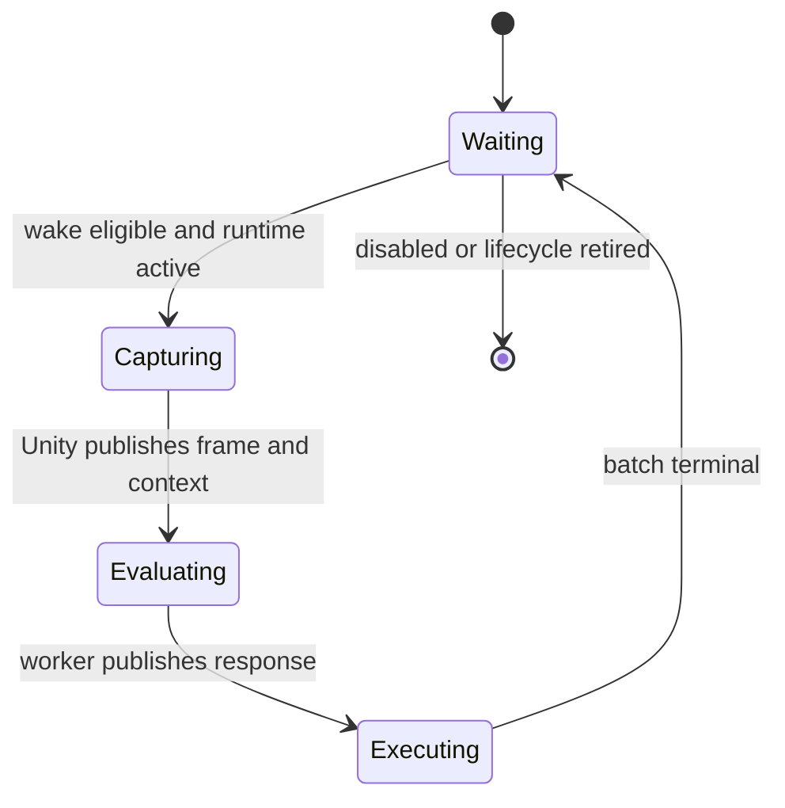

# Service-cycle runtime

> **Lifecycle: Accepted production foundation / neutral Automata host composed.** Common ServiceCycle drives Auto Harvest in production with schema-v5 semantic export, finite replay capture, lifecycle replacement, and bounded diagnostics. Automata owns that generic registry and pump through a feature-neutral host ready for a second typed service; production ServiceCycle has no dependency on the legacy suite performance coordinator.

[Back to dossier](README.md) | [Replay](replay.md) | [Goals and invariants](goals-and-invariants.md) | [Architecture](architecture.md) | [Engineering decisions](decisions.md)

## Purpose

The default automation workload is a strict service cycle, not a general asynchronous process runtime:

1. Common identifies a waiting service whose wake policy is eligible.
2. A feature-owned adapter captures one complete, feature-shaped frame on the Unity main thread.
3. Common transfers that frame and immutable cycle context to one dedicated service thread.
4. The service evaluates synchronously and updates its private state.
5. The service publishes a semantic state projection, zero or more advisory actions, and a wake policy.
6. Common attempts the batch over later Unity frames with fresh native validation.
7. Only after the batch is terminal may the service begin another cycle.

This model makes the ordinary path easy to understand, test, trace, and remove from the Unity frame. A future workload may earn a separate specialized execution contract, but speculative complexity does not belong in the default service API.

## Core state machine



Every current service generation is in exactly one of these stages:

`Waiting -> Capturing -> Evaluating -> Executing -> Waiting`

The cycle is half-duplex:

- Common and the worker never own the mutable frame storage at the same time.
- Common never refills the frame while the worker evaluates it.
- The worker cannot begin another evaluation while its current batch drains.
- The worker cannot mutate a response after publishing it.
- Actions contain copied suite-owned values, never frame, Unity, reflected-object, native-token, configuration-entry, or adapter references.

## Typed service boundary

The exact names may evolve, but the accepted shape is:

```csharp
AutomataService.Define<TFrame, TState, TAction>(
    metadata,
    createFrame,
    createWorker,
    shouldStart,
    capture,
    execute);
```

Automata supplies its one immutable `AutomataConfiguration` automatically. A
feature supplies its typed capture and execution ports plus a worker definition
whose evaluator is synchronous CPU work:

```csharp
WakePolicy Evaluate(
    in TFrame frame,
    in TConfig config,
    in ServiceCycleContext context,
    ref TState state,
    ServiceActionWriter<TAction> actions);
```

Feature code owns:

- `TFrame`, the exact live game facts required for one decision;
- `TState`, lifecycle-scoped mutable planner memory owned only by its worker;
- `TAction`, a typed, Unity-free advisory action;
- capture, evaluation, state projection, and action execution;
- optional detached replay records, codecs, comparers, and hydration supplied as
  a typed decorator rather than as the primary service definition;
- any separately typed immutable strategy publisher plus the capture mapping that copies relevant strategy facts into `TFrame` and reports the generation used;
- default wake and evaluator-fault recovery policies.

Common owns:

- deterministic explicit registration and type erasure at the composition boundary;
- lifecycle, configuration, strategy, cycle, batch, action, and publication identities;
- one reusable frame and response store per current runner;
- one named sleeping background thread for the normal current runner of each registered service, with a second physical runner position reserved only for lifecycle retirement;
- the ownership handoff and memory-ordering protocol;
- one top-level Unity frame pump;
- batch cursors, action rotation, emergency stop, and terminal receipts;
- common health, diagnostics transport, semantic tracing, and snapshot export. The separate replay layer owns replay orchestration.

The Automata host owns the product-level composition around that Common
runtime. Replay capture windows, export stepping, worker wrapping, and observer
lifecycle are neutral host facilities. Auto Harvest now reaches the seven-type
Common replay registration only through that host-owned decorator; its primary
definition has only frame, state, and action types.

Common depends only on neutral contracts. It never references Auto Harvest, Auto Buy, Agrimancy, Mentor, or another feature implementation.

## Automata production host

Common owns the generic runner, registry, and pump contracts. Automata owns one small product composition
host around them. The host:

- seals an explicitly populated typed registry and claims its one frame pump;
- reads the authoritative frame identity and publishes the resulting pump timing;
- centralizes emergency-stop control and native lifecycle replacement;
- composes and schedules the independent full-trace, decision-journal, and opt-in profile controllers around
  each accepted pump;
- owns an optional exclusive pump-shutdown lease for observation products such as the decision journal; and
- contains no feature, native adapter, configuration, or Auto Harvest type.

Feature runtimes do not tick, dispose, or select individual observation controllers. They provide one neutral
observability-options value when attaching the host. Full trace, decision journal, and profiling retain
separate controls, formats, buffers, storage, and failure boundaries; sharing the host attachment point does
not make them one sink. Feature-specific profiling stage codes remain at the native adapter edge.

Auto Harvest remains the first production registration. A focused composition test registers two services
with different frame, configuration, state, and action types in the same host and proves that one accepted
host frame polls both while a duplicate frame performs no work. Auto Buy therefore joins through another
explicit typed registration; it does not introduce another registry abstraction, pump, or generic service
locator.

Orb Automata chooses one complete `AutomataConfiguration` for every Automata ServiceCycle service. It is the
typed immutable product model. A single boundary reader copies the live BepInEx entries after load and after
each successful Save; BepInEx types never enter the service graph. The plugin publishes that same object to
every registered service. Automata service definitions declare only frame, state, and action types: they do
not select another configuration generic or build feature-specific configuration mirrors. Common remains
product-neutral and pins the published value for an entire cycle.

Profile builds carry the pump's exact service ordinal and frame identity through `ServiceActionContext`.
Feature adapters may use those coordinates to report native action substages. Ordinary builds compile that
coordinate and probe path out. This is observation only: stage results do not alter admission, action results,
or lifecycle behavior.

## Context identities

Different changes have different meanings and use different identities:

- `LifecycleGeneration` changes for save/load, reset, NG+, scene replacement, or another audited native-lifetime boundary.
- `ConfigGeneration` changes when a successful Save publishes a service configuration snapshot.
- `StrategyGeneration` changes when a new immutable strategy bulletin is published.
- `CaptureSequence` changes for every service frame captured.
- `CycleId` identifies one capture/evaluate/execute cycle.
- `BatchId` identifies the action batch returned by one evaluation.
- `StatePublicationId` identifies one immutable diagnostic/state projection.

A generation is not reused as a generic counter. Traces and rejection evidence retain all relevant identities.

## Configuration and strategy publication

Editable UI values are not runtime configuration. Only a successful Save transaction publishes a new immutable `TConfig` snapshot and generation. Draft edits, previews, validation failures, and failed persistence are invisible to services.

For Orb Automata, `TConfig` is always the complete suite snapshot. A saved publication becomes visible when
each service next starts a cycle; already running evaluation and action batches retain their prior snapshot.
Detached replay input records encode the configuration values that the recorded service actually consumed,
not unrelated settings from other Automata features.

At cycle start, Common pins the latest published `TConfig`. During main-thread capture, the feature adapter atomically reads its separately typed latest strategy bulletin, copies the relevant immutable facts into `TFrame`, and reports the exact `StrategyGeneration` used. The frame facts, configuration, and both generation identities then remain the cycle's context through evaluation and the complete action batch. Common never stores strategy as `object` or adds it as a hidden runner generic.

- Publishing configuration or strategy never cancels, orphans, rewrites, or partially updates current work.
- A running evaluation finishes with its pinned configuration and captured strategy facts.
- A draining batch finishes or terminates with that same policy context.
- The next cycle consumes the latest configuration and strategy publication; intermediate publications may coalesce.
- The state projection exposes both pinned and latest generations so the UI can explain that a saved change applies next cycle.

Native game state remains authoritative. Pinning policy context does not permit an action that current native validation rejects.

## Frame ownership

Each current runner ordinarily has one reusable frame store.

1. Common owns it while the service waits or executes actions.
2. A feature-owned capture adapter fills it on the Unity main thread.
3. Publication transfers read-only ownership to the worker.
4. Evaluation returns ownership together with the response.
5. Common does not refill it until the batch is terminal and the next wake is eligible.

No ordinary double or triple buffer is required because capture, evaluation, and action execution do not overlap for one service. A second buffer is a future measured optimization, not a default contract.

Frames contain dense handles, primitives, immutable suite values, and feature-owned storage with read-only surfaces. They do not clone Unity graphs. Stable definitions live in lifecycle catalogs; frames update only live values required by the service. A reference-type capture may mutate its one reusable frame but may not replace that frame instance; Common restores the owned instance and faults a capture that attempts replacement.

C# 10 generic constraints cannot prove deep immutability or prove that one generic type never references another. The implementation therefore combines narrow APIs, non-escapable builders where supported, no exposed mutable backing arrays, structural architecture tests, and review. It must not claim that `in TFrame` alone establishes safety.

## Service state

`TState` is deliberately stateful. It may retain sequence progress, planner history, estimates, previous outcomes, or a per-service random state across cycles.

It is:

- constructed explicitly and testable without Unity;
- accessed only by the service worker;
- never read directly by Unity, UI, tracing, another service, or Common orchestration;
- forbidden from retaining frames, response writers, native objects, adapters, live configuration objects, or another service's state;
- scoped to one lifecycle unless a separately reviewed persistence contract exists.

After evaluation, the service projects `TState` into a small immutable semantic snapshot. The UI and traces consume that projection, not the mutable state object. The projection may report goals, planner phase, estimates, sequence progress, last decision, and feature health.

The worker's evaluation loop does not also implement state-resource ownership. An internal state owner
contains construction, exact reference claims, same-lifecycle recreation, contention backoff, and shutdown
release. It remains inline in the worker and lends the state to evaluation by reference, so this separation
does not add a heap object or copy mutable state between cycles.

On lifecycle replacement, a fresh runner always receives state from the fresh-state factory. A previous lifecycle's projection is diagnostic evidence only and cannot seed the new state. The last successfully published neutral projection may support evaluator-fault recovery within the same lifecycle; cross-lifecycle persistence requires the separately reviewed persistence contract below.

Persistence across process restarts or save data is not implicit. It requires a versioned serializer, compatibility policy, and save-safety review.

## Action batches

A service returns zero to any finite number of actions. Common imposes no configured item-count ceiling, does not truncate the batch, and does not reject it because it contains hundreds or thousands of actions.

The batch model is still structurally bounded:

- there is at most one active batch per service;
- the service cannot publish another batch while the current one drains;
- one reusable response buffer grows as needed and may retain its high-water capacity;
- Common holds a cursor into that buffer rather than copying actions into one global queue;
- high-water action count and retained bytes are observable.

Common has no universal gameplay count cap. A feature must nevertheless have a reviewable termination argument for producing a finite batch from its captured domain. Capacity arithmetic is checked, growth failure faults the evaluation before `ResponseReady`, partial actions are never published, and current plus retiring buffer capacity is visible in diagnostics. Common never silently truncates or substitutes a policy limit.

The initial dispatch policy is exactly:

- scan services in stable registration order from a rotating start index;
- attempt at most one action from each active service in one Unity frame;
- continue scanning other services after one service commits, rejects, or faults;
- advance rotation so registration order cannot dominate;
- use no additional action time budget until measurement demonstrates a need.

With five active services, up to five native actions may be attempted in one Unity frame. A service with a 500-action batch may intentionally drain over many frames while the game processes previously committed work.

Every attempted action receives fresh main-thread identity resolution, current native safety and ownership admission under the cycle's pinned configuration and strategy, native validation, mutation, and postcondition evidence. Queue reservations and similar execution policies live at this native boundary. Planning information is advisory.

The Automata definition surface does not expose a legacy scheduler-admission callback. Common owns the stable
rotation and invokes each selected action directly; the feature callback owns only fresh native validation,
mutation, and postcondition evidence. During migration this means an independent ServiceCycle action may run
in the same Unity frame as a legacy coordinator lease. That temporary stacked frame cost is accepted and does
not turn legacy fairness or budget denial into a ServiceCycle retry.

Replay and observer clock boundaries remain outside feature exception containment.

Validation boundaries are intentionally non-overlapping. Common rotation selects an action; it does not make
a gameplay decision. The feature action callback maps pinned configuration, quarantine, and
family ownership to a terminal result, then resolves one lifecycle-coherent native binding set. The native
submission boundary captures current stable identities and policy facts from one pre-mutation snapshot.
Only the separate post-mutation snapshot proves the exact native transition. A successful binding-set
coherence check is not immediately repeated as another registry-generation read, and observing resolved
pairs cannot require a second quarantine read because that observation only clears gates for a newer lifecycle.

### Terminal outcomes

- `Committed`: the native mutation was accepted and verified; advance the cursor.
- `Rejected`: current authoritative state or pinned policy does not admit the action; terminate the batch.
- `Faulted`: an unexpected adapter, contract, or mutation failure occurred; terminate the batch and publish fault evidence.

There is no `Deferred` outcome and no automatic retry of the old action. The first rejection or fault preserves earlier commits and discards the untouched suffix without executing it. One `BatchAborted` fact records the terminal index and suffix count; it is unnecessary to emit one full trace event for every untouched action.

A later cycle may replan from a fresh frame. The rejected batch is never resumed.

The next cycle receives a terminal receipt containing the batch identity, pinned context, committed count, terminal index, stable result code, native outcome evidence, and terminal timestamp.

## Emergency stop

Emergency stop is an immediate Common control, not configuration.

When engaged:

- no further native action is attempted;
- every unattempted action in every current batch is terminally `Rejected(EmergencyStop)`;
- a response that arrives later publishes its valid state projection and wake policy normally, retains the worker's state, and rejects its entire action batch with the same reason;
- a running evaluator is not forcibly cancelled;
- new captures remain paused until emergency stop clears;
- clearing stop never resurrects a rejected batch; services begin fresh cycles according to their wake policies.

Emergency stop does not roll back pure evaluation. The response's wake anchor continues to age while capture is paused; after clearing, a fresh cycle may be immediately eligible if that policy is already due. Semantic evidence records state/projection/wake publication and action rejection separately; deterministic replay reproduces both without implying a native mutation.

Emergency rejection is deterministic, visible in health/diagnostics/traces, and isolated from other suite functionality.

## Wake policy

Action execution and continuation timing are separate response fields. Initial policies are:

- `Immediate`;
- `AfterDecision(duration)`, anchored when the worker publishes its response;
- `AfterBatch(duration)`, anchored when the batch becomes terminal;
- `At(monotonicTimestamp)`;
- `Default`, resolved from explicit registration.

The service never overlaps its active batch. If an `AfterDecision` or absolute deadline expires while the batch drains, the next cycle becomes eligible immediately when the batch terminates. `AfterBatch` intentionally starts its delay at termination.

A zero-action response is terminal on publication. All timing uses a monotonic clock. Wall-clock or game-time inputs required by policy are explicit replayable context fields, not ambient reads.

## Worker and handoff

Each registered slot normally has one current runner with one named background thread. Disabled services keep that worker asleep; enable/disable never constructs or retires a worker. A second physical runner position exists only so one stale worker can retire without blocking a safe replacement.

Each runner has capacity-one ownership handoffs:

```text
Unity/Common -> FrameReady -> service worker
Unity/Common <- ResponseReady <- service worker
```

The implementation uses a small explicit phase machine with synchronization-provided happens-before edges. It may use a private monitor/event plus sequence checks or equivalent proven primitives. No lock is held during native capture, service evaluation, diagnostics projection, or native mutation. There is no hot polling and no bespoke lock-free claim.

The handoff remains one synchronization-owning type and one gate; its source is separated by exchange,
offline-wait, main-ownership, lifetime, and core-state responsibilities. On the owner thread, response
installation, native action invocation, action outcome handling, batch completion, and lifecycle retirement
are separate collaborators wired directly into the runner. There is no forwarding-only batch controller and
no per-frame allocation introduced by this composition.

Cycle start remains one owner-thread coordinator. Its start-policy, capture,
and pending-publication source boundaries preserve one state machine and the
exact capture-to-queue clock order. The worker likewise remains one object and
one thread while its shell, loop and shutdown, evaluation transaction, and
state acquisition are separated by responsibility. Diagnostic facts, the
aggregate runner snapshot, and operation outcomes are value-only declarations,
not runtime services.

The Common pump sees a non-generic service slot produced by typed registration. It scans the finite explicitly registered array without blocking. There is no reflection discovery, filesystem autoloading, or general service locator.

## Lifecycle retirement

Lifecycle replacement immediately invalidates old native work:

1. advance `LifecycleGeneration`;
2. reject old pending captures and action suffixes without another native call;
3. wake and retire sleeping old runners;
4. create a fresh runner, frame, response store, and factory-created state when the per-service live-runner bound permits;
5. allow an evaluator already running in the old generation to finish in isolation;
6. discard its state projection and actions by generation;
7. let the old background thread exit.

Each registered slot has exactly two physical runner positions. Normally one is `Current` and at most one is `Retiring`; during a lifecycle storm both positions may be `Retiring`, leaving the service with no current runner. No third runner is ever created. Later lifecycle requests coalesce to the newest generation while the service is paused. A stale sleeping or main-owned runner enters `Stopping` and continues counting as live while it clears worker-owned references, releases state/frame resources, and disposes its wake handle. The owner then observes `Thread.IsAlive == false` without joining and publishes `Stopped`; only that complete exit evidence permits position reuse for one fresh runner at the newest requested generation.

Retirement publishes one bounded terminal fact immediately when ownership is available. A main-owned untouched suffix produces `Orphaned`; an already-entered ordinary terminal remains authoritative; and a zero-action `ResponseReady` receipt is acquired nonblockingly and remains `Completed`. Gate contention defers retirement instead of dropping or rewriting that receipt. Worker exit is cleanup evidence, not a second terminal. Workers are background threads before they start, and the aggregate physical worker bound is therefore twice the fixed registration capacity.

Lifecycle invalidation is latched while an already-entered `ShouldStart`, capture, or native action callback finishes. The stale runner is checked after `ShouldStart`, after capture, immediately before request publication, and after the native action returns. No later old-generation callback is entered. An already-entered action remains authoritative for its own outcome: `Rejected`, `Faulted`, or a final `Committed` action keeps its ordinary terminal receipt; a committed action with an untouched suffix produces the one exact `Orphaned` receipt. Lifecycle then publishes only its separate bounded retirement fact, so emergency or another terminal path is never rewritten or double-terminalized.

Execution and lifecycle semantic translation share the same exact receipt-identity comparison. Their
duplicate-terminal suppression therefore cannot disagree about whether a retained terminal was already
emitted before lifecycle retirement.

The registry owns the suite's initial and desired lifecycle generation. Registrations must match it. Newer requests coalesce, while equal or older requests are ignored. Initial and replacement construction are failure-atomic; replacement uses the service fault policy's real monotonic timestamp and bounded backoff. Every accepted pump frame has one allocation-free reconciliation epoch shared by its initial and final reconciliation, and a slot may attempt construction only once in that epoch even if a slow failing factory advances the clock beyond its retry due time. One registry-wide construction scope guards every composition and lifecycle mutation during both initial and replacement factories, and initial registration revalidates its reserved ordinal and service ownership before publication. A construction callback therefore cannot recursively install a candidate, seal or dispose the registry, release/tombstone a slot, enter lifecycle reconciliation, or create an untracked worker.

Runner construction is separate from the runner's owner-thread API. The factory
validates registration, prepares externally owned resources, and assembles the
execution collaborators. The runner itself groups its pump, diagnostic, and
lifetime operations without adding intermediate forwarding objects. Resource
claims and their ledger own only identity admission and release.

The registry remains one owner-thread object, with composition, lifecycle,
access, and disposal source boundaries sharing its mutation guards. Each typed
slot likewise remains one object: its runner-facing pump API, lifecycle
reconciliation, and offline lifetime operations share the same two physical
positions. These boundaries add no per-frame collaborators and do not move the
construction guard around feature factories.

The configuration publisher survives replacement, while worker definition, frame, action store, handoff, thread, state, projection storage, and fault trackers are factory-fresh. A fixed identity ledger preallocates six external claim slots per configured service: worker definition, reference frame, and reference state for each of the two physical runner positions. Before every external reference factory, the runtime reserves a fresh exact slot and single-CASes that same handle into one ledger-wide factory token. Each admission attempt is bounded and fails before the callback without waiting, spinning, or holding a monitor. The token owner invokes finite feature code outside locks, publishes a candidate that remains valid through immediate finalization, and performs one definitive bounded cross-role scan. Factory callbacks must not synchronously depend on another reference factory succeeding. Transient worker contention returns through the normal handoff with a monotonic 16–1000 ms retry deadline; lifecycle reconstruction uses the same bounded policy through a typed construction result. Neither path advances the feature-fault streak or uses expected exception control flow. State ownership remains identity-visible until `ReleaseState` returns; frame and worker-definition ownership remain visible through worker cleanup. Token finalization CASes `Open` to `Closing` while the global token remains installed, sweeps claims retired under the open token, and exact-clears the global token last. A release after `Closing` self-removes. No successor factory can overlap a stale sweep, preserving exact-handle ABA safety without identity maps, identity tombstones, release queues, or registry retention.

The runtime does not use `Thread.Abort`, cooperative checkpoints, cancellation tokens inside ordinary evaluation, or mid-evaluation state transfer. An orphan's elapsed time is diagnostic evidence. A non-returning evaluator violates the service contract but cannot mutate Unity or block other services; two non-returning evaluators can pause only their service without allowing an unbounded replacement-thread chain.

Background threads do not keep the process alive. Graceful shutdown signals sleeping workers and never waits on native work from a background thread.

## Fault recovery

Expected domain refusal is represented by a normal decision or action rejection. Exceptions are unexpected faults. Evaluation is one failure-atomic gameplay transaction: action-store reset, `Evaluate`, state projection, response validation, and synchronized `ResponseReady` publication.

The worker loop catches evaluator exceptions:

- no new actions or current state projection are published from the failed evaluation;
- every written reference-bearing action entry is cleared and the partial action count becomes zero;
- the last successful projection remains current;
- the worker thread survives;
- the failure becomes a stable typed episode without exception messages, paths, or stacks in public diagnostics;
- identical failures are debounced and counted;
- Common schedules one monotonic retry with bounded backoff and coalesces additional retry demand;
- the service recreates safe working state from its state factory or last successful neutral publication rather than trusting partially mutated state;
- state-factory/recovery failure enters the same bounded debounced retry circuit and cannot spin;
- one successful evaluation resets the fault episode and backoff.

Capture and action-adapter faults use the same episode/debounce principles but never retry an already rejected action. Lifecycle replacement or a new successful cycle resolves obsolete fault state explicitly.

## Common frame pump

Common owns one top-level frame pump. It exists independently of Orb Automata and remains the same seam after the old runtime is deleted.

`SuiteFramePump` is the owner-thread API facade. Its private Common collaborators separate mutable pump
state, lifecycle and emergency control, accepted-frame execution, per-service transitions, trace-session
ownership, journal-session ownership, evidence emission, evidence scanning, and semantic profiling.
The facade preserves one scheduling path and one cross-sink event order; the split does not introduce
per-sink pumps or observation-owned gameplay state.

Each Unity frame performs deterministic phases:

1. observe lifecycle, enablement, and emergency-stop transitions;
2. ingest completed worker responses without blocking;
3. publish state projections and install action batches;
4. reject current and arriving batches if emergency stop is active;
5. scan active services from the rotating index and attempt at most one action per service;
6. finalize completed, rejected, faulted, or lifecycle-orphaned batches and publish receipts;
7. identify waiting services whose wake policies are eligible;
8. capture each eligible service at most once and publish its frame/context to the worker;
9. publish per-frame timing and causal evidence.

The initial design has no additional time-budget scheduler. Capture and action durations, total Common main-thread time, active service count, and wake lateness are measured so a later budget decision can be based on evidence without changing the service API.

The implemented pump never waits for the worker-owned handoff gate. Response acquisition, captured-request publication, and normal or cleanup ownership return use zero-time probes; contention retains the existing owner and defers the transition to a later frame without repeating capture or native execution. Worker wake and stop use a sleeping event, so disposal signals and returns without joining. If a worker observes the published stop flag and disposes its wake handle before the owner resumes the final signal, only that exact published-disposal race is treated as an already-completed wake; unrelated disposal failures still surface. `SuiteFramePumpReport.LifecyclePositionTransitions` is the exact cumulative-counter delta for all physical position transitions during that accepted frame, including reconciliation triggered after a reentrant supported callback. An emergency episode marks any outstanding request, evaluation, or response until that exact response is consumed, even when the player clears the stop first, so clearing cannot resurrect work that existed during the stopped episode.

## Semantic observability

The accepted post-cutover mode and storage boundaries are specified in
[Service-cycle observability](observability.md). The causal schema described here remains the detailed
semantic source; it is not also stretched into the compact journal or profiler sample format.

The trace is one causal service-cycle story, not separate kernel/process/thread logs:

```text
latest context publication -> start decision -> frame capture -> cycle queued
                           -> evaluation -> state publication -> batch publication
                           -> action attempt/result -> batch terminal -> next wake
```

Common keeps that story behind three cohesive boundaries. Payload validation first enforces the shared
wire shape and then delegates to explicit lifecycle/context, cycle/evaluation, or execution rules. One
causal writer owns the ring, service and suite heads, delayed anchors, and emergency ancestry; those
responsibilities are organized as parts of the same object so no causal state is copied or synchronized
between collaborators. The stable recorder facade routes the public event API directly to the existing
context, cycle/admission, evaluation, and batch emitters. This organization adds no observation layer,
lookup table, or per-event allocation.

Pump-side execution translation likewise remains one object with one recorder, publication helper, and
per-service trace-state owner. Its source is partitioned by incoming fact family: start/capture,
response/evaluation, action/batch, and fault/recovery. The partitions add no runtime dispatch or state;
they preserve established event order, terminal-receipt identity deduplication, and duration calculation.

The generic event vocabulary includes:

- configuration and strategy publication;
- lifecycle replacement and emergency-stop transitions;
- cycle queued, started, completed, orphaned, or faulted;
- frame capture identity and duration;
- evaluation duration, result, and fault episode;
- state publication identity and fingerprint;
- batch count, retained capacity, age, cursor, completion, rejection, or abort;
- action selection, exact native outcome, and call/attempt/commit counts;
- retry scheduling and recovery;
- every accepted pump's fairness start/next rotation plus service/action/capture counts and total duration;
- opt-in profiling samples and feature-specific native-stage operation counts in profiling builds.

Every event carries stable causal identifiers and pinned context generations. Publication facts are a monotonic, once-only observed high-water; unobserved intermediate publications may coalesce. Capture and cycle facts independently record the exact generations they consumed, so a delayed older cycle may truthfully appear after a newer publication fact without inventing a regressing publication. Configuration or strategy publication never creates a cancellation edge to current work.

Live diagnostics and optional disk capture project from the same bounded semantic stream. Unity never waits for diagnostics, telemetry, replay payloads, or I/O, and observability never changes gameplay outputs or native decisions. The ordinary four-generic runner has no replay callback or per-action replay overhead. A separately registered replayable service may add bounded, separately measured worker CPU and response latency under the detached-record contract below. The implemented pump emits a summary for every accepted frame, including frames with no capture or action, because exact replay must preserve each fairness-rotation step. Profiling remains a separate compile-time observation product rather than part of the replay schema.

Trace rings and disk handoffs remain bounded and report exact overwrites/drops. Implemented semantic trace capture never scans or copies a complete returned batch on the Unity thread and never retains gameplay storage for I/O. An opt-in replayable feature pairs each appended gameplay action with a detached readonly action record; the worker-side writer encodes that record into separate bounded storage. Exhaustion marks the replay payload incomplete and stops encoding while gameplay action production continues unchanged. Live telemetry stores fixed-size batch summaries and attempted-action outcomes. A capture missing any ordered action payload fails replay before evaluator comparison; it never truncates or rejects the gameplay batch.

Replay encoding is isolated from gameplay. The implemented recording layer appends gameplay actions first,
catches detached record/codec failures except process-fatal stack overflow, latches incomplete, and stops
encoding without suppressing gameplay. Exact capture adds bounded measured worker work; Unity never waits
for or scans replay payloads. Broad verification and re-review remain.

State diagnostics report both current cycle context and latest published context, making next-cycle configuration behavior visible without reading logs.

## Replay

**Implementation status:** strict detached-record contracts, registration/sidecar recording, canonical
`.oscr` encoding/decoding, hydration/comparison, detached evaluator replay, and a production-shaped real
registry/frame-pump driver exist. Schema v5 includes service capacity plus explicit start, admission, and
resolved-wake evidence.

Graph traversal is not replay. Each replayable service uses a separate opt-in typed registration that supplies explicit versioned codecs/comparers for detached, recursively value-only readonly cycle-input, previous/next-state, and action records or bounded fragments. Common rejects reference-bearing record shapes and records identities, generations, contexts, wake, decision/result codes, control transitions, native outcomes, and receipts. The ordinary `ServiceRunner<TFrame,TConfig,TState,TAction>` remains unchanged.

Replay:

1. decodes the exact cycle inputs and pinned generations;
2. runs the real evaluator;
3. compares next state, wake policy, and the complete ordered action batch;
4. drives the real generic pump with recorded Unity frames, control transitions, and exact native outcomes;
5. compares terminal receipts and causal events.

The production path requires the artifact's replay services to form the full contiguous registered topology
described by schema-v5 `ServiceCapacity` header metadata, with at least one detached cycle per slot for
initial configuration hydration and gap-free configuration publications beginning at generation one. It
derives the shared initial lifecycle from consistent pre-cycle `LifecycleActivated` evidence, uses
independent lifecycle-unique clock scripts, waits by complete recorded cycle identity rather than global
footer order, and rejects a `CaptureCompleted -> CycleQueued` request handoff split across pumps. It also
validates independently reconstructible action/capture phase durations and the overall pump-phase sum.

Lifecycle-construction evidence fails during callback-free preflight. Callback-issued lifecycle, emergency,
configuration, and non-capture-derived external strategy mutations fail after typed preparation but before
pumping; capture-derived strategy publication remains supported evidence. Sparse and zero-cycle artifacts
remain eligible for the detached evaluator oracle only, and missing-cycle execution produces typed failure
evidence rather than an escaping lookup exception. Containable production callback, adapter, comparison,
and cleanup failures preserve the primary failing phase; `StackOverflowException`, `OutOfMemoryException`,
and `AccessViolationException` remain outside containment.

No reflection serializer, raw save structure, native object, path, user/host name, arbitrary string, or exception text enters the trace. Large action batches are encoded incrementally as bounded streamed records; decoder bounds come from available bytes and schema, not a gameplay action cap.

After registration and capacity warm-up, idle pumping, waiting-slot scans, response handoff, in-capacity action append/drain, terminal receipt publication, and fixed-size semantic event emission allocate zero managed bytes. Whole-slot erasure does not box generic values. Strings and rich arrays are created only by rate-limited UI/export projections. Every permitted growth allocation is named and observable.

## Explicitly excluded from the default runtime

- custom async tasks or method builders;
- shared latency/deep worker lanes;
- polling awaiters;
- cooperative checkpoints or continuation scheduling;
- incumbents or automatic soft supersession;
- ordinary multi-buffer live-view leasing;
- one suite-global action slot or global action queue;
- configured action-count ceilings or truncation;
- deferred action outcomes or automatic old-action retry;
- configuration/strategy invalidation of current work;
- service-owned Unity `Update` loops or frame budgets.

Future deep search, mid-step native questions, or anytime planning may introduce a separate specialized contract only after a real service demonstrates the need. The ordinary service API must remain unchanged.

## First vertical-slice acceptance

Before Auto Buy migrates, the generic runtime and Auto Harvest pilot must prove:

- exact half-duplex ownership and no hot polling;
- one normal current worker/frame/response store per registered service and no more than two physical runner positions during retirement;
- structural rejection of native/config/adapter leakage;
- mutable state across cycles plus immutable semantic projection;
- pinned configuration/strategy through evaluation and batch drain;
- next-cycle adoption of the latest saved context;
- zero, one, large, and very large finite action batches without Common truncation;
- one attempted action per active service per Unity frame with stable rotation;
- first-rejection suffix abort and exact receipt;
- emergency rejection before arrival and during drain;
- lifecycle orphaning and late-result rejection;
- evaluator/capture/action fault debounce and recovery;
- exact semantic trace export, privacy bounds, incomplete-capture evidence, and real replay;
- allocation and long-soak evidence over the sole composed runtime;
- portable build and test success, followed by separate approved real-reference and interactive gates.
