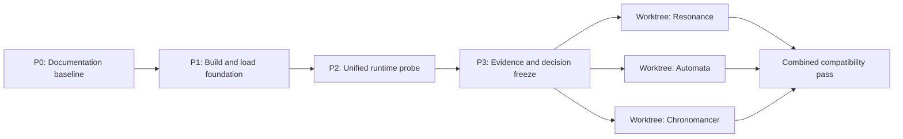

# Three-mod iteration plan

[Back to roadmap](roadmap.md) · [Compatibility and testing](compatibility-and-testing.md)

## Objective

Deliver three separate BepInEx 5 plugins in small, testable increments:

1. **Orb Achievement Resonance** — make Achievement Strength grant useful, configurable global bonuses.
2. **Orb Automata** — remove repetitive research-start decisions without taking control away from the player.
3. **Orb Chronomancer** — accelerate the game safely while preserving saves, input, and interoperability.

The MVPs should provide real value without requiring a custom settings UI, custom save data, a shared runtime library, or broad invasive patches.

## Delivery strategy

Do not split into feature worktrees immediately. First complete one shared discovery sequence on the main branch so every worktree starts from the same verified contracts.

Worktree split gate: every blocker in the [grey-area register](#grey-area-register) has evidence, an explicit MVP exclusion, or a recorded product decision.

## Pre-worktree iterations

### P0 — Documentation baseline

- Commit the reverse-engineering audit, entity mapping, correlations, global-stat catalog, and this plan as one known baseline.
- Record installed assembly hashes and the BepInEx runtime version.
- Preserve analysis binaries under ignored paths only.

Exit: the tree has no unexplained changes, links/UUIDs validate, and all worktrees can branch from one baseline commit.

### P1 — Build and load foundation

- Create a `netstandard2.1` solution with BepInEx 5 references.
- Use `OOC_GAME_DIR`/an MSBuild property for game references; never commit game DLLs.
- Add deterministic build output, staging, version metadata, and debug/release configurations.
- Build one diagnostic plugin and verify load, config generation, scene transitions, and cleanup.
- Check the game assembly hash at runtime and warn on mismatch.

Known environment: .NET SDK `10.0.301`, BepInEx `5.4.23.5`, Unity `6000.0.70` Mono.

Exit: a clean repository build produces a staged plugin that loads without errors, survives title → game → title, and contains no game assemblies.

### P2 — Unified runtime probe

Build one non-shipping probe plugin with three report sections.

#### Resonance report

- Current Achievement Strength and every native Achievement Strength effect block.
- All 24 attribute groups: member target/property, ratio, exponent ratio, order, and prerequisites.
- Overlap among speed, power, duration, special, resource, and casting targets.
- Current contributors to proposed MVP records and native tooltip nodes.

#### Timing report

- Fixed/manager/increment/slow-increment calls per real second.
- Time scale, fixed step, scaled/unscaled delta, scene, phase, and autosave countdown.
- Representative resource, research, crafting, alchemy, combat, animation, and popup timing.
- Confirm no overlapping third-party automation plugin is installed during validation.
- Compare, behind explicit probe hotkeys:
  - scaled Unity time with the original fixed step;
  - scaled Unity time with a proportionally larger fixed step to limit CPU growth.

#### Research report

- Registered research UUIDs and visible/available/complete/developing/active/flagged/queued state.
- Development cost, current stage cost, partial fill, stages/time, and linked types.
- `CanDevelop()`, `GetDevelopError()`, and reserve calculations without taking action.
- Queue-mode and global multi-buy state.

Exit: reports are captured at 1×/2×/4×/8× using a backed-up save, with no NaN, duplicate modifier, or save error. The probe is read-only except for explicitly activated timing experiments.

### P3 — Evidence and decision freeze

- Store sanitized dated reports under `tests/baseline/`.
- Select the timing strategy using measured correctness and CPU cost.
- Freeze Resonance targets after overlap analysis.
- Freeze Automata admission and priority rules after comparison with manual UI behavior.
- Record exact Harmony targets and configuration keys.
- Convert remaining non-critical unknowns into explicit post-MVP exclusions.

Exit: each mod has a bounded MVP backlog and no worktree must rediscover shared lifecycle, version, or fixtures.

## Worktree strategy

After P3, create three branches/worktrees from the same baseline:

| Worktree branch | Ownership |
|---|---|
| `codex/achievement-resonance` | Resonance source, tests, and release docs |
| `codex/automata` | Automata source, tests, and release docs |
| `codex/chronomancer` | Chronomancer source, tests, and release docs |

Each worktree avoids the other plugins' source. Do not create `OrbModding.Common` yet; extract a shared library only after two independent plugins have stable, genuinely identical code.

## Achievement Resonance iterations

### R1 — Native speed vertical slice

- Inject one mod-owned persistent effect before `Player.ManagerStart()` builds its observer.
- Target `GlobalSpeedGroup` only.
- Use stable UUIDs and idempotent injection.
- Configure enabled state, per-strength rate, and cap.
- Add native tooltip detail and a small appended summary.
- Remove only mod-owned state on disable/reload.

Exit: achievement changes recalculate live, repeated loads never duplicate modifiers, and achievement save data stays untouched.

### R2 — MVP bonus set

| Category | Candidate targets | Rule |
|---|---|---|
| Speed | `GlobalSpeedGroup` | Enable only with verified coverage |
| Power | Four domain power groups | Apply non-overlapping coverage |
| Resource rate | `GlobalResourceType.Rate` | Never silently add `GainRate` |
| Resource capacity | `GlobalCappedResourceType.MaxQuantity` | Capped resources only |
| Casting | Player spell power/special/duration/cast and cooldown speed | Exclude records already covered by speed/power groups |

- Independent rates and caps per category.
- Conservative default profile plus custom BepInEx configuration.
- Tooltip shows effective multipliers and logs skipped overlapping targets.

MVP excludes generic scaling; cost/drain/time reductions; luck/critical/echo/flash; slot/integer limits; and a custom settings window.

### R3 — Hardening and v0.1

- Test early/mid/late strength ranges, resets, load/title cycles, config changes, and tooltip refresh.
- Test clean, Chronomancer, and full-suite configurations.
- Publish formulas, caps, affected targets, and known overlaps.

MVP value: achievement progression improves speed, domain power, passive generation, capacity, and casting while remaining configurable and save-neutral.

## Automata iterations

### A1 — Auto Buy

- Start with the audited `StructureSO.All`, availability, true-spend cost, action-room, and native `Purchase()` contracts.
- Support disabled, buy-all, and 10x/100x/1000x excess modes plus absolute/relative reserves.
- Add dry-run ordering, queue-space reservation, bulk/action caps, resumable CPU-bounded scans, and emergency disable.
- Use AutobuyOrb 1.1.4 only as an offline behavior reference when comparing eligible sets and ordering.
- Probe `UpgradeSO` and additional levelable families separately before expanding the active adapter.

Exit: active Structure purchases match dry-run decisions and preserve reserves and manual queue room in a supported single-buyer installation.

### A2 — Auto Cast

- Enumerate player-created `Spell` instances and bind only explicitly selected spells.
- Probe native readiness, cost, cooldown, targeting, channel/interruption, and combat/context contracts.
- First active slice supports one non-targeted, non-channeled spell and a resource-threshold rule.
- Use the native UI/hotkey-equivalent cast path and stop immediately on disable or failed reserves.

Exit: the selected spell casts reliably without bypassing cost/cooldown or interrupting incompatible player actions.

### A3 — Auto Concept

- Treat concepts as the mapped `AlchemyRecipeSO` subset exposed by `ConceptRecipes` and `ActiveConcepts`.
- Filter Reductive, Reflective, and Conceptualization types without touching ordinary alchemy.
- Maintain one selected unlocked concept and conservative level/drain target through the native API.
- Defer automatic discovery, loadout swapping, mastery optimization, and multi-concept balancing.

Exit: the selected concept is maintained without exceeding capacity, violating reserves, or changing unrelated alchemy instances.

### A4 — Auto Harvest

- Probe harvest elements/types/actions, live action instances, plots, readiness, repeatability, costs, and destructive actions.
- First slice runs one allowlisted ready, non-destructive harvest action on an existing plot.
- Defer seed choice, replanting, and plot-layout strategy.

Exit: selected ready targets are harvested through the normal action path while preservation rules and queue room remain intact.

### A5 — Original modules and hardening

- Add crafting, scribing, ordinary alchemy, and optional research automation one adapter at a time.
- Test unlocks, insufficient resources, resets, long sessions, and Chronomancer timing.
- Add decision tooltips only after the four primary modules are stable.

MVP excludes arbitrary rule scripting, queue reordering, broad cancellation/resumption, automatic concept/plot optimization, targeted or channeled autocast, and active research.

MVP value: the player can automate routine buying, safe casting, concept upkeep, and harvesting while preserving manual strategy and resource reserves.

## Chronomancer iterations

### C1 — Timing-control core

- Implement the P2-selected strategy with 1×/2×/4× presets and configurable increase/decrease/reset keys.
- Capture and restore every original timing value on disable, unload, title return, unsupported scene, and error.
- Log transitions and show a transient multiplier notification.

Exit: core resource, research, crafting, alchemy, and combat timing scales within tolerance; input stays responsive; repeated toggles do not drift baselines.

### C2 — 8× and safety MVP

- Add 8× behind the configured maximum.
- Add scene/load/save guards and automatic 1× fallback where evidence requires it.
- Apply the measured fixed-update/CPU policy.
- Document whether autosave follows simulated time.
- Verify timing behavior with only the intended project plugins installed.

MVP excludes pause, 0.5×, 16×, per-subsystem scaling, animation suppression, and persistent/custom UI.

### C3 — Hardening and v0.1

- Save/reload and transition from every multiplier.
- Extended 1×/4×/8× sessions with update-rate and CPU measurements.
- Combined test with Resonance and Automata.
- Publish the timing model and known scaled/unscaled exceptions.

MVP value: reliable 1×/2×/4×/8× acceleration with one-key reset and automatic recovery to normal timing.

## Grey-area register

| ID | Unknown or risk | Resolution before split | Blocks |
|---|---|---|---|
| G1 | Attribute-group members and overlaps | Resonance runtime report | R2 |
| G2 | Normal Achievement Strength range | Probe representative states | Resonance defaults |
| G3 | Timing correctness versus CPU | Timing A/B experiment | Chronomancer implementation |
| G4 | Save/load/scene behavior above 1× | Timing/save protocol | Chronomancer 8× |
| G5 | Slow increments and non-GameManager timers | Rate/call-count probe | Chronomancer strategy |
| G6 | Safe one-level research call in both queue modes | State-transition probe | Automata active mode |
| G7 | Development cost versus progressive stage drain | Compare manual before/after state | Automata reserve formula |
| G8 | Choice/exclusive research behavior | Selection policy plus prerequisite report | Automata candidates |
| G9 | Partial/manual/paused ownership | MVP excludes mutation | Closed by scope |
| G10 | Build/load/reference correctness | P1 smoke test | All worktrees |
| G11 | Tooltip signature and duplicate prevention | Repeated native-node probe | Resonance tooltip |
| G12 | Cross-mod timing/stat changes | Combined test matrix | All releases |

## Cross-mod contracts

- Separate plugin GUIDs, configs, DLLs, and release archives; no custom save data in MVP.
- Automata evaluates on unscaled time and reads live costs so Chronomancer and Resonance changes are incorporated.
- Chronomancer exclusively owns Unity timing values.
- Resonance owns only its stable modifier/block UUIDs.
- Automata initiates eligible actions but never owns native queues or manual in-progress state.
- No plugin patches or depends on third-party automation mods.
- Combined tests share one backed-up save and assembly-hash baseline.

## Combined MVP release gate

- All three build independently from a clean checkout and work with only BepInEx.
- Each works independently; all three work together at 1×/2×/4×/8×.
- Save/reload/title return show no duplicate modifiers, lost queues, corrupted investment, or timing drift.
- Disabling one plugin leaves the other two functional.
- Archives contain only intended plugin artifacts and documentation.

## Product decisions to close

1. Whole-game Unity scaling versus progression-only Chronomancer scaling.
2. Conservative public versus strong/cheat-oriented Resonance defaults.
3. Flagged-only versus all-eligible Automata selection on first install.

Recommended defaults: whole-game scaling, conservative Resonance values with caps, and flagged-only Automata selection.
